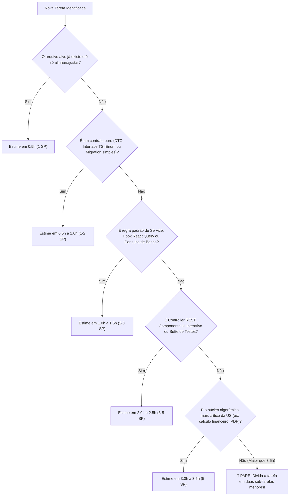

# ⏱️ Guia Geral de Estimativa de Horas e Esforço — AlumiGest

> **Documento Institucional de Governança de Engenharia e Planejamento Ágil**  
> **Projeto:** AlumiGest — Sistema de Gestão para Vidraçaria e Esquadrias  
> **Metodologia:** Processo IMPROS (Scrum Adaptado com Sprints de 15 dias)  
> **Público-Alvo:** Scrum Masters, Product Owners (PO), Líderes de Projeto (LPs), Desenvolvedores e Engenheiros de QA  
> **Abrangência:** Sprints 1 a 16 (Releases 1, 2 e 3)  

---

## 🎯 1. Objetivo

Este guia define o **padrão oficial de dimensionamento e estimativa de esforço em horas** para qualquer demanda, User Story ou sub-tarefa técnica no repositório do **AlumiGest**.

O propósito é garantir:
1. **Previsibilidade**: Evitar estouros de escopo e entregas parciais no final da sprint.
2. **Equidade na Distribuição**: Assegurar que os 8 integrantes da equipe recebam cargas de trabalho equivalentes.
3. **Padronização nas Cerimônias**: Orientar o *Sprint Planning* e o *Planning Poker* com critérios objetivos e empíricos já validados pelo histórico do projeto.
4. **Agilidade no Code Review**: Sub-tarefas pequenas resultam em Pull Requests menores, fáceis de revisar e rápidos de integrar na `develop`.

---

## 📐 2. Capacidade e Cadência da Equipe

| Parâmetro | Valor Padrão | Observações |
|---|:---:|---|
| **Duração da Sprint** | **15 dias corridos** | Ciclo fixo e inegociável (10 dias úteis de desenvolvimento). |
| **Tamanho da Equipe** | **8 membros** | Estudantes e desenvolvedores do CST em ADS / IFPB. |
| **Dedicação Individual** | **12h a 15h semanais** | ~24h a 30h totais por integrante durante a sprint. |
| **Capacidade Bruta da Sprint** | **~200 a 240 horas** | Capacidade global de trabalho da equipe por sprint. |
| **Capacidade Líquida de Código** | **~140 a 170 horas** | Descontando cerimônias, documentação, reuniões com parceiro social e code reviews. |
| **Média por User Story Maior** | **40h a 45h** | Tamanho ideal de uma User Story Pai completa (como a US-09, US-10, etc.). |

---

## 🧩 3. Regra de Ouro: Fatiamento Atômico (*Atomic Slice*)

> [!IMPORTANT]
> **Nenhuma sub-tarefa no AlumiGest deve ser estimada acima de 3.5 horas.**

Se uma demanda parecer exigir mais de 3.5 horas, ela **NÃO** deve ser cadastrada como uma única task. Ela deve ser obrigatoriamente decomposta em duas ou mais tarefas (exemplo: separar a criação de DTOs da regra de negócio, ou separar o hook de dados do componente visual).

### Princípios da Sub-tarefa Atômica:
- **1 Camada / 1 Responsabilidade**: A task deve alterar preferencialmente apenas um arquivo ou camada bem delimitada (ex: apenas DTOs, apenas Controller, apenas Hook).
- **Testabilidade**: Deve ser possível verificar se a tarefa foi concluída de forma independente (via teste automatizado, `mvn clean compile` ou `npm run build`).
- **Nomenclatura Decimal Rastreável**: Sub-tarefas sempre recebem o código decimal vinculado à sua US Pai (ex: `[US-10.1]`, `[US-10.2]`).

---

## 🧭 4. Matriz Universal de Estimativa por Tipo de Artefato

Esta é a régua oficial de estimativas do projeto para cada componente da nossa arquitetura:

### ⚙️ 4.1 Infraestrutura, DevOps e Configuração
| Tipo de Atividade | Exemplo Prático | Estimativa Padrão |
|---|---|:---:|
| Adicionar/atualizar dependência Maven/NPM | Adicionar OpenPDF no `pom.xml`, instalar Lucide-React | **0.5h** |
| Adicionar asset estático ou fonte | Logotipo da Alumiportas em `resources/static/` | **0.5h a 1.0h** |
| Ajuste pontual em Dockerfile ou Compose | Adicionar variável de ambiente, porta de serviço | **1.0h** |
| Configuração de Workflow de CI/CD | GitHub Actions, pipeline SonarQube, release tagging | **1.5h a 2.5h** |

---

### 🗄️ 4.2 Banco de Dados & Migrations (PostgreSQL / Flyway)
| Tipo de Atividade | Exemplo Prático | Estimativa Padrão |
|---|---|:---:|
| Migration SQL Simples (DDL direto) | `ALTER TABLE tb_budgets ADD COLUMN...`, criação de índices | **1.0h** |
| Migration SQL Estrutural (Nova Tabela) | `CREATE TABLE` com PK UUID, FKs, constraints e checks | **1.5h** |
| Migration com Dados Semente (Seed Data) | Inserção de dados padrão de materiais, perfis ou templates | **1.5h a 2.0h** |

---

### ☕ 4.3 Backend — Domínio, Contratos e Mapeamentos (Java / Spring)
| Tipo de Atividade | Exemplo Prático | Estimativa Padrão |
|---|---|:---:|
| Criação de Enum Java | `DiscountType`, `PaymentCondition`, `OrderStatus` com labels | **0.5h a 1.0h** |
| Record Java DTO de Request simples | `DiscountRequest`, `StatusChangeRequest` com Bean Validation | **0.5h** |
| Record Java DTO com aninhamentos | `BudgetResponse`, `BudgetItemCreateRequest` com listas | **1.0h** |
| Mapper MapStruct | Interface `BudgetMapper` com conversões e campos derivados | **1.0h** |
| Entidade JPA Simples | Entidade direta com campos básicos e soft delete | **1.0h** |
| Entidade JPA Complexa | Relacionamento `@OneToMany`, cascata, orphanRemoval, JSONB | **1.5h** |
| Spring Data Repository | `BudgetRepository` com derived queries e busca textual paginada | **1.0h a 1.5h** |

---

### 🧠 4.4 Backend — Serviços e Regras de Negócio (`Service`)
| Tipo de Atividade | Exemplo Prático | Estimativa Padrão |
|---|---|:---:|
| Método utilitário ou gerador | `BudgetCodeGenerator` sequencial com lock e formatação | **1.0h** |
| Método CRUD básico no Service | Inserção simples, deleção lógica com checagem de existência | **1.0h** |
| Máquina de Estados / Transição | `alterarStatus()` validando fluxo permitido e lançando exceções | **1.0h a 1.5h** |
| Orquestração de Criação com Defaults | `create()` com data de validade de 15 dias, status inicial e FKs | **1.5h** |
| Adição Incremental de Itens | `adicionarItem()` com atualização de subtotais e persistência | **1.0h a 1.5h** |
| **Core Matemático / Algoritmo Crítico** | `aplicarDesconto()` bidirecional (% e R$) com `BigDecimal HALF_EVEN`, fórmulas de corte de perfis/vidro | **3.0h a 3.5h** |

---

### 🌐 4.5 Backend — Controladores e APIs (`Controller`)
| Tipo de Atividade | Exemplo Prático | Estimativa Padrão |
|---|---|:---:|
| Adicionar endpoint pontual | Rota direta delegando para Service já existente | **1.0h** |
| Controller REST Completo | Múltiplas rotas, DTOs com `@Valid`, documentação OpenAPI/Swagger e códigos HTTP (200, 201, 400, 404, 422) | **2.0h** |

---

### 💻 4.6 Frontend — Contratos, Schemas e Serviços (TypeScript / React)
| Tipo de Atividade | Exemplo Prático | Estimativa Padrão |
|---|---|:---:|
| Interfaces TypeScript puras | `types/budget.ts` com tipos espelhados do backend | **0.5h** |
| Schemas Zod de Validação | `budgetSchema.ts` com mensagens amigáveis em português | **1.0h** |
| Serviço de API Axios | Funções em `budgetApi.ts` com tipagem estrita de retorno | **1.0h a 1.5h** |
| Custom Hook React Query | `useBudgets.ts` com queries, mutações e invalidação de cache | **1.0h a 1.5h** |
| Configuração de Rotas (`App.tsx`) | Registro de rotas privadas/públicas e lazy imports | **0.5h a 1.0h** |

---

### 🎨 4.7 Frontend — Componentes Visuais e Telas (React / Tailwind / PWA)
| Tipo de Atividade | Exemplo Prático | Estimativa Padrão |
|---|---|:---:|
| Componente atômico / Badge | `BudgetStatusBadge` com cores e labels por estado | **0.5h** |
| Alinhamento de componente existente | Conferência de props, binding de formulário pronto | **0.5h** |
| Card de Resumo ou Totais | `BudgetFinancialSummary` formatando valores em moeda BRL | **1.0h** |
| Formulário com React Hook Form | Formulário com binding de campos, erros Zod e botões | **1.5h** |
| Tabela rica com filtros/ações | `BudgetItemsTable` com edição inline e totalizadores | **1.0h a 1.5h** |
| Componente Interativo em Tempo Real | `DiscountPanel` com alternância % e R$ e recálculo dinâmico | **2.0h** |
| Modal Construtor Dinâmico | Modal de esquadria com cálculo e seleção de insumos | **2.0h a 2.5h** |
| Página Completa (Page View) | `BudgetsPage` ou `BudgetNewPage` integrando hooks e subcomponentes | **1.5h a 2.0h** |

---

### 📄 4.8 Geração de Documentos (PDF e Integrações Externas)
| Tipo de Atividade | Exemplo Prático | Estimativa Padrão |
|---|---|:---:|
| Formatação de texto para WhatsApp | Gerador de resumo textual com quebras de linha e emojis | **1.0h** |
| Cabeçalho / Rodapé com paginação | Event helper do OpenPDF (`PdfPageEventHelper`) | **1.5h** |
| Layout do PDF (Tabelas e Estilização) | Montagem de grid de produtos e totais financeiros em A4 | **2.0h a 3.0h** |
| Emissão completa de PDF comercial/técnico | `BudgetPdfService` completo gerando stream de bytes | **3.0h a 3.5h** |

---

### 🧪 4.9 Qualidade, Testes Automatizados e Auditoria (QA)
| Tipo de Atividade | Exemplo Prático | Estimativa Padrão |
|---|---|:---:|
| Testes Unitários de Service (Mockito) | Suíte cobrindo regras felizes, limites e exceções de negócio | **1.5h a 2.0h** |
| Testes de Integração REST (MockMvc + H2) | Suíte de Controller validando payload, headers e status HTTP | **2.0h a 2.5h** |
| Testes E2E com Cypress | Cenários automatizados navegando pelo PWA na interface | **2.5h a 3.5h** |
| Auditoria SonarQube & Quality Gate | Análise de branch coverage, resolução de smells e relatório | **1.5h a 2.0h** |

---

## 🔢 5. Tabela de Equivalência: Horas vs. Story Points

Ao realizar o Planning Poker com a equipe, use esta correspondência direta:

```
┌──────────────┬──────────────────┬───────────────────────────────────────────────────────────┐
│ Story Points │ Faixa em Horas   │ Diretriz Operacional                                      │
├──────────────┼──────────────────┼───────────────────────────────────────────────────────────┤
│    1 SP      │ 0.5h a 1.0h      │ Rápida, pontual, baixo risco de impedimento.              │
│    2 SP      │ 1.0h a 2.0h      │ Padrão de desenvolvimento (1 arquivo / 1 método / 1 DTO). │
│    3 SP      │ 2.0h a 4.0h      │ Demanda média (integração de componentes ou queries).     │
│    5 SP      │ 4.0h a 6.0h      │ Alta complexidade (regras críticas, suítes de testes).    │
│    8 SP      │ > 6.0h (ALERTA)  │ ⛔ PROIBIDO COMO SUB-TASK. Deve ser fatiada em 2+ tasks.  │
└──────────────┴──────────────────┴───────────────────────────────────────────────────────────┘
```

---

## 🛠️ 6. Algoritmo Passo a Passo para Estimar Novas Tarefas

Quando uma nova tarefa for criada (seja na US-10 de PDF, US-11 de Oficina ou em qualquer sprint futura):



---

## 📋 7. Checklist de Validação da Estimativa (DoD da Estimativa)

Antes de aprovar a pontuação no Planning, o Scrum Master e a equipe devem checar:
- [ ] A tarefa altera estritamente seu escopo sem depender de branches não mergeadas?
- [ ] O arquivo alvo e os critérios de aceitação estão definidos com precisão?
- [ ] A estimativa está dentro do teto máximo de **3.5 horas**?
- [ ] A soma das estimativas da User Story cabe dentro da capacidade da equipe para a sprint?

---

*Documento homologado pela Equipe AlumiGest — Diretriz Oficial de Engenharia e Planejamento.*
