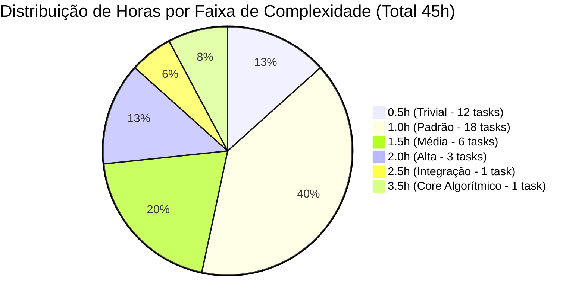

# ⏱️ Guia e Matriz de Estimativas em Horas — Sprint 04 (US-09)

> **Documento de Governança e Referência de Dimensionamento de Tarefas**  
> **User Story Pai:** [US-09: Aplicar Descontos e Condições Comerciais no Orçamento (#133)](https://github.com/ADS-IFPB-SR/alumigest/issues/133)  
> **Metodologia:** Processo IMPROS (Scrum adaptado)  
> **Equipe:** AlumiGest (8 integrantes) | **Sprint:** Sprint 04  
> **Total de Tarefas:** 41 sub-tarefas | **Total de Horas:** **45.0 horas**  

---

## 🎯 1. Princípios de Fatiamento e Estimativa

A User Story 09 adotou a estratégia de **Decomposição Vertical Fatiada (*Vertical Slice & Atomic Tasks*)**, estabelecida na reunião de planejamento e na Constituição do Projeto:
1. **Atomicidade e Responsabilidade Única**: Cada sub-tarefa concentra-se estritamente em **uma única camada** e em **um único arquivo ou conjunto correlato** (ex: criar 1 record DTO, criar 1 enum, implementar 1 método no Service, criar 1 componente de UI).
2. **Evitar tarefas monolíticas**: Nenhuma sub-tarefa ultrapassa **3.5 horas**. Tarefas complexas são divididas para permitir paralelismo e revisão ágil via Pull Request.
3. **Escala de Estimativa**: As tarefas utilizam faixas de **0.5h, 1.0h, 1.5h, 2.0h, 2.5h e 3.5h**, mapeando diretamente os pesos do Planning Poker (1, 2, 3 e 5 Story Points).

---

## 🧭 2. Matriz de Complexidade vs. Horas (Gabarito da Equipe)

| Faixa | Story Points | Perfil Técnico | O que caracteriza | Exemplos Típicos no Projeto |
|:---:|:---:|---|---|---|
| **0.5h** *(30 min)* | 1 SP | **Trivial / Micro-ajuste / Verificação** | Código já existente que só precisa de alinhamento, ou contrato declarativo simples sem lógica condicional. | • Dependência no `pom.xml` • Records DTO simples (4-6 campos) • Interfaces TypeScript (`export interface`) • Inclusão de case em `StatusBadge` • Alinhamento/conferência de componentes prontos |
| **1.0h** *(60 min)* | 2 SP | **Novo Artefato Padrão / CRUD Direto** | Criação de arquivo do zero ou escrita de lógica direta sem cálculos complexos. | • Migration Flyway SQL DDL (`ALTER TABLE`) • Enums Java com métodos auxiliares • MapStruct com mapeamentos explícitos • Métodos de Service com lógica CRUD padrão • Schemas de validação Zod • Hooks React Query com mutações • Cards de UI que formatam moeda BRL |
| **1.5h** *(90 min)* | 2-3 SP | **Relacionamentos JPA / Queries / Telas** | Envolve múltiplos relacionamentos no banco, queries com filtros ou orquestração de páginas completas. | • Entidade JPA com cascata e orphanRemoval • `JpaRepository` com consultas textuais customizadas • Método `create()` com geração de código e validade • Módulo Axios completo (`budgetApi.ts`) • Páginas integradoras (`BudgetNewPage`, `BudgetsPage`) |
| **2.0h** *(120 min)* | 3-5 SP | **REST Controller / UI Interativa / Testes Unitários** | Exposição de contratos HTTP completos, telas com estado dinâmico ou suítes de testes unitários com Mockito. | • `BudgetController` com rotas, Swagger e tratamentos • Painel interativo de desconto com recálculo em tempo real • Suíte de testes unitários do `BudgetService` cobrindo regras e exceções |
| **2.5h** *(150 min)* | 5 SP | **Testes de Integração Ponta a Ponta** | Testes completos com Spring Boot Context (`@SpringBootTest`), MockMvc, banco H2 e múltiplos status HTTP. | • `BudgetControllerIntegrationTest` cobrindo cenários 200, 201, 400, 404 e 422 em múltiplos endpoints e aliases |
| **3.5h** *(210 min)* | 5 SP | **Coração Algorítmico / Core de Domínio** | Regra central mais sensível e crítica de toda a User Story, onde erros geram impacto financeiro direto. | • `BudgetService.aplicarDesconto()` — Matemática financeira com `BigDecimal` (`HALF_EVEN`), cálculo bidirecional % e R$, validação de limites e travas de imutabilidade |

---

## 📊 3. Tabela Completa das 41 Sub-tarefas da US-09

| # | ID | Issue | Descrição da Tarefa | Horas | Camada | Complexidade |
|:---:|---|:---:|---|:---:|---|:---:|
| 1 | **US-09.1** | [#179](https://github.com/ADS-IFPB-SR/alumigest/issues/179) | Adicionar dependência `openpdf:2.0.3` no `backend/pom.xml` | **0.5h** | Backend / Maven | Trivial |
| 2 | **US-09.2** | [#221](https://github.com/ADS-IFPB-SR/alumigest/issues/221) | Adicionar logotipo da Alumiportas como recurso estático para PDFs | **1.0h** | Backend / Static Asset | Padrão |
| 3 | **US-09.3** | [#201](https://github.com/ADS-IFPB-SR/alumigest/issues/201) | Criar migration Flyway `V11__add_commercial_conditions_to_budgets.sql` | **1.0h** | Database / Flyway | Padrão |
| 4 | **US-09.4** | [#214](https://github.com/ADS-IFPB-SR/alumigest/issues/214) | Alinhar enum `BudgetStatus` com estados da US-09 e labels em PT-BR | **1.0h** | Backend / Domínio | Padrão |
| 5 | **US-09.5** | [#216](https://github.com/ADS-IFPB-SR/alumigest/issues/216) | Criar enum `DiscountType` (`PERCENTUAL`, `VALOR_FIXO`) | **1.0h** | Backend / Domínio | Padrão |
| 6 | **US-09.6** | [#217](https://github.com/ADS-IFPB-SR/alumigest/issues/217) | Criar enum `PaymentCondition` com opções comerciais padronizadas | **1.0h** | Backend / Domínio | Padrão |
| 7 | **US-09.7** | [#218](https://github.com/ADS-IFPB-SR/alumigest/issues/218) | Estender entidade JPA `Budget` com condição de pagamento e notas | **1.5h** | Backend / JPA Entity | Média |
| 8 | **US-09.8** | [#219](https://github.com/ADS-IFPB-SR/alumigest/issues/219) | Verificar e alinhar entidade JPA `BudgetItem` com campos da US-09 | **1.0h** | Backend / JPA Entity | Padrão |
| 9 | **US-09.9** | [#220](https://github.com/ADS-IFPB-SR/alumigest/issues/220) | Estender `BudgetRepository` com consultas por código e filtros de status | **1.5h** | Backend / Repository | Média |
| 10 | **US-09.10** | [#180](https://github.com/ADS-IFPB-SR/alumigest/issues/180) | Verificar e alinhar repositório `BudgetItemRepository` | **1.0h** | Backend / Repository | Padrão |
| 11 | **US-09.11** | [#181](https://github.com/ADS-IFPB-SR/alumigest/issues/181) | Extrair ou refinar gerador de código sequencial `BudgetCodeGenerator` | **1.0h** | Backend / Service | Padrão |
| 12 | **US-09.12** | [#182](https://github.com/ADS-IFPB-SR/alumigest/issues/182) | Alinhar record `BudgetCreateRequest` com validações Jakarta | **0.5h** | Backend / DTO | Trivial |
| 13 | **US-09.13** | [#183](https://github.com/ADS-IFPB-SR/alumigest/issues/183) | Criar record `BudgetItemCreateRequest` para inserção de itens avulsos | **1.0h** | Backend / DTO | Padrão |
| 14 | **US-09.14** | [#184](https://github.com/ADS-IFPB-SR/alumigest/issues/184) | Criar record `DiscountRequest` para aplicação de descontos | **0.5h** | Backend / DTO | Trivial |
| 15 | **US-09.15** | [#185](https://github.com/ADS-IFPB-SR/alumigest/issues/185) | Alinhar record `StatusChangeRequest` com transições de status | **0.5h** | Backend / DTO | Trivial |
| 16 | **US-09.16** | [#186](https://github.com/ADS-IFPB-SR/alumigest/issues/186) | Estender record `BudgetResponse` com totais detalhados e condição | **1.0h** | Backend / DTO | Padrão |
| 17 | **US-09.17** | [#187](https://github.com/ADS-IFPB-SR/alumigest/issues/187) | Alinhar record `BudgetSummaryResponseDTO` para exibição na listagem | **0.5h** | Backend / DTO | Trivial |
| 18 | **US-09.18** | [#188](https://github.com/ADS-IFPB-SR/alumigest/issues/188) | Alinhar record `BudgetItemResponse` com dados técnicos da esquadria | **0.5h** | Backend / DTO | Trivial |
| 19 | **US-09.19** | [#189](https://github.com/ADS-IFPB-SR/alumigest/issues/189) | Estender mapper MapStruct `BudgetMapper` com novos campos e labels | **1.0h** | Backend / Mapper | Padrão |
| 20 | **US-09.20** | [#190](https://github.com/ADS-IFPB-SR/alumigest/issues/190) | Estender `BudgetService.create()` com validade padrão e condições | **1.5h** | Backend / Service | Média |
| 21 | **US-09.21** | [#191](https://github.com/ADS-IFPB-SR/alumigest/issues/191) | Implementar método `adicionarItem()` incremental no `BudgetService` | **1.0h** | Backend / Service | Padrão |
| 22 | **US-09.23** | [#193](https://github.com/ADS-IFPB-SR/alumigest/issues/193) | Alinhar máquina de estados no `alterarStatus()` do `BudgetService` | **1.0h** | Backend / Service | Padrão |
| 23 | **US-09.24** | [#194](https://github.com/ADS-IFPB-SR/alumigest/issues/194) | Alinhar listagem paginada no `BudgetService` com filtros e ordenação | **1.0h** | Backend / Service | Padrão |
| 24 | **US-09.25** | [#195](https://github.com/ADS-IFPB-SR/alumigest/issues/195) | Estender `BudgetController` com endpoints de desconto e itens avulsos | **2.0h** | Backend / Controller | Alta |
| 25 | **US-09.27** | [#197](https://github.com/ADS-IFPB-SR/alumigest/issues/197) | Criar testes de integração do `BudgetController` (MockMvc + H2) | **2.5h** | Backend / Testes Int. | Alta |
| 26 | **US-09.28** | [#198](https://github.com/ADS-IFPB-SR/alumigest/issues/198) | Estender tipos TypeScript com modelos de desconto e pagamento | **0.5h** | Frontend / Types | Trivial |
| 27 | **US-09.29** | [#200](https://github.com/ADS-IFPB-SR/alumigest/issues/200) | Criar schemas Zod para validação do formulário de descontos | **1.0h** | Frontend / Schemas | Padrão |
| 28 | **US-09.30** | [#202](https://github.com/ADS-IFPB-SR/alumigest/issues/202) | Estender serviço de API Axios com funções de desconto e itens avulsos | **1.5h** | Frontend / Services | Média |
| 29 | **US-09.31** | [#203](https://github.com/ADS-IFPB-SR/alumigest/issues/203) | Estender custom hook `useBudgets` com mutação de desconto | **1.0h** | Frontend / Hooks | Padrão |
| 30 | **US-09.32** | [#204](https://github.com/ADS-IFPB-SR/alumigest/issues/204) | Estender `StatusBadge` com suporte ao estado `EXPIRADO` | **0.5h** | Frontend / UI | Trivial |
| 31 | **US-09.33** | [#207](https://github.com/ADS-IFPB-SR/alumigest/issues/207) | Alinhar formulário de dados do orçamento com seleção de cliente | **0.5h** | Frontend / UI | Trivial |
| 32 | **US-09.34** | [#208](https://github.com/ADS-IFPB-SR/alumigest/issues/208) | Alinhar modal e formulário de adição de esquadrias ao orçamento | **0.5h** | Frontend / UI | Trivial |
| 33 | **US-09.35** | [#209](https://github.com/ADS-IFPB-SR/alumigest/issues/209) | Verificar exibição de itens e subtotais na `BudgetItemsTable` | **0.5h** | Frontend / UI | Trivial |
| 34 | **US-09.36** | [#210](https://github.com/ADS-IFPB-SR/alumigest/issues/210) | Criar ou refinar painel de descontos com recálculo em tempo real | **2.0h** | Frontend / UI Core | Alta |
| 35 | **US-09.37** | [#211](https://github.com/ADS-IFPB-SR/alumigest/issues/211) | Integrar card de totais financeiros com reflexo imediato do desconto | **1.0h** | Frontend / UI | Padrão |
| 36 | **US-09.38** | [#212](https://github.com/ADS-IFPB-SR/alumigest/issues/212) | Integrar painéis de desconto e totais na página `BudgetNewPage` | **1.5h** | Frontend / Páginas | Média |
| 37 | **US-09.39** | [#213](https://github.com/ADS-IFPB-SR/alumigest/issues/213) | Alinhar página de listagem `BudgetsPage` com badges de status e filtros | **1.5h** | Frontend / Páginas | Média |
| 38 | **US-09.40** | [#215](https://github.com/ADS-IFPB-SR/alumigest/issues/215) | Verificar e garantir integridade das rotas de orçamentos no `App.tsx` | **1.0h** | Frontend / Rotas | Padrão |
| 39 | **US-09.28** | [#199](https://github.com/ADS-IFPB-SR/alumigest/issues/199) | Criar interfaces TypeScript (`Budget`, `BudgetItem`, `DiscountRequest`) | **0.5h** | Frontend / Types | Trivial |
| 40 | **US-09.22** | [#192](https://github.com/ADS-IFPB-SR/alumigest/issues/192) | Implementar `aplicarDesconto()` com cálculo bidirecional e limites | **3.5h** | Backend / Service | Core |
| 41 | **US-09.26** | [#196](https://github.com/ADS-IFPB-SR/alumigest/issues/196) | Criar testes unitários do `BudgetService` para regras de desconto | **2.0h** | Backend / Testes Unit. | Alta |
| **TOTAL** | | | **41 Sub-tarefas Concluídas** | **45.0h** | | |

---

## 📈 4. Distribuição Estatística do Esforço

---

## 🚀 5. Como Aplicar este Padrão para Novas User Stories

Ao criar e estimar novas sub-tarefas para as histórias seguintes (**US-10 — PDF Comercial**, **US-11 — PDF Técnico**, **US-12 — Homologação** ou novas sprints), utilize este checklist:

1. **Configuração, asset ou dependência?** ➜ **0.5h a 1.0h**.
2. **DTO Record, interface TS, enum ou mapper?** ➜ **0.5h a 1.0h**.
3. **Regra de negócio em Service, Hook React Query ou Consulta JPA?** ➜ **1.0h a 1.5h**.
4. **Endpoint em Controller REST com OpenAPI ou Card/Página Integrada?** ➜ **1.5h a 2.0h**.
5. **Suíte de Testes Automatizados (MockMvc ou Mockito)?** ➜ **2.0h a 2.5h**.
6. **Algoritmo central complexo (PDF render, motor de corte)?** ➜ **3.0h a 3.5h**.
7. **Ultrapassa 3.5h?** ➜ **Fatie em duas sub-tarefas** (ex: separe o backend do frontend, ou a regra de cálculo do endpoint HTTP).
