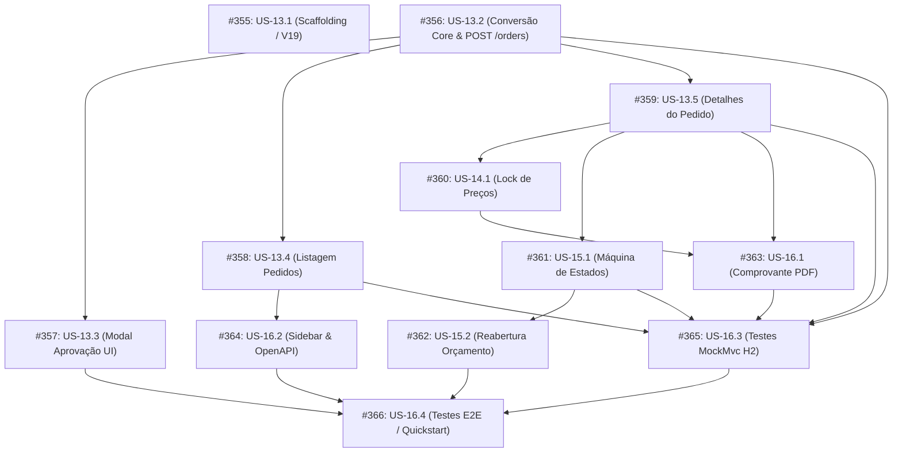

# 📋 Lista de Tarefas (Tasks) — Sprint 06 — Pedidos de Venda, Lock de Preços e Comprovante Oficial

> **Padrão**: User Stories sequenciais do AlumiGest com Sub-tarefas decimais (`US-XX.Y`).  
> **Arquitetura**: Fatias Verticais Finas (*Thin Vertical Slices* ponta a ponta: Banco + Backend + Frontend + Testes).  
> **Regra de Estimativa**: Cada implementação tem duração máxima de **≤ 4 horas**.  
> **Garantia de Qualidade**: Testes unitários em cada task, Definition of Done (DoD) com 7 critérios e tasks finais de integração/sistema.  
> **Período da Sprint 06**: 29/09/2026 a 12/10/2026  
> **Total de Tarefas**: 12 fatias verticais (~38h estimadas).

---

## 📦 US-13: Aprovar Orçamento e Converter em Pedido de Venda
**Issue GitHub**: [#137](https://github.com/ADS-IFPB-SR/alumigest/issues/137) | **Prioridade**: P1 (MVP)

| ID | Issue | Tarefa | Duração | Pré-requisito / Bloqueado por | Tipo | Status |
|---|:---:|---|:---:|---|---|:---:|
| **US-13.1** | [#355](https://github.com/ADS-IFPB-SR/alumigest/issues/355) | [US-13.1](issues/US-13.1-scaffolding-e-infraestrutura-do-modulo-orders/issue.md) Scaffolding e Infraestrutura do Módulo de Pedidos (Migration Flyway V19, pacotes, enums, entidades JPA base e repositórios) | ~1h | *Livre* (Ponto de partida / Root) | Scaffolding / Infra | 🔲 Aberta |
| **US-13.2** | [#356](https://github.com/ADS-IFPB-SR/alumigest/issues/356) | [US-13.2](issues/US-13.2-conversao-de-orcamento-em-pedido-backend-core/issue.md) Conversão de Orçamento em Pedido de Venda no Backend Core (OrderCodeGenerator PED-YYYY-NNNN, OrderService atômico, DTOs, mappers, endpoint POST e testes unitários) | ~4h | *Livre* (Pode iniciar em paralelo com US-13.1) | Backend Core / Regras | 🔲 Aberta |
| **US-13.3** | [#357](https://github.com/ADS-IFPB-SR/alumigest/issues/357) | [US-13.3](issues/US-13.3-modal-aprovacao-e-conversao-frontend/issue.md) Modal de Aprovação e Ação de Conversão na Tela de Orçamento (Tipos TS, Schema Zod, orderApi, hook useConvertBudget, OrderApprovalModal e botão na BudgetDetailPage) | ~3h | Bloqueado por **#356** (US-13.2) | Frontend UI / API | ✅ Concluída |
| **US-13.4** | [#358](https://github.com/ADS-IFPB-SR/alumigest/issues/358) | [US-13.4](issues/US-13.4-listagem-paginada-de-pedidos-fullstack/issue.md) Listagem Paginada de Pedidos de Venda com Filtros (Full-Stack: GET /api/orders paginado, OrderListPage, OrderStatusBadge, busca com debounce e filtros) | ~4h | Bloqueado por **#356** (US-13.2) | Fatia Vertical Full-Stack | ✅ Concluída |
| **US-13.5** | [#359](https://github.com/ADS-IFPB-SR/alumigest/issues/359) | [US-13.5](issues/US-13.5-detalhamento-do-pedido-de-venda-fullstack/issue.md) Visualização Detalhada do Pedido de Venda (Full-Stack: GET /api/orders/{id}, OrderDetailPage com cards informativos, resumo financeiro e vínculo do orçamento) | ~3h | Bloqueado por **#356** (US-13.2) | Fatia Vertical Full-Stack | 🔲 Aberta |

---

## 📦 US-14: Snapshot Imutável e Lock de Preços do Pedido
**Issue GitHub**: [#138](https://github.com/ADS-IFPB-SR/alumigest/issues/138) | **Prioridade**: P1

| ID | Issue | Tarefa | Duração | Pré-requisito / Bloqueado por | Tipo | Status |
|---|:---:|---|:---:|---|---|:---:|
| **US-14.1** | [#360](https://github.com/ADS-IFPB-SR/alumigest/issues/360) | [US-14.1](issues/US-14.1-snapshot-imutavel-lock-precos-deep-copy/issue.md) Snapshot Imutável, Lock de Preços e Tabela de Itens Congelados (Full-Stack: Deep copy em 3 níveis, snapshots JSONB, OrderItemsTable no front e testes unitários de blindagem contra reajuste do catálogo) | ~4h | Bloqueado por **#359** (US-13.5) | Fatia Vertical Full-Stack | ✅ Concluída |

---

## 📦 US-15: Gestão de Status, Prazos e Cancelamento de Pedidos
**Issue GitHub**: [#139](https://github.com/ADS-IFPB-SR/alumigest/issues/139) | **Prioridade**: P2

| ID | Issue | Tarefa | Duração | Pré-requisito / Bloqueado por | Status |
|---|:---:|---|:---:|---|:---:|
| **US-15.1** | [#361](https://github.com/ADS-IFPB-SR/alumigest/issues/361) | [US-15.1](issues/US-15.1-maquina-estados-e-cancelamento-de-pedidos/issue.md) Máquina de Estados e Cancelamento de Pedidos com Justificativa (Full-Stack: transições CRIADO a CONCLUIDO com dataConclusao automática, PATCH /cancel, OrderCancelModal e bloqueio estrito em produção) | ~4h | Bloqueado por **#359** (US-13.5) | 🔲 Aberta |
| **US-15.2** | [#362](https://github.com/ADS-IFPB-SR/alumigest/issues/362) | [US-15.2](issues/US-15.2-reabertura-de-orcamento-apos-cancelamento/issue.md) Reabertura de Orçamento após Cancelamento de Pedido (Ajuste na máquina de estados do BudgetService para APPROVED ➔ DRAFT condicional e botão contextual na BudgetDetailPage) | ~2h | Bloqueado por **#361** (US-15.1) | 🔲 Aberta |

---

## 📦 US-16: Emissão do Comprovante do Pedido de Venda em PDF
**Issue GitHub**: [#140](https://github.com/ADS-IFPB-SR/alumigest/issues/140) | **Prioridade**: P2

| ID | Issue | Tarefa | Duração | Pré-requisito / Bloqueado por | Status |
|---|:---:|---|:---:|---|:---:|
| **US-16.1** | [#363](https://github.com/ADS-IFPB-SR/alumigest/issues/363) | [US-16.1](issues/US-16.1-comprovante-oficial-do-pedido-em-pdf-openpdf/issue.md) Comprovante Oficial do Pedido de Venda em PDF via OpenPDF (Full-Stack: OrderPdfService layout A4 institucional, endpoint GET /pdf/comprovante e ação de download na OrderDetailPage) | ~4h | Bloqueado por **#359** (US-13.5) e **#360** (US-14.1) | 🔲 Aberta |
| **US-16.2** | [#364](https://github.com/ADS-IFPB-SR/alumigest/issues/364) | [US-16.2](issues/US-16.2-navegacao-openapi-swagger-e-contratos/issue.md) Navegação no Sidebar, Documentação OpenAPI/Swagger e Contratos (Atalho 'Pedidos de Venda' no sidebar, anotações Swagger no OrderController e atualização do contrato de API) | ~2h | Bloqueado por **#358** (US-13.4) | 🔲 Aberta |
| **US-16.3** | [#365](https://github.com/ADS-IFPB-SR/alumigest/issues/365) | [US-16.3](issues/US-16.3-testes-de-integracao-backend-mockmvc-h2/issue.md) Bateria de Testes de Integração do Backend (OrderControllerIntegrationTest cobrindo todos os endpoints REST, validações de erro, conflito 409 e downloads com base H2) | ~3h | Bloqueado por **#356**, **#358**, **#359**, **#361**, **#363** | 🔲 Aberta |
| **US-16.4** | [#366](https://github.com/ADS-IFPB-SR/alumigest/issues/366) | [US-16.4](issues/US-16.4-testes-e2e-sistema-e-validacao-quickstart/issue.md) Testes de Sistema E2E, Validação BDD e Homologação do Quickstart (Suite E2E Cypress/Playwright do fluxo ponta a ponta e execução completa do quickstart.md) | ~4h | Bloqueado por **#357**, **#362**, **#364**, **#365** | 🔲 Aberta |

---

## 🔀 Diagrama de Dependências e Ordem de Precedência

---

## 📊 Resumo de Esforço da Sprint 06

- **Total de Horas Estimadas**: **~38 horas** (detalhamento e pontuação Story Points disponíveis no [Guia de Estimativa de Horas](../guia-estimativa-horas.md#8-dimensionamento-oficial-de-tarefas--sprint-06)).
- **Duração Máxima por Tarefa**: Nenhuma tarefa ultrapassa **4 horas** (todas variam entre 1h e 4h).
- **Cobertura de Testes**:
  - Cada fatia vertical possui testes unitários dedicados escolhidos e implementados pelo desenvolvedor.
  - As tarefas **US-16.3** e **US-16.4** realizam a cobertura global de testes de integração, testes de sistema e testes de aceitação ponta a ponta.
- **Definition of Done (DoD)**: Padronizado com 7 critérios em todas as issues.
