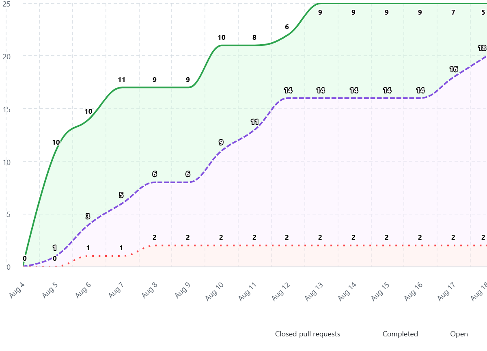

# BRD — Burndown / Burnup Chart — Sprint 02

| Campo | Valor |
|---|---|
| **Projeto** | AlumiGest — Sistema de Gestão para Vidraçaria e Esquadrias |
| **Sprint** | 02 — Catálogo de Materiais e Produtos |
| **Período** | 04/08/2026 a 18/08/2026 (15 dias) |
| **Fonte dos Dados** | GitHub Projects Insights / Closed PRs & Issues |
| **Total de Itens/PRs Planejados** | 25 itens |

---

## 1. 📈 Gráfico de Acompanhamento (GitHub Projects)

---

## 2. 📋 Dados Diários do Burndown / Burnup

| Data | Dia da Sprint | Escopo Total | Itens Concluídos (Completed) | Itens Abertos (Open) | Itens Restantes / Em Andamento |
|---|---|---|---|---|---|
| 04/08 | Dia 0 (seg) | 0 | 0 | 0 | 0 |
| 05/08 | Dia 1 (ter) | 12 | 0 | 0 | 10 |
| 06/08 | Dia 2 (qua) | 14 | 3 | 1 | 10 |
| 07/08 | Dia 3 (qui) | 17 | 5 | 1 | 11 |
| 08/08 | Dia 4 (sex) | 17 | 6 | 2 | 9 |
| 09/08 | Dia 5 (sáb) | 17 | 6 | 2 | 9 |
| 10/08 | Dia 6 (dom) | 21 | 9 | 2 | 10 |
| 11/08 | Dia 7 (seg) | 21 | 11 | 2 | 8 |
| 12/08 | Dia 8 (ter) | 22 | 14 | 2 | 6 |
| 13/08 | Dia 9 (qua) | 25 | 14 | 2 | 9 |
| 14/08 | Dia 10 (qui) | 25 | 14 | 2 | 9 |
| 15/08 | Dia 11 (sex) | 25 | 14 | 2 | 9 |
| 16/08 | Dia 12 (sáb) | 25 | 14 | 2 | 9 |
| 17/08 | Dia 13 (dom) | 25 | 16 | 2 | 7 |
| 18/08 | Dia 14 (seg) | 25 | 20 | 2 | 5 (Transição S3) |

---

## 3. 🔍 Análise do Gráfico e Ritmo de Entrega

1. **Evolução do Escopo (Linha Verde):** 
   - A sprint iniciou com definição base (12 a 17 itens nos primeiros dias) e alcançou o escopo total de **25 itens/PRs** no dia 13/08 após o detalhamento completo dos módulos de materiais e fichas técnicas.
2. **Ritmo de Conclusão (Linha Roxa Tracejada):**
   - As entregas e merges de PRs foram contínuos, com aceleração notável a partir de 10/08 (Auth e Entidades Base) e 17-18/08 (Fechamento das telas de catálogo e integração).
3. **Itens Abertos e Transição (Linha Vermelha Pontilhada):**
   - Manteve-se em taxa controlada (1 a 2 itens simultâneos abertos), demonstrando que a equipe evitou sobrecarga de trabalho em progresso (baixo WIP).
4. **Fechamento:**
   - 20 itens concluídos e aprovados diretamente no incremento da Sprint 2, com os itens residuais sendo promovidos para o encadeamento imediato com a Sprint 3 (Orçamentos e Clientes).

---

*Documento atualizado com dados extraídos do GitHub Projects — Sprint 02 — 18/08/2026*
