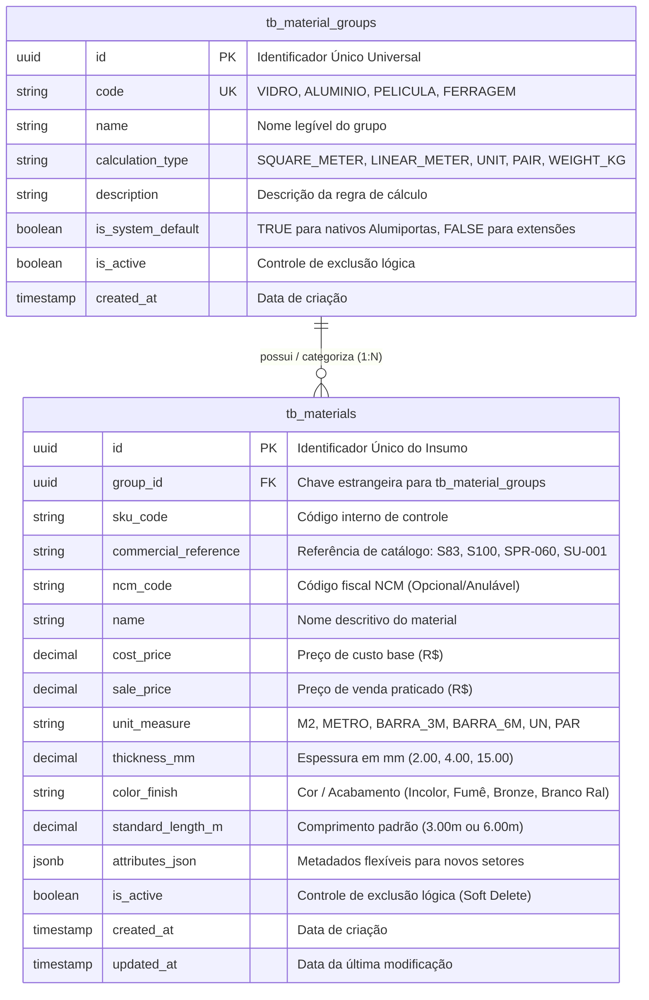

# 📐 Documento de Arquitetura e Modelagem de Dados (DER)
## Módulo: Catálogo de Materiais e Insumos Genéricos
**Projeto:** AlumiGest (Gestão Operacional e Orçamentária para Esquadrias e Vidraçaria)  
**Versão:** 1.0.0  
**Data:** 06 de Agosto de 2026  
**Autor:** Equipe de Engenharia de Software (Scrum Master: Nichollas Cavalcante)  

---

## 1. 🎯 Visão Geral e Objetivos Arquiteturais

O módulo de **Catálogo de Materiais** é o alicerce de dados do AlumiGest. Seu objetivo principal é fornecer uma base sólida, flexível e performática para o cadastro, precificação e consulta de todos os insumos utilizados na fabricação de esquadrias e vidros pela **Alumiportas**.

### 🌟 Princípios de Design e Extensibilidade
1. **Atendimento Imediato à Alumiportas (Sprint 2):** Suporte nativo e otimizado para os 4 grupos essenciais de materiais:
   * **Vidros:** Medidos por área ($m^2$) com suporte a espessuras finas para móveis (**2mm e 4mm**) e comuns/temperados (**6mm, 8mm, 10mm**).
   * **Perfis de Alumínio e Puxadores:** Medidos por metro linear ($m$) com suporte a barras comerciais (**3.00m e 6.00m**), referências comerciais de perfis (ex: `SU-001`, `S83`, `SPR-060`) e código NCM opcional para conformidade fiscal.
   * **Películas:** Medidas por área de aplicação ($m^2$) sobre os vidros (Fumê G5/G20, Jateada, Leitosa, Espelhada).
   * **Ferragens e Acessórios:** Medidos por **Unidade (`UN`)**, **Par (`PAR`)** (dobradiças, rodízios) ou **Metro (`METRO`)** (trilhos e escovas).
2. **Extensibilidade Futura (*Type-Object Pattern*):** A arquitetura foi projetada para que a expansão para outros setores da indústria moveleira ou serralheria (ex: **Marcenaria** com chapas de MDF, fitas de borda e corrediças) ocorra **sem necessidade de alterar o esquema do banco de dados ou recompilar o backend**.
3. **Desacoplamento entre Insumo e Produto Final:** Materiais são os componentes atômicos; portas e esquadrias são **Produtos Finais / Templates (Compostos)** montados a partir desses materiais na Sprint 3.

---

## 2. 📊 Diagrama Entidade-Relacionamento (DER)



---

## 3. 📖 Dicionário de Dados

### 3.1 Tabela `tb_material_groups` (Grupos de Materiais)
Armazena as famílias de insumos e define a estratégia matemática de medição e cálculo de orçamentos.

| Campo | Tipo | Restrições | Descrição / Exemplo |
| :--- | :--- | :--- | :--- |
| `id` | `UUID` | `PK, DEFAULT uuid_generate_v4()` | Chave primária universal. |
| `code` | `VARCHAR(50)` | `NOT NULL, UNIQUE` | Código identificador (ex: `VIDRO`, `ALUMINIO`, `PELICULA`, `FERRAGEM`, `MDF`). |
| `name` | `VARCHAR(100)` | `NOT NULL` | Nome exibido na interface (*"Vidros e Espelhos"*). |
| `calculation_type` | `VARCHAR(30)` | `NOT NULL` | `SQUARE_METER`, `LINEAR_METER`, `UNIT`, `PAIR`, `WEIGHT_KG`. |
| `description` | `TEXT` | `NULL` | Descrição técnica das regras do grupo. |
| `is_system_default`| `BOOLEAN` | `DEFAULT FALSE` | `TRUE` para proteger os 4 grupos nativos da Alumiportas contra exclusão. |
| `is_active` | `BOOLEAN` | `DEFAULT TRUE` | Soft delete para desativação de grupos. |
| `created_at` | `TIMESTAMP WITH TIME ZONE` | `DEFAULT NOW()` | Auditoria de criação. |

---

### 3.2 Tabela `tb_materials` (Insumos e Materiais do Catálogo)
Armazena a listagem de todos os materiais comercializados, associados ao seu respectivo grupo.

| Campo | Tipo | Restrições | Descrição / Exemplo |
| :--- | :--- | :--- | :--- |
| `id` | `UUID` | `PK, DEFAULT uuid_generate_v4()` | Chave primária universal. |
| `group_id` | `UUID` | `FK -> tb_material_groups(id)` | Grupo que rege a regra de cálculo do material. |
| `sku_code` | `VARCHAR(50)` | `NULL` | Código interno de estoque ou SKU. |
| `commercial_reference`| `VARCHAR(100)`| `NULL` | **Referência de Catálogo/Fábrica:** `SU-001`, `S83`, `SPR-060`. |
| `ncm_code` | `VARCHAR(10)` | `NULL` | Nomenclatura Comum do Mercosul (Classificação Fiscal opcional). |
| `name` | `VARCHAR(150)`| `NOT NULL` | Nome completo (*"Vidro Canelado 4mm"*, *"Perfil Puxador Alfa"*). |
| `cost_price` | `DECIMAL(12,2)`| `NOT NULL, DEFAULT 0.00` | Preço de custo base. |
| `sale_price` | `DECIMAL(12,2)`| `NOT NULL, DEFAULT 0.00` | Preço de venda padrão praticado no catálogo. |
| `unit_measure` | `VARCHAR(20)` | `NOT NULL, DEFAULT 'UN'` | `M2`, `METRO`, `BARRA_3M`, `BARRA_6M`, `UN`, `PAR`. |
| `thickness_mm` | `DECIMAL(6,2)` | `NULL` | Espessura física em mm (**2.00, 4.00, 6.00** ou **15.00** para MDF). |
| `color_finish` | `VARCHAR(50)` | `NULL` | Cor/Acabamento (Incolor, Bronze, Champanhe, Preto Fosco). |
| `standard_length_m`| `DECIMAL(6,2)` | `NULL` | Comprimento padrão da barra (**3.00m** ou **6.00m**). |
| `attributes_json` | `JSONB` | `NULL` | Atributos adicionais dinâmicos para expansão de novos setores. |
| `is_active` | `BOOLEAN` | `DEFAULT TRUE` | Soft delete (`false` quando inativado). |
| `created_at` | `TIMESTAMP WITH TIME ZONE` | `DEFAULT NOW()` | Data de criação. |
| `updated_at` | `TIMESTAMP WITH TIME ZONE` | `DEFAULT NOW()` | Data da última atualização. |

---

## 4. 🗄️ Script DDL Oficial (PostgreSQL 16 & Flyway)

```sql
-- ============================================================================
-- AlumiGest Database Migration - V1__create_generic_catalog.sql
-- Módulo: Catálogo de Materiais e Insumos Genéricos
-- ============================================================================

CREATE EXTENSION IF NOT EXISTS "uuid-ossp";

-- 1. Criação da Tabela de Grupos de Materiais
CREATE TABLE tb_material_groups (
    id UUID PRIMARY KEY DEFAULT uuid_generate_v4(),
    code VARCHAR(50) NOT NULL UNIQUE,
    name VARCHAR(100) NOT NULL,
    calculation_type VARCHAR(30) NOT NULL,
    description TEXT,
    is_system_default BOOLEAN NOT NULL DEFAULT FALSE,
    is_active BOOLEAN NOT NULL DEFAULT TRUE,
    created_at TIMESTAMP WITH TIME ZONE DEFAULT CURRENT_TIMESTAMP
);

-- 2. Seed dos 4 Grupos Nativos da Alumiportas
INSERT INTO tb_material_groups (code, name, calculation_type, description, is_system_default) VALUES
('VIDRO', 'Vidros e Espelhos', 'SQUARE_METER', 'Vidros planos, fantasia e temperados calculados por área (m²)', TRUE),
('ALUMINIO', 'Perfis de Alumínio e Puxadores', 'LINEAR_METER', 'Perfis, trilhos e puxadores calculados por metro linear e barras de 3m/6m', TRUE),
('PELICULA', 'Películas de Proteção e Acabamento', 'SQUARE_METER', 'Películas decorativas e de proteção solar calculadas por m²', TRUE),
('FERRAGEM', 'Ferragens, Componentes e Acessórios', 'UNIT', 'Fechaduras, rodízios, esquadretas e kits de montagem por unidade ou par', TRUE);

-- 3. Criação da Tabela Universal de Materiais
CREATE TABLE tb_materials (
    id UUID PRIMARY KEY DEFAULT uuid_generate_v4(),
    group_id UUID NOT NULL,
    sku_code VARCHAR(50),
    commercial_reference VARCHAR(100),
    ncm_code VARCHAR(10),
    name VARCHAR(150) NOT NULL,
    cost_price DECIMAL(12, 2) NOT NULL DEFAULT 0.00,
    sale_price DECIMAL(12, 2) NOT NULL DEFAULT 0.00,
    unit_measure VARCHAR(20) NOT NULL DEFAULT 'UN',
    thickness_mm DECIMAL(6, 2),
    color_finish VARCHAR(50),
    standard_length_m DECIMAL(6, 2),
    attributes_json JSONB,
    is_active BOOLEAN NOT NULL DEFAULT TRUE,
    created_at TIMESTAMP WITH TIME ZONE DEFAULT CURRENT_TIMESTAMP,
    updated_at TIMESTAMP WITH TIME ZONE DEFAULT CURRENT_TIMESTAMP,
    
    CONSTRAINT fk_materials_group FOREIGN KEY (group_id) REFERENCES tb_material_groups (id) ON DELETE RESTRICT
);

-- 4. Índices de Otimização para Consultas
CREATE INDEX idx_materials_group_id ON tb_materials(group_id);
CREATE INDEX idx_materials_name ON tb_materials(name);
CREATE INDEX idx_materials_commercial_ref ON tb_materials(commercial_reference);
CREATE INDEX idx_materials_active ON tb_materials(is_active);
```

---

## 5. 🔮 Guia de Extensibilidade: Como expandir para Marcenaria

Para cadastrar insumos de **Marcenaria** (ou qualquer outro setor), basta registrar o novo grupo via API ou SQL:

```sql
-- Exemplo: Adicionar suporte a Marcenaria
INSERT INTO tb_material_groups (code, name, calculation_type, description, is_system_default)
VALUES ('MDF', 'Chapas e Painéis de MDF', 'SQUARE_METER', 'Painéis de madeira calculados por m²', FALSE);

-- Exemplo: Cadastrar Chapa de MDF
INSERT INTO tb_materials (group_id, name, thickness_mm, color_finish, cost_price, sale_price, unit_measure)
SELECT id, 'Chapa MDF Branco TX', 15.00, 'Branco', 70.00, 110.00, 'M2'
FROM tb_material_groups WHERE code = 'MDF';
```
O sistema processará o cálculo de área do MDF automaticamente pelo motor de cálculo genérico!
