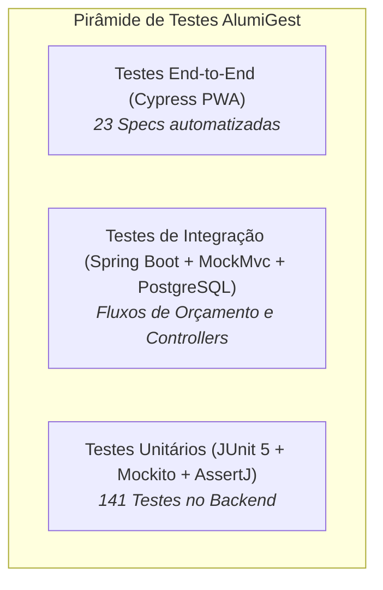

# 🧪 PLT — Plano Geral de Testes e Estratégia de Qualidade

| Campo | Valor |
|---|---|
| **Projeto** | AlumiGest — Sistema de Gestão para Vidraçaria e Esquadrias |
| **Versão** | 2.0.0 |
| **Data** | 31/08/2026 |
| **Responsável de QA** | Herbert Carvalho dos Santos / Equipe de Engenharia |

---

## 1. 🎯 Objetivos de Qualidade

Este documento define a estratégia, a pirâmide de testes, as ferramentas, os ambientes e os critérios de aceitação adotados pela equipe do **AlumiGest** para assegurar a corretude, robustez e usabilidade do sistema em todas as sprints.

### 🌟 Pilares de Qualidade
1. **Precisão Matemática e Monetária:** Garantir que o motor de cálculo de vidro ($m^2$), perfis lineares ($m$), kits de ferragens e películas execute cálculos determinísticos sem desvios de arredondamento.
2. **Integridade de Dados:** Validar integridade referencial, restrições de unicidade (SKU, CPF/CNPJ) e migrações Flyway.
3. **Resiliência e Tratamento de Erros:** Garantir que exceções de negócio retornem códigos HTTP semânticos (400, 404, 409, 422) com respostas padronizadas em português.
4. **Regressão Zero:** Executar suítes automatizadas a cada Pull Request integrado na branch `develop`.

---

## 2. 🏛️ Pirâmide de Testes e Ferramental

| Nível de Teste | Escopo | Ferramentas / Frameworks | Execução |
|---|---|---|---|
| **Unitário (Backend)** | Serviços de Domínio, Motores de Cálculo, Mappers e Entidades | JUnit 5, Mockito, AssertJ | Local (`mvn test`) e CI/CD GitHub Actions |
| **Integração (Backend)** | Controllers REST, Validações JSR-380, Filtros de Paginação e Exceptions | SpringBootTest, MockMvc, H2 / Testcontainers | Local e CI/CD |
| **End-to-End (Frontend)** | Fluxos de Catálogo, Modais de Cadastro, Alternância de Abas, Status e Filtros | Cypress 13, TypeScript | Local (`npm run test:e2e`) |
| **Aceitação (BDD / TEA)** | Validação de Regras de Negócio com o Product Owner | Gherkin / BDD (Documentos TEA por sprint) | Homologação em `develop.italuhub.cloud` |

---

## 3. 🌐 Ambientes e Execução

| Ambiente | Propósito | URL / Endpoint | Banco de Dados |
|---|---|---|---|
| **Local (DEV)** | Desenvolvimento ativo | `http://localhost:5173` (Front) / `8080` (Back) | PostgreSQL 16 (Docker Compose) |
| **CI (GitHub Actions)** | Validação de PRs e SonarQube | Runner Linux (GitHub Actions) | H2 in-memory / Mocked |
| **Staging / Homologação** | Validação E2E integrada e testes de aceitação | `https://develop.italuhub.cloud` | PostgreSQL 16 em Nuvem |

---

## 4. 📊 Critérios de Aceitação e Definição de Pronto (DoD de QA)

Um item só é considerado pronto e elegível para merge quando:
1. **100% dos testes unitários e de integração passarem** sem falhas ou erros.
2. **Cobertura de linhas de código superior a 80%** nos serviços críticos de negócio (`BudgetService`, `BudgetQuantityService`, `ProductService`).
3. **Specs Cypress executando com 100% de sucesso** em modo headless (`npm run test:e2e`).
4. **Relatório de Testes (RET) gerado e arquivado** na pasta da respectiva sprint em `docs/projeto-001/003-teste/`.

---

*Plano homologado pela Equipe de QA AlumiGest — Agosto/2026*
