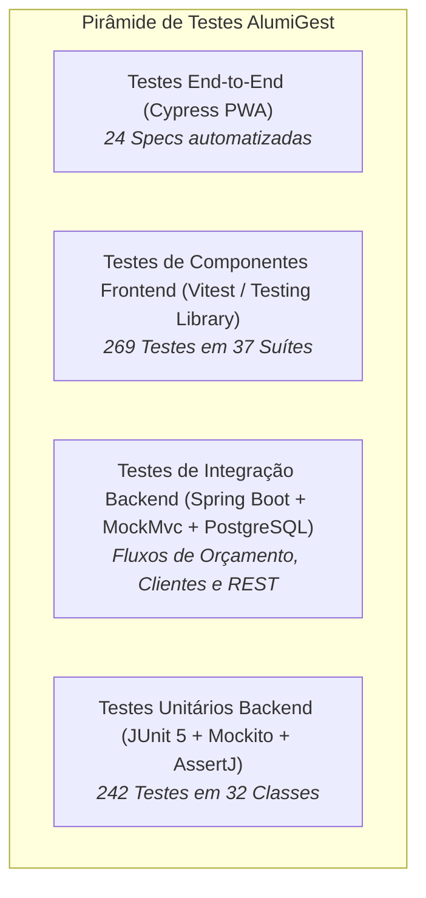

# 🧪 PLT — Plano Geral de Testes e Estratégia de Qualidade

| Campo | Valor |
|---|---|
| **Projeto** | AlumiGest — Sistema de Gestão para Vidraçaria e Esquadrias |
| **Sigla** | ALG |
| **Versão** | 2.2.0 (Consolidação de Cobertura US-09/US-10, Mitigações R11/R12 e 269 Testes Vitest) |
| **Data** | 24/09/2026 |
| **Responsável de QA** | Herbert Carvalho dos Santos / Equipe de Engenharia e QA |
| **Governança** | Docs-as-Code — Oficial de Governança (`alumigest-doc-governor`) |

---

## 1. 🎯 Objetivos de Qualidade

Este documento define a estratégia, a pirâmide de testes, as ferramentas, os ambientes e os critérios de aceitação adotados pela equipe do **AlumiGest** para assegurar a corretude, robustez, sigilo e usabilidade do sistema em todas as sprints.

### 🌟 Pilares de Qualidade
1. **Precisão Matemática e Engenharia de Corte:** Garantir que o motor de cálculo de vidro ($m^2$ com faturamento mínimo de $0.2500\text{ m}^2$), perfis lineares ($m$ com fórmulas paramétricas $2W+nH$ e arredondamento `RoundingMode.CEILING`), kits de ferragens e películas execute cálculos determinísticos via `BigDecimal` sem desvios de ponto flutuante.
2. **Sigilo Comercial e Segregação de Vias (Risco R11):** Garantir que a suíte automatizada valide que a emissão da Ficha Técnica de Oficina (`TechnicalPdfPageEvent`) não contenha nenhuma menção a preços de custo, venda, margens ou cifras em R$.
3. **Validação de Limites Físicos (Risco R12):** Validar alertas de subdimensionamento físico para vãos menores que 400 mm e bloqueio para medidas que excedam a dimensão máxima das chapas de vidro.
4. **Integridade de Dados e Transações:** Validar integridade referencial, restrições de unicidade (SKU, CPF/CNPJ, E-mail) e migrações Flyway.
5. **Resiliência e Tratamento de Erros:** Garantir que exceções de negócio retornem códigos HTTP semânticos (400, 404, 409, 422) com respostas padronizadas em português.
6. **Regressão Zero e Clean as You Code:** Executar suítes automatizadas a cada Pull Request integrado na branch `develop` com Quality Gate do SonarQube aprovado (New Code $\ge 80\%$, zero bugs/vulnerabilidades).

---

## 2. 🏛️ Pirâmide de Testes e Ferramental

| Nível de Teste | Escopo | Ferramentas / Frameworks | Métricas / Volume | Execução |
|---|---|---|---|---|
| **Unitário (Backend)** | Serviços de Domínio, Motores de Cálculo (`MaterialQuantityCalculator`), Mappers e Entidades | JUnit 5, Mockito, AssertJ | **242 testes** em **32 classes** de teste | Local (`mvn test`) e CI/CD GitHub Actions |
| **Integração (Backend)** | Controllers REST, Validações JSR-380/Zod, Filtros de Paginação e Exceptions | SpringBootTest, MockMvc, H2 / PostgreSQL Docker | Cobertura integrada de endpoints de Catálogo, Clientes e Orçamentos | Local e CI/CD |
| **Componentes Frontend** | Modais, Seletores, Formulários e Schemas Zod de Orçamento | Vitest, React Testing Library | **269 testes** em **37 suítes** | Local (`npm run test`) |
| **End-to-End (Frontend)** | Fluxos de Catálogo, Modais de Cadastro, Alternância de Abas, Status e Filtros | Cypress 13, TypeScript | **24 specs** automatizadas | Local (`npm run test:e2e`) |
| **Aceitação (BDD / TEA)** | Validação de Regras de Negócio com o Product Owner | Gherkin / BDD (Documentos TEA por sprint) | Cenários BDD por História de Usuário | Homologação em `develop.italuhub.cloud` |

---

### 2.1 📈 Evidências de Cobertura e Homologação de Orçamentos (US-09 e US-10)

Em auditoria técnica conduzida pela Engenharia de QA (Joseph Nichollas) para os módulos de **Orçamentos e Exportação PDF/WhatsApp**, foram obtidos os seguintes índices formais no JaCoCo e Vitest:

1. **Backend (`br.edu.ifpb.alumigest.budgets.service` — JaCoCo XML):**
   * **133 testes unitários e de integração** no domínio comercial com 100% de aprovação.
   * **Cobertura de Linhas no pacote de serviços:** **97,1%** (meta mínima do SonarQube: $\ge 80\%$).
   * **Cobertura de Branches no pacote de serviços:** **80,0%** (meta mínima do SonarQube: $\ge 80\%$).
   * Classes centrais: `BudgetService` atingiu **99,5% de linhas** e **85,0% de branches**; `BudgetCodeGenerator` atingiu **100%**.
   * Resolução preventiva do risco de `LazyInitializationException` em transações de geração de PDF.

2. **Frontend (React 19 / Vitest / v8 / Testing Library):**
   * **269 testes automatizados** executados com 100% de sucesso em 37 suítes.
   * `BudgetsPagination`: **100% de linhas e 100% de branches**.
   * `CustomerSelector`: **94,8% de linhas e 91,9% de branches**.
   * `SeparateSaleForm`: **95,6% de linhas e 90,9% de branches**.
   * `budgetSchema` (validação Zod): **100% de linhas e 94,7% de branches**.
   * `budgetsApi`: **97,7% de linhas**.

## 3. 🌐 Ambientes e Execução

| Ambiente | Propósito | URL / Endpoint | Banco de Dados | Pipeline / Monitoramento |
|---|---|---|---|---|
| **Local (DEV)** | Desenvolvimento ativo | `http://localhost:5173` (Front) / `8080` (Back) | PostgreSQL 16 (Docker Compose) | Execução local via terminal |
| **CI (GitHub Actions)** | Validação de PRs e SonarQube | Runner Ubuntu (GitHub Actions) | JaCoCo XML + SonarScanner | Pipeline `.github/workflows/ci.yml` |
| **Staging / Homologação** | Validação E2E integrada e testes de aceitação | `https://develop.italuhub.cloud` | PostgreSQL 16 em Nuvem (Coolify) | Deploy contínuo da branch `develop` |

---

## 4. 📊 Critérios de Aceitação e Definição de Pronto (DoD de QA)

Um item só é considerado pronto e elegível para merge quando:
1. **100% dos testes unitários e de integração passarem** sem falhas ou erros (`mvn clean verify`).
2. **Cobertura de linhas de código superior a 80%** nos serviços críticos de negócio (`BudgetService`, `BudgetQuantityService`, `ProductService`, `ClientService`).
3. **Quality Gate do SonarQube Aprovado** no GitHub Actions (zero bugs, zero vulnerabilidades e cobertura em código novo $\ge 80\%$).
4. **Specs Cypress executando com 100% de sucesso** em modo headless (`npm run test:e2e`).
5. **Relatório de Testes (RET) gerado e arquivado** na pasta da respectiva sprint em `docs/projeto-001/003-teste/`.
6. **Defeitos e incidentes catalogados** no [`RBD-Registro_de_Bugs_e_Defeitos.md`](file:///c:/Users/italo/Desktop/Projects/alumigest/docs/projeto-001/003-teste/RBD-Registro_de_Bugs_e_Defeitos.md) e reportados via template interativo YAML (`.github/ISSUE_TEMPLATE/bug_report.yml`).

---

*Plano homologado pela Equipe de QA AlumiGest — Atualizado em 24/09/2026*
