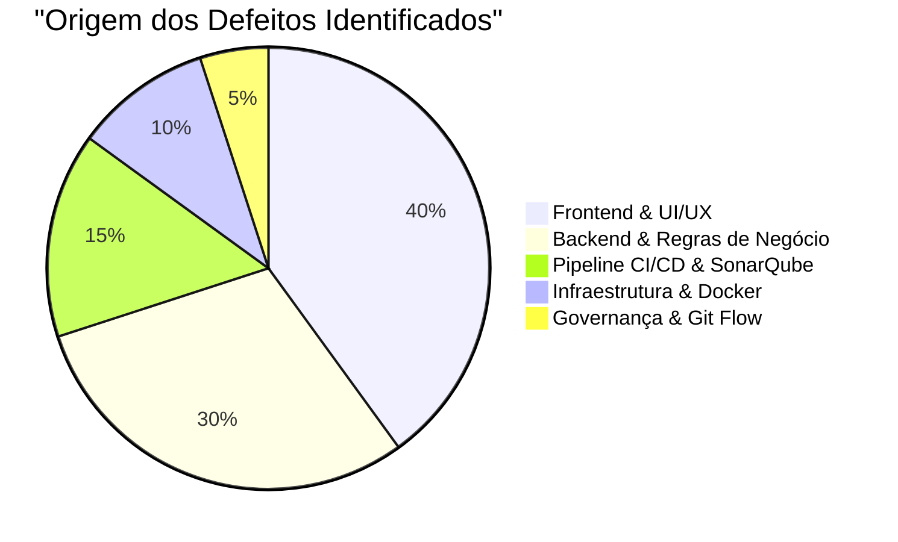

# 🐞 RBD — Registro de Bugs e Defeitos do Projeto AlumiGest

| Campo | Valor |
|---|---|
| **Projeto** | AlumiGest — Sistema de Gestão para Vidraçaria e Esquadrias |
| **Documento** | Registro Unificado de Bugs, Defeitos e Hotfixes (RBD) |
| **Versão** | 2.0.0 |
| **Data de Atualização** | 05/09/2026 |
| **Responsável QA** | Herbert Carvalho dos Santos / Equipe de Engenharia AlumiGest |
| **Branch** | `planejamento` |
| **Padrão de Template** | Baseado em [`.github/ISSUE_TEMPLATE/bug_report.md`](../../../.github/ISSUE_TEMPLATE/bug_report.md) |
| **Auditoria Técnica** | Análise estática SonarQube, Pipeline CI/CD GitHub Actions e Histórico Git |

---

## 1. 🎯 Finalidade e Metodologia de Qualidade

Este documento consolida o **catálogo histórico e investigativo de todos os bugs, defeitos, falhas de ambiente, incompatibilidades de tipagem e regressões de software** identificados e tratados nas branches `develop` e `main` do repositório **AlumiGest**.

Seguindo a governança do **Plano de Gerência de Configuração (PGC)** e do **Plano Geral de Testes (PLT)**:
1. Todos os relatos respeitam estritamente a estrutura formal do template [`.github/ISSUE_TEMPLATE/bug_report.md`](../../../.github/ISSUE_TEMPLATE/bug_report.md).
2. Cada defeito é rastreado com sua severidade, passos de reprodução, comportamento esperado, ambiente afetado e **análise técnica de causa raiz e solução aplicada**.
3. O monitoramento contínuo aplica a filosofia **Clean as You Code**, suportada pela suíte de **141 testes automatizados JUnit 5**, **23 suítes E2E Cypress**, **Oxlint** e **SonarQube Community Edition**.

---

## 2. 📊 Matriz Consolidada de Defeitos Catalogados

| ID | Título do Defeito / Bug | Módulo | Severidade | Sprint | Status | Detecção / Correção |
|:---:|:---|:---:|:---:|:---:|:---:|:---:|
| **[BUG-001](#bug-001)** | Bloqueio de CORS e Rotas Incorretas na API de Materiais do Frontend | Frontend / API | 🔴 Alta | Sprint 02 | ✅ Resolvido | Commit `6d4907c` |
| **[BUG-002](#bug-002)** | Mapeamento JSONB e Parâmetros Nullable Quebrando Consultas no PostgreSQL e Swagger | Backend / JPA | 🔴 Alta | Sprint 02 | ✅ Resolvido | Commit `d394cc7` |
| **[BUG-003](#bug-003)** | Unidade de Comprimento em Milímetros e Falta de Edição no Modal de Perfis | Frontend / Catálogo | 🟡 Média | Sprint 02 | ✅ Resolvido | Commit `5c0022e` |
| **[BUG-004](#bug-004)** | Serialização Divergente de Booleano `isActive` vs `active` no DTO de Vidros | Backend / DTO | 🟡 Média | Sprint 02 | ✅ Resolvido | Commit `ca9a13f` |
| **[BUG-005](#bug-005)** | Impossibilidade de Atualizar ou Reativar Materiais Inativados (Soft Delete) | Backend / Service | 🔴 Alta | Sprint 02 | ✅ Resolvido | Commit `48738ec` |
| **[BUG-006](#bug-006)** | Perda de Padding Principal e Quebra Visual de Espaçamento no DashboardLayout | Frontend / UI | 🟢 Baixa | Sprint 02 | ✅ Resolvido | Commit `e3d7d62` |
| **[BUG-007](#bug-007)** | Quebra de Fixtures de Testes Unitários após Adição de Dimensões em Vidros | Backend / Testes | 🟡 Média | Sprint 02 | ✅ Resolvido | Commit `4c3ccff` |
| **[BUG-008](#bug-008)** | Falha no Build de Produção por Imports Não Utilizados do React e Erros Oxlint | Frontend / CI | 🔴 Alta | Sprint 02 | ✅ Resolvido | Commits `136d1c8`, `1dab61a` |
| **[BUG-009](#bug-009)** | Isolamento Indevido de Portas no Docker Bloqueando Acesso Local (Host) | Infra / Docker | 🔴 Alta | Sprint 02 | ✅ Resolvido | PR #55, #58 / Commit `25bd60a` |
| **[BUG-010](#bug-010)** | Duplo Desempacotamento de Resposta da API Gerando Telas Vazias de Produtos | Frontend / State | 🔴 Alta | Sprint 02 | ✅ Resolvido | PR #56 / Commit `e993e97` |
| **[BUG-011](#bug-011)** | Crash na Ficha Técnica por `crypto.randomUUID()` Não Definido em Conexões HTTP | Frontend / PWA | 🔴 Crítica | Sprint 02 | ✅ Resolvido | PR #59, #60 / Commit `6b47302` |
| **[BUG-012](#bug-012)** | Falhas de Validação, Mensagens Genéricas e Quebra de Layout nos Modais (Issue #75) | Frontend / Modais | 🔴 Alta | Sprint 02 | ✅ Resolvido | PR #77 / Commit `eb38861` |
| **[BUG-013](#bug-013)** | Falha de Resolução do Plugin SonarQube Maven no Pipeline do GitHub Actions | CI/CD / Sonar | 🔴 Alta | Sprint 03 | ✅ Resolvido | PR #78 / Commit `d0da2e3` |
| **[BUG-014](#bug-014)** | Merge Prematuro de Orçamentos na Branch `main` e Reversão Emergencial | Arquitetura / Git | 🔴 Crítica | Sprint 03 | ✅ Resolvido | PR #105 / Revert PR #109 |
| **[BUG-015](#bug-015)** | Conflito Fatal de Versões de Migração Flyway (`V8` Duplicada no Banco) | Backend / Flyway | 🔴 Alta | Sprint 03 | ✅ Resolvido | Commit `bad5c2d` |
| **[BUG-016](#bug-016)** | Incompatibilidade de Propriedade `fullName` no MapStruct de Orçamentos | Backend / Mapper | 🔴 Alta | Sprint 03 | ✅ Resolvido | Commits `c6b1842`, `530f8e1` |
| **[BUG-017](#bug-017)** | Quebra de Compilação do `BudgetIntegrationTest` após Remoção de `laborCost` | Backend / Testes | 🔴 Alta | Sprint 03 | ✅ Resolvido | PR #120 / Commit `e47bff9` |
| **[BUG-018](#bug-018)** | Erro de Inferência de Tipos no Schema Zod do SKU de Películas | Frontend / Zod | 🟡 Média | Sprint 03 | ✅ Resolvido | Commit `7751850` |
| **[BUG-019](#bug-019)** | Falha de Compilação e DI por Inconsistência na `MaterialCalculatorFactory` | Backend / Motor | 🔴 Alta | Sprint 03 | ✅ Resolvido | Commit `9cbf957` |
| **[BUG-020](#bug-020)** | Funções Não Utilizadas no Cypress Violando Linting Estrito no Pipeline | Frontend / QA | 🟢 Baixa | Sprint 03 | ✅ Resolvido | Commit `6a48859` |

---

## 3. 📝 Registro Detalhado de Bugs e Defeitos

---

### BUG-001
#### [BUG] Bloqueio de CORS e Rotas Incorretas na API de Materiais do Frontend

**Descrição do Problema:**
Ao tentar carregar ou salvar dados na tela de Catálogo de Materiais (`/`), as requisições HTTP falhavam com erros `404 Not Found` e bloqueio de CORS no navegador. A aplicação frontend estava chamando diretamente a porta do backend (`http://localhost:8080/api/glasses`) sem o prefixo `/v1/catalog/` padronizado na arquitetura.

**Passos para Reproduzir:**
1. Iniciar o backend na porta 8080 e o frontend no Vite na porta 5173.
2. Acessar a aplicação em `http://localhost:5173`.
3. Navegar para a aba "Vidros" ou "Perfis".
4. Abrir o Console de Desenvolvedor (F12) e observar a falha de requisição `CORS Policy / 404`.

**Comportamento Esperado:**
O frontend deve se comunicar transparentemente através de reverse proxy (`/api/v1`) com suporte nativo a rotas prefixadas `/catalog/...` sem incidentes de CORS ou falha de porta.

**Contexto / Ambiente:**
- **Navegador / Sistema:** Google Chrome / Firefox (Ambiente de Desenvolvimento Vite).
- **Módulo Afetado:** Catálogo de Materiais (`frontend/src/features/catalog/services/catalogApi.ts`, `vite.config.ts`, `api.ts`).
- **Severidade:** 🔴 Alta | **Sprint:** 02 | **Status:** ✅ Resolvido.
- **Detecção / Correção:** Commit `6d4907c` (Refs: US-013).

**Causa Raiz Técnica & Solução:**
* **Causa Raiz:** O cliente Axios apontava para `http://localhost:8080/api` de forma estática e sem o proxy reverso do Vite configurado, disparando restrições de Cross-Origin Resource Sharing.
* **Solução:** Configurado o proxy reverso no `vite.config.ts` redirecionando `/api` para `http://localhost:8080`, unificada a `baseURL` para `/api/v1` e adicionados os prefixos `/catalog/` em todas as chamadas de insumos.

---

### BUG-002
#### [BUG] Mapeamento JSONB e Parâmetros Nullable Quebrando Consultas no PostgreSQL e Swagger

**Descrição do Problema:**
A listagem filtrada de perfis de alumínio e o salvamento de atributos dinâmicos quebravam com exceções SQL no backend (`PSQLException: column "attributes_json" is of type jsonb but expression is of type character varying`). Adicionalmente, buscas com parâmetros nulos geravam falha de inferência de tipos e a documentação do Swagger exibia o objeto `Pageable` desestruturado de forma incorreta.

**Passos para Reproduzir:**
1. Acessar o endpoint `GET /api/v1/catalog/aluminum-profiles` sem informar filtros de nome ou cor.
2. Observar erro HTTP 500 com log do PostgreSQL indicando `could not determine data type of parameter $1`.
3. Tentar persistir um material com campo `attributes_json`.

**Comportamento Esperado:**
O PostgreSQL deve aceitar atributos nulos em cláusulas `OR` e persistir objetos JSONB nativamente via Hibernate sem divergência de tipos.

**Contexto / Ambiente:**
- **Navegador / Sistema:** Spring Boot 3.4 / PostgreSQL 16 / Hibernate 6.
- **Módulo Afetado:** `backend/src/main/java/br/edu/ifpb/alumigest/catalog/domain/Material.java` e `MaterialRepository.java`.
- **Severidade:** 🔴 Alta | **Sprint:** 02 | **Status:** ✅ Resolvido.
- **Detecção / Correção:** Commit `d394cc7`.

**Causa Raiz Técnica & Solução:**
* **Causa Raiz:** O campo `attributesJson` na entidade `Material` estava mapeado como `TEXT` genérico, incompatível com o tipo de coluna `jsonb` criado no Flyway. Além disso, no Spring Data JPA, parâmetros opcionais em queries nativas sem cast explícito falham no driver do Postgres.
* **Solução:** Adicionada anotação `@JdbcTypeCode(SqlTypes.JSON)`, aplicado `CAST(:param AS string) IS NULL` nas queries JPQL do `MaterialRepository` e adicionada a anotação `@ParameterObject` no `AluminumProfileController`.

---

### BUG-003
#### [BUG] Unidade de Comprimento em Milímetros e Falta de Edição no Modal de Perfis

**Descrição do Problema:**
O formulário de cadastro de perfis de alumínio enviava o comprimento padrão da barra em milímetros (`6000`), enquanto as regras de cálculo do backend esperavam o valor em metros (`3.00` ou `6.00`). Adicionalmente, o modal não suportava a edição de perfis já cadastrados e hardcodava a linha comercial como "Suprema".

**Passos para Reproduzir:**
1. Acessar o Catálogo de Materiais > Aba Perfis de Alumínio.
2. Clicar em "Novo Perfil" e preencher os dados informando comprimento de barra.
3. Observar erro de validação de negócio no backend (`Tamanho padrão de barra inválido. Permitido apenas 3m ou 6m`).
4. Tentar clicar no botão de editar um perfil existente e notar que o formulário abria em branco para criação.

**Comportamento Esperado:**
O modal deve trabalhar com metros (`3m` ou `6m`), permitir selecionar a linha comercial dinâmica (ex: Rometal, Suprema) e preencher os dados existentes ao editar.

**Contexto / Ambiente:**
- **Navegador / Sistema:** Frontend SPA React / TypeScript.
- **Módulo Afetado:** `frontend/src/features/catalog/components/ProfileFormModal.tsx`.
- **Severidade:** 🟡 Média | **Sprint:** 02 | **Status:** ✅ Resolvido.
- **Detecção / Correção:** Commit `5c0022e`.

**Causa Raiz Técnica & Solução:**
* **Causa Raiz:** Divergência de especificação entre contrato de tela (mm) e regra de cálculo da engenharia (m), além da ausência de branch condicional `isEditing` no hook de mutação do modal.
* **Solução:** Adequação das máscaras e parseadores numéricos (`formatInteger`, `parseWeightString`), conversão para metros (`unit="m"`), inclusão do hook `useUpdateProfile` e população correta do estado no `useEffect`.

---

### BUG-004
#### [BUG] Serialização Divergente de Booleano `isActive` vs `active` no DTO de Vidros

**Descrição do Problema:**
Ao listar vidros cadastrados na interface web, todos os itens apareciam com o badge visual de "Inativo", mesmo quando ativos no banco de dados. Os botões de alternância de status não refletiam o valor real.

**Passos para Reproduzir:**
1. Cadastrar um vidro com status "Ativo".
2. Consultar o retorno do endpoint `GET /api/v1/catalog/glasses`.
3. Notar que a propriedade serializada no JSON chegava como `active: true`, enquanto o DTO no backend declarava `boolean isActive`.

**Comportamento Esperado:**
O status ativo/inativo deve ser consistente entre o payload REST e o modelo de dados TypeScript no frontend.

**Contexto / Ambiente:**
- **Navegador / Sistema:** Java 21 Records / Jackson ObjectMapper / React.
- **Módulo Afetado:** `backend/src/main/java/br/edu/ifpb/alumigest/catalog/dto/GlassResponseDTO.java`.
- **Severidade:** 🟡 Média | **Sprint:** 02 | **Status:** ✅ Resolvido.
- **Detecção / Correção:** Commit `ca9a13f`.

**Causa Raiz Técnica & Solução:**
* **Causa Raiz:** A convenção do Jackson para campos booleanos com prefixo `is` em Records pode omitir o prefixo na serialização JSON, gerando incompatibilidade com tipagens que esperam `isActive`.
* **Solução:** Padronizado o nome do atributo para `boolean active` em todo o ecossistema backend e frontend.

---

### BUG-005
#### [BUG] Impossibilidade de Atualizar ou Reativar Materiais Inativados (Soft Delete)

**Descrição do Problema:**
Quando um material era desativado (soft delete), tornava-se impossível editá-lo ou reativá-lo através do painel administrativo. Qualquer requisição de `PUT` ou `DELETE` para um item inativo retornava erro `404 Not Found`.

**Passos para Reproduzir:**
1. Inativar um vidro no catálogo.
2. Tentar alterar o preço ou o nome desse vidro via modal de edição.
3. Clicar em "Salvar".
4. Receber mensagem de erro na tela: *"Vidro não encontrado ou inativo."* (HTTP 404).

**Comportamento Esperado:**
Materiais inativados devem poder ser consultados por administradores, editados e reativados quando necessário.

**Contexto / Ambiente:**
- **Navegador / Sistema:** Backend Spring Boot / Repositório JPA.
- **Módulo Afetado:** `backend/src/main/java/br/edu/ifpb/alumigest/catalog/service/GlassService.java`.
- **Severidade:** 🔴 Alta | **Sprint:** 02 | **Status:** ✅ Resolvido.
- **Detecção / Correção:** Commit `48738ec`.

**Causa Raiz Técnica & Solução:**
* **Causa Raiz:** Os métodos `update()` e `delete()` executavam `materialRepository.findByIdAndIsActiveTrue(id)`. Como o registro estava com `isActive = false`, a query não retornava resultados e disparava a exceção de entidade não encontrada.
* **Solução:** Alterada a busca para `materialRepository.findById(id)`, permitindo a localização do registro independentemente do status para posterior modificação.

---

### BUG-006
#### [BUG] Perda de Padding Principal e Quebra Visual de Espaçamento no DashboardLayout

**Descrição do Problema:**
Após uma alteração de estilização no layout principal do sistema, todo o conteúdo das páginas (tabelas, cabeçalhos, formulários) ficou colado diretamente às bordas da tela, sem nenhum espaçamento lateral ou superior.

**Passos para Reproduzir:**
1. Acessar o sistema em qualquer resolução de tela (Desktop ou Tablet).
2. Entrar em `/materiais` ou `/produtos`.
3. Observar que a tabela e os filtros encostavam diretamente na barra lateral e nas margens do navegador.

**Comportamento Esperado:**
O container central da aplicação deve possuir preenchimento interno consistente (`padding`) de acordo com os tokens do design system (`p-md sm:p-lg lg:p-xl`).

**Contexto / Ambiente:**
- **Navegador / Sistema:** Todos os navegadores / Tailwind CSS Vanilla.
- **Módulo Afetado:** `frontend/src/components/layout/DashboardLayout.tsx`.
- **Severidade:** 🟢 Baixa | **Sprint:** 02 | **Status:** ✅ Resolvido.
- **Detecção / Correção:** Commit `e3d7d62`.

**Causa Raiz Técnica & Solução:**
* **Causa Raiz:** Classes utilitárias de padding foram suprimidas acidentalmente da `div` que envolve o `<Outlet />`.
* **Solução:** Restaurada a classe `p-md sm:p-lg lg:p-xl flex flex-col` no container do `DashboardLayout`.

---

### BUG-007
#### [BUG] Quebra de Fixtures de Testes Unitários após Adição de Dimensões em Vidros

**Descrição do Problema:**
Após a introdução dos atributos de largura máxima (`maxWidthMm`) e altura máxima (`maxHeightMm`) na modelagem de vidros, a suíte de testes unitários do Maven falhou ao compilar, interrompendo a validação no CI.

**Passos para Reproduzir:**
1. Adicionar campos de dimensões ao `GlassResponseDTO`.
2. Executar `./mvnw clean test` no terminal.
3. Observar erros de compilação em `GlassServiceTest` e `GlassMapperTest` acusando construtores incompatíveis.

**Comportamento Esperado:**
Todas as fixtures de testes unitários e de integração devem refletir a assinatura exata dos DTOs vigentes.

**Contexto / Ambiente:**
- **Navegador / Sistema:** Java 21 / Maven 3.9 / JUnit 5.
- **Módulo Afetado:** `backend/src/test/java/br/edu/ifpb/alumigest/catalog/...`.
- **Severidade:** 🟡 Média | **Sprint:** 02 | **Status:** ✅ Resolvido.
- **Detecção / Correção:** Commit `4c3ccff`.

**Causa Raiz Técnica & Solução:**
* **Causa Raiz:** Como os Records no Java geram construtores canônicos estritos com todos os parâmetros, a inclusão de campos sem atualização correspondente nos testes resulta em quebra de compilação.
* **Solução:** Atualização de todas as instâncias de fixtures de teste e ajustes no MapStruct.

---

### BUG-008
#### [BUG] Falha no Build de Produção por Imports Não Utilizados do React e Erros Oxlint

**Descrição do Problema:**
O job de CI `frontend-ci` no GitHub Actions falhava sistematicamente durante a etapa de `npm run build` devido à presença de diretivas `import React from 'react'` não utilizadas (desnecessárias no React 19 JSX Transform) e erros de linting detectados pelo Oxlint.

**Passos para Reproduzir:**
1. Abrir um Pull Request com arquivos contendo imports de React sem uso ou violações de acessibilidade em elementos `div` interativos.
2. O workflow do GitHub Actions executa `tsc --noEmit` e `oxlint`.
3. O build falha com código de saída 1.

**Comportamento Esperado:**
O código do frontend deve ser totalmente aderente às regras de tipagem estrita do TypeScript e às normas de acessibilidade sem resíduos de imports.

**Contexto / Ambiente:**
- **Navegador / Sistema:** GitHub Actions Linux Runner / Node 20 / TypeScript 5.5.
- **Módulo Afetado:** `frontend/src/App.tsx`, `ProductsPage.tsx`, `.github/workflows/ci.yml`.
- **Severidade:** 🔴 Alta | **Sprint:** 02 | **Status:** ✅ Resolvido.
- **Detecção / Correção:** Commits `136d1c8`, `1dab61a`, `f450e77`.

**Causa Raiz Técnica & Solução:**
* **Causa Raiz:** Configuração estrita de compilação (`noUnusedLocals`) combinada com falta de papéis ARIA (`role="dialog"`, `aria-modal`) em overlays customizados.
* **Solução:** Remoção massiva de imports obsoletos, adição de atributos de acessibilidade nos modais e atualização das ações do CI.

---

### BUG-009
#### [BUG] Isolamento Indevido de Portas no Docker Bloqueando Acesso Local (Host)

**Descrição do Problema:**
Após ajustes de infraestrutura para evitar conflitos de portas no ambiente Coolify, as portas dos serviços no `docker-compose.yml` foram alteradas para a diretiva `expose:`. Como resultado, os desenvolvedores não conseguiam mais conectar suas ferramentas locais (DBeaver, pgAdmin, navegador local) ao banco PostgreSQL (5432) nem ao backend (8080).

**Passos para Reproduzir:**
1. Executar `docker compose up -d` na raiz do projeto.
2. Tentar conectar ao PostgreSQL via `localhost:5432` no DBeaver.
3. Conexão recusada (`Connection refused: connect`).

**Comportamento Esperado:**
O ambiente Docker Compose local deve mapear as portas no host de forma configurável para permitir desenvolvimento e depuração local.

**Contexto / Ambiente:**
- **Navegador / Sistema:** Docker Engine / Docker Compose / Windows & Linux.
- **Módulo Afetado:** `docker-compose.yml`, `.env.example`.
- **Severidade:** 🔴 Alta | **Sprint:** 02 | **Status:** ✅ Resolvido.
- **Detecção / Correção:** PR #55, PR #58 / Commits `acbd8ae`, `25bd60a`.

**Causa Raiz Técnica & Solução:**
* **Causa Raiz:** A diretiva `expose:` apenas disponibiliza portas entre containers na mesma rede Docker interna, não as publicando no host do desenvolvedor.
* **Solução:** Restaurada a seção `ports:` com fallback dinâmico via variáveis de ambiente (`${POSTGRES_PORT:-5432}:5432`, `${BACKEND_PORT:-8080}:8080`, `${FRONTEND_PORT:-3000}:80`).

---

### BUG-010
#### [BUG] Duplo Desempacotamento de Resposta da API Gerando Telas Vazias de Produtos

**Descrição do Problema:**
Ao acessar a tela de Produtos (`/produtos`) e a tela de montagem de esquadrias (`/produtos/novo`), a listagem aparecia permanentemente vazia e a edição de produtos existentes travava. Os dados eram baixados com sucesso pela rede, mas não renderizavam no DOM.

**Passos para Reproduzir:**
1. Cadastrar produtos no backend.
2. Acessar `/produtos` no navegador.
3. Observar que a tabela exibia mensagem de nenhum produto encontrado.
4. Tentar abrir `/produtos/:id/editar` e ver a tela de edição em branco.

**Comportamento Esperado:**
A lista de produtos e os dados da ficha técnica devem ser extraídos corretamente do envelope da resposta HTTP e renderizados na UI.

**Contexto / Ambiente:**
- **Navegador / Sistema:** React 19 / TanStack React Query / Axios.
- **Módulo Afetado:** `frontend/src/features/catalog/services/catalogApi.ts`, `ProductBuilderPage.tsx`, `ProductsPage.tsx`.
- **Severidade:** 🔴 Alta | **Sprint:** 02 | **Status:** ✅ Resolvido.
- **Detecção / Correção:** PR #56 / Commit `e993e97` (Hotfix `hotfix/api-data-unwrap`).

**Causa Raiz Técnica & Solução:**
* **Causa Raiz:** O cliente Axios já desempacotava o payload bruto, mas o código dos hooks tentava realizar um segundo nível de leitura (`productsData?.data?.content`), resultando em `undefined`.
* **Solução:** Corrigida a tipagem genérica das chamadas Axios para `api.get<PageResponse<Product>>` e consumo direto de `productsData?.content`.

---

### BUG-011
#### [BUG] Crash na Ficha Técnica por `crypto.randomUUID()` Não Definido em Conexões HTTP

**Descrição do Problema:**
Ao utilizar o sistema em dispositivos móveis (tablets na fábrica ou celulares) conectados via IP local ou protocolo HTTP sem SSL (`http://192.168.x.x:5173`), a tela de montagem de esquadrias congelava ao tentar adicionar qualquer insumo à ficha técnica, disparando uma tela de erro vermelha com a mensagem: *`TypeError: crypto.randomUUID is not a function`*.

**Passos para Reproduzir:**
1. Acessar a aplicação através de uma conexão HTTP local sem certificado SSL (ex: `http://192.168.1.100:5173`).
2. Navegar para `/produtos/novo`.
3. Clicar em "Adicionar Insumo" e selecionar um vidro ou perfil.
4. Observar o travamento imediato da aplicação com erro fatal no console.

**Comportamento Esperado:**
O sistema deve gerar identificadores temporários de interface em qualquer ambiente, independentemente de haver ou não camada TLS/SSL ativa.

**Contexto / Ambiente:**
- **Navegador / Sistema:** Navegadores Web em Tablets / Celulares / Redes Locais HTTP (Contexto Não Seguro).
- **Módulo Afetado:** `frontend/src/features/catalog/components/builder/ProductTechSheet.tsx`, `ProductBuilderPage.tsx`.
- **Severidade:** 🔴 Crítica | **Sprint:** 02 | **Status:** ✅ Resolvido.
- **Detecção / Correção:** PR #59, PR #60 / Commit `6b47302` (Hotfix `hotfix/crypto-uuid` / Release `v0.2.2`).

**Causa Raiz Técnica & Solução:**
* **Causa Raiz:** Conforme especificação da W3C, o método nativo `crypto.randomUUID()` está restrito exclusivamente a *Secure Contexts* (HTTPS ou localhost).
* **Solução:** Implementado gerador seguro com fallback: `Math.random().toString(36).slice(2)`.

---

### BUG-012
#### [BUG] Falhas de Validação, Mensagens Genéricas e Quebra de Layout nos Modais (Issue #75)

**Descrição do Problema:**
Os formulários de cadastro de Vidros, Perfis, Ferragens e Películas exibiam mensagens de erro vagas sem apontar visualmente qual campo estava incorreto. Em telas de menor resolução, a barra de rolagem cortava os botões de ação ("Salvar" e "Cancelar"), além de inconsistências tipográficas e ausência de normalização em caixa alta.

**Passos para Reproduzir:**
1. Acessar o Catálogo de Materiais.
2. Abrir o modal de cadastro de Ferragens ou Perfis.
3. Submeter o formulário sem preencher o preço ou com valores negativos.
4. Observar notificação genérica sem indicação visual no campo com erro e rodapé de ações fora da área visível.

**Comportamento Esperado:**
Cada campo inválido deve apresentar borda vermelha e texto explicativo logo abaixo. O rodapé de ações deve permanecer sempre visível na base do modal (`sticky bottom`).

**Contexto / Ambiente:**
- **Navegador / Sistema:** Frontend SPA React.
- **Módulo Afetado:** `frontend/src/features/catalog/components/*Modal.tsx`, `schemas/catalogSchemas.ts`.
- **Severidade:** 🔴 Alta | **Sprint:** 02 | **Status:** ✅ Resolvido.
- **Detecção / Correção:** Issue #75 / PR #77 / Commit `eb38861`.

**Causa Raiz Técnica & Solução:**
* **Causa Raiz:** Controle manual de estado com múltiplos `useState` sem biblioteca de validação de esquemas e container flex sem overflow controlado.
* **Solução:** Adoção de `react-hook-form` integrado a esquemas `zod`, fixação do rodapé do modal com classes Tailwind `sticky bottom-0 bg-surface` e conversão automática de textos para maiúsculas.

---

### BUG-013
#### [BUG] Falha de Resolução do Plugin SonarQube Maven no Pipeline do GitHub Actions

**Descrição do Problema:**
Durante a implementação da pipeline de CI com SonarQube, o workflow falhava na execução do comando `./mvnw sonar:sonar`, gerando erro fatal: *`No plugin found for prefix 'sonar' in the current project and in the plugin groups`*.

**Passos para Reproduzir:**
1. Submeter código em uma branch com o workflow do SonarQube ativo.
2. O job `backend-ci` executa `./mvnw sonar:sonar`.
3. O build falha imediatamente antes da análise estática.

**Comportamento Esperado:**
O Maven deve resolver e executar o plugin do SonarQube Scanner enviando as métricas de cobertura JaCoCo para o servidor self-hosted.

**Contexto / Ambiente:**
- **Navegador / Sistema:** GitHub Actions Runner / Maven Wrapper / SonarQube 10.
- **Módulo Afetado:** `.github/workflows/ci.yml`, `backend/pom.xml`.
- **Severidade:** 🔴 Alta | **Sprint:** 03 | **Status:** ✅ Resolvido.
- **Detecção / Correção:** PR #78 / Commit `d0da2e3`.

**Causa Raiz Técnica & Solução:**
* **Causa Raiz:** O plugin `sonar-maven-plugin` não estava explicitamente configurado no bloco `<build><plugins>` do `pom.xml`, impedindo o Maven Wrapper de resolver o prefixo curto `sonar:sonar`.
* **Solução:** Declarado o plugin `org.sonarsource.scanner.maven:sonar-maven-plugin:5.0.0.4389` no `pom.xml` e ajustado o comando no CI para as coordenadas completas do plugin.

---

### BUG-014
#### [BUG] Merge Prematuro de Orçamentos na Branch `main` e Reversão Emergencial

**Descrição do Problema:**
O Pull Request #105 (contendo o frontend do assistente de orçamentos) foi mergeado diretamente na branch de produção `main` antes que as rotas e o motor de cálculo do backend estivessem concluídos e disponíveis. A aplicação em produção passou a exibir links quebrados e disparar erros 404.

**Passos para Reproduzir:**
1. Acessar a aplicação implantada a partir da branch `main`.
2. Clicar no menu lateral "Orçamentos".
3. Tentar criar um novo orçamento.
4. Erro HTTP 404 em todas as chamadas de API, pois os endpoints não existiam na `main`.

**Comportamento Esperado:**
Nenhum código de funcionalidade deve ser incorporado na branch `main` sem que a dependência completa de backend e frontend esteja validada na branch `develop`.

**Contexto / Ambiente:**
- **Navegador / Sistema:** Branch `main` (Produção / Staging).
- **Módulo Afetado:** Gestão de Orçamentos (`App.tsx`, `Sidebar.tsx`, `features/budgets/*`).
- **Severidade:** 🔴 Crítica | **Sprint:** 03 | **Status:** ✅ Resolvido.
- **Detecção / Correção:** PR #105 / PR #109 (Revert emergencial commit `07eda8b` e `9e67ad2`).

**Causa Raiz Técnica & Solução:**
* **Causa Raiz:** Quebra da política de Git Flow definida no PGC, com merge direto de feature incompleta na `main`.
* **Solução:** Reversão imediata na branch `main` via PR #109, mantendo o desenvolvimento protegido na branch `develop` até a entrega completa do motor no backend via PRs #110, #116 e #117.

---

### BUG-015
#### [BUG] Conflito Fatal de Versões de Migração Flyway (`V8` Duplicada no Banco)

**Descrição do Problema:**
Ao subir a aplicação Spring Boot na branch `develop`, o contexto quebrava na inicialização com a exceção: *`FlywayException: Found more than one migration with version 8`*.

**Passos para Reproduzir:**
1. Executar `./mvnw spring-boot:run` ou rodar a suite de testes.
2. O Flyway escaneia a pasta `db/migration`.
3. O log acusa duas migrações com o mesmo número de versão: `V8__add_template_fields_to_products.sql` e `V8__create_budgets_schema.sql`.

**Comportamento Esperado:**
As versões das migrações do Flyway devem ser estritamente sequenciais e unívocas para garantir aplicação determinística do DDL.

**Contexto / Ambiente:**
- **Navegador / Sistema:** Spring Boot 3.4 / Flyway Migration / PostgreSQL.
- **Módulo Afetado:** `backend/src/main/resources/db/migration/`.
- **Severidade:** 🔴 Alta | **Sprint:** 03 | **Status:** ✅ Resolvido.
- **Detecção / Correção:** Commit `bad5c2d`, `72d6907`.

**Causa Raiz Técnica & Solução:**
* **Causa Raiz:** Desenvolvimento paralelo em branches distintas que nomearam suas respectivas migrações com o mesmo identificador sequencial `V8`.
* **Solução:** Renomeada a migração de orçamentos para `V9__create_budgets_schema.sql`, restaurando a ordem cronológica do banco relacional.

---

### BUG-016
#### [BUG] Incompatibilidade de Propriedade `fullName` no MapStruct de Orçamentos

**Descrição do Problema:**
O build do backend falhava com erro do processador de anotações do MapStruct: *`No property named "name" / "fullname" exists in source parameter(s)`* durante a geração de código do `BudgetMapper`.

**Passos para Reproduzir:**
1. Declarar `@Mapping(target = "clientName", source = "client.name")` na interface `BudgetMapper`.
2. Executar `./mvnw compile`.
3. Erro fatal de compilação do compilador Java.

**Comportamento Esperado:**
O MapStruct deve mapear com sucesso o nome completo do cliente (`client.fullName`) para os DTOs de resposta da proposta.

**Contexto / Ambiente:**
- **Navegador / Sistema:** Java 21 / MapStruct 1.6 / Maven.
- **Módulo Afetado:** `backend/src/main/java/br/edu/ifpb/alumigest/budgets/mapper/BudgetMapper.java`.
- **Severidade:** 🔴 Alta | **Sprint:** 03 | **Status:** ✅ Resolvido.
- **Detecção / Correção:** Commits `c6b1842`, `530f8e1`.

**Causa Raiz Técnica & Solução:**
* **Causa Raiz:** Divergência de nomenclatura na entidade `Customer/Client`, que possui o campo `fullName` em camelCase, enquanto o mapper referenciava `name` e posteriormente `fullname` em minúsculas.
* **Solução:** Corrigido o target para `client.fullName` em todos os métodos de conversão do mapper.

---

### BUG-017
#### [BUG] Quebra de Compilação do `BudgetIntegrationTest` após Remoção de `laborCost`

**Descrição do Problema:**
Após a aprovação do refactoring que eliminou o custo de mão de obra (`laborCost`) da entidade base de produtos (PR #119), o teste integrado `BudgetIntegrationTest` na branch `develop` passou a falhar na compilação, bloqueando novas integrações.

**Passos para Reproduzir:**
1. Executar `mvn test -Dtest=BudgetIntegrationTest` na branch `develop`.
2. Falha de compilação: *`cannot find symbol: method setLaborCost(BigDecimal)`*.

**Comportamento Esperado:**
A suíte de testes de integração deve compilar e executar com 100% de sucesso alinhada à nova regra de negócio de mão de obra desvinculada do catálogo base.

**Contexto / Ambiente:**
- **Navegador / Sistema:** JUnit 5 / SpringBootTest / Mockito.
- **Módulo Afetado:** `backend/src/test/java/br/edu/ifpb/alumigest/budgets/service/BudgetIntegrationTest.java`.
- **Severidade:** 🔴 Alta | **Sprint:** 03 | **Status:** ✅ Resolvido.
- **Detecção / Correção:** PR #120 / Commit `e47bff9`.

**Causa Raiz Técnica & Solução:**
* **Causa Raiz:** O método `setLaborCost()` foi removido da classe `Product`, mas uma chamada legada remanescente no mock de fixture do teste integrado não havia sido limpa na branch de origem.
* **Solução:** Removida a configuração obsoleta do mock através da PR corretiva #120.

---

### BUG-018
#### [BUG] Erro de Inferência de Tipos no Schema Zod do SKU de Películas

**Descrição do Problema:**
A compilação do TypeScript falhava no formulário de películas com o erro: *`Type 'undefined' is not assignable to type 'string'`*, gerado pelo tipo inferido `z.infer<typeof filmSchema>`.

**Passos para Reproduzir:**
1. Declarar o campo `skuCode: z.string().optional().transform(v => v ? v.toUpperCase() : undefined)`.
2. Executar `npm run build` ou `npx tsc --noEmit`.
3. Erro de tipo ao associar os valores do schema com o hook `useForm<FilmFormValues>()`.

**Comportamento Esperado:**
O schema do Zod deve inferir tipos primitivos compatíveis com o estado do formulário React Hook Form.

**Contexto / Ambiente:**
- **Navegador / Sistema:** TypeScript 5 / Zod 3.23 / React Hook Form.
- **Módulo Afetado:** `frontend/src/features/catalog/schemas/catalogSchemas.ts`.
- **Severidade:** 🟡 Média | **Sprint:** 03 | **Status:** ✅ Resolvido.
- **Detecção / Correção:** Commit `7751850`.

**Causa Raiz Técnica & Solução:**
* **Causa Raiz:** A função `.transform()` altera a saída de tipos do Zod em tempo de compilação, quebrando a compatibilidade direta com inputs HTML.
* **Solução:** Simplificado o schema para `skuCode: z.string().toUpperCase().optional()`.

---

### BUG-019
#### [BUG] Falha de Compilação e DI por Inconsistência na `MaterialCalculatorFactory`

**Descrição do Problema:**
O Spring Boot não conseguia inicializar o motor de cálculo de orçamentos por ausência de um método de fábrica consistente para recuperar as calculadoras especializadas (`GlassCalculator`, `AluminumCalculator`, etc.).

**Passos para Reproduzir:**
1. Chamar o serviço de cálculo de orçamentos para um item contendo perfis e vidros.
2. Invocação de método com nome incorreto na factory.
3. Exceção em tempo de execução ou falha de injeção de dependência.

**Comportamento Esperado:**
A factory deve mapear via injeção de dependências do Spring todas as estratégias registradas por `CategoryType` e entregá-las via `getCalculator(categoryType)`.

**Contexto / Ambiente:**
- **Navegador / Sistema:** Spring Boot / Strategy Pattern.
- **Módulo Afetado:** `backend/src/main/java/br/edu/ifpb/alumigest/budgets/calculator/MaterialCalculatorFactory.java`.
- **Severidade:** 🔴 Alta | **Sprint:** 03 | **Status:** ✅ Resolvido.
- **Detecção / Correção:** Commit `9cbf957`.

**Causa Raiz Técnica & Solução:**
* **Causa Raiz:** Typo no nome do método de recuperação de calculadoras e ausência de tratamento para categorias desconhecidas.
* **Solução:** Implementado mapa imutável no construtor via `Collectors.toMap` e método `getCalculator(CategoryType)` com lançamento semântico de `IllegalArgumentException`.

---

### BUG-020
#### [BUG] Funções Não Utilizadas no Cypress Violando Linting Estrito no Pipeline

**Descrição do Problema:**
O pipeline de CI rejeitava Pull Requests da Sprint 3 durante o job de qualidade do frontend devido à presença de funções auxiliares formatadoras que foram criadas nas specs de teste do Cypress (`catalog-film.cy.ts`, `catalog-hardware-details.cy.ts`), mas nunca chamadas no código.

**Passos para Reproduzir:**
1. Executar `npx oxlint` no diretório `frontend`.
2. O linter reporta violações de severidade Warning/Error: *`Variable 'formatBRL' is declared but never used`*.
3. O Quality Gate da pipeline é interrompido.

**Comportamento Esperado:**
O repositório deve manter zero variáveis ou funções órfãs para garantir clean code e aprovação no SonarQube e Oxlint.

**Contexto / Ambiente:**
- **Navegador / Sistema:** Oxlint / SonarQube Frontend / GitHub Actions.
- **Módulo Afetado:** `frontend/cypress/e2e/catalog/*.cy.ts`, `frontend/src/pages/ProductsPage.tsx`.
- **Severidade:** 🟢 Baixa | **Sprint:** 03 | **Status:** ✅ Resolvido.
- **Detecção / Correção:** Commit `6a48859`.

**Causa Raiz Técnica & Solução:**
* **Causa Raiz:** Código remanescente de testes exploratórios que permaneceu após refatoração dos asserções do Cypress.
* **Solução:** Remoção do código morto e refatoração de renderizadores inline para funções estáticas no `ProductsPage.tsx`.

---

## 4. 📈 Análise Categórica e Lições Aprendidas de Qualidade

### 4.1 Distribuição dos Defeitos por Camada

### 4.2 Classificação por Causa Raiz

| Categoria | Ocorrências | Ação Preventiva Definitiva Adotada |
|---|:---:|---|
| **Incompatibilidade de Contratos (DTOs / Types)** | 5 | Adoção de contratos OpenAPI sincronizados e tipagens estritas no TypeScript. |
| **Limitações de Ambiente (HTTP vs HTTPS / Docker)** | 3 | Uso de fallbacks nativos (`Math.random`) e parametrização com variáveis de ambiente `.env`. |
| **Erros de Validação e Feedback ao Usuário** | 3 | Padronização dos formulários com **React Hook Form + Zod** em todos os modais. |
| **Regressão por Refatoração** | 4 | Ampliação da suíte para **141 testes JUnit 5** e **23 suítes Cypress E2E** no pipeline obrigatório. |
| **Configuração de CI/CD e Build Tools** | 4 | Adição do Quality Gate no SonarQube bloqueando merges caso haja regressão ou falha de plugin. |
| **Desvio de Git Flow / Merge Prematuro** | 1 | Configuração de Rulesets protegendo `main` e `develop` contra merges diretos sem aprovação de PR. |

---

*Documento mantido e auditado pelo Time de Engenharia e QA — AlumiGest — Setembro/2026*
