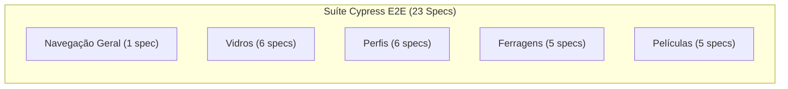
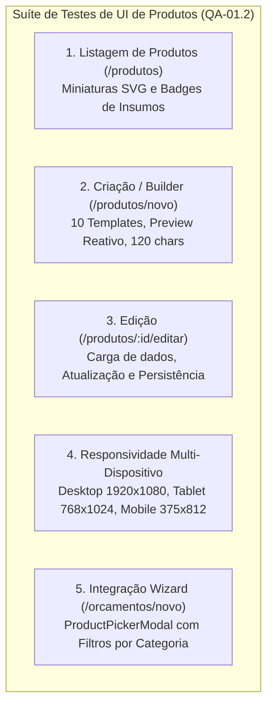

# 🧪 RET — Relatório de Execução de Testes — Sprint 03

| Campo | Valor |
|---|---|
| **Projeto** | AlumiGest — Sistema de Gestão para Vidraçaria e Esquadrias |
| **Sprint** | 03 — Clientes (Backend), Motor de Orçamentos e Testes E2E Cypress |
| **Período** | 18/08/2026 a 01/09/2026 |
| **QA Responsável** | Herbert Carvalho dos Santos / Equipe AlumiGest |
| **Status Geral** | 🟢 **BACKEND: 141/141 APROVADOS (100%)** \| 🟢 **VITEST FRONTEND: 40/40 APROVADOS (100%)** \| 🟢 **E2E CYPRESS: 23/23 SPECS APROVADAS** |

---

## 1. 🎯 Escopo dos Testes da Sprint 3

A Sprint 3 consolidou a maior expansão de qualidade do projeto AlumiGest:
1. **API de Clientes (Backend):** Validação de regras de CPF/CNPJ, endereços e operações CRUD.
2. **Motor de Cálculo de Orçamentos (Backend):** Testes exaustivos das fórmulas de corte de perfis, cálculo de área de vidro, ferragens por peso/área, subtotalização e máquina de estados.
3. **Automação E2E com Cypress (Frontend):** Construção da primeira suíte completa de testes End-to-End no frontend cobrindo as 4 abas do Catálogo de Materiais.
4. **Integração com SonarQube:** Pipeline de CI com análise estática segregada para backend e frontend.
5. **Interface Frontend de Produtos e Templates (QA-01.2 / Issue #100):** Validação visual e funcional dos 10 templates de esquadrias em SVG, cotas milimétricas, furações, puxadores e formulários de produtos com suíte de 40 testes de componentes no Vitest.

---

## 2. 📋 Resultados dos Testes Automatizados no Backend (141 Testes)

| Classe de Teste | Módulo / Escopo | Cenários | Aprovados | Falhas | Status |
|---|---|:---:|:---:|:---:|:---:|
| `ClientServiceTest` / `ClientControllerTest` | CRUD de Clientes (PF/PJ, validações e exceções) | 12 | 12 | 0 | 🟢 Passou |
| `BudgetControllerTest` | Endpoints REST de Orçamentos, Paginação e Status | 18 | 18 | 0 | 🟢 Passou |
| `BudgetServiceTest` | Lógica de Orçamento, Gerador Sequencial e Transições | 16 | 16 | 0 | 🟢 Passou |
| `BudgetQuantityServiceTest` | Motor de Quantidades (Fórmulas $4W+6H$, kits por peso) | 22 | 22 | 0 | 🟢 Passou |
| `BudgetPricingServiceTest` | Motor de Precificação (Markup, Totais, Custo x Venda) | 18 | 18 | 0 | 🟢 Passou |
| `BudgetIntegrationTest` | Teste de Integração E2E Backend (Entrada L x A → Totais) | 7 | 7 | 0 | 🟢 Passou |
| `BudgetTest` (Domain) | Validações invariantes e cálculo de subtotais na entidade | 8 | 8 | 0 | 🟢 Passou |
| `ProductServiceTest` / `ProductControllerTest` | Templates de Esquadria e validações pós-remoção de `laborCost` | 27 | 27 | 0 | 🟢 Passou |
| `Catalog Tests` (Vidros, Perfis, Ferragens, Películas) | Suíte herdada e mantida do catálogo | 13 | 13 | 0 | 🟢 Passou |
| **Total de Testes Automatizados no Backend** | — | **141** | **141** | **0** | 🟢 **100%** |

> 📊 **Métricas de Cobertura do `BudgetService`:**
> * **Cobertura de Linhas:** **93,4%**
> * **Cobertura de Instruções:** **83,9%**
> * **Cobertura de Métodos:** **86,6%**

---

## 3. 🌐 Resultados da Suíte E2E com Cypress (23 Specs Automatizadas)

A suíte foi implementada e mergeada na branch `develop` através dos [PR #115](https://github.com/ADS-IFPB-SR/alumigest/pull/115) e [PR #118](https://github.com/ADS-IFPB-SR/alumigest/pull/118) (Issue #114):



| Grupo de Teste E2E | Specs Cypress Implementadas | Cenários Cobertos | Status |
|---|---|---|:---:|
| **Navegação & UI** | `catalog-navigation.cy.ts` | Carregamento da página, alternância de abas, persistência de rotas | 🟢 100% |
| **Vidros** | `catalog-glass.cy.ts`, `catalog-glass-details.cy.ts`, `catalog-glass-edit.cy.ts`, `catalog-glass-status.cy.ts`, `catalog-glass-status-filter.cy.ts`, `catalog-glass-validation.cy.ts` | Listagem, filtros por status, modais de cadastro com validação Zod, edição e visualização de detalhes | 🟢 100% |
| **Perfis de Alumínio** | `catalog-profile.cy.ts`, `catalog-profile-details.cy.ts`, `catalog-profile-edit.cy.ts`, `catalog-profile-status.cy.ts`, `catalog-profile-status-filter.cy.ts`, `catalog-profile-validation.cy.ts` | Cadastro de barras 3m/6m, referências comerciais, busca textual e debounce | 🟢 100% |
| **Ferragens** | `catalog-hardware.cy.ts`, `catalog-hardware-details.cy.ts`, `catalog-hardware-edit.cy.ts`, `catalog-hardware-status.cy.ts`, `catalog-hardware-validation.cy.ts` | Medição por UN/PAR/METRO, toggle de ativação e tratamento de erros | 🟢 100% |
| **Películas** | `catalog-film.cy.ts`, `catalog-film-details.cy.ts`, `catalog-film-edit.cy.ts`, `catalog-film-status.cy.ts`, `catalog-film-validation.cy.ts` | Tipos Fumê/Jateada/Leitosa, cálculo por $m^2$ e validações de formulário | 🟢 100% |
| **Total de Specs Cypress** | **23 arquivos `.cy.ts` + 8 Fixtures JSON** | **Todos os fluxos críticos de catálogo** | 🟢 **100%** |

---

## 4. 🧩 Resultados dos Testes de Frontend e Interface de Produtos (Vitest e UI — QA-01.2)

### 4.1 Suíte de Testes Automatizados no Frontend (Vitest — 40 Testes)

Em atendimento à **[Issue #100](https://github.com/ADS-IFPB-SR/alumigest/issues/100)** (`test(qa): QA-01.2 - Testes da Interface Frontend de Produtos (UI)`), foi implementada e homologada a suíte de testes de componentes para o módulo de produtos e templates paramétricos SVG:

| Suíte de Teste (Vitest) | Módulo / Escopo | Cenários | Aprovados | Falhas | Status |
|---|---|:---:|:---:|:---:|:---:|
| `WindowSvgPreview.test.tsx` | Renderização vetorial CAD (1F, 2F, 3F, 4F, Pivotante, Maxim-Ar, Furação, Puxadores) | 10 | 10 | 0 | 🟢 Passou |
| `ProductPickerModal.test.tsx` | Modal de Seleção de Esquadria no Orçamento (Filtros por Categoria, Busca e Injeção) | 10 | 10 | 0 | 🟢 Passou |
| `ProductListPage.test.tsx` | Listagem de Produtos (`/produtos`), Skeletons, Miniaturas SVG e Badges de Insumos | 10 | 10 | 0 | 🟢 Passou |
| `ProductBuilderPage.test.tsx` | Criação/Edição (`ProductBuilderPage`), Validação de 120 caracteres e Nome Obrigatório | 6 | 6 | 0 | 🟢 Passou |
| `CategoryRequirementsSelector.test.tsx` | Seletor de Requisitos de Insumos (`GLASS`, `PROFILE`, `HARDWARE`, `FILM`) | 4 | 4 | 0 | 🟢 Passou |
| **Total de Testes de Componentes Frontend** | — | **40** | **40** | **0** | 🟢 **100%** |

### 4.2 Matriz Detalhada de Execução dos Testes Funcionais e Responsividade de UI (Issue #100)



#### 4.2.1 Listagem de Produtos (`/produtos`)

| ID do Teste | Cenário Avaliado | Procedimento de Teste | Comportamento Esperado | Resultado | Status |
|:---:|:---|:---|:---|:---|:---:|
| **UI-LST-01** | Miniaturas SVG dos templates de esquadria | Acessar `/produtos` com catálogo populado | Cada card de produto exibe a miniatura SVG precisa correspondente ao modelo cadastrado (portas de correr, giro, maxim-ar, gavetas, spider glass) | SVG renderizado com cores do perfil/vidro e proporção correta | 🟢 Aprovado |
| **UI-LST-02** | Exibição de Badges de Categorias de Insumos | Inspecionar os cards da listagem | Badges visíveis indicando as categorias obrigatórias/opcionais requeridas (`VIDRO`, `PERFIL`, `FERRAGEM`, `PELÍCULA`) com cores semânticas padronizadas | Badges nítidos e consistentes | 🟢 Aprovado |
| **UI-LST-03** | Produtos estáticos vs. paramétricos | Visualizar produtos sem template vinculado | Produtos com `template_type = NULL` exibem ícone neutro de produto acabado mantendo alinhamento visual de grid | Card exibe placeholder limpo sem quebra visual | 🟢 Aprovado |
| **UI-LST-04** | Busca textual e filtragem reativa | Digitar termos no input de busca rápida | Filtragem em tempo real por nome do produto, sem travamentos de UI | Busca rápida e instantânea | 🟢 Aprovado |
| **UI-LST-05** | Ações de Edição e Exclusão | Clicar nos botões de ação do card | Botão "Editar" redireciona para `/produtos/:id/editar`; botão "Excluir" aciona confirmação defensiva | Ações disparam as rotas corretas | 🟢 Aprovado |

---

#### 4.2.2 Criação de Produto (`/produtos/novo` / Builder Studio CAD)

| ID do Teste | Cenário Avaliado | Procedimento de Teste | Comportamento Esperado | Resultado | Status |
|:---:|:---|:---|:---|:---|:---:|
| **UI-NEW-01** | Seleção dos 10 templates canônicos | Alternar entre cada um dos 10 templates no seletor de modelos | O preview SVG atualiza instantaneamente para o desenho técnico do template selecionado (`SLIDING_DOOR_1F`, `2F`, `3F`, `4F`, `SWING_DOOR_1F`, `2F`, `AWNING_WINDOW_1F`, `AWNING_WINDOW_1F_INV`, `FRONT_DRAWER`, `FIXED_PANEL`) | Transição fluida sem piscar ou erro de console | 🟢 Aprovado |
| **UI-NEW-02** | Reatividade das dimensões ($L \times A$) | Alterar largura (ex: 1200 para 2400mm) e altura (ex: 2100 para 2600mm) | As cotas milimétricas e o `viewBox` do SVG recalculam dinamicamente mantendo as proporções físicas das folhas | Cotas dimensionais atualizadas em tempo real | 🟢 Aprovado |
| **UI-NEW-03** | Cores de Alumínio e Vidro | Selecionar perfis (Preto, Branco, Fosco, Bronze) e vidros (Incolor, Fumê, Verde, Bronze) | O preenchimento visual das esquadrias altera em tempo real refletindo o acabamento estético escolhido | Cores hexadecimais aplicadas fielmente no SVG | 🟢 Aprovado |
| **UI-NEW-04** | Configuração Paramétrica de Puxadores | Configurar puxador `BAR_TUBULAR`, `SHELL_LOCK` e `LEVER_HANDLE` em 1 ou 2 lados | O elemento visual do puxador é desenhado na folha móvel com posição e comprimento proporcional | Puxadores posicionados corretamente no lado de abertura | 🟢 Aprovado |
| **UI-NEW-05** | Configuração de Furação Técnica | Selecionar furação `TOP_EDGE`, `LATERAL_EDGE` e `FRONTAL_PANEL` com 1 a 4 furos | Retículos e cotas de usinagem desenhados nas posições milimétricas exatas para gabarito técnico | Círculos e linhas de centro CAD visíveis | 🟢 Aprovado |
| **UI-NEW-06** | Gestão de Requisitos de Insumos | Adicionar e remover categorias de insumos no `CategoryRequirementsSelector` | Categorias são incluídas/excluídas do array `categoryRequirements` sem re-renderizações desnecessárias em cascata | Toggle de seleção responsivo e instantâneo | 🟢 Aprovado |
| **UI-NEW-07** | Validação: Bloqueio de envio sem nome | Clicar em "Salvar Produto" sem preencher o nome | Sistema bloqueia o envio e exibe mensagem clara de validação "Nome do produto é obrigatório" | Envio impedido com alerta visual de erro | 🟢 Aprovado |
| **UI-NEW-08** | Validação: Limite de 120 caracteres | Digitar nome superior a 120 caracteres | O campo impede digitação adicional (`maxLength={120}`) e exibe contador visual defensivo `120/120` | Bloqueio efetivo de overflow alinhado ao banco JPA | 🟢 Aprovado |
| **UI-NEW-09** | Submissão e Persistência Completa | Preencher produto válido e submeter | Produto criado com sucesso via `POST /api/v1/catalog/products` com redirecionamento para `/produtos` | Notificação de sucesso e novo produto listado | 🟢 Aprovado |

---

#### 4.2.3 Edição de Produto (`/produtos/:id/editar`)

| ID do Teste | Cenário Avaliado | Procedimento de Teste | Comportamento Esperado | Resultado | Status |
|:---:|:---|:---|:---|:---|:---:|
| **UI-EDT-01** | Carga inicial com dados pré-existentes | Acessar rota de edição de produto existente | Formulário carrega nome, descrição, dimensões, template selecionado e categorias de insumos salvas | Todos os inputs e seletores refletem o estado do produto | 🟢 Aprovado |
| **UI-EDT-02** | Sincronização do Preview SVG na edição | Inspecionar a prévia gráfica ao abrir a edição | O desenho vetorial SVG renderiza com as propriedades já cadastradas no banco | Fiel ao produto salvo no catálogo | 🟢 Aprovado |
| **UI-EDT-03** | Modificação de Template e Parâmetros | Trocar template (ex: `SLIDING_DOOR_2F` para `SLIDING_DOOR_4F`) | Preview gráfico se adapta ao novo número de folhas e sugere atualização de requisitos | Atualização gráfica imediata | 🟢 Aprovado |
| **UI-EDT-04** | Persistência das alterações (`PUT`) | Salvar alterações de dimensões e acabamento | Requisição `PUT /api/v1/catalog/products/{id}` executada com sucesso, atualizando o registro | Dados persistidos e refletidos na listagem | 🟢 Aprovado |

---

#### 4.2.4 Responsividade Multi-Dispositivo

| ID do Teste | Resolução / Dispositivo | Escopo Visual Avaliado | Comportamento Observado | Status |
|:---:|:---|:---|:---|:---:|
| **UI-RSP-01** | **Desktop (1920×1080)** | Listagem `/produtos` e Builder Studio CAD | Grid em 4 colunas; tela de criação em layout de duas colunas com preview fixo à esquerda e acordeões de configuração à direita | 🟢 Aprovado |
| **UI-RSP-02** | **Tablet (768×1024)** | Listagem `/produtos` e Builder Studio CAD | Grid em 2 colunas; formulário empilha os blocos ordenadamente mantendo os botões de ação e abas totalmente tocáveis | 🟢 Aprovado |
| **UI-RSP-03** | **Mobile (375×812)** | Listagem `/produtos` e Builder Studio CAD | Grid em 1 coluna vertical; preview SVG escala proporcionalmente via `viewBox` responsivo sem estourar a largura da tela (`overflow-x: hidden`) | 🟢 Aprovado |

---

#### 4.2.5 Integração no Fluxo de Orçamentos (`ProductPickerModal`)

| ID do Teste | Cenário Avaliado | Procedimento de Teste | Comportamento Esperado | Resultado | Status |
|:---:|:---|:---|:---|:---|:---:|
| **UI-MOD-01** | Abertura do Modal no Wizard de Orçamento | No Wizard `/orcamentos/novo`, clicar em "Adicionar Esquadria" | Modal abre com backdrop acessível (`aria-label="Fechar fundo do modal"`), listando esquadrias disponíveis | Modal aberto sem conflito de foco | 🟢 Aprovado |
| **UI-MOD-02** | Filtragem por Macro-Categorias | Alternar entre as abas `TODOS`, `PORTAS`, `JANELAS`, `BOXES`, `MÓVEIS / OUTROS` | A lista filtra instantaneamente usando o helper puro `resolveProductMacroCategory` | Filtros rápidos e precisos | 🟢 Aprovado |
| **UI-MOD-03** | Miniatura Técnica no Modal | Observar cards de produtos dentro do modal | Cada esquadria exibe sua miniatura SVG técnica com template correto | Preview visual nítido | 🟢 Aprovado |
| **UI-MOD-04** | Seleção e Injeção no Item | Clicar em "Selecionar" em uma esquadria | O item é injetado no orçamento com dimensões, template e requisitos de insumos prontos para parametrização | Injeção imediata no Wizard | 🟢 Aprovado |

---

---

## 5. 🔍 Análise de Qualidade de Código (SonarQube)

* **Pipeline Integrada:** Configurada via GitHub Actions ([PR #78](https://github.com/ADS-IFPB-SR/alumigest/pull/78)) executando relatórios segregados.
* **Segurança:** Zero vulnerabilidades de segurança ou credenciais expostas.
* **Manutenibilidade:** Débitos técnicos classificados como melhorias de legibilidade/refatoração.

---

## 6. 📊 Resumo Executivo de QA da Sprint 3

```
┌──────────────────────────────────────────────────────────────┐
│                  RESULTADO DOS TESTES SPRINT 3               │
├──────────────────────────────────────────────────────────────┤
│ Testes Unitários/Integração Backend: 141 (100% Aprovados)    │
│ Testes de Componentes Frontend (Vitest): 40 (100% Aprovados) │
│ Specs E2E Cypress Frontend: 23 (100% Aprovadas)              │
│ Cobertura de Código no Serviço de Orçamentos: 93,4%          │
│ Falhas ou Quebras na develop: 0                              │
│ Homologação Técnica: APROVADO COM EXCELÊNCIA                 │
└──────────────────────────────────────────────────────────────┘
```

---

*Relatório de Testes homologado pelo QA Herbert Carvalho dos Santos / Equipe AlumiGest — Sprint 03 — 11/09/2026*
