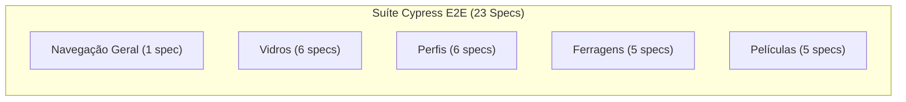

# 🧪 RET — Relatório de Execução de Testes — Sprint 03

| Campo | Valor |
|---|---|
| **Projeto** | AlumiGest — Sistema de Gestão para Vidraçaria e Esquadrias |
| **Sprint** | 03 — Clientes (Backend), Motor de Orçamentos e Testes E2E Cypress |
| **Período** | 18/08/2026 a 01/09/2026 |
| **QA Responsável** | Herbert Carvalho dos Santos / Equipe AlumiGest |
| **Status Geral** | 🟢 **BACKEND: 141/141 APROVADOS (100%)** \| 🟢 **VITEST FRONTEND: 40/40 APROVADOS (100%)** \| 🟢 **E2E CYPRESS: 23/23 SPECS APROVADAS** |

---

## 1. 🎯 Escopo dos Testes da Sprint 3

A Sprint 3 consolidou a maior expansão de qualidade do projeto AlumiGest:
1. **API de Clientes (Backend):** Validação de regras de CPF/CNPJ, endereços e operações CRUD.
2. **Motor de Cálculo de Orçamentos (Backend):** Testes exaustivos das fórmulas de corte de perfis, cálculo de área de vidro, ferragens por peso/área, subtotalização e máquina de estados.
3. **Automação E2E com Cypress (Frontend):** Construção da primeira suíte completa de testes End-to-End no frontend cobrindo as 4 abas do Catálogo de Materiais.
4. **Integração com SonarQube:** Pipeline de CI com análise estática segregada para backend e frontend.
5. **Interface Frontend de Produtos e Templates (QA-01.2 / Issue #100):** Validação visual e funcional dos 10 templates de esquadrias em SVG, cotas milimétricas, furações, puxadores e formulários de produtos com suíte de 40 testes de componentes no Vitest.

---

## 2. 📋 Resultados dos Testes Automatizados no Backend (141 Testes)

| Classe de Teste | Módulo / Escopo | Cenários | Aprovados | Falhas | Status |
|---|---|:---:|:---:|:---:|:---:|
| `ClientServiceTest` / `ClientControllerTest` | CRUD de Clientes (PF/PJ, validações e exceções) | 12 | 12 | 0 | 🟢 Passou |
| `BudgetControllerTest` | Endpoints REST de Orçamentos, Paginação e Status | 18 | 18 | 0 | 🟢 Passou |
| `BudgetServiceTest` | Lógica de Orçamento, Gerador Sequencial e Transições | 16 | 16 | 0 | 🟢 Passou |
| `BudgetQuantityServiceTest` | Motor de Quantidades (Fórmulas $4W+6H$, kits por peso) | 22 | 22 | 0 | 🟢 Passou |
| `BudgetPricingServiceTest` | Motor de Precificação (Markup, Totais, Custo x Venda) | 18 | 18 | 0 | 🟢 Passou |
| `BudgetIntegrationTest` | Teste de Integração E2E Backend (Entrada L x A → Totais) | 7 | 7 | 0 | 🟢 Passou |
| `BudgetTest` (Domain) | Validações invariantes e cálculo de subtotais na entidade | 8 | 8 | 0 | 🟢 Passou |
| `ProductServiceTest` / `ProductControllerTest` | Templates de Esquadria e validações pós-remoção de `laborCost` | 27 | 27 | 0 | 🟢 Passou |
| `Catalog Tests` (Vidros, Perfis, Ferragens, Películas) | Suíte herdada e mantida do catálogo | 13 | 13 | 0 | 🟢 Passou |
| **Total de Testes Automatizados no Backend** | — | **141** | **141** | **0** | 🟢 **100%** |

> 📊 **Métricas de Cobertura do `BudgetService`:**
> * **Cobertura de Linhas:** **93,4%**
> * **Cobertura de Instruções:** **83,9%**
> * **Cobertura de Métodos:** **86,6%**

---

## 3. 🌐 Resultados da Suíte E2E com Cypress (23 Specs Automatizadas)

A suíte foi implementada e mergeada na branch `develop` através dos [PR #115](https://github.com/ADS-IFPB-SR/alumigest/pull/115) e [PR #118](https://github.com/ADS-IFPB-SR/alumigest/pull/118) (Issue #114):



| Grupo de Teste E2E | Specs Cypress Implementadas | Cenários Cobertos | Status |
|---|---|---|:---:|
| **Navegação & UI** | `catalog-navigation.cy.ts` | Carregamento da página, alternância de abas, persistência de rotas | 🟢 100% |
| **Vidros** | `catalog-glass.cy.ts`, `catalog-glass-details.cy.ts`, `catalog-glass-edit.cy.ts`, `catalog-glass-status.cy.ts`, `catalog-glass-status-filter.cy.ts`, `catalog-glass-validation.cy.ts` | Listagem, filtros por status, modais de cadastro com validação Zod, edição e visualização de detalhes | 🟢 100% |
| **Perfis de Alumínio** | `catalog-profile.cy.ts`, `catalog-profile-details.cy.ts`, `catalog-profile-edit.cy.ts`, `catalog-profile-status.cy.ts`, `catalog-profile-status-filter.cy.ts`, `catalog-profile-validation.cy.ts` | Cadastro de barras 3m/6m, referências comerciais, busca textual e debounce | 🟢 100% |
| **Ferragens** | `catalog-hardware.cy.ts`, `catalog-hardware-details.cy.ts`, `catalog-hardware-edit.cy.ts`, `catalog-hardware-status.cy.ts`, `catalog-hardware-validation.cy.ts` | Medição por UN/PAR/METRO, toggle de ativação e tratamento de erros | 🟢 100% |
| **Películas** | `catalog-film.cy.ts`, `catalog-film-details.cy.ts`, `catalog-film-edit.cy.ts`, `catalog-film-status.cy.ts`, `catalog-film-validation.cy.ts` | Tipos Fumê/Jateada/Leitosa, cálculo por $m^2$ e validações de formulário | 🟢 100% |
| **Total de Specs Cypress** | **23 arquivos `.cy.ts` + 8 Fixtures JSON** | **Todos os fluxos críticos de catálogo** | 🟢 **100%** |

---

## 4. 🧩 Resultados dos Testes de Componentes Frontend (Vitest — 40 Testes)

Em atendimento à **[Issue #100](https://github.com/ADS-IFPB-SR/alumigest/issues/100)** (`test(qa): QA-01.2 - Testes da Interface Frontend de Produtos (UI)`), foi implementada e homologada a suíte de testes de componentes para o módulo de produtos e templates paramétricos SVG:

| Suíte de Teste (Vitest) | Módulo / Escopo | Cenários | Aprovados | Falhas | Status |
|---|---|:---:|:---:|:---:|:---:|
| `WindowSvgPreview.test.tsx` | Renderização vetorial CAD (1F, 2F, 3F, 4F, Pivotante, Maxim-Ar, Furação, Puxadores) | 10 | 10 | 0 | 🟢 Passou |
| `ProductPickerModal.test.tsx` | Modal de Seleção de Esquadria no Orçamento (Filtros por Categoria, Busca e Injeção) | 10 | 10 | 0 | 🟢 Passou |
| `ProductListPage.test.tsx` | Listagem de Produtos (`/produtos`), Skeletons, Miniaturas SVG e Badges de Insumos | 10 | 10 | 0 | 🟢 Passou |
| `ProductBuilderPage.test.tsx` | Criação/Edição (`ProductBuilderPage`), Validação de 120 caracteres e Nome Obrigatório | 6 | 6 | 0 | 🟢 Passou |
| `CategoryRequirementsSelector.test.tsx` | Seletor de Requisitos de Insumos (`GLASS`, `PROFILE`, `HARDWARE`, `FILM`) | 4 | 4 | 0 | 🟢 Passou |
| **Total de Testes de Componentes Frontend** | — | **40** | **40** | **0** | 🟢 **100%** |

> 📄 **Relatório Detalhado de UI:** Para ver a matriz de execução dos cenários visuais, testes de responsividade (Desktop, Tablet e Mobile) e homologação dos critérios de aceitação, consulte o documento dedicado:
> 👉 [`RTE-QA-01.2-Relatorio_Testes_UI_Produtos.md`](RTE-QA-01.2-Relatorio_Testes_UI_Produtos.md)

---

## 5. 🔍 Análise de Qualidade de Código (SonarQube)

* **Pipeline Integrada:** Configurada via GitHub Actions ([PR #78](https://github.com/ADS-IFPB-SR/alumigest/pull/78)) executando relatórios segregados.
* **Segurança:** Zero vulnerabilidades de segurança ou credenciais expostas.
* **Manutenibilidade:** Débitos técnicos classificados como melhorias de legibilidade/refatoração.

---

## 6. 📊 Resumo Executivo de QA da Sprint 3

```
┌──────────────────────────────────────────────────────────────┐
│                  RESULTADO DOS TESTES SPRINT 3               │
├──────────────────────────────────────────────────────────────┤
│ Testes Unitários/Integração Backend: 141 (100% Aprovados)    │
│ Testes de Componentes Frontend (Vitest): 40 (100% Aprovados) │
│ Specs E2E Cypress Frontend: 23 (100% Aprovadas)              │
│ Cobertura de Código no Serviço de Orçamentos: 93,4%          │
│ Falhas ou Quebras na develop: 0                              │
│ Homologação Técnica: APROVADO COM EXCELÊNCIA                 │
└──────────────────────────────────────────────────────────────┘
```

---

*Relatório de Testes homologado pelo QA Herbert Carvalho dos Santos / Equipe AlumiGest — Sprint 03 — 11/09/2026*

