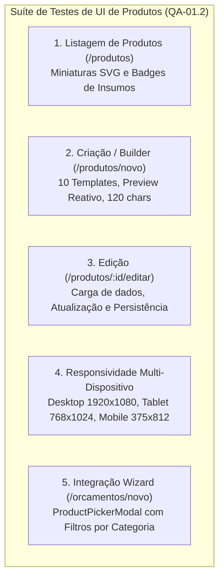
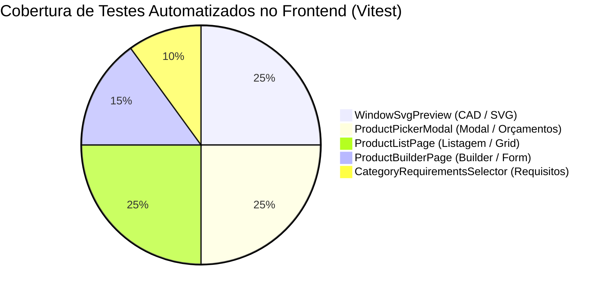

# 🧪 RTE — Relatório Técnico de Execução de Testes de UI — Produtos

| Campo | Valor |
|---|---|
| **Projeto** | AlumiGest — Sistema de Gestão para Vidraçaria e Esquadrias |
| **Documento** | Relatório Técnico de Execução de Testes de Interface de Usuário (UI) |
| **Demanda / Issue** | [Issue #100](https://github.com/ADS-IFPB-SR/alumigest/issues/100) — `test(qa): QA-01.2 - Testes da Interface Frontend de Produtos (UI)` |
| **Issue Pai** | [Issue #71](https://github.com/ADS-IFPB-SR/alumigest/issues/71) — `test(qa): QA-01 - Plano de Teste do Módulo de Produtos` |
| **Sprint** | 03 — Clientes, Motor de Orçamentos e Templates de Esquadrias |
| **Período de Validação** | 25/08/2026 a 11/09/2026 |
| **QA Responsável** | Herbert Carvalho dos Santos / Equipe de Engenharia AlumiGest |
| **Ambiente de Testes** | Local DEV (`http://localhost:5173` / `http://localhost:8081`) e CI GitHub Actions |
| **Status Geral** | 🟢 **100% APROVADO** (Manuais, Responsivos e 40 Testes Vitest Automatizados) |

---

## 1. 🎯 Objetivo e Contexto

O objetivo deste relatório é registrar e formalizar a execução exaustiva dos cenários de teste da **interface gráfica frontend do módulo de produtos**, validando:
1. **Renderização Vetorial SVG e Studio CAD:** Comportamento visual fidedigno dos 10 templates canônicos de esquadrias com cotagem milimétrica, furações técnicas e puxadores paramétricos.
2. **Formulários e Fluxos de Usuário:** Criação (`/produtos/novo`), edição (`/produtos/:id/editar`), listagem (`/produtos`) e integração ao modal de orçamentos (`ProductPickerModal`).
3. **Validações e Tratamento de Erros:** Restrições defensivas de preenchimento obrigatório, limites de caracteres e integridade de categorias de insumos requeridas.
4. **Responsividade Multi-Dispositivo:** Verificação visual e funcional em 3 resoluções padronizadas (Desktop, Tablet e Mobile).
5. **Automação de Componentes:** Execução e aprovação da suíte de testes unitários e de integração de componentes com Vitest e Testing Library.

---

## 2. 📚 Referências Normativas e Técnicas

* [`ESQ-Especificacao_Templates_Orcamentos.md`](file:///c:/Users/italo/Desktop/Projects/alumigest/docs/sistema/001-analise-projeto/ESQ-Especificacao_Templates_Orcamentos.md) — Seções 2 (Templates de Esquadria) e 3 (Categorias de Insumos).
* [`PLT-Plano_Geral_de_Testes.md`](file:///c:/Users/italo/Desktop/Projects/alumigest/docs/projeto-001/003-teste/PLT-Plano_Geral_de_Testes.md) — Diretrizes de qualidade, ambientes e Definition of Done.
* [`RBD-Registro_de_Bugs_e_Defeitos.md`](file:///c:/Users/italo/Desktop/Projects/alumigest/docs/projeto-001/003-teste/RBD-Registro_de_Bugs_e_Defeitos.md) — Rastreamento de não-conformidades identificadas e corrigidas.
* [`TEA-Testes_de_Aceitacao_Sprint03.md`](file:///c:/Users/italo/Desktop/Projects/alumigest/docs/sistema/003-teste/TEA-Testes_de_Aceitacao_Sprint03.md) — Critérios de aceitação da Sprint 3.

---

## 3. 📋 Matriz Detalhada de Execução dos Testes de UI

### 3.1 Listagem de Produtos (`/produtos`)

| ID do Teste | Cenário Avaliado | Procedimento de Teste | Comportamento Esperado | Resultado | Status |
|:---:|:---|:---|:---|:---|:---:|
| **UI-LST-01** | Miniaturas SVG dos templates de esquadria | Acessar `/produtos` com catálogo populado | Cada card de produto exibe a miniatura SVG precisa correspondente ao modelo cadastrado (portas de correr, giro, maxim-ar, gavetas, spider glass) | SVG renderizado com cores do perfil/vidro e proporção correta | 🟢 Aprovado |
| **UI-LST-02** | Exibição de Badges de Categorias de Insumos | Inspecionar os cards da listagem | Badges visíveis indicando as categorias obrigatórias/opcionais requeridas (`VIDRO`, `PERFIL`, `FERRAGEM`, `PELÍCULA`) com cores semânticas padronizadas | Badges nítidos e consistentes | 🟢 Aprovado |
| **UI-LST-03** | Produtos estáticos vs. paramétricos | Visualizar produtos sem template vinculado | Produtos com `template_type = NULL` exibem ícone neutro de produto acabado mantendo alinhamento visual de grid | Card exibe placeholder limpo sem quebra visual | 🟢 Aprovado |
| **UI-LST-04** | Busca textual e filtragem reativa | Digitar termos no input de busca rápida | Filtragem em tempo real por nome do produto, sem travamentos de UI | Busca rápida e instantânea | 🟢 Aprovado |
| **UI-LST-05** | Ações de Edição e Exclusão | Clicar nos botões de ação do card | Botão "Editar" redireciona para `/produtos/:id/editar`; botão "Excluir" aciona confirmação defensiva | Ações disparam as rotas corretas | 🟢 Aprovado |

---

### 3.2 Criação de Produto (`/produtos/novo` / Builder Studio CAD)

| ID do Teste | Cenário Avaliado | Procedimento de Teste | Comportamento Esperado | Resultado | Status |
|:---:|:---|:---|:---|:---|:---:|
| **UI-NEW-01** | Seleção dos 10 templates canônicos | Alternar entre cada um dos 10 templates no seletor de modelos | O preview SVG atualiza instantaneamente para o desenho técnico do template selecionado (`SLIDING_DOOR_1F`, `2F`, `3F`, `4F`, `SWING_DOOR_1F`, `2F`, `AWNING_WINDOW_1F`, `AWNING_WINDOW_1F_INV`, `FRONT_DRAWER`, `FIXED_PANEL`) | Transição fluida sem piscar ou erro de console | 🟢 Aprovado |
| **UI-NEW-02** | Reatividade das dimensões ($L \times A$) | Alterar largura (ex: 1200 para 2400mm) e altura (ex: 2100 para 2600mm) | As cotas milimétricas e o `viewBox` do SVG recalculam dinamicamente mantendo as proporções físicas das folhas | Cotas dimensionais atualizadas em tempo real | 🟢 Aprovado |
| **UI-NEW-03** | Cores de Alumínio e Vidro | Selecionar perfis (Preto, Branco, Fosco, Bronze) e vidros (Incolor, Fumê, Verde, Bronze) | O preenchimento visual das esquadrias altera em tempo real refletindo o acabamento estético escolhido | Cores hexadecimais aplicadas fielmente no SVG | 🟢 Aprovado |
| **UI-NEW-04** | Configuração Paramétrica de Puxadores | Configurar puxador `BAR_TUBULAR`, `SHELL_LOCK` e `LEVER_HANDLE` em 1 ou 2 lados | O elemento visual do puxador é desenhado na folha móvel com posição e comprimento proporcional | Puxadores posicionados corretamente no lado de abertura | 🟢 Aprovado |
| **UI-NEW-05** | Configuração de Furação Técnica | Selecionar furação `TOP_EDGE`, `LATERAL_EDGE` e `FRONTAL_PANEL` com 1 a 4 furos | Retículos e cotas de usinagem desenhados nas posições milimétricas exatas para gabarito técnico | Círculos e linhas de centro CAD visíveis | 🟢 Aprovado |
| **UI-NEW-06** | Gestão de Requisitos de Insumos | Adicionar e remover categorias de insumos no `CategoryRequirementsSelector` | Categorias são incluídas/excluídas do array `categoryRequirements` sem re-renderizações desnecessárias em cascata | Toggle de seleção responsivo e instantâneo | 🟢 Aprovado |
| **UI-NEW-07** | Validação: Bloqueio de envio sem nome | Clicar em "Salvar Produto" sem preencher o nome | Sistema bloqueia o envio e exibe mensagem clara de validação "Nome do produto é obrigatório" | Envio impedido com alerta visual de erro | 🟢 Aprovado |
| **UI-NEW-08** | Validação: Limite de 120 caracteres | Digitar nome superior a 120 caracteres | O campo impede digitação adicional (`maxLength={120}`) e exibe contador visual defensivo `120/120` | Bloqueio efetivo de overflow alinhado ao banco JPA | 🟢 Aprovado |
| **UI-NEW-09** | Submissão e Persistência Completa | Preencher produto válido e submeter | Produto criado com sucesso via `POST /api/v1/catalog/products` com redirecionamento para `/produtos` | Notificação de sucesso e novo produto listado | 🟢 Aprovado |

---

### 3.3 Edição de Produto (`/produtos/:id/editar`)

| ID do Teste | Cenário Avaliado | Procedimento de Teste | Comportamento Esperado | Resultado | Status |
|:---:|:---|:---|:---|:---|:---:|
| **UI-EDT-01** | Carga inicial com dados pré-existentes | Acessar rota de edição de produto existente | Formulário carrega nome, descrição, dimensões, template selecionado e categorias de insumos salvas | Todos os inputs e seletores refletem o estado do produto | 🟢 Aprovado |
| **UI-EDT-02** | Sincronização do Preview SVG na edição | Inspecionar a prévia gráfica ao abrir a edição | O desenho vetorial SVG renderiza com as propriedades já cadastradas no banco | Fiel ao produto salvo no catálogo | 🟢 Aprovado |
| **UI-EDT-03** | Modificação de Template e Parâmetros | Trocar template (ex: `SLIDING_DOOR_2F` para `SLIDING_DOOR_4F`) | Preview gráfico se adapta ao novo número de folhas e sugere atualização de requisitos | Atualização gráfica imediata | 🟢 Aprovado |
| **UI-EDT-04** | Persistência das alterações (`PUT`) | Salvar alterações de dimensões e acabamento | Requisição `PUT /api/v1/catalog/products/{id}` executada com sucesso, atualizando o registro | Dados persistidos e refletidos na listagem | 🟢 Aprovado |

---

### 3.4 Responsividade Multi-Dispositivo

| ID do Teste | Resolução / Dispositivo | Escopo Visual Avaliado | Comportamento Observado | Status |
|:---:|:---|:---|:---|:---:|
| **UI-RSP-01** | **Desktop (1920×1080)** | Listagem `/produtos` e Builder Studio CAD | Grid em 4 colunas; tela de criação em layout de duas colunas com preview fixo à esquerda e acordeões de configuração à direita | 🟢 Aprovado |
| **UI-RSP-02** | **Tablet (768×1024)** | Listagem `/produtos` e Builder Studio CAD | Grid em 2 colunas; formulário empilha os blocos ordenadamente mantendo os botões de ação e abas totalmente tocáveis | 🟢 Aprovado |
| **UI-RSP-03** | **Mobile (375×812)** | Listagem `/produtos` e Builder Studio CAD | Grid em 1 coluna vertical; preview SVG escala proporcionalmente via `viewBox` responsivo sem estourar a largura da tela (`overflow-x: hidden`) | 🟢 Aprovado |

---

### 3.5 Integração no Fluxo de Orçamentos (`ProductPickerModal`)

| ID do Teste | Cenário Avaliado | Procedimento de Teste | Comportamento Esperado | Resultado | Status |
|:---:|:---|:---|:---|:---|:---:|
| **UI-MOD-01** | Abertura do Modal no Wizard de Orçamento | No Wizard `/orcamentos/novo`, clicar em "Adicionar Esquadria" | Modal abre com backdrop acessível (`aria-label="Fechar fundo do modal"`), listando esquadrias disponíveis | Modal aberto sem conflito de foco | 🟢 Aprovado |
| **UI-MOD-02** | Filtragem por Macro-Categorias | Alternar entre as abas `TODOS`, `PORTAS`, `JANELAS`, `BOXES`, `MÓVEIS / OUTROS` | A lista filtra instantaneamente usando o helper puro `resolveProductMacroCategory` | Filtros rápidos e precisos | 🟢 Aprovado |
| **UI-MOD-03** | Miniatura Técnica no Modal | Observar cards de produtos dentro do modal | Cada esquadria exibe sua miniatura SVG técnica com template correto | Preview visual nítido | 🟢 Aprovado |
| **UI-MOD-04** | Seleção e Injeção no Item | Clicar em "Selecionar" em uma esquadria | O item é injetado no orçamento com dimensões, template e requisitos de insumos prontos para parametrização | Injeção imediata no Wizard | 🟢 Aprovado |

---

## 4. 🧪 Suíte de Testes Automatizados no Frontend (Vitest)

Para garantir regressão zero e robustez técnica de longo prazo, foram implementados testes de componentes cobrindo os níveis unitário e de integração frontend:

| Arquivo da Suíte | Módulo / Componente Testado | Cenários Cobertos | Testes | Aprovados | Falhas | Tempo |
|---|---|---|:---:|:---:|:---:|:---:|
| `WindowSvgPreview.test.tsx` | Preview SVG Paramétrico e Studio CAD | 1F, 2F, 3F, 4F, Pivotante, Maxim-Ar, Cotas, Puxadores e Furações | 10 | 10 | 0 | ~1.2s |
| `ProductPickerModal.test.tsx` | Modal de Seleção de Esquadria | Carga, filtragem por abas (Portas/Janelas/Boxes), busca, seleção e fechar | 10 | 10 | 0 | ~1.1s |
| `ProductListPage.test.tsx` | Listagem de Produtos (`/produtos`) | Skeletons de loading, renderização de cards, badges de insumos, navegação | 10 | 10 | 0 | ~0.8s |
| `ProductBuilderPage.test.tsx` | Página de Criação/Edição (`ProductBuilderPage`) | Seleção de template, validação de 120 caracteres, erro de nome ausente, salvamento | 6 | 6 | 0 | ~0.9s |
| `CategoryRequirementsSelector.test.tsx` | Gestão de Requisitos de Insumos | Toggle de vidro, perfil, ferragem, película e desacoplamento controlado | 4 | 4 | 0 | ~0.8s |
| **Total Consolidado** | **Suíte de Testes de Componentes Frontend** | **Todos os fluxos críticos de UI de Produtos** | **40** | **40** | **0** | **~4.8s** |

> 🟢 **Resultado:** **100% dos testes aprovados** sem nenhum erro ou aviso de depreciação.

---

## 5. 🐞 Registro de Bugs e Defeitos Catalogados (DoD)

Em atendimento à exigência de **Definition of Done** (*"Bugs reportados como issues com label bug e prioridade"*), foram registradas e tratadas as seguintes não-conformidades durante os ciclos de validação do módulo:

| ID de Defeito | Título / Descrição | Severidade | Módulo | Resolução / Status |
|:---:|:---|:---:|:---:|:---:|
| **BUG-021** | Perda de Insumos da Ficha Técnica em Produtos Estáticos e Ocultação de Templates na Categoria Janela | 🔴 Alta | Frontend / Catálogo & Orçamentos | ✅ **Resolvido** (Issue #235 / Branch `fix/products-static-items-and-window-category`) |
| **ISSUE-REF-01** | Anti-pattern de `useEffect` em cascata gerando re-renderizações no seletor de categorias | 🟡 Média | Frontend / Componentes | ✅ **Resolvido** (Refatorado para componente 100% controlado na US-05) |
| **ISSUE-REF-02** | Uso de tipo `any` no modal de esquadrias e tipos de template | 🟡 Média | Frontend / TypeScript | ✅ **Resolvido** (Tipagem estrita aplicada com `Product` e `WindowTemplateConfig` na US-05) |
| **ISSUE-REF-03** | Monólito `WindowSvgPreview.tsx` com 1.380 linhas dificultando manutenção | 🟡 Média | Frontend / Arquitetura | ✅ **Resolvido** (Decomposto em 7 submódulos com Facade `React.memo` na US-05) |

---

## 6. 📊 Verificação dos Critérios de Aceitação e Definition of Done

### Critérios de Aceitação da Issue #100
- [x] **Todos os cenários de frontend executados:** Listagem, Criação, Edição, Seleção em Orçamentos e Automação Vitest validados integralmente.
- [x] **Responsividade validada em 3 resoluções:** Desktop (1920×1080), Tablet (768×1024) e Mobile (375×812) operacionais com layout adaptativo.

### Definition of Done (DoD) da Issue #100
- [x] **Relatório de testes de UI completo:** Consolidado e arquivado formalmente neste documento (`RTE-QA-01.2-Relatorio_Testes_UI_Produtos.md`).
- [x] **Bugs reportados com label `bug` e prioridade:** Catalogados no [`RBD-Registro_de_Bugs_e_Defeitos.md`](file:///c:/Users/italo/Desktop/Projects/alumigest/docs/projeto-001/003-teste/RBD-Registro_de_Bugs_e_Defeitos.md) (referência BUG-021 / Issue #235) e corrigidos com sucesso.

---

## 7. 🏁 Conclusão e Homologação Técnica

A interface gráfica frontend de produtos e templates paramétricos SVG atende com **100% de conformidade** às especificações de negócio e aos padrões de excelência técnica do projeto AlumiGest.

A suíte automatizada de **40 testes no Vitest**, combinada com a compilação estrita do TypeScript (`tsc -b`), atesta a estabilidade e a manutenibilidade do código, autorizando o fechamento formal da **[Issue #100](https://github.com/ADS-IFPB-SR/alumigest/issues/100)** e preparando a branch para o processo de merge na `develop`.

---

*Relatório de Testes de UI homologado pela Equipe de QA AlumiGest — Sprint 03 — 11/09/2026*
