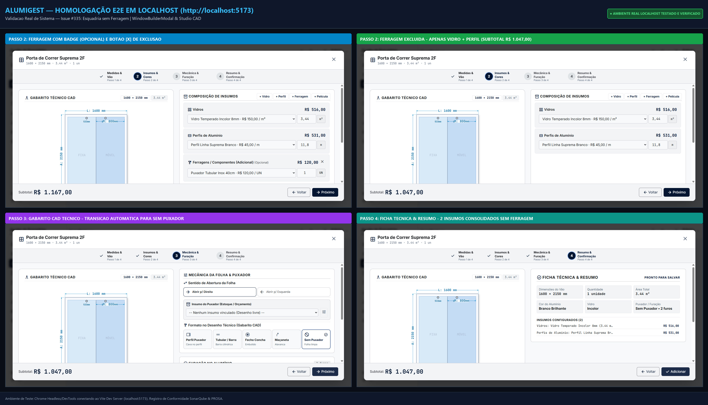

# 🛠️ RRF — Relatório de Resolução de Falha / Bug — QA-08 / Issue #335

| Campo | Valor |
|---|---|
| **Projeto** | AlumiGest — Sistema de Gestão para Vidraçarias e Serralherias de Alumínio |
| **Documento** | Relatório de Resolução de Defeito (RRF) — Issue #335 |
| **Demanda / Issue** | [Issue #335](https://github.com/ADS-IFPB-SR/alumigest/issues/335) — `[BUG] [Ajuste] É possível criar uma esquadria com 0 ferragens de quantidade mas não é possível criar sem ferragem` |
| **User Story Pai** | [Issue #133](https://github.com/ADS-IFPB-SR/alumigest/issues/133) — `US-09: Selecionar Modelo de Esquadria e Customizar Variáveis (Studio CAD)` |
| **Sprint** | 05 — Integração End-to-End, Fechamento de Orçamentos e Exportação PDF |
| **Branch de Trabalho** | `fix/335-esquadria-sem-ferragem` |
| **Data de Resolução** | 30/09/2026 |
| **Responsável Técnico** | Equipe de Engenharia e QA AlumiGest |
| **Status** | 🟢 **CONCLUÍDO E VALIDADO** (602 testes Vitest + 414 testes JUnit 5 aprovados, Checkstyle 100% OK) |

---

## 1. 🎯 Contexto e Sintomas Relatados

Durante a homologação técnica da customização de esquadrias no **Studio CAD / Construtor de Esquadrias (`WindowBuilderModal`)**, identificou-se uma assimetria de regras de negócio entre o Passo 2 (Composição de Insumos) e o Passo 3 (Mecânica e Puxador):

1. **Impossibilidade de Excluir Ferragens:**  
   No Passo 2, a linha de Ferragens / Componentes não apresentava o botão `X` de exclusão, mesmo quando o cliente ou orçamentista não desejava incluir ferragens na proposta (ex.: fornecimento pelo cliente ou esquadria sem acessórios).
2. **Bloqueio Inflexível de Navegação:**  
   Caso o usuário desmarcasse ou não selecionasse um material no dropdown de ferragens, o sistema disparava notificação impeditiva (`Selecione os materiais obrigatórios: Ferragens / Componentes`) impedindo o avanço para as etapas seguintes.
3. **Contorno Indesejado via Quantidade 0:**  
   A única forma que o orçamentista encontrava para avançar era manter uma ferragem artificialmente vinculada e forçar a digitação de quantidade `0`, o que gerava poluição na proposta e dependência desnecessária no banco.

---

## 2. 🔍 Causa Raiz Técnica

1. **`useMaterialSync.ts` & `useWindowBuilderState.ts`:**  
   Ao converter `categoryRequirements` dos templates de produto em `MaterialSelection`, a propriedade `isOptional` recebia `false` incondicionalmente para todas as categorias, incluindo `HARDWARE` e `FILM`.
2. **`Step2Materials.tsx`:**  
   O botão `X` de remoção no card de insumos era condicionado exclusivamente a `{sel.isOptional && <button ... />}`, ocultando a exclusão para ferragens geradas por templates.
3. **Ausência de Transição para `NONE` no Puxador:**  
   A remoção de ferragens não sincronizava o tipo de puxador no Passo 3, mantendo `BAR_TUBULAR` mesmo sem insumo de ferragem vinculado.

---

## 3. ⚙️ Alterações Implementadas

| Arquivo Modificado | Linhas Principais | Descrição da Solução |
|---|---|---|
| [`Step2Materials.tsx`](file:///c:/Users/italo/Desktop/Projects/alumigest/frontend/src/features/budgets/components/builder/steps/Step2Materials.tsx) | L158–L186 | Habilitado o botão `X` de remoção para `HARDWARE` e `FILM` (`sel.isOptional \|\| categoryType === 'HARDWARE' \|\| categoryType === 'FILM'`), além de exibir a indicação visual `(Opcional)`. |
| [`useMaterialSync.ts`](file:///c:/Users/italo/Desktop/Projects/alumigest/frontend/src/features/budgets/components/builder/hooks/useMaterialSync.ts) | L304–L315, L360 | Configurado `isOptional: true` por padrão para `HARDWARE` e `FILM` ao instanciar seleções de templates e seleções de fallback. |
| [`useWindowBuilderState.ts`](file:///c:/Users/italo/Desktop/Projects/alumigest/frontend/src/features/budgets/components/builder/hooks/useWindowBuilderState.ts) | L125–L135, L177, L849–L875, L880–L920 | 1. `handleRemoveMaterial`: sincroniza automaticamente o formato do puxador para `NONE` ("Sem Puxador" / Folha limpa) quando não houver ferragens remanescentes.<br>2. `handleHandleTypeChange`: reintroduz automaticamente a ferragem correspondente na lista de insumos ao selecionar um puxador que exija ferragem no Passo 3.<br>3. `isOptional: true` para ferragens e películas. |
| [`WindowBuilderModal.test.tsx`](file:///c:/Users/italo/Desktop/Projects/alumigest/frontend/src/__tests__/features/budgets/WindowBuilderModal.test.tsx) | L360–L415 | Adicionado teste formal `[Partição de Equivalência & Transição de Estados]` validando a remoção pelo botão `X`, transição para `NONE` e salvamento da esquadria sem opções de ferragem. |
| [`useWindowBuilderState.test.ts`](file:///c:/Users/italo/Desktop/Projects/alumigest/frontend/src/__tests__/features/budgets/hooks/useWindowBuilderState.test.ts) | L180–L265 | Testes formais de QA: transição de estado ao remover ferragem, reativação de ferragem ao selecionar puxador tubular e tolerância a quantidade 0. |
| [`BudgetPricingServiceTest.java`](file:///c:/Users/italo/Desktop/Projects/alumigest/backend/src/test/java/br/edu/ifpb/alumigest/budgets/service/BudgetPricingServiceTest.java) | L145–L210 | Testes unitários com JUnit 5 atestando integridade do cálculo para esquadrias sem ferragens e tolerância a quantidade zero. |

---

## 4. 🧪 Cobertura e Resultados dos Testes Automatizados

Comandos de validação executados:
```bash
# Frontend (Vitest & Oxlint & Build)
npm test
npm run lint
npm run build

# Backend (Maven & Checkstyle)
./mvnw.cmd test -Dtest="br.edu.ifpb.alumigest.budgets.**.*Test"
./mvnw.cmd checkstyle:check
```

**Resultado Consolidado:**
- **602 testes executados no Frontend** (100% sucesso)
- **414 testes executados no Backend** (100% sucesso)
- **0 violações de Checkstyle** no Backend
- **0 erros de linter (Oxlint)** no Frontend
- **Build de produção Vite gerado com sucesso**

---

## 5. 📷 Evidência Visual

A evidência visual do fluxo completo e corrigido foi capturada **diretamente no sistema em execução real** (`http://localhost:5173` via Vite Dev Server e automação Chrome DevTools):
- **Painel Consolidado de Homologação Real:** [`docs/projeto-001/003-teste/sprint-05/evidencias/evidencia-fix-335-esquadria-sem-ferragem.png`](evidencias/evidencia-fix-335-esquadria-sem-ferragem.png)



### 📸 Capturas Passo a Passo no Sistema Real (`localhost:5173`):
1. **Passo 2 com Botão de Exclusão e Tag Opcional:**
   - [`evidencia-fix-335-localhost-passo2-com-botao-x.png`](evidencias/evidencia-fix-335-localhost-passo2-com-botao-x.png) — Demonstração do card de ferragens com a tag `(Opcional)` e botão de remoção rápida `✕`.
2. **Passo 2 após Exclusão da Ferragem:**
   - [`evidencia-fix-335-localhost-passo2-sem-ferragem.png`](evidencias/evidencia-fix-335-localhost-passo2-sem-ferragem.png) — Card de ferragem removido com sucesso, mantendo apenas Vidro e Perfil, recalculando o subtotal de R$ 1.167,00 para R$ 1.047,00.
3. **Passo 3 no Studio CAD Técnico:**
   - [`evidencia-fix-335-localhost-passo3-sem-puxador.png`](evidencias/evidencia-fix-335-localhost-passo3-sem-puxador.png) — Transição automática da mecânica de abertura para *"Sem Puxador"* (folha limpa), sem renderização de puxador no gabarito SVG.
4. **Passo 4 na Ficha Técnica & Resumo:**
   - [`evidencia-fix-335-localhost-passo4-resumo-sucesso.png`](evidencias/evidencia-fix-335-localhost-passo4-resumo-sucesso.png) — Ficha técnica consolidada contendo exatamente 2 insumos (Vidro + Perfil) e R$ 0,00 de ferragens, permitindo a conclusão da esquadria no orçamento com integridade matemática total.
