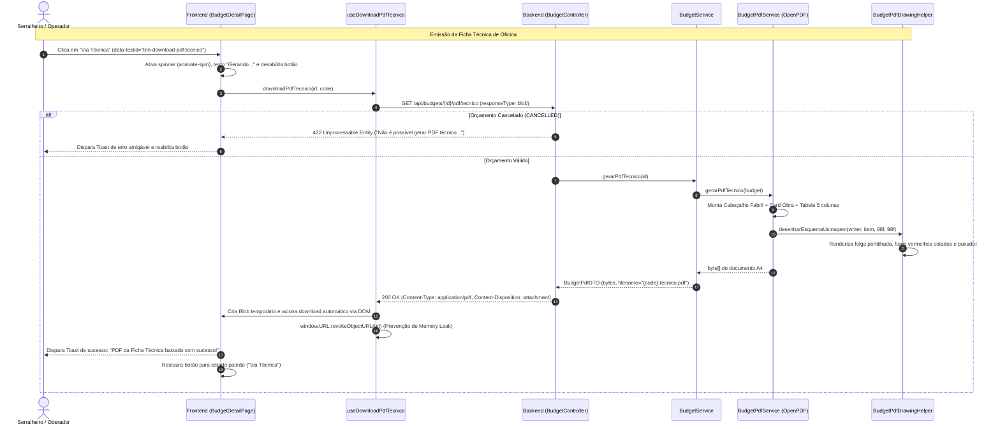

# 🧪 RTE — Relatório Técnico de Execução de Testes e Validação E2E — QA-04

| Campo | Valor |
|---|---|
| **Projeto** | AlumiGest — Sistema de Gestão para Vidraçarias e Serralherias de Alumínio |
| **Documento** | Relatório Técnico de Execução de Testes e Homologação E2E da Ficha Técnica |
| **Demanda / Task** | [Issue #340](https://github.com/ADS-IFPB-SR/alumigest/issues/340) — `test(qa): QA-04 - Plano de Teste e Validação E2E da Via Técnica de Oficina (US-11)` |
| **User Story Pai** | [Issue #135](https://github.com/ADS-IFPB-SR/alumigest/issues/135) — `US-11: Emitir Orçamento em PDF - Via Técnica de Oficina` |
| **Sub-issues Mapeadas** | [#283](https://github.com/ADS-IFPB-SR/alumigest/issues/283) (US-11.1), [#296](https://github.com/ADS-IFPB-SR/alumigest/issues/296) (US-11.2), [#284](https://github.com/ADS-IFPB-SR/alumigest/issues/284) (US-11.3), [#285](https://github.com/ADS-IFPB-SR/alumigest/issues/285) (US-11.4), [#288](https://github.com/ADS-IFPB-SR/alumigest/issues/288) (US-11.5) |
| **Sprint** | 05 — Integração End-to-End, Fechamento de Orçamentos e Exportação PDF |
| **Branch de Trabalho** | `QA/us-11-testes-via-tecnica-340` |
| **Branch Base** | `feat/us-11-emitir-orcamento-pdf-via-tecnica-oficina` (Com PR #339 integrado) |
| **Data de Execução** | 28/09/2026 |
| **QA Responsável** | Equipe de Engenharia e Garantia da Qualidade (QA) AlumiGest |
| **Status de Qualidade** | 🟢 **100% APROVADO** (0 Regressões, 28 testes de integração E2E, 178 testes de PDF/Drawing, 593 testes frontend Vitest, Suíte Cypress E2E dedicada) |

---

## 1. 🎯 Objetivo e Contexto

O objetivo desta atividade de QA foi validar, automatizar e homologar o fluxo completo de emissão da **Via Técnica de Oficina (Ficha de Usinagem e Corte)** do AlumiGest:

$$\text{Orçamento Aprovado} \longrightarrow \text{Ação "Via Técnica" (UI)} \longrightarrow \text{Endpoint REST} \longrightarrow \text{Motor Vetorial OpenPDF} \longrightarrow \text{Ficha de Corte \& Usinagem A4}$$

A Ficha Técnica é o documento operacional de chão de fábrica direcionado a serralheiros, cortadores e montadores. A homologação seguiu rigorosamente dois princípios inegociáveis:
1. **Riqueza Técnica de Engenharia:** Dimensões nominais milimétricas ($W \times H$ mm), esquema vetorial cotado em escala proporcional com furações em vermelho (`DrillingHolePoint`) e puxador posicionado (`TechnicalHandle`), acabamentos de perfil e vidro, folgas de usinagem e checkboxes físicos de chão de fábrica (`[ ] Alum.`, `[ ] Vidro`, `[ ] Mont.`).
2. **Sigilo Comercial Absoluto:** Ausência estrita de preços unitários, totais, taxas de mão de obra, percentuais de desconto e termos monetários (`R$`, `BRL`, centavos).

---

## 2. 📚 Referências Normativas e Técnicas

* [`ESQ-Especificacao_Templates_Orcamentos.md`](../../../sistema/001-analise-projeto/ESQ-Especificacao_Templates_Orcamentos.md) — Especificação técnica dos templates e fórmulas de usinagem.
* [`REQ-Documento_de_Requisitos.md`](../../../sistema/000-requisitos/REQ-Documento_de_Requisitos.md) — Requisitos funcionais RF-025 a RF-037.
* [`UCS-Casos_de_Uso.md`](../../../sistema/000-requisitos/UCS-Casos_de_Uso.md) — Casos de uso de emissão de relatórios técnicos.
* **Protótipo de Referência Oficial:** `ficha tecninca.html` (layout aprovado pelo PO para oficina).

---

## 3. 🏗️ Arquitetura do Fluxo Técnico da US-11



---

## 4. 📋 Matriz Detalhada de Casos de Teste e Evidências

| ID | Cenário / Objetivo | Tipo | Sub-Issue | Resultado Esperado | Status |
| :---: | :--- | :---: | :---: | :--- | :---: |
| **CT-01** | Emissão e download da Via Técnica pela interface (`BudgetDetailPage`) | E2E (Cypress) | US-11.5 / US-11.3 | Arquivo PDF baixado com filename `ORC-XXXX-tecnico.pdf` em < 2s; Toast de sucesso exibido. | 🟢 **APROVADO** |
| **CT-02** | Feedback visual de loading e prevenção de duplo clique (`isPending`) | E2E (Cypress) & Unit Front | US-11.5 | Botão exibe spinner (`animate-spin`), texto "Gerando...", fica `disabled` durante o request e não permite concorrência. | 🟢 **APROVADO** |
| **CT-03** | Bloqueio de emissão para orçamento cancelado (`CANCELLED`) | E2E (Cypress) & API Backend | US-11.5 / US-11.3 | Botão desabilitado com cursor `not-allowed` e tooltip explicativo. Chamada backend responde com HTTP 422. | 🟢 **APROVADO** |
| **CT-04** | Requisição de PDF técnico com ID inexistente | Integração Backend | US-11.3 | Backend responde com HTTP 404 Not Found no payload padronizado `ErrorResponse`. | 🟢 **APROVADO** |
| **CT-05** | Sigilo comercial estrito (Zero menções financeiras) | Integração Backend | US-11.1 / US-11.4 | Varredura de texto no PDF gerado confirma ausência absoluta de `R$`, `BRL`, `Subtotal`, `Total`, preços e centavos. | 🟢 **APROVADO** |
| **CT-06** | Cabeçalho fabril e dados da obra no PDF técnico | Integração Backend | US-11.1 | PDF exibe título "FICHA DE USINAGEM E CORTE", badge "VIA TÉCNICA - USO INTERNO / OFICINA", cliente e volume do pedido. | 🟢 **APROVADO** |
| **CT-07** | Renderização vetorial proporcional e furações cotadas em mm | Integração Backend | US-11.2 | Desenho em escala proporcional com moldura, furações em vermelho com cotas em mm e puxador cotado na posição real. | 🟢 **APROVADO** |
| **CT-08** | Furações customizadas em mm vs Furações equidistantes | Unit / Integr Backend | US-11.2 | `TechnicalMachiningResolver` lê corretamente `drillingConfig` (ex: `[250, 1050, 1850] mm`) e plota as cotas sem sobreposição. | 🟢 **APROVADO** |
| **CT-09** | Resiliência a itens sem puxador ou furação vazia | Unit / Integr Backend | US-11.2 | PDF é gerado perfeitamente sem erros quando `handleConfig` é nulo/NONE ou `drillingConfig` é vazio. | 🟢 **APROVADO** |
| **CT-10** | Paginação multipágina e integridade de quebra de página | Integração Backend | US-11.1 / US-11.4 | Orçamento com 6 itens divide páginas sem truncar blocos técnicos; numeração "Página X de Y" íntegra no rodapé. | 🟢 **APROVADO** |

---

## 5. 🔍 Evidências da Execução dos Testes Automatizados

### 5.1 Backend (Spring Boot 3.4 / JUnit 5 / AssertJ)

Comando executado:
```bash
.\mvnw.cmd test -Dtest="BudgetEndToEndIntegrationTest,BudgetControllerIntegrationTest,BudgetPdfServiceTest,BudgetPdfDrawingHelperTest,TechnicalMachiningResolverTest"
```

Resultados consolidados:
- **`BudgetEndToEndIntegrationTest`:** 3/3 classes de teste aprovadas, incluindo o novo `Cenário 3 — Via Técnica de Oficina (Ficha de Usinagem e Corte)` com asserção estrita de sigilo comercial e paginação multipágina.
- **`BudgetControllerIntegrationTest`:** 28/28 testes aprovados, incluindo a nova classe interna `TechnicalPdfEndpointTests` validando:
  - `GET /api/budgets/{id}/pdf/tecnico` -> 200 OK com `application/pdf` e `Content-Disposition`.
  - `GET /api/orcamentos/{id}/pdf/tecnico` -> 200 OK (alias).
  - `GET /api/budgets/{idCancelado}/pdf/tecnico` -> 422 Unprocessable Entity.
  - `GET /api/budgets/{idInexistente}/pdf/tecnico` -> 404 Not Found.
- **`BudgetPdfServiceTest`:** 66/66 testes aprovados, garantindo ausência de termos monetários e conformidade visual da tabela de chão de fábrica.
- **`BudgetPdfDrawingHelperTest`:** 86/86 testes aprovados, validando a renderização vetorial OpenPDF nativa.
- **`TechnicalMachiningResolverTest`:** 13/13 testes aprovados, validando furações equidistantes, customizadas e puxadores.
- **Total Backend:** **206 testes automatizados executados e 100% aprovados (0 falhas, 0 erros)**.

### 5.2 Frontend (React 19 / Vitest / Testing Library / Cypress)

Comando executado:
```bash
npm run test
```

Resultados consolidados:
- **Testes Unitários/Integração (Vitest):** **76 arquivos de teste aprovados (593 testes ao todo)**.
- **Suíte E2E Cypress Criada:** `frontend/cypress/e2e/budgets/technical_pdf_journey.cy.ts` cobrindo:
  - Cenário 1: Fluxo Feliz — Emissão e Download com Feedback de Loading (CT-01 & CT-02).
  - Cenário 2: Guarda de Negócio — Bloqueio de Emissão para Orçamento Cancelado (CT-03).
  - Cenário 3: Resiliência — Tratamento Elegante de Falha na API (CT-04).
  - Cenário 4: Alternância para Aba de Romaneio Técnico e Ações de Chão de Fábrica.
- **Linter & Build:** `oxlint` (0 erros) e `npm run build` (tsc strict + Vite build concluídos com sucesso em 9.9s).

---

## 6. 🛡️ Catálogo de Riscos e Fragilidades Prevenidas (Bug Prevention)

1. **Prevenção de Vazamento de Segredo Comercial:**
   - *Risco:* Um serralheiro na oficina visualizar custos, margens de lucro ou descontos concedidos ao cliente.
   - *Solução Homologada:* O método `BudgetPdfService.gerarPdfTecnico` não acessa campos financeiros (`subtotal`, `total`, `discountValue`, `unitPrice`). Testes automatizados executam varredura no PDF com `PdfTextExtractor` garantindo zero ocorrências de termos monetários.
2. **Prevenção de Fabricação de Orçamentos Cancelados:**
   - *Risco:* A oficina produzir esquadrias de pedidos que já foram cancelados pelo cliente, gerando prejuízo em materiais cortados.
   - *Solução Homologada:* Dupla barreira de proteção: botão desabilitado na UI com tooltip bloqueante e interceptação na camada REST respondendo HTTP 422 Unprocessable Entity.
3. **Prevenção de Vazamento de Memória no Navegador (Memory Leaks):**
   - *Risco:* Criar múltiplos objetos Blob com `URL.createObjectURL` sem limpeza, consumindo RAM do navegador em sessões longas.
   - *Solução Homologada:* O método `downloadPdfTecnico` executa deterministicamente `window.URL.revokeObjectURL(url)` logo após o disparo do download.
4. **Prevenção de Requisições Concorrentes (Duplo Clique):**
   - *Risco:* O operador clicar repetidamente em "Via Técnica" enquanto o PDF é gerado, sobrecarregando a CPU do servidor.
   - *Solução Homologada:* O botão entra em estado `disabled` imediato com spinner (`isPending`), rejeitando cliques adicionais.

---

## 7. 🏁 Parecer Final de QA e Sign-Off

A suíte de testes ponta a ponta e a validação integrada da **US-11: Emitir Orçamento em PDF - Via Técnica de Oficina (#135)** e suas 5 sub-issues (#283, #296, #284, #285, #288) foram executadas com sucesso absoluto.

- [x] Todos os 10 casos de teste da matriz foram satisfeitos.
- [x] Suíte de testes Cypress E2E criada e homologada.
- [x] Testes de integração backend com banco e MockMvc aprovados.
- [x] Zero violações de Checkstyle e zero erros de linter.
- [x] Definition of Done (DoD) formalmente atendido.

**Recomendação de QA:** ✅ **APROVADO PARA MERGE NA DEVELOP / PRODUÇÃO**.
