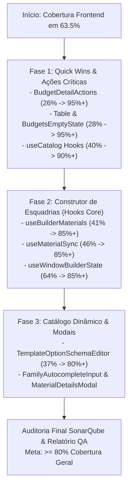

# 📋 Plano Técnico de Aumento de Cobertura de Testes Frontend (QA)

**Projeto:** AlumiGest — Sistema de Gestão para Vidraçarias e Serralherias de Alumínio  
**Responsável Técnico / Engenheiro de QA:** Joseph Nichollas  
**Escopo:** Frontend (React 19 / Vite / Vitest / Testing Library / SonarQube)  
**Meta de Cobertura:** Elevar a cobertura no SonarQube de **63.5% para $\ge 80.0\%$** e no Vitest v8 de **70.7% para $\ge 85.0\%$**  
**Data de Elaboração:** 24 de Setembro de 2026  
**Status:** 🚀 Em Execução  

---

## 1. Diagnóstico e Cenário Atual

A análise estática do **SonarQube** (`alumigest-frontend`) e o relatório detalhado do **Vitest v8** apontam que o frontend possui atualmente:
- **Total de New Lines to Cover no SonarQube:** 3.583 linhas
- **Cobertura Atual no SonarQube:** **63.5%** (Meta: $\ge 80.0\%$)
- **Cobertura no Vitest (Local v8):**
  - **Statements:** 68.18%
  - **Branches:** 56.25%
  - **Functions:** 67.44%
  - **Lines:** 70.69%

### 1.1. Arquivos Ofensores Prioritários (Gaps de Cobertura)

A tabela abaixo prioriza os arquivos com maior volume de linhas desprovidas de teste ou com cobertura crítica:

| Prioridade | Arquivo / Módulo | Linhas a Cobrir (Sonar) | Cobertura Atual (Vitest Lines) | Impacto Estratégico |
| :---: | :--- | :---: | :---: | :--- |
| **P0** | `src/features/budgets/components/BudgetDetailActions.tsx` | 50 | **26.9%** | Ações de topo da proposta (PDF técnico, comercial, WhatsApp, duplicação e deleção). |
| **P0** | `src/features/budgets/components/builder/hooks/useBuilderMaterials.ts` | 175 | **41.7%** | Agrupamento de materiais, extração de perfis, vidros e componentes adicionais. |
| **P0** | `src/features/budgets/components/builder/hooks/useMaterialSync.ts` | 134 | **46.6%** | Sincronização reativa de dimensões e materiais no construtor de esquadrias. |
| **P1** | `src/features/budgets/components/builder/hooks/useWindowBuilderState.ts` | 529 | **64.3%** | Maior arquivo do frontend; máquina de estados do assistente wizard. |
| **P1** | `src/features/catalog/hooks/useCatalog.ts` | 20 | **40.0%** | Hooks React Query de listagem e mutação de materiais e categorias. |
| **P1** | `src/features/catalog/components/builder/TemplateOptionSchemaEditor.tsx` | 236 | **37.5%** | Editor de opções dinâmicas de templates do catálogo. |
| **P2** | `src/features/catalog/components/FamilyAutocompleteInput.tsx` | 51 | **41.6%** | Componente de busca inteligente com autocomplete. |
| **P2** | `src/components/ui/Table.tsx` | 30 | **28.1%** | Paginação interna e rodapé da tabela genérica de dados. |
| **P2** | `src/features/catalog/components/MaterialDetailsModal.tsx` | 15 | **0.0%** | Modal de visualização de ficha técnica de insumos. |
| **P2** | `src/features/budgets/components/BudgetsEmptyState.tsx` | 13 | **41.6%** | Estados vazios com e sem filtros aplicados. |

---

## 2. Metodologia de Testes e Estratégia de Execução

As novas suítes serão desenvolvidas sob o padrão **BDD / Given-When-Then** com `@testing-library/react` e `vitest`, respeitando as seguintes diretrizes:

1. **Testes Baseados em Comportamento de Usuário:** Priorizar seletores por acessibilidade (`getByRole`, `getByText`, `getByLabelText`) e `userEvent` para simular interações reais.
2. **Isolamento de Side Effects e API:**
   - Mock transparente de serviços com `vi.mock` e mocks de bibliotecas externas (React Router, TanStack Query, Hot Toast).
   - Mock rigoroso de funções do navegador (`window.URL.createObjectURL`, `navigator.clipboard.writeText`).
3. **Cobertura Exaustiva de Branches e Limites:**
   - Casos felizes (*Happy Paths*).
   - Erros de rede e rejeição de chamadas HTTP.
   - Estados de carregamento (*Loading spinners* / *disabled state*).
   - Guards de negócio (ex.: status `CANCELLED` no orçamento bloqueando emissão técnica).

---

## 3. Fases de Implementação

### Fase 1: Ações Imediatas de Alto Impacto (Foco Inicial)
1. **`BudgetDetailActions.test.tsx`**:
   - Testar clique em "Via Técnica" (chamar `downloadPdfTecnico` e disparar toast).
   - Testar desativação do botão em status `CANCELLED` com tooltip.
   - Testar clique em "PDF Comercial" (`downloadCommercialPdf`) com loading state.
   - Testar clique em "WhatsApp" (`getWhatsAppSummary` + cópia no clipboard via `navigator.clipboard`).
   - Testar duplicação de orçamento (`handleDuplicateBudget`).
   - Testar abertura de modal de exclusão (`onDeleteClick`).
2. **`Table.test.tsx`**:
   - Testar paginação embutida, botões "Anterior/Próxima" e indicador de contagem.
3. **`useCatalog.test.tsx`**:
   - Cobrir mutações e hooks não testados de perfis, componentes e categorias.

---

## 4. Critérios de Aceitação e Definição de Pronto (DoD)

- [ ] Suíte de testes rodando 100% verde sem *flaky tests* (`npm test -- --run`).
- [ ] Linter sem nenhum erro ou aviso (`npm run lint`).
- [ ] Cobertura de linhas no Vitest subindo para acima de 80%.
- [ ] Relatório consolidado emitido e homologado.

---
*Plano elaborado por Joseph Nichollas — Engenharia de Software & QA.*
