# 📊 Relatório Técnico de Garantia da Qualidade e Cobertura do Frontend (QA)

**Projeto:** AlumiGest — Sistema de Gestão para Vidraçarias e Serralherias de Alumínio  
**Responsável Técnico / Engenheiro de QA:** Joseph Nichollas (`nichollascavalcante@gmail.com`)  
**Escopo:** Frontend Completo — Módulos de Orçamentos, Catálogo de Esquadrias/Materiais, Componentes UI Base, Hooks e Serviços da API  
**Branch de Trabalho:** `feat/us-11.5-botao-emitir-via-tecnica-288`  
**Ferramentas de Medição:** Vitest v5 (v8 engine), React Testing Library, Oxlint, SonarQube  
**Data de Emissão:** 24 de Setembro de 2026  
**Status do Quality Gate:** 🏆 **APROVADO** (524 testes passando, 0 falhas, Linhas $\ge 80.0\%$ atingido: **80.08%**)

---

## 1. Sumário Executivo

Este documento formaliza os resultados da campanha de expansão de cobertura e confiabilidade de testes no frontend do **AlumiGest**, executada por **Joseph Nichollas**.

O objetivo primordial foi sanar lacunas de testes identificadas no SonarQube e na análise estática, elevando a cobertura global de código novo e geral para o limiar de excelência técnica estipulado ($\ge 80.0\%$).

### Principais Conquistas Técnicas
1. **Meta Global Superada com Sucesso**:
   - **Testes Unitários e de Integração**: Evoluíram de **444 testes** (65 suítes) para **524 testes** (71 suítes), todos **100% GREEN**.
   - **Cobertura Global de Linhas**: Saltou de **70.69%** para **80.08%** (+9.39 p.p.).
   - **Cobertura Global de Funções**: Elevada para **77.01%**.
   - **Cobertura Global de Branches**: Elevada para **63.20%**.
   - **Zero Regressões e Zero Erros de Lint**: Validação completa com `oxlint` (224 arquivos analisados, 0 erros).

2. **Blindagem de Módulos Críticos a 100% de Linhas**:
   - **`components/ui` (Design System Base)**: `Button`, `Input`, `Modal`, `Select`, `Table`, `Tabs` $\rightarrow$ **100.0% de Linhas**.
   - **Ações e Estados do Orçamento**: `BudgetDetailActions.tsx` (de 26.92% para **100%**), `BudgetsEmptyState.tsx` (de 41.66% para **100%**), `BudgetsFilters.tsx` (**100%**), `BudgetsPagination.tsx` (**100%**), `BudgetsTable.tsx` (**100%**), `BudgetMaterialsSummary.tsx` (**100%**).
   - **Gestão do Catálogo de Materiais**: `useCatalog.ts` (de 40% para **100%**), `MaterialDetailsModal.tsx` (**100%**), `MaterialTypeSelectionModal.tsx` (**100%**), `CategoryBadges.tsx` (**100%**), `catalogApi.ts` (**100%**), `ProductCostSummary.tsx` (**100%**).
   - **Camada de Comunicação HTTP**: `src/lib/api.ts` $\rightarrow$ **100.0% de Linhas** e **100.0% Branches**.

---

## 2. Matriz de Rastreabilidade e Cobertura por Arquivo

| Arquivo Alvo | Localização do Teste | Tipo de Teste | Linhas Antes | Linhas Depois | Branches | Status |
| :--- | :--- | :--- | :---: | :---: | :---: | :---: |
| `BudgetDetailActions.tsx` | `__tests__/features/budgets/BudgetDetailActions.test.tsx` | Integração / UI | 26.92% | **100.0%** | 84.78% | 🏆 100% |
| `BudgetsEmptyState.tsx` | `__tests__/features/budgets/BudgetsEmptyState.test.tsx` | Unitário / UI | 41.66% | **100.0%** | 100.0% | 🏆 100% |
| `BudgetsFilters.tsx` | `__tests__/features/budgets/BudgetsFilters.test.tsx` | Unitário / Hook | 95.23% | **100.0%** | 92.85% | 🏆 100% |
| `BudgetsTable.tsx` | `__tests__/features/budgets/BudgetsTable.test.tsx` | Integração / UI | 87.50% | **100.0%** | 95.65% | 🏆 100% |
| `BudgetMaterialsSummary.tsx` | `__tests__/features/budgets/BudgetMaterialsSummary.test.tsx` | Consolidação | 97.67% | **100.0%** | 67.34% | 🏆 100% |
| `BudgetItemsTable.tsx` | `__tests__/features/budgets/BudgetItemsTable.test.tsx` | Integração / UI | 73.91% | **100.0%** | 90.56% | 🏆 100% |
| `Table.tsx` (UI Base) | `__tests__/components/ui/Table.test.tsx` | Componente Base | 28.12% | **100.0%** | 97.36% | 🏆 100% |
| `useCatalog.ts` | `__tests__/features/catalog/hooks/useCatalog.test.tsx` | Hooks React Query | 40.00% | **100.0%** | 85.71% | 🏆 100% |
| `catalogApi.ts` | `__tests__/features/catalog/services/catalogApi.test.ts` | Serviços HTTP | 83.33% | **100.0%** | 83.33% | 🏆 100% |
| `MaterialDetailsModal.tsx` | `__tests__/features/catalog/components/MaterialDetailsModal.test.tsx` | Modal / UI | 0.00% | **100.0%** | 87.17% | 🏆 100% |
| `MaterialTypeSelectionModal.tsx`| `__tests__/features/catalog/components/MaterialTypeSelectionModal.test.tsx` | Modal / UI | 25.00% | **100.0%** | 100.0% | 🏆 100% |
| `CategoryBadges.tsx` | `__tests__/features/catalog/components/CategoryBadges.test.tsx` | Badges UI | 20.00% | **100.0%** | 100.0% | 🏆 100% |
| `ProductCostSummary.tsx` | `__tests__/features/catalog/ProductCostSummary.test.tsx` | Builder CAD / UI | 87.09% | **100.0%** | 93.05% | 🏆 100% |
| `FamilyAutocompleteInput.tsx` | `__tests__/features/catalog/FamilyAutocompleteInput.test.tsx` | Autocomplete / UI | 41.66% | **94.44%** | 82.00% | ✅ Excelente |
| `useMaterialSync.ts` | `__tests__/features/budgets/hooks/useMaterialSync.test.ts` | Lógica de Domínio | 46.66% | **94.28%** | 63.46% | ✅ Excelente |
| `useBuilderMaterials.ts` | `__tests__/features/budgets/hooks/useBuilderMaterials.test.ts` | Lógica de Cálculo | 41.77% | **82.91%** | 60.08% | ✅ Superou 80% |
| `api.ts` (Axios Client) | `__tests__/lib/api.test.ts` | Interceptores | 90.90% | **100.0%** | 100.0% | 🏆 100% |

---

## 3. Metodologia e Técnicas de Teste Aplicadas

A elevação da qualidade seguiu os conceitos de teste preconizados pelo ISTQB:

### 3.1. Particionamento em Classes de Equivalência (EP)
- **Descontos no Orçamento (`BudgetCommercialConditions`)**:
  - Equivalência de formato: alternância transparente entre valor nominal em Reais (`R$`) e percentual (`%`).
  - Atualização dinâmica com recalculo de prazos de validade via botões de atalho (`+7d`, `+15d`, `+30d`) e entrada direta via calendário.
- **Tipos de Abertura de Esquadria (`BudgetItemsTable`)**:
  - Validação de setas e ícones técnicos: `LEFT_TO_RIGHT` (→), `RIGHT_TO_LEFT` (←), `CENTER_TO_SIDES` (↔), `OUTSIDE` (↗), `INSIDE` (↙) e fallback resiliente.

### 3.2. Análise de Valores Limite (BVA)
- **Contadores de Materiais e Insumos**:
  - $0$ materiais: exibição de mensagem em itálico `"Sem materiais"`.
  - $1$ material: exibição direta do nome do insumo primário.
  - $2$ materiais: sufixo singular `"+1 material"`.
  - $3+$ materiais: sufixo plural `"+N materiais"`.
- **Exportação CSV em Tabela (`Table.tsx`)**:
  - Exportação de dados preenchidos vs. listas vazias.
  - Sanitização de valores nulos e separadores de linha `\r\n`.

### 3.3. Teste de Transição de Estados (State Transition Testing)
- **Fluxos de Modal e Confirmação de Exclusão**:
  - Exclusão com confirmação $\rightarrow$ disparando `onDelete(id)` e remoção otimista.
  - Exclusão com cancelamento $\rightarrow$ fechamento instantâneo do modal preservando o item sem side-effects.
- **Ciclo de Vida de Requisições Assíncronas**:
  - Sucesso de mutação $\rightarrow$ disparo de notificação Toast positiva e invalidação de Query Cache.
  - Rejeição de mutação $\rightarrow$ captura do erro do backend (`response.data.message` ou fallback genérico) e disparo de Toast de erro.

---

## 4. Comparativo de Métricas Gerais: Antes vs. Depois

```mermaid
xychart-beta
    title "Evolução da Cobertura de Código Frontend (Vitest v8)"
    x-axis ["Instruções/Stmts", "Branches", "Funções", "Linhas"]
    y-axis "Porcentagem (%)" 40 --> 100
    bar [67.84, 56.25, 68.12, 70.69]
    bar [77.23, 63.20, 77.01, 80.08]
```

| Métrica Global | Antes da Atuação | Depois da Atuação | Delta Absoluto | Status |
| :--- | :---: | :---: | :---: | :---: |
| **Linhas Totais Cobertas** | **70.69%** | **80.08%** | **+9.39%** | 🏆 **Meta $\ge 80\%$ Superada** |
| **Instruções (Stmts)** | **67.84%** | **77.23%** | **+9.39%** | ✅ Forte Evolução |
| **Branches** | **56.25%** | **63.20%** | **+6.95%** | ✅ Ramo Seguro |
| **Funções** | **68.12%** | **77.01%** | **+8.89%** | ✅ Alta Cobertura |
| **Total de Testes** | **444 testes** | **524 testes** | **+80 novos testes** | 🟢 100% Passing |
| **Total de Arquivos de Teste** | **65 arquivos** | **71 arquivos** | **+6 novas suítes** | 🟢 100% Passing |

---

## 5. Definition of Done (DoD) — Checklist Final

- [x] Todas as novas suítes de teste executam localmente via Vitest v8 com 100% de sucesso (`524 passed`).
- [x] A cobertura global de Linhas do Frontend atingiu e superou a meta de 80.0% (**80.08%**).
- [x] Todas as suítes utilizam convenção limpa de asserções `@testing-library/react` e `@testing-library/user-event`.
- [x] O linter (`oxlint`) foi executado em todo o projeto, reportando **0 erros**.
- [x] Nenhuma alteração invasiva ou regressão foi introduzida nas regras de negócio de produção.
- [x] Todos os artefatos de teste e relatórios técnicos estão devidamente versionados e creditados a **Joseph Nichollas**.
