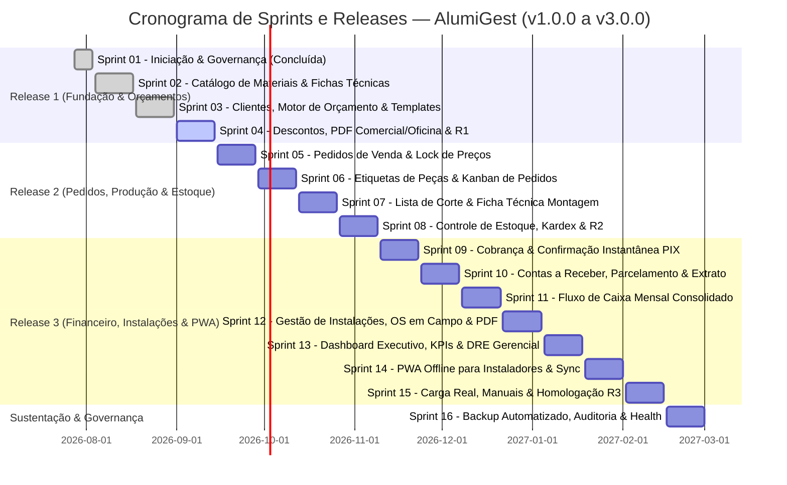

# 📋 PBL — Product Backlog (AlumiGest)

**Projeto:** AlumiGest — Sistema de Gestão para Vidraçaria e Esquadrias  
**Cliente:** Alumiportas | **PO:** José Guylherme dos Santos Melo | **Scrum Master:** Nichollas Cavalcante  
**Versão:** 3.0 (Atualizado e Alinhado com o Planejamento Geral em 04/09/2026)  

---

## 1. 🎯 Visão Geral das Releases e Sprints

O backlog do AlumiGest está estruturado em **3 grandes Releases de Negócio** e um ciclo de **Sustentação/Estabilização**, distribuídos ao longo de **16 Sprints quinzenais**:

> 💡 **Referência de Sincronização**: Para verificar o mapeamento entre a numeração antiga do PO e a numeração ativa das User Stories, consulte a [Tabela De-Para Oficial](file:///c:/Users/italo/Desktop/Projects/alumigest/docs/planejamento/de-para-user-stories.md).

---

## 2. 📦 Estrutura de Épicos e User Stories Ativas (US-01 a US-46)

### 🟢 Release 1 (v1.0.0) — Fundação, Catálogo & Orçamentos Comerciais

* **EP-01: Governança & Infraestrutura Base (Sprint 01)**
  * `US-01`: Configurar Infraestrutura Monorepo, Docker e Governança do Projeto *(Concluída)*
* **EP-02: Catálogo de Materiais & Fichas Técnicas (Sprint 02)**
  * `US-02`: Gerenciar Catálogo de Materiais Genérico (Vidros, Perfis, Ferragens) *(Concluída)*
  * `US-03`: Gerenciar Produtos e Fichas Técnicas de Esquadrias *(Concluída)*
* **EP-03: Clientes, Motor de Precificação & Templates Paramétricos (Sprint 03)**
  * `US-04`: Gerenciar Clientes PF e PJ *(Concluída)*
  * `US-05`: Refatorar Produtos com Templates Paramétricos de Esquadrias *(Concluída)*
  * `US-06`: Criar e Gerenciar Orçamentos de Venda *(Concluída)*
  * `US-07`: Motor de Cálculo Físico e Precificação de Orçamentos *(Concluída)*
  * `US-08`: Pipeline CI/CD com SonarQube e Testes E2E Cypress *(Concluída)*
* **EP-04: Condições Comerciais, Propostas em PDF & Homologação R1 (Sprint 04)**
  * `US-09`: Aplicar Descontos e Condições Comerciais no Orçamento
  * `US-10`: Emitir e Exportar Orçamento em PDF - Via Comercial e WhatsApp
  * `US-11`: Emitir Orçamento em PDF - Via Técnica de Oficina
  * `US-12`: Homologação Integrada e Validação da Release 1 (v1.0.0)

---

### 🟡 Release 2 (v2.0.0) — Gestão de Pedidos, Produção & Estoque

* **EP-05: Pedidos de Venda & Lock de Preços (Sprint 05)**
  * `US-13`: Aprovar Orçamento e Converter em Pedido de Venda
  * `US-14`: Snapshot Imutável e Lock de Preços do Pedido
  * `US-15`: Gestão de Status, Prazos e Cancelamento de Pedidos
  * `US-16`: Emissão do Comprovante do Pedido de Venda
* **EP-06: Identificação no Chão de Fábrica & Kanban Operacional (Sprint 06)**
  * `US-17`: Emitir Etiquetas de Identificação de Peças por Item do Pedido *(Sem QR Code)*
  * `US-18`: Acompanhar Produção via Painel Kanban de Pedidos de Venda
* **EP-07: Engenharia de Corte & Fichas Técnicas de Montagem (Sprint 07)**
  * `US-19`: Consolidar Lista Linear e Plana de Corte do Pedido
  * `US-20`: Gerar Ficha Técnica de Montagem por Item do Pedido
* **EP-08: Gestão de Estoque, Kardex & Homologação R2 (Sprint 08)**
  * `US-21`: Reservar e Baixar Matéria-Prima no Estoque Automaticamente
  * `US-22`: Consultar Posição de Estoque e Kardex de Movimentações
  * `US-23`: Homologação Integrada e Validação da Release 2 (v2.0.0)

---

### 🔵 Release 3 (v3.0.0) — Financeiro, Instalações & Gestão Estratégica

* **EP-09: Pagamentos Instantâneos via PIX (Sprint 09)**
  * `US-24`: Gerar Cobrança PIX com QR Code Dinâmico e Copia e Cola
  * `US-25`: Confirmar Pagamento PIX via Webhook com Liberação Automática
  * `US-26`: Modal PIX Interativo no Frontend e Histórico de Transações
* **EP-10: Contas a Receber & Gestão de Títulos (Sprint 10)**
  * `US-27`: Desdobrar e Gerenciar Parcelamento de Pedidos
  * `US-28`: Controlar Contas a Receber, Vencimentos e Inadimplência
  * `US-29`: Emitir Extrato Financeiro do Cliente e Recibo de Quitação
* **EP-11: Gestão Financeira & Fluxo de Caixa Consolidado (Sprint 11)**
  * `US-30`: Acompanhar Fluxo de Caixa Mensal
* **EP-12: Instalações & Ordens de Serviço em Campo (Sprint 12)**
  * `US-31`: Agendar Instalação e Gerar Ordem de Serviço (OS)
  * `US-32`: Executar e Concluir OS em Campo com Registro Fotográfico (PWA)
  * `US-33`: Visualizar Calendário de Instalações e Prevenção de Conflitos
  * `US-34`: Emitir Ordem de Serviço (OS) em PDF
* **EP-13: Inteligência de Negócio, KPIs & DRE (Sprint 13)**
  * `US-35`: Visualizar Dashboard Executivo e Indicadores (KPIs) Comerciais
  * `US-36`: Apurar DRE Gerencial (Competência e Caixa)
  * `US-37`: Exportar Relatórios Executivos em PDF e Planilhas CSV/Excel
* **EP-14: Operação Offline & Sincronização PWA (Sprint 14)**
  * `US-38`: Instalar PWA e Consultar Pedidos e OS Offline via IndexedDB
  * `US-39`: Sincronizar Fila de Alterações e Fotos em Segundo Plano
  * `US-40`: Comprimir Imagens no Dispositivo e Otimizar Performance Web
* **EP-15: Carga de Dados, Treinamento & Homologação R3 (Sprint 15)**
  * `US-41`: Executar Carga Inicial de Dados e Importador de Clientes via CSV
  * `US-42`: Homologação Integrada Ponta a Ponta da Release 3 (v3.0.0)
  * `US-43`: Disponibilizar Guias de Treinamento por Perfil e Central de Ajuda

---

### 🟣 Sustentação & Governança Corporativa

* **EP-16: Estabilização, Recuperação de Desastres & Auditoria (Sprint 16)**
  * `US-44`: Executar Rotinas de Backup Automático e Disaster Recovery
  * `US-45`: Registrar Trilha de Auditoria Imutável para Ações Críticas
  * `US-46`: Monitorar Saúde do Sistema com Actuator e Publicar Documentação
