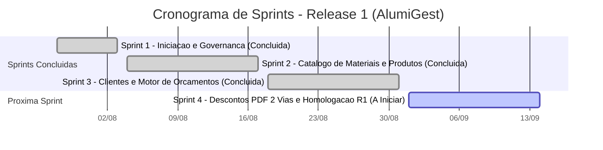

# 📋 PBL — Product Backlog (AlumiGest)
**Projeto:** AlumiGest — Sistema de Gestão para Vidraçaria e Esquadrias  
**Cliente / Parceiro Social:** Alumiportas  
**Product Owner (PO):** José Guylherme dos Santos Melo | **Scrum Master:** Italo Santos  
**Versão:** 3.1 (Atualizado com fechamento técnico da Sprint 3 e detalhamento da Sprint 4)  
**Data:** 31 de Agosto de 2026  

---

## 1. 🎯 Visão Geral das Releases e Sprints

---

## 2. 📦 Estrutura de Épicos e Histórico de Sprints

### 🟢 SPRINT 1 (28/07 a 03/08/2026) — *Concluída (Baseline B-ALG-v0.1.0-S01-01)*
* **EP-01: Iniciação, Governança e Infraestrutura**
  * PGC (Plano de Gerência de Configuração) e PPJ (Plano de Projeto). ✅
  * Estrutura Monorepo com Rulesets, Branch Protection e CI/CD GitHub Actions. ✅
  * Arquitetura Base Spring Boot 3.4 com OpenAPI Swagger e Docker Compose. ✅

---

### 🟢 SPRINT 2 (04/08 a 17/08/2026) — *Concluída (Baseline B-ALG-v0.2.0-S02-01)*
* **EP-02: Catálogo de Materiais e Insumos Universais (Issue Pai #4)**
  * **#11:** Backend: Migration Flyway V1 e Entidades Base (`tb_material_groups`, `tb_materials`). ✅
  * **#12:** Backend: CRUD de Vidros (2mm a 10mm) calculados por $m^2$. ✅
  * **#13:** Backend: CRUD de Perfis de Alumínio (Linhas Rometal/Alternativa, Barras 3m/6m, NCM). ✅
  * **#14:** Backend: CRUD de Películas e Acabamentos por $m^2$ (Fumê, Jateada, Leitosa, Espelhada). ✅
  * **#15:** Backend: CRUD de Ferragens e Acessórios por Unidade, Par ou Metro. ✅
  * **#16:** Frontend: Interface PWA em Abas para Gestão Completa do Catálogo. ✅
  * **#17:** QA: Suíte de Testes Unitários (48 testes) e 14 cenários TEA. ✅
* **EP-03: Fichas Técnicas e Categorias de Produtos (Issue #31)**
  * **#33 / #39:** Cadastro de Categorias e Modelos de Produtos (`tb_products` e `tb_product_items`). ✅

---

### 🟡 SPRINT 3 (18/08 a 31/08/2026) — *Em Fechamento (Foco: Clientes, Motor & Orçamentos)*
* **EP-04: Cadastro de Clientes (Backend)**
  * **#61 / PR #79:** API CRUD de Clientes PF/PJ (`/api/v1/customers`) com 11 classes Java e validações. ✅
* **EP-05: Motor de Precificação e Orçamentos (Backend)**
  * **#80 / PR #108:** Entidades JPA (`Budget`, `BudgetItem`, `BudgetItemOption`) e Migration V9. ✅
  * **#81 / PR #112:** DTOs e Mappers MapStruct com validações JSR-380. ✅
  * **#82 / PR #113:** `BudgetService` com gerador sequencial e máquina de estados. ✅
  * **#83 / PR #116:** `BudgetController` e Endpoints REST (136 testes automatizados). ✅
  * **#65 / #90, #91, #92 / PR #117:** Motor de Cálculo com Factory Strategy para Vidro $m^2$, Perfil linear ($4W+6H$), Ferragens e Películas (141 testes). ✅
* **EP-06: Refatoração de Templates de Produtos (Backend)**
  * **#62 / PR #104:** Suporte a Templates Paramétricos e Categorias Obrigatórias na Entidade `Product`. ✅
  * **#119 / #120:** Remoção de `laborCost` do produto mestre e transferência para o Orçamento. ✅
* **EP-07: Interfaces PWA de Orçamentos (Frontend)**
  * **#67 / #98 / PR #110:** Wizard de Criação de Orçamentos com subtotal em tempo real. ✅ *(Mergeado)*
  * **#66 / #93, #94 / PR #111:** Listagem e Paginação de Orçamentos com filtros. ✅ *(Mergeado)*
* **EP-08: Qualidade e Infraestrutura**
  * **#114 / PR #115, #118:** Suíte E2E Cypress com 23 specs para o Catálogo de Materiais. ✅
  * **PR #78:** Pipeline CI/CD com SonarQube segregado. ✅
  * **Débito Técnico:** **US-04 (#87, #88, #89)** — Componentes SVG e Tela de Produtos (transitando para S4). 🟡

---

### 🟣 SPRINT 4 (01/09 a 14/09/2026) — *Planejada (Descontos, PDF em 2 Vias & Homologação R1)*
* **EP-09: Descontos Comerciais e Condições de Pagamento**
  * Aplicação de descontos em % ou R$ com autonomia do vendedor.
  * Taxas extras (frete/instalação) e condições de pagamento (À Vista PIX, 50%+50%, Cartão até 12x).
  * Definição de prazo de validade da proposta comercial (padrão 15 dias).
* **EP-10: Emissão de Proposta Comercial e Romaneio Técnico em PDF**
  * **Via Comercial (PDF):** Layout profissional com logotipo Alumiportas, dados do cliente, itens discriminados, valores unitários/totais e botão de cópia de resumo para WhatsApp.
  * **Via Técnica / Oficina (PDF):** Instrução de fabricação com medidas nominais (L x A em mm), modelos de esquadrias, cores de perfis, tipos de vidro, sentido de abertura e ferragens, **sem exibição de valores monetários**.
  * **#68 / #69 / #70:** Relatório Comercial, Romaneio de Peças e Exportação PDF.
* **EP-11: Conclusão do Frontend de Produtos (Absorção da US-04)**
  * Finalização dos componentes SVG paramétricos de esquadrias e tela de produtos.
* **EP-12: Homologação e Fechamento da Release 1**
  * Teste E2E integrado do fluxo completo (Cliente → Produto → Orçamento → PDF) com a Alumiportas.
  * Geração da Baseline `B-ALG-v1.0.0-R01-01`.

---

*Product Backlog mantido pela Equipe AlumiGest — Atualizado em 31/08/2026*
