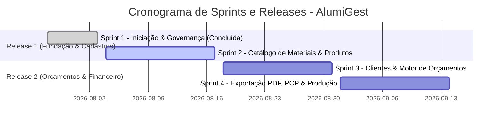

# 📋 PBL — Product Backlog (AlumiGest)
**Projeto:** AlumiGest — Sistema de Gestão para Vidraçaria e Esquadrias  
**Cliente:** Alumiportas | **PO:** José Guylherme dos Santos Melo | **Scrum Master:** Nichollas Cavalcante  
**Versão:** 2.0 (Atualizado após Planning Sprint 2 em 05/08/2026)  

---

## 1. 🎯 Visão Geral das Releases e Sprints

---

## 2. 📦 Estrutura de Épicos e Sprints

### 🟢 SPRINT 1 (28/07 a 03/08/2026) — *Concluída (Baseline 0.1.0)*
* **EP-01: Iniciação e Governança**
  * PGC (Plano de Gerência de Configuração), PPJ (Plano de Projeto), Templates de PR/Issue, Monorepo e Rulesets.

### 🟡 SPRINT 2 (04/08 a 17/08/2026) — *Em Andamento (Foco: Catálogo & Produtos)*
* **EP-02: Catálogo de Materiais e Insumos Genéricos (Issue Pai #4)**
  * **#11:** Backend: Migration Flyway V1 e Entidades Base JPA universais (`tb_material_groups`, `tb_materials`).
  * **#12:** Backend: CRUD de Vidros (2mm, 4mm, 6mm a 10mm) calculados por $m^2$.
  * **#13:** Backend: CRUD de Perfis de Alumínio (Linhas Rometal/Alternativa, Barras 3m/6m, Puxadores e NCM).
  * **#14:** Backend: CRUD de Películas e Acabamentos por $m^2$ (Fumê, Jateada, Leitosa, Espelhada).
  * **#15:** Backend: CRUD de Ferragens e Acessórios por Unidade, Par ou Metro.
  * **#16:** Frontend: Interface PWA em Abas para Gestão Completa do Catálogo.
  * **#17:** QA: Cenários e Relatórios de Teste de Aceitação (TEA).
* **EP-03: Fichas Técnicas e Categorias de Produtos (Issue #31)**
  * Cadastro de Categorias e Modelos de Portas/Esquadrias (ProductCategory e Product).
  * Associação de componentes e insumos (ProductItem).

### 🔵 SPRINT 3 (18/08 a 31/08/2026) — *Planejada (Release 2: Orçamentos & Clientes)*
* **EP-04: Cadastro de Clientes**
  * Gestão de clientes físicos e jurídicos (Nome, Telefone, WhatsApp, Endereço).
* **EP-05: Motor de Precificação e Orçamentos**
  * Criação de orçamentos rápidos com seleção de Templates ou Itens Avulsos.
  * Cálculo dinâmico com desconto de corte de perfil e folgas de vidro.
  * Aplicação de margem de lucro e flexibilidade de preços para o vendedor.

### 🟣 SPRINT 4 (01/09 a 14/09/2026) — *Planejada (Release 3: PDF, PCP & Fábrica)*
* **EP-06: Exportação e Compartilhamento de Orçamentos**
  * Geração de proposta comercial em PDF com logomarca da Alumiportas e envio via WhatsApp.
* **EP-07: Planejamento e Controle de Produção (PCP)**
  * Conversão de orçamento aprovado em Pedido de Venda.
  * Emissão de Ordem de Produção (OP) com lista de corte de perfis e vidros para a fábrica.
