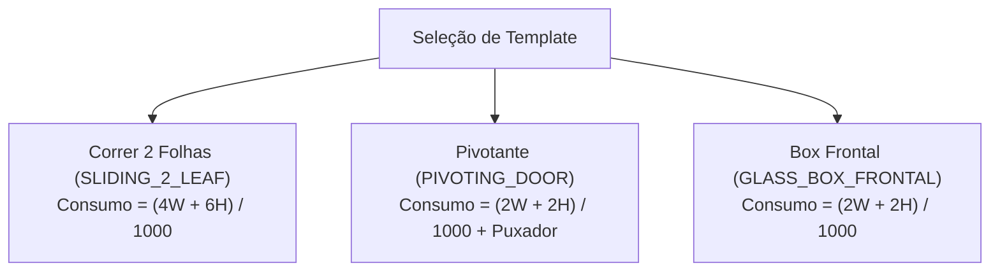

# 📐 RN — Regras de Cálculo e Negócio (AlumiGest)
**Projeto:** AlumiGest — Sistema de Gestão para Vidraçaria e Esquadrias  
**Cliente / Parceiro Social:** Alumiportas  
**Versão:** 3.0 (Atualizado com o Motor de Cálculo e Formulas da Sprint 3)  
**Data:** 31 de Agosto de 2026  
**Autor:** Equipe de Engenharia de Software (Scrum Master: Italo Santos)  

---

## 1. 🎯 Introdução e Desacoplamento Arquitetural

Este documento detalha as **regras de negócio operacionais e fórmulas matemáticas exatas** implementadas no motor de cálculo do AlumiGest (`br.edu.ifpb.alumigest.budgets.calculator`).

### 🌟 Conceito Fundamental: Insumos Básicos vs. Templates de Esquadrias
1. **Insumos Atômicos do Catálogo:**
   * **Vidros:** Medidos por área ($m^2$) com suporte a espessuras de **2mm a 10mm** e regra de faturamento mínimo.
   * **Perfis de Alumínio:** Medidos por metro linear ($m$), fornecidos em barras de **3.00m** (revenda/local) ou **6.00m** (indústria), cobrindo as linhas **Rometal**, **Alternativa** e **Puxadores**.
   * **Películas:** Medidas por área de aplicação ($m^2$) sobre o vidro (Fumê, Jateada, Leitosa, Espelhada).
   * **Ferragens e Acessórios:** Medidos por **Unidade (`UN`)**, **Par (`PAR`)** (dobradiças, roldanas) ou **Metro Linear (`METRO`)** (trilhos e escovas de vedação).
2. **Templates de Esquadrias (Modelos Paramétricos):**
   * Produtos finais representam receitas de corte e montagem (`TemplateType`).
   * As medidas nominais de entrada no orçamento são fornecidas estritamente em **milímetros ($mm$)** pelo vendedor.
   * A mão de obra (`laborCost`) é calculada e informada dinamicamente no item do orçamento, estando desacoplada do catálogo de produtos.

---

## 2. 🪟 Cálculo de Vidros (Área em $m^2$)

### 2.1 Fórmula Matemática Base
$$\text{Área Nominal } (m^2) = \left(\frac{\text{Largura (mm)}}{1000}\right) \times \left(\frac{\text{Altura (mm)}}{1000}\right)$$

$$\text{Preço Base Vidro (R\$)} = \text{Área Faturada } (m^2) \times \text{Preço Unitário do } m^2 \times \text{Quantidade}$$

### 2.2 Regras Operacionais de Vidraçaria
| ID | Regra | Descrição e Comportamento no Sistema |
| :--- | :--- | :--- |
| **RN-V01** | **Espessuras Homologadas** | O sistema suporta nativamente vidros finos para móveis (**2.00mm e 4.00mm**) e vidros temperados estruturais (**6.00mm, 8.00mm e 10.00mm**). |
| **RN-V02** | **Cálculo da Massa do Vidro** | $\text{Peso (kg)} = \text{Área } (m^2) \times \text{Espessura (mm)} \times 2,5 \text{ kg/m²}$. Utilizado para dimensionamento de ferragens e roldanas. |
| **RN-V03** | **Área Mínima de Faturamento** | Se a área calculada de uma peça for inferior a **$0,25 m^2$**, adota-se **$0,25 m^2$** para absorver o custo fixo de corte e perda de chapa. |
| **RN-V04** | **Flexibilidade Comercial** | O vendedor pode ajustar pontualmente o preço unitário do $m^2$ no orçamento sem alterar a tabela mestre de catálogo. |

---

## 3. 🔩 Cálculo de Perfis de Alumínio e Puxadores (Metro Linear)

### 3.1 Fórmulas Paramétricas por Modelo de Template

O consumo de perfis é calculado pelo motor `ProfileQuantityCalculator` com base no `TemplateType`:

1. **Porta/Janela de Correr 2 Folhas (`SLIDING_DOOR_2F` / `SLIDING_2_LEAF`):**
   $$\text{Consumo Linear (m)} = \frac{4 \times \text{Largura (mm)} + 6 \times \text{Altura (mm)}}{1000}$$
   *(Contempla trilho superior duplo, guia inferior, 4 montantes laterais e 2 travessas intermediárias).*

2. **Porta Pivotante (`PIVOTING_DOOR`):**
   $$\text{Consumo Linear (m)} = \frac{2 \times \text{Largura (mm)} + 2 \times \text{Altura (mm)}}{1000} + \text{Comprimento do Puxador (m)}$$

3. **Box de Banheiro Frontal (`GLASS_BOX_FRONTAL`):**
   $$\text{Consumo Linear (m)} = \frac{2 \times \text{Largura (mm)} + 2 \times \text{Altura (mm)}}{1000}$$

### 3.2 Regras Operacionais de Perfis
| ID | Regra | Descrição |
| :--- | :--- | :--- |
| **RN-AL01** | **Linhas Homologadas** | Suporte às linhas de catálogo comercial **Rometal**, **Alternativa** e **Suprema**. |
| **RN-AL02** | **Barras Comerciais** | Comprimento cadastrado como **3.00m** (comércio local) ou **6.00m** (indústria). |
| **RN-AL03** | **Classificação de Catálogo** | Todo perfil deve possuir código de referência de fábrica (ex: `SU-001`, `S83`, `SPR-060`) e código NCM opcional. |
| **RN-AL04** | **Puxadores Integrados** | Puxadores lineares (perfil concha ou tubular) são calculados conforme a altura da folha ou comprimento nominal informado. |

---

## 4. 🎨 Cálculo de Películas de Proteção e Acabamento ($m^2$)

### 4.1 Fórmula
$$\text{Preço Película (R\$)} = \text{Área Real do Vidro } (m^2) \times \text{Preço Unitário de Aplicação por } m^2 \times \text{Qtd}$$
* **Tipos Nativos:** Fumê G5/G20, Jateada, Leitosa e Espelhada.
* **Nota Operacional:** Na película não se aplica a regra de área mínima do vidro (fatura-se a metragem real aplicada).

---

## 5. 🧰 Cálculo de Ferragens e Acessórios

O motor `HardwareQuantityCalculator` resolve a quantidade de ferragens por 3 estratégias:
1. **Unidade Fixa (`UN`):** Quantidade declarada multiplicada pelo número de peças (ex: fechaduras, batedores).
2. **Par (`PAR`):** Roldanas e dobradiças aplicadas em pares por folha móvel (ex: 1 par a cada 50kg de vidro calculado pela **RN-V02**).
3. **Metro Linear (`METRO`):** Escovas de vedação e borrachas calculadas como $2 \times \text{Altura (m)}$ por folha.

---

## 6. 💰 Precificação Consolidada do Orçamento

O serviço `BudgetPricingService` consolida o valor total do orçamento através da composição:

$$\text{Subtotal do Item} = \sum (\text{Vidros} + \text{Perfis} + \text{Ferragens} + \text{Películas}) + \text{Mão de Obra do Item (R\$)}$$

$$\text{Total Bruto} = \sum_{i=1}^{n} \text{Subtotal do Item}_i$$

$$\text{Total Final do Orçamento} = \text{Total Bruto} - \text{Desconto Comercial (R\$ ou \%)} + \text{Taxas Adicionais (Instalação/Frete)}$$

### 6.1 Regras Comerciais e de Status
| ID | Regra | Descrição |
| :--- | :--- | :--- |
| **RN-DESC01** | **Autonomia de Desconto** | O vendedor pode aplicar descontos em porcentagem (0% a 100%) ou valor fixo em reais (R$) com autonomia total na Release 1. |
| **RN-STAT01** | **Máquina de Estados** | O orçamento transita entre **`DRAFT` (Rascunho) → `SENT` (Enviado) → `APPROVED` (Aprovado) / `CANCELLED` (Cancelado)**. |
| **RN-CONG01** | **Congelamento de Valores** | Uma vez marcado como `APPROVED`, todos os preços, insumos e medidas tornam-se imutáveis para garantir a integridade da ordem de produção. |
| **RN-PDF01** | **Segregação de Vias** | O documento técnico para a oficina omite estritamente todos os valores financeiros (R$), exibindo apenas medidas em mm e especificações de corte. |

---

*Documento de Regras de Cálculo homologado com o código da Sprint 3 — Versão 3.0 — 31/08/2026*
