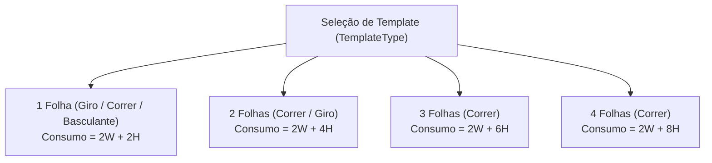
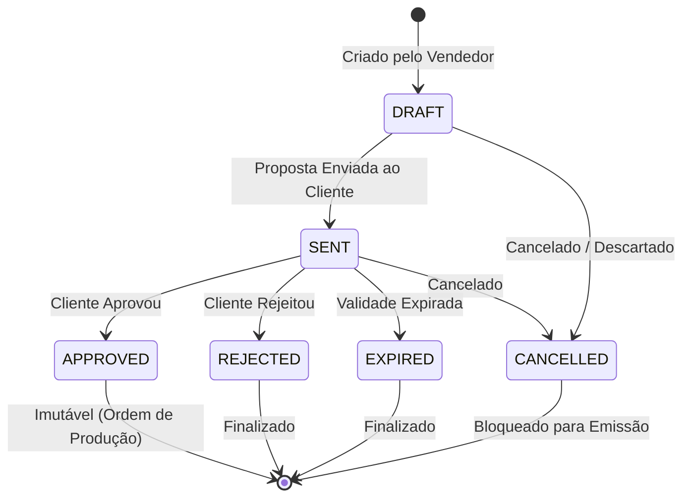

# 📐 RN — Regras de Cálculo e Negócio (AlumiGest)
**Projeto:** AlumiGest — Sistema de Gestão para Vidraçaria e Esquadrias  
**Cliente / Parceiro Social:** Alumiportas  
**Versão:** 4.0 (Homologado com Motor de Cálculo Paramétrico, Descontos e Vias de PDF)  
**Data:** 24 de Setembro de 2026  
**Governança:** Docs-as-Code — Oficial de Governança (`alumigest-doc-governor`)  

---

## 1. 🎯 Introdução e Desacoplamento Arquitetural

Este documento consolida as **regras de negócio operacionais, restrições físicas de engenharia e fórmulas matemáticas exatas** implementadas no motor de cálculo do AlumiGest (`br.edu.ifpb.alumigest.budgets`).

### 🌟 Conceito Fundamental: Insumos Básicos vs. Templates de Esquadrias
1. **Insumos Atômicos do Catálogo (`catalog`):**
   * **Vidros:** Medidos por área ($m^2$) com suporte a espessuras de **2.00mm a 10.00mm** e regra de faturamento mínimo.
   * **Perfis de Alumínio:** Medidos por metro linear ($m$), fornecidos em barras comerciais de **3.00m** (revenda/local) ou **6.00m** (indústria), abrangendo as linhas homologadas **Rometal**, **Alternativa**, **Suprema** e puxadores lineares.
   * **Películas:** Medidas por área de aplicação ($m^2$) sobre o vidro (Fumê G5/G20, Jateada, Leitosa, Espelhada).
   * **Ferragens e Componentes:** Medidos por **Unidade (`UN`)**, **Par (`PAR`)** (dobradiças, roldanas) ou **Metro Linear (`METRO`)** (trilhos e escovas de vedação).
2. **Templates de Esquadrias (Modelos Paramétricos):**
   * Produtos finais representam receitas de corte e montagem (`TemplateType`).
   * As medidas nominais de entrada no orçamento são fornecidas estritamente em **milímetros ($mm$)** pelo vendedor.
   * A mão de obra (`laborCost`) é desacoplada do catálogo mestre e calculada/informada dinamicamente no item do orçamento.

---

## 2. 🪟 Cálculo de Vidros (Área em $m^2$)

### 2.1 Fórmulas Matemáticas Base

$$\text{Largura (m)} = \frac{\text{Largura (mm)}}{1000}, \quad \text{Altura (m)} = \frac{\text{Altura (mm)}}{1000}$$

$$\text{Área Nominal Unitária } (m^2) = \text{Largura (m)} \times \text{Altura (m)}$$

$$\text{Área Faturada Unitária } (m^2) = \max(\text{Área Nominal Unitária}, 0.25)$$

$$\text{Área Total Faturada } (m^2) = \lceil \text{Área Faturada Unitária} \times \text{Quantidade} \rceil_{2\text{ decimais, CEILING}}$$

$$\text{Preço Base Vidro (R\$)} = \text{Área Total Faturada } (m^2) \times \text{Preço Unitário do } m^2$$

### 2.2 Regras Operacionais de Vidraçaria
| ID | Regra | Descrição e Comportamento no Sistema | Classe de Implementação |
| :--- | :--- | :--- | :--- |
| **RN-V01** | **Espessuras Homologadas** | O sistema suporta nativamente vidros finos para móveis (**2.00mm e 4.00mm**) e vidros temperados estruturais (**6.00mm, 8.00mm e 10.00mm**). | `GlassService` |
| **RN-V02** | **Cálculo da Massa do Vidro** | $\text{Peso (kg)} = \text{Área } (m^2) \times \text{Espessura (mm)} \times 2,5 \text{ kg/m²}$. Utilizado para validação de carga de roldanas e dobradiças. | `GlassQuantityCalculator` |
| **RN-V03** | **Área Mínima de Faturamento** | Se a área calculada de uma peça for inferior a **$0,25 m^2$**, adota-se o piso fixo de **$0,25 m^2$** para absorver o custo operacional de corte e descarte de retalho de chapa. | `GlassQuantityCalculator` |
| **RN-V04** | **Precedência de Metragem Manual** | Caso o operador informe explicitamente uma metragem manual de vidro válida ($> 0$), o sistema prioriza o valor manual, emitindo aviso caso seja inferior ao vão físico. | `BudgetQuantityService` |

---

## 3. 🔩 Cálculo de Perfis de Alumínio (Metro Linear)

### 3.1 Fórmulas Paramétricas por Modelo de Template (`ProfileQuantityCalculator`)

A conversão das dimensões do vão para metros lineares de perfis considera a tipologia de abertura e a quantidade de folhas:

Sendo $W = \frac{\text{Largura (mm)}}{1000}$ e $H = \frac{\text{Altura (mm)}}{1000}$:

1. **1 Folha (`SWING_1_LEAF`, `SLIDING_1_LEAF`, `MAX_AR_WINDOW_1_LEAF`):**
   $$\text{Metros por Unidade (m)} = 2W + 2H$$

2. **2 Folhas (`SLIDING_2_LEAF`, `SWING_2_LEAF`):**
   $$\text{Metros por Unidade (m)} = 2W + 4H$$
   *(Contempla trilhos superior e inferior no vão total e 4 montantes verticais, 2 por folha).*

3. **3 Folhas (`SLIDING_3_LEAF`):**
   $$\text{Metros por Unidade (m)} = 2W + 6H$$

4. **4 Folhas (`SLIDING_4_LEAF`):**
   $$\text{Metros por Unidade (m)} = 2W + 8H$$

5. **Consumo Total com Arredondamento:**
   $$\text{Total Perfis (m)} = \lceil \text{Metros por Unidade} \times \text{Quantidade} \rceil_{2\text{ decimais, CEILING}}$$

### 3.2 Regras Operacionais de Perfis
| ID | Regra | Descrição | Classe de Implementação |
| :--- | :--- | :--- | :--- |
| **RN-AL01** | **Linhas Homologadas** | Suporte às linhas comerciais **Rometal**, **Alternativa** e **Suprema**. | `AluminumProfileService` |
| **RN-AL02** | **Comprimento de Barra Comercial** | Barras padrão cadastradas com **3.00m** (varejo local) ou **6.00m** (indústria). | `AluminumProfileService` |
| **RN-AL03** | **Classificação de Catálogo** | Perfis exigem código de referência do fornecedor (ex: `SU-001`, `S83`, `SPR-060`) e código NCM opcional. | `AluminumProfileMapper` |
| **RN-AL04** | **Puxadores Integrados** | Puxadores lineares (perfil concha ou tubular) são calculados conforme a altura da folha ou comprimento nominal informado. | `ProfileQuantityCalculator` |
| **RN-AL05** | **Alerta de Subdimensionamento** | Se a metragem manual de perfil informada for inferior ao consumo físico necessário da esquadria, o sistema sinaliza risco de barra insuficiente. | `BudgetQuantityService` |

---

## 4. 🎨 Cálculo de Películas de Proteção e Acabamento ($m^2$)

### 4.1 Fórmulas e Regras
$$\text{Área Película (m²)} = \lceil \max(\text{Largura (m)} \times \text{Altura (m)}, 0.25) \times \text{Quantidade} \rceil_{2\text{ decimais, CEILING}}$$

$$\text{Preço Película (R\$)} = \text{Área Película (m²)} \times \text{Preço Unitário de Aplicação por } m^2$$

* **Tipos Suportados:** Fumê G5/G20, Jateada, Leitosa e Espelhada.
* **Classe:** `FilmQuantityCalculator`.

---

## 5. 🧰 Cálculo de Ferragens e Componentes de Montagem

### 5.1 Fórmulas e Estratégias de Quantificação
A classe `HardwareQuantityCalculator` resolve o consumo de acessórios conforme a unidade de medida do cadastro:

1. **Unidade Fixa (`UN`):**
   $$\text{Qtd Total} = \text{Qtd Declarada} \times \text{Qtd de Esquadrias}$$
   *(Ex: fechaduras bico de papagaio, fechos concha, batedores).*
2. **Par (`PAR`):**
   $$\text{Qtd Total (Pares)} = \text{Qtd Declarada (Pares)} \times \text{Qtd de Esquadrias}$$
   *(Ex: 1 par de roldanas para portas até 50kg).*
3. **Metro Linear (`METRO`):**
   $$\text{Qtd Total (m)} = \text{Metragem Declarada} \times \text{Qtd de Esquadrias}$$
   *(Ex: escovas de vedação siliconadas, borrachas EPDM).*

---

## 6. 💰 Precificação Consolidada e Descontos (`BudgetPricingService`)

### 6.1 Composição Financeira em Cascata

$$\text{Subtotal do Item} = \left[ \sum_{\text{opções}} (\text{Preço Unitário do Insumo} \times \text{Quantidade Calculada}) \times \text{Qtd Esquadrias} \right] + \text{Mão de Obra do Item (R\$)}$$

$$\text{Subtotal do Orçamento} = \sum_{i=1}^{n} \text{Subtotal do Item}_i$$

### 6.2 Regras de Desconto Comercial (`DiscountType`)
O vendedor pode aplicar desconto com autonomia sob duas modalidades:

1. **Desconto Percentual (`PERCENTUAL`):**
   $$\text{Validação: } 0\% \le \text{Percentual} \le 100\%$$
   $$\text{Valor do Desconto (R\$)} = \left[ \text{Subtotal} \times \frac{\text{Percentual}}{100} \right]_{2\text{ decimais, HALF\_EVEN}}$$

2. **Desconto por Valor Fixo (`VALOR_FIXO`):**
   $$\text{Validação: } \text{R\$} 0,00 \le \text{Valor do Desconto} \le \text{Subtotal do Orçamento}$$
   $$\text{Percentual Equivalente (\%)} = \left[ \frac{\text{Valor do Desconto} \times 100}{\text{Subtotal}} \right]_{2\text{ decimais, HALF\_EVEN}}$$

3. **Total Líquido Final:**
   $$\text{Total Final (R\$)} = \text{Subtotal do Orçamento} - \text{Valor do Desconto}$$

---

## 7. 🔄 Máquina de Estados do Orçamento (`BudgetStatus`)

O ciclo de vida do orçamento é governado pela classe `BudgetService`:

### 7.1 Regras de Transição e Governança
| ID | Regra | Descrição e Validação |
| :--- | :--- | :--- |
| **RN-STAT01** | **Mutabilidade Estrita em Rascunho** | Inserção, edição e exclusão de itens de esquadrias são permitidas **exclusivamente** quando `status == DRAFT`. Se diferente, lança `BudgetImmutableException`. |
| **RN-STAT02** | **Congelamento Pós-Aprovação** | Ao transitar para `APPROVED`, preços, dimensões, opções de materiais e dados do cliente tornam-se estritamente imutáveis. |
| **RN-STAT03** | **Validade da Proposta** | O campo `validUntil` é armazenado em UTC (`23:59:59`). Se a data for anterior ao dia corrente, a operação é rejeitada com `BusinessException`. |
| **RN-STAT04** | **Bloqueio de Orçamento Cancelado** | Orçamentos no status `CANCELLED` são sumariamente bloqueados para emissão de PDF comercial ou técnico. |

---

## 8. 📄 Segregação de Vias Documentais e Exportação (`BudgetPdfService`)

Para preservar o segredo industrial e viabilizar a operação de chão de fábrica, a emissão documental é segregada em dois canais:

### 8.1 Via Comercial do Cliente (PDF Comercial)
* **Destinatário:** Cliente final / Vendedor.
* **Conteúdo Obrigatório:** Dados cadastrais da Alumiportas, identificação do cliente, descrição dos itens de esquadria, valor unitário, mão de obra discriminada, subtotal, valor/percentual de desconto, total final em R$, condição de pagamento homologada (`PaymentCondition`), data limite de validade e observações comerciais.

### 8.2 Ficha Técnica da Oficina (PDF Técnico)
* **Destinatário:** Serralheiro / Vidraceiro / Operador de Oficina.
* **Sigilo Comercial Estrito (`RN-PDF01`):** Omissão absoluta de qualquer cifra monetária (R$), preços de insumos, valores de mão de obra e totais.
* **Conteúdo Operacional:** Dimensões milimétricas exatas ($W \times H$ em mm), identificação do template (`TemplateType`), metragem exata de corte de perfis lineares (m), especificação e espessura do vidro cortado ($m^2$), tipo de película e listagem de ferragens/acessórios para conferência de montagem.

### 8.3 Resumo para WhatsApp (`gerarResumoWhatsApp`)
* **Destinatário:** Envio ágil via WhatsApp Web / Mobile.
* **Formato:** Mensagem textual estruturada com emojis, código do orçamento, nome do cliente, relação resumida de itens, valor total líquido, condição de pagamento e prazo de validade.

---

## 9. 📋 Matriz de Rastreabilidade Docs-as-Code

| Regra Documentada | Código Backend Correspondente | Teste Automatizado |
| :--- | :--- | :--- |
| Fórmulas de Perfis ($2W+2H$, $2W+4H$, $2W+6H$, $2W+8H$) | `br.edu.ifpb.alumigest.budgets.calculator.ProfileQuantityCalculator` | `ProfileQuantityCalculatorTest` |
| Piso mínimo de vidro ($0.25 m^2$) | `br.edu.ifpb.alumigest.budgets.calculator.GlassQuantityCalculator` | `GlassQuantityCalculatorTest` |
| Piso mínimo de película ($0.25 m^2$) | `br.edu.ifpb.alumigest.budgets.calculator.FilmQuantityCalculator` | `FilmQuantityCalculatorTest` |
| Quantificação de ferragens por unidade | `br.edu.ifpb.alumigest.budgets.calculator.HardwareQuantityCalculator` | `HardwareQuantityCalculatorTest` |
| Cálculo de Subtotal e Desconto Comercial | `br.edu.ifpb.alumigest.budgets.service.BudgetPricingService` | `BudgetPricingServiceTest` |
| Detecção de Subdimensionamento Físico | `br.edu.ifpb.alumigest.budgets.service.BudgetQuantityService` | `BudgetQuantityServiceTest` |
| Máquina de Estados e Imutabilidade | `br.edu.ifpb.alumigest.budgets.service.BudgetService` | `BudgetServiceTest` |
| Segregação de Vias (Comercial / Ficha Técnica) | `br.edu.ifpb.alumigest.budgets.service.BudgetPdfService` | `BudgetPdfServiceTest` |

---
*Documento homologado pelo Oficial de Governança Técnica (`alumigest-doc-governor`) em 24/09/2026.*
