# UCS — Documento de Casos de Uso

| Campo | Valor |
|---|---|
| **Projeto** | AlumiGest — Sistema de Gestão para Vidraçaria e Esquadrias |
| **Sigla** | ALG |
| **Versão** | 2.0 (Atualizado com regras da Sprint 3, milímetros, templates e descontos em %/R$) |
| **Data** | 31/08/2026 |

---

## Revisões

| Data | Versão | Descrição | Autor |
|---|---|---|---|
| 05/08/2026 | 1.0 | Versão inicial — Casos de uso da Sprint 2 | Ítalo Jefferson / Equipe AlumiGest |
| 31/08/2026 | 2.0 | Atualização com medidas em mm, área mínima de 0,25 m², templates de esquadrias, descontos em %/R$ e máquina de estados | Equipe AlumiGest (Scrum Master: Italo Santos) |

---

## 1. Atores do Sistema

| Ator | Descrição | Perfil |
|---|---|---|
| **Administrador** | Proprietário ou gestor da Alumiportas com acesso irrestrito ao sistema, relatórios, cadastros e parametrizações. | Administrador |
| **Vendedor** | Atendente/Vendedor responsável por cadastrar clientes, configurar orçamentos no Wizard, aplicar descontos e emitir propostas. | Vendedor |
| **Produção / Oficina** | Operador de corte e montagem na fábrica que consulta o Romaneio Técnico de esquadrias e ordens de produção. | Produção |
| **Sistema** | Mecanismo autônomo de cálculo dinâmico de materiais, transições de status e validações de regras de negócio. | Sistema |

---

## 2. Diagrama de Casos de Uso (Release 1)

```mermaid
graph TD
    subgraph Atores["Atores"]
        Admin((Administrador))
        Vend((Vendedor))
        Prod((Produção))
        Syst((Sistema))
    end

    subgraph ModuloCatalogo["Módulo de Catálogo & Templates"]
        UC01["UC-01: Cadastrar Vidros"]
        UC02["UC-02: Cadastrar Perfis e Puxadores"]
        UC03["UC-03: Cadastrar Ferragens"]
        UC04["UC-04: Cadastrar Películas"]
        UC05["UC-05: Pesquisar Insumos"]
        UC06["UC-06: Configurar Templates de Esquadrias"]
    end

    subgraph ModuloOrcamentos["Módulo de Orçamentos Comerciais"]
        UC07["UC-07: Criar Orçamento (Wizard)"]
        UC08["UC-08: Adicionar e Configurar Item (Template em mm)"]
        UC09["UC-09: Calcular Materiais e Totais (Automático)"]
        UC10["UC-10: Aplicar Desconto e Condições (% ou R$)"]
        UC11["UC-11: Gerar Proposta Comercial e Romaneio (PDF)"]
        UC12["UC-12: Gerenciar Status do Orçamento"]
    end

    subgraph ModuloClientes["Módulo de Clientes"]
        UC13["UC-13: Cadastrar Cliente (PF/PJ)"]
        UC14["UC-14: Pesquisar e Selecionar Cliente"]
    end

    Admin --> UC01
    Admin --> UC02
    Admin --> UC03
    Admin --> UC04
    Admin --> UC06
    Admin --> UC13

    Vend --> UC05
    Vend --> UC07
    Vend --> UC08
    Vend --> UC10
    Vend --> UC11
    Vend --> UC12
    Vend --> UC13
    Vend --> UC14

    UC08 --> UC09
    Syst --> UC09
    Prod --> UC11
```

---

## 3. Especificação Detalhada dos Casos de Uso

---

### UC-01: Cadastrar Tipo de Vidro

| Campo | Descrição |
|---|---|
| **ID** | UC-01 |
| **Nome** | Cadastrar Tipo de Vidro |
| **Ator Principal** | Administrador |
| **Pré-condições** | Usuário autenticado |
| **Pós-condições** | Vidro cadastrado e disponível para montagem de esquadrias |
| **Requisitos** | RF-016, RF-020 |

**Fluxo Principal:**
1. O Administrador acessa **Catálogo > Vidros** e clica em **"+ Novo Material"**.
2. O sistema abre o modal `GlassFormModal` solicitando: Nome, Espessura nominal em milímetros (**2mm, 4mm, 6mm, 8mm, 10mm**), Cor/Acabamento, Preço de Custo e Preço de Venda por $m^2$.
3. O Administrador preenche os dados e clica em **"Salvar"**.
4. O sistema valida os campos via Zod/JSR-380, grava o registro com status **Ativo** e exibe feedback visual (*Toast*).

---

### UC-02: Cadastrar Perfil de Alumínio e Puxadores

| Campo | Descrição |
|---|---|
| **ID** | UC-02 |
| **Nome** | Cadastrar Perfil de Alumínio |
| **Ator Principal** | Administrador |
| **Pré-condições** | Usuário autenticado |
| **Pós-condições** | Perfil registrado para cálculo linear de esquadrias |
| **Requisitos** | RF-017, RF-020 |

**Fluxo Principal:**
1. O Administrador acessa **Catálogo > Perfis de Alumínio** e clica em **"+ Novo Material"**.
2. O sistema abre o modal `ProfileFormModal` solicitando: Código de Referência Comercial (ex: `SU-001`, `S83`, `SPR-060`), Nome, Linha Comercial (Rometal, Alternativa, Suprema), NCM opcional, Preço de Venda por metro linear ($R\$/m$) e Comprimento Padrão da Barra (3.00m ou 6.00m).
3. O Administrador salva o registro.
4. O sistema valida unicidade e armazena o perfil como ativo.

---

### UC-03: Cadastrar Ferragem e Acessórios

| Campo | Descrição |
|---|---|
| **ID** | UC-03 |
| **Nome** | Cadastrar Ferragem e Acessórios |
| **Ator Principal** | Administrador |
| **Pré-condições** | Usuário autenticado |
| **Pós-condições** | Ferragem cadastrada com precificação por UN, PAR ou METRO |
| **Requisitos** | RF-018, RF-020 |

**Fluxo Principal:**
1. O Administrador acessa **Catálogo > Ferragens** e clica em **"+ Novo Material"**.
2. Preenche: Nome, Unidade de Medida (**Unidade `UN`**, **Par `PAR`** ou **Metro `METRO`**) e Preço Unitário.
3. Salva o registro.

---

### UC-04: Cadastrar Película

| Campo | Descrição |
|---|---|
| **ID** | UC-04 |
| **Nome** | Cadastrar Película |
| **Ator Principal** | Administrador |
| **Pré-condições** | Usuário autenticado |
| **Pós-condições** | Película registrada para aplicação sobre vidros |
| **Requisitos** | RF-019, RF-020 |

**Fluxo Principal:**
1. O Administrador acessa **Catálogo > Películas**.
2. Preenche: Nome (ex: Fumê G5, Fumê G20, Jateada, Leitosa, Espelhada) e Preço de Aplicação por $m^2$.
3. Salva o registro.

---

### UC-05: Pesquisar Insumos no Catálogo

| Campo | Descrição |
|---|---|
| **ID** | UC-05 |
| **Nome** | Pesquisar Insumos |
| **Ator Principal** | Administrador, Vendedor |
| **Pré-condições** | Usuário autenticado |
| **Pós-condições** | Tabela filtrada em tempo real com debounce |
| **Requisitos** | RF-021 |

**Fluxo Principal:**
1. O usuário navega entre as 4 abas (**Vidros, Perfis, Ferragens e Películas**).
2. Digita o termo no campo de busca.
3. O sistema aplica filtro textual reativo, exibindo badges de status e preços formatados em Real (BRL).

---

### UC-06: Configurar Templates de Esquadrias (Modelos Paramétricos)

| Campo | Descrição |
|---|---|
| **ID** | UC-06 |
| **Nome** | Configurar Templates de Esquadrias |
| **Ator Principal** | Administrador |
| **Pré-condições** | Categorias de produtos criadas |
| **Pós-condições** | Template registrado com esquema paramétrico e categorias de insumos |
| **Requisitos** | RF-022, RF-023, RF-024 |

**Fluxo Principal:**
1. O Administrador acessa **Produtos/Templates**.
2. Define o modelo (`TemplateType`: Porta de Correr 2F, Pivotante, Box Frontal, Janela), categorias obrigatórias (`category_requirements`: `GLASS`, `PROFILE`, `HARDWARE`, `FILM`) e esquema vetorial SVG.
3. Salva o template no catálogo base.

---

### UC-07: Criar Orçamento Comercial (Wizard de 3 Passos)

| Campo | Descrição |
|---|---|
| **ID** | UC-07 |
| **Nome** | Criar Orçamento no Wizard |
| **Ator Principal** | Vendedor |
| **Atores Secundários** | Sistema |
| **Pré-condições** | Usuário autenticado |
| **Pós-condições** | Orçamento criado com código sequencial no status `DRAFT` |
| **Requisitos** | RF-025, RF-034, RF-035 |

**Fluxo Principal:**
1. O Vendedor acessa **Orçamentos > Novo Orçamento**.
2. **Passo 1 (Cliente):** O Vendedor pesquisa um cliente existente ou cadastra rapidamente um novo cliente (UC-13).
3. **Passo 2 (Configuração de Itens):** O Vendedor adiciona as peças sob medida (UC-08), visualizando o subtotal em tempo real.
4. **Passo 3 (Revisão e Condições):** O Vendedor aplica descontos em % ou R$ (UC-10), seleciona a forma de pagamento e define a validade (15 dias).
5. O Vendedor clica em **"Emitir Orçamento"**.
6. O Sistema gera o código `ORC-YYYYMMDD-NNNN`, persiste o orçamento como `DRAFT` e disponibiliza a emissão de PDF.

---

### UC-08: Adicionar e Configurar Item de Esquadria

| Campo | Descrição |
|---|---|
| **ID** | UC-08 |
| **Nome** | Adicionar Item de Esquadria |
| **Ator Principal** | Vendedor |
| **Atores Secundários** | Sistema (Motor de Cálculo) |
| **Pré-condições** | Orçamento em edição |
| **Pós-condições** | Item parametrizado com cálculo exato de materiais |
| **Requisitos** | RF-026, RF-027, RF-028, RF-029, RF-030, RF-031 |

**Fluxo Principal:**
1. No Wizard, o Vendedor seleciona o **Template de Esquadria** desejado (ex: Porta de Correr 2 Folhas).
2. O Vendedor informa as **medidas nominais em milímetros**:
   - **Largura (mm):** Ex: 1600
   - **Altura (mm):** Ex: 2100
   - **Quantidade:** Ex: 1
3. O Vendedor seleciona os insumos correspondentes:
   - Vidro desejado (ex: Vidro 8mm Incolor)
   - Perfil de alumínio e cor (ex: Linha Rometal Branco Ral)
   - Película opcional (ex: Fumê G20)
   - Sentido de abertura e modelo de puxador (tubular / concha)
4. O **Sistema** executa o cálculo automático em background (UC-09) e atualiza o **indicador de subtotal reativo em tempo real**.
5. O Vendedor informa a mão de obra específica do item (`laborCost`).
6. O Vendedor confirma e o item é anexado ao orçamento.

---

### UC-09: Calcular Materiais e Totais (Automático)

| Campo | Descrição |
|---|---|
| **ID** | UC-09 |
| **Nome** | Calcular Materiais e Totais |
| **Ator Principal** | Sistema |
| **Pré-condições** | Medidas em mm e insumos selecionados |
| **Pós-condições** | Quantidades e preços calculados com regras operacionais |
| **Requisitos** | RF-027, RF-028, RF-029, RN-V02, RN-V03, RN-AL01 |

**Fluxo Principal:**
1. **Vidro:** Calcula $\text{Área } (m^2) = (\text{Largura}/1000) \times (\text{Altura}/1000)$. Se $< 0,25 m^2$, aplica a área mínima de $0,25 m^2$ (`RN-V03`). Multiplica pelo preço do $m^2$.
2. **Perfis:** Aplica a fórmula do template (ex: $\frac{4W + 6H}{1000}$ para correr 2 folhas). Multiplica pelo preço por metro.
3. **Ferragens:** Computa pares de roldanas, guias e escovas ($2 \times \text{Altura}$) conforme tipologia e peso do vidro.
4. **Película:** Multiplica a área real do vidro pelo preço do $m^2$ da película.
5. **Subtotal do Item:** Consolida insumos + mão de obra do item.

---

### UC-10: Aplicar Desconto e Condições Comerciais

| Campo | Descrição |
|---|---|
| **ID** | UC-10 |
| **Nome** | Aplicar Desconto Comercial |
| **Ator Principal** | Vendedor |
| **Pré-condições** | Orçamento com itens configurados |
| **Pós-condições** | Total final recalculado |
| **Requisitos** | RF-032, RF-033, RN-DESC01 |

**Fluxo Principal:**
1. O Vendedor escolhe a modalidade de desconto: **Percentual (%)** ou **Valor Fixo (R\$)**.
2. Informa o valor com autonomia total.
3. O sistema recalcula o valor líquido final em tempo real.
4. O Vendedor seleciona a condição de pagamento (À Vista PIX, 50%+50%, Cartão até 12x) e taxas adicionais.

---

### UC-11: Gerar Proposta Comercial e Romaneio Técnico (PDF)

| Campo | Descrição |
|---|---|
| **ID** | UC-11 |
| **Nome** | Gerar Documentos em PDF |
| **Ator Principal** | Vendedor, Produção |
| **Pré-condições** | Orçamento criado |
| **Pós-condições** | PDFs emitidos para download e impressão |
| **Requisitos** | RF-036, RF-037, RN-PDF01 |

**Fluxo Principal:**
1. O usuário clica em **"Gerar PDF"** e escolhe a via:
   - **Via Comercial (Cliente):** Contém cabeçalho Alumiportas, dados do cliente, descrição dos itens, medidas, valores unitários, subtotal, descontos, total final e botão de compartilhamento no WhatsApp.
   - **Via Técnica / Oficina (Produção):** Contém ficha de corte com medidas em mm, modelos de esquadria, tipo de vidro, cores de perfis e ferragens, **sem exibição de nenhum valor financeiro (R\$)**.
2. O sistema compila o PDF para visualização e download imediato.

---

### UC-12: Gerenciar Máquina de Estados do Orçamento

| Campo | Descrição |
|---|---|
| **ID** | UC-12 |
| **Nome** | Alterar Status do Orçamento |
| **Ator Principal** | Vendedor |
| **Pré-condições** | Orçamento existente |
| **Pós-condições** | Status atualizado com congelamento de valores na aprovação |
| **Requisitos** | RF-035, RN-STAT01, RN-CONG01 |

**Fluxo Principal:**
1. O Vendedor seleciona o orçamento na listagem e aciona a transição:
   * **`DRAFT` → `SENT`:** Orçamento finalizado e enviado ao cliente.
   * **`SENT` → `APPROVED`:** Cliente aprovou a proposta comercial. O sistema **congela todos os preços e medidas**, tornando o registro imutável.
   * **`SENT` → `CANCELLED`:** Proposta recusada ou cancelada.
2. O sistema registra o histórico da transição.

---

### UC-13: Cadastrar Cliente (PF/PJ)

| Campo | Descrição |
|---|---|
| **ID** | UC-13 |
| **Nome** | Cadastrar Cliente |
| **Ator Principal** | Vendedor, Administrador |
| **Pré-condições** | Usuário autenticado |
| **Pós-condições** | Cliente persistido no banco de dados |
| **Requisitos** | RF-007, RF-008 |

**Fluxo Principal:**
1. O operador informa: Nome/Razão Social, Tipo de Pessoa (Física/Jurídica), CPF ou CNPJ (com validação de dígitos), Telefone/WhatsApp, E-mail e Endereço.
2. O sistema valida unicidade do documento e persiste o registro com status Ativo.

---

### UC-14: Pesquisar e Selecionar Cliente

| Campo | Descrição |
|---|---|
| **ID** | UC-14 |
| **Nome** | Pesquisar Cliente |
| **Ator Principal** | Vendedor, Administrador |
| **Pré-condições** | Usuário autenticado |
| **Pós-condições** | Cliente selecionado para o fluxo comercial |
| **Requisitos** | RF-009 |

**Fluxo Principal:**
1. O Vendedor pesquisa por nome, documento ou telefone na listagem ou no início do Wizard.
2. O sistema retorna os clientes correspondentes de forma paginada e rápida.

---

*Documento de Casos de Uso homologado com a arquitetura AlumiGest — Versão 2.0 — 31/08/2026*
