# 📋 UCS — Documento de Casos de Uso (AlumiGest)

| Campo | Valor |
|---|---|
| **Projeto** | AlumiGest — Sistema de Gestão para Vidraçaria e Esquadrias |
| **Sigla** | ALG |
| **Versão** | 4.0 (Reestruturação Completa com Fluxos Alternativos, Fluxos de Exceção, Vias Segregadas e Segurança) |
| **Data** | 24/09/2026 |
| **Governança** | Docs-as-Code — Oficial de Governança (`alumigest-doc-governor`) |

---

## Histórico de Revisões

| Data | Versão | Descrição | Autor |
|---|---|---|---|
| 05/08/2026 | 1.0 | Versão inicial — Casos de uso da Sprint 2 | Ítalo Jefferson / Equipe AlumiGest |
| 31/08/2026 | 2.0 | Atualização com medidas em mm, área mínima de 0,25 m², templates de esquadrias, descontos em %/R$ e máquina de estados | Equipe AlumiGest (Scrum Master: Italo Santos) |
| 24/09/2026 | 3.0 | Revisão e alinhamento com o código-fonte (PDF Comercial, PDF Técnico com Sigilo, WhatsApp, Alertas Físicos) | Equipe AlumiGest (Tech Lead: Ítalo Jefferson) |
| 24/09/2026 | 4.0 | Reincorporação e aprofundamento exaustivo de todos os Fluxos Alternativos (FA) e Fluxos de Exceção (FE) para os 18 Casos de Uso do sistema, restauração de módulos de autenticação e matriz de rastreabilidade | Equipe AlumiGest (Tech Lead & QA: Ítalo Jefferson) |

---

## 1. Atores do Sistema

| Ator | Descrição | Perfil de Acesso |
|---|---|---|
| **Administrador** | Proprietário ou gestor da vidraçaria/serralheria com acesso irrestrito ao sistema, relatórios, cadastros de insumos, parametrizações de templates e usuários. | Administrador |
| **Vendedor** | Atendente/Vendedor responsável por cadastrar clientes, configurar orçamentos no Wizard ou venda avulsa, negociar descontos e emitir propostas. | Vendedor |
| **Produção / Oficina** | Operador de corte e montagem na fábrica que consulta e imprime a Ficha Técnica de Oficina com medidas e especificações sem valores monetários. | Produção |
| **Sistema** | Mecanismo autônomo de dimensionamento paramétrico de materiais, validação física de corte, transições de status e consolidação de preços. | Sistema |

---

## 2. Diagrama Geral de Casos de Uso

```mermaid
graph TD
    subgraph Atores["Atores do Sistema"]
        Admin((Administrador))
        Vend((Vendedor))
        Prod((Produção / Oficina))
        Syst((Sistema Autônomo))
    end

    subgraph ModuloCatalogo["Módulo 1: Catálogo & Engenharia de Templates"]
        UC01["UC-01: Cadastrar Tipo de Vidro"]
        UC02["UC-02: Cadastrar Perfil de Alumínio e Puxadores"]
        UC03["UC-03: Cadastrar Ferragem e Acessórios"]
        UC04["UC-04: Cadastrar Película"]
        UC05["UC-05: Pesquisar Insumos no Catálogo"]
        UC06["UC-06: Configurar Templates de Esquadrias"]
    end

    subgraph ModuloOrcamentos["Módulo 2: Orçamentos Comerciais & Produção"]
        UC07["UC-07: Criar Orçamento Comercial (Wizard / Avulso)"]
        UC08["UC-08: Adicionar Item com Validação Física"]
        UC09["UC-09: Calcular Materiais e Totais (Automático)"]
        UC10["UC-10: Aplicar Desconto e Condições Comerciais"]
        UC11["UC-11: Emitir Proposta Comercial (PDF Comercial)"]
        UC12["UC-12: Emitir Ficha Técnica de Oficina (PDF Técnico)"]
        UC13["UC-13: Gerar Resumo Formatado para WhatsApp"]
        UC14["UC-14: Gerenciar Ciclo de Vida (Máquina de Estados)"]
    end

    subgraph ModuloClientes["Módulo 3: Gestão de Clientes"]
        UC15["UC-15: Cadastrar Cliente (PF/PJ com ViaCEP)"]
        UC16["UC-16: Pesquisar e Selecionar Cliente"]
    end

    subgraph ModuloSeguranca["Módulo 4: Autenticação & Acesso"]
        UC17["UC-17: Fazer Login e Autenticação"]
        UC18["UC-18: Gerenciar Usuários e Perfis"]
    end

    Admin --> UC01
    Admin --> UC02
    Admin --> UC03
    Admin --> UC04
    Admin --> UC06
    Admin --> UC15
    Admin --> UC18

    Vend --> UC05
    Vend --> UC07
    Vend --> UC08
    Vend --> UC10
    Vend --> UC11
    Vend --> UC12
    Vend --> UC13
    Vend --> UC14
    Vend --> UC15
    Vend --> UC16

    Prod --> UC12
    Syst --> UC09
    UC08 --> UC09

    Admin --> UC17
    Vend --> UC17
    Prod --> UC17
```

---

## 3. Especificação Detalhada dos Casos de Uso

---

### UC-01: Cadastrar Tipo de Vidro

| Campo | Descrição |
|---|---|
| **ID** | UC-01 |
| **Nome** | Cadastrar Tipo de Vidro |
| **Ator Principal** | Administrador |
| **Pré-condições** | Usuário autenticado com perfil Administrador |
| **Pós-condições** | Tipo de vidro registrado no catálogo da entidade `Material` (`MaterialGroup.GLASS`) e disponível para cálculo de esquadrias e venda avulsa |
| **Requisitos** | RF-016, RF-020, RN-MAT01 |

**Fluxo Principal:**
1. O Administrador acessa o menu **Catálogo > Vidros** e clica em **"+ Novo Material"**.
2. O sistema exibe o formulário modal `GlassFormModal` com os campos:
   - Nome comercial (ex: "Vidro Temperado 8mm Incolor")
   - Espessura nominal em milímetros (seleção: **2.00mm, 4.00mm, 6.00mm, 8.00mm, 10.00mm**)
   - Cor/Acabamento (ex: "Incolor", "Fumê", "Verde", "Bronze")
   - Preço de Custo por $m^2$ (R$)
   - Preço de Venda por $m^2$ (R$)
   - Dimensão máxima da chapa (Largura e Altura em milímetros)
3. O Administrador preenche os dados e clica em **"Salvar"**.
4. O sistema valida os campos via Zod no frontend e Bean Validation (JSR-380) no backend.
5. O sistema grava o material com `group = MaterialGroup.GLASS` e status **Ativo**.
6. O sistema fecha o modal, atualiza a lista de materiais em cache via TanStack Query e exibe notificação de sucesso (*Toast*).

**Fluxos Alternativos:**
- **FA-01 — Editar vidro existente:** No passo 1, o Administrador clica em "Editar" na linha de um vidro cadastrado. O sistema carrega os dados atuais no modal. O Administrador altera os valores (como preço de venda ou espessura) e clica em "Salvar". O sistema atualiza o registro.
- **FA-02 — Inativar tipo de vidro:** Na listagem, o Administrador clica na ação "Inativar". O sistema exibe diálogo de confirmação explicando que o insumo deixará de ser selecionável em novos orçamentos, mas permanecerá preservado no histórico de orçamentos existentes. Ao confirmar, o status é alterado para inativo (`isActive = false`).
- **FA-03 — Reativar vidro inativo:** O Administrador filtra materiais inativos e clica em "Reativar". O insumo volta a ficar disponível imediatamente.

**Fluxos de Exceção:**
- **FE-01 — Campos obrigatórios em branco:** No passo 3, caso campos obrigatórios (nome, espessura, preço de venda) estejam vazios, o sistema bloqueia o envio e destaca os campos com mensagens explicativas.
- **FE-02 — Preço inválido (menor ou igual a zero):** Se o preço de venda ou custo for $\le 0$, o sistema exibe "O preço deve ser maior que zero".
- **FE-03 — Preço de venda inferior ao preço de custo:** O sistema emite alerta visual de margem negativa ("Atenção: Preço de venda menor que o custo"), permitindo confirmação expressa do administrador.
- **FE-04 — Nome de insumo duplicado:** Se já existir vidro ativo com o mesmo nome e espessura, o sistema rejeita o cadastro com erro de integridade de negócio.

---

### UC-02: Cadastrar Perfil de Alumínio e Puxadores

| Campo | Descrição |
|---|---|
| **ID** | UC-02 |
| **Nome** | Cadastrar Perfil de Alumínio e Puxadores |
| **Ator Principal** | Administrador |
| **Pré-condições** | Usuário autenticado com perfil Administrador |
| **Pós-condições** | Perfil registrado na entidade `Material` (`MaterialGroup.ALUMINUM_PROFILE`), parametrizado com tipo de precificação por metro linear ou barra |
| **Requisitos** | RF-017, RF-020, RN-MAT02 |

**Fluxo Principal:**
1. O Administrador acessa **Catálogo > Perfis de Alumínio** e clica em **"+ Novo Perfil"**.
2. O sistema exibe o formulário modal solicitando:
   - Código Comercial / Referência do perfil (ex: "SUP-001", "SU-002", "PUX-400")
   - Nome / Descrição do perfil (ex: "Perfil Superior Guia 2 Folhas")
   - Linha comercial (ex: "Linha Suprema", "Linha 25", "Standard")
   - Cor/Acabamento (ex: "Branco Eletrostático", "Preto Fosco", "Fosco Anodizado")
   - Comprimento padrão da barra comercial em mm (padrão: 6000 mm)
   - Preço de Custo e Preço de Venda (por metro linear ou por barra comercial)
3. O Administrador preenche os dados e clica em **"Salvar"**.
4. O sistema valida as restrições e grava o registro com `MaterialGroup.ALUMINUM_PROFILE` e status **Ativo**.
5. O sistema atualiza o grid e exibe notificação de sucesso.

**Fluxos Alternativos:**
- **FA-01 — Editar perfil existente:** O Administrador seleciona "Editar", ajusta o custo da barra ou preço por metro e salva.
- **FA-02 — Inativar perfil de alumínio:** O Administrador inativa perfil descontinuado pelo fornecedor.
- **FA-03 — Filtrar por linha de alumínio:** Na listagem, o operador filtra os perfis pela linha construtiva (ex: apenas Suprema) facilitando a auditoria de preços.

**Fluxos de Exceção:**
- **FE-01 — Código comercial duplicado:** Caso o código de perfil já exista no catálogo, o sistema acusa "Já existe um perfil cadastrado com a referência informada".
- **FE-02 — Comprimento da barra nulo ou menor que 1000 mm:** O sistema valida que a barra comercial deve possuir dimensão industrial válida ($comprimento \ge 1000\text{ mm}$).
- **FE-03 — Preço ou peso nulo:** Sistema bloqueia a gravação com mensagem de erro de validação.

---

### UC-03: Cadastrar Ferragem e Acessórios

| Campo | Descrição |
|---|---|
| **ID** | UC-03 |
| **Nome** | Cadastrar Ferragem e Acessórios |
| **Ator Principal** | Administrador |
| **Pré-condições** | Usuário autenticado com perfil Administrador |
| **Pós-condições** | Ferragem registrada na entidade `Material` (`MaterialGroup.HARDWARE`) por unidade física de comercialização |
| **Requisitos** | RF-018, RF-020, RN-MAT03 |

**Fluxo Principal:**
1. O Administrador acessa **Catálogo > Ferragens** e clica em **"+ Nova Ferragem"**.
2. O sistema exibe o formulário com os campos:
   - Código de referência (ex: "ROL-01", "TRV-02", "FEC-04")
   - Nome descritivo (ex: "Roldana Dupla com Rolamento Côncavo", "Fechadura Bico de Papagaio")
   - Unidade de Medida (Unidade, Par, Kit, Cento)
   - Preço de Custo e Preço de Venda Unitário (R$)
3. O Administrador preenche e submete o formulário.
4. O sistema valida os campos, persiste a entidade com `MaterialGroup.HARDWARE` e exibe mensagem de sucesso.

**Fluxos Alternativos:**
- **FA-01 — Edição e reajuste em lote:** O Administrador edita insumos para atualizar tabelas de preços de fornecedores.
- **FA-02 — Inativação lógica:** Inativação de ferragens que saíram de linha.

**Fluxos de Exceção:**
- **FE-01 — Código ou nome em branco:** Validação visual impede o prosseguimento.
- **FE-02 — Preço unitário $\le 0$:** O sistema bloqueia com a mensagem "Preço unitário deve ser maior que zero".

---

### UC-04: Cadastrar Película

| Campo | Descrição |
|---|---|
| **ID** | UC-04 |
| **Nome** | Cadastrar Película |
| **Ator Principal** | Administrador |
| **Pré-condições** | Usuário autenticado com perfil Administrador |
| **Pós-condições** | Película registrada na entidade `Material` (`MaterialGroup.FILM`) para cálculo de aplicação por $m^2$ |
| **Requisitos** | RF-019, RF-020, RN-MAT04 |

**Fluxo Principal:**
1. O Administrador acessa **Catálogo > Películas** e clica em **"+ Nova Película"**.
2. Informa: Nome (ex: "Película Fumê G20", "Película Jateada Opaca", "Película de Segurança PS4"), Tonalidade/Tipo, Preço de Custo por $m^2$ e Preço de Venda por $m^2$.
3. Submete o formulário.
4. O sistema valida os limites numéricos, grava a entidade e atualiza a visualização.

**Fluxos Alternativos:**
- **FA-01 — Editar dados de película:** Atualização de preços por $m^2$.
- **FA-02 — Inativar película:** Desativação de modelo indisponível no estoque.

**Fluxos de Exceção:**
- **FE-01 — Preço por $m^2 \le 0$:** O sistema exibe "O preço por metro quadrado deve ser positivo".
- **FE-02 — Duplicidade de nome e tonalidade:** Erro de validação de duplicidade.

---

### UC-05: Pesquisar Insumos no Catálogo

| Campo | Descrição |
|---|---|
| **ID** | UC-05 |
| **Nome** | Pesquisar Insumos no Catálogo |
| **Ator Principal** | Vendedor, Administrador |
| **Pré-condições** | Usuário autenticado |
| **Pós-condições** | Listagem de insumos filtrada exibida para seleção ágil |
| **Requisitos** | RF-021 |

**Fluxo Principal:**
1. O operador acessa a tela de consulta do Catálogo.
2. Digita um termo de busca (fragmento do nome, código ou cor).
3. O sistema aplica *debounce* e consulta a API `GET /api/v1/materials?search={termo}`.
4. Os resultados são renderizados em tempo hábil com destaque para preço, grupo e disponibilidade.

**Fluxos Alternativos:**
- **FA-01 — Filtro por categoria/grupo:** O operador seleciona a aba específica (ex: apenas Perfis ou apenas Vidros).
- **FA-02 — Ordenação personalizada:** O operador ordena a listagem por menor preço, maior preço ou ordem alfabética.

**Fluxos de Exceção:**
- **FE-01 — Nenhum insumo correspondente:** O sistema renderiza estado vazio amigável (*Empty State*) informando "Nenhum material encontrado para os filtros selecionados" com botão para limpar pesquisa.

---

### UC-06: Configurar Templates de Esquadrias (Modelos Paramétricos)

| Campo | Descrição |
|---|---|
| **ID** | UC-06 |
| **Nome** | Configurar Templates de Esquadrias |
| **Ator Principal** | Administrador |
| **Pré-condições** | Insumos de perfis, vidros e ferragens previamente cadastrados |
| **Pós-condições** | Modelo de esquadria registrado com fórmulas de corte paramétricas em JSONB |
| **Requisitos** | RF-014, RF-015, RN-PAR01, RN-PAR02 |

**Fluxo Principal:**
1. O Administrador acessa **Engenharia > Templates de Esquadrias**.
2. Seleciona um modelo padrão (`DoorTemplateType`) ou clica em "Novo Template":
   - Porta 1 Folha Giro, Porta 2 Folhas Correr, Porta 3 Folhas, Porta 4 Folhas, etc.
3. Define os parâmetros de engenharia:
   - Quantidade de folhas e tipo de movimento (correr ou giro)
   - Fórmula de corte de perfis de contorno (ex: 2 folhas = $2W + 4H$)
   - Folgas e descontos técnicos de corte de vidro em mm
   - Insumos de perfis obrigatórios e ferragens padrão (roldanas, guias, puxadores)
4. O Administrador salva o template.
5. O sistema valida a estrutura do JSONB no backend e persiste na entidade `Product`.

**Fluxos Alternativos:**
- **FA-01 — Desativar modelo temporariamente:** Desativação de um template específico para que não seja ofertado no Wizard de vendas.

**Fluxos de Exceção:**
- **FE-01 — JSONB malformado ou campos obrigatórios ausentes:** O backend rejeita a gravação com código HTTP 400 e payload indicando a chave ausente.
- **FE-02 — Template sem perfis estruturais mínimos:** Alerta impedindo a publicação de template sem perfis associados.

---

### UC-07: Criar Orçamento Comercial (Wizard / Venda Avulsa)

| Campo | Descrição |
|---|---|
| **ID** | UC-07 |
| **Nome** | Criar Orçamento Comercial (Wizard / Venda Avulsa) |
| **Ator Principal** | Vendedor, Administrador |
| **Pré-condições** | Usuário autenticado; Cliente previamente cadastrado ou disponível para cadastro rápido |
| **Pós-condições** | Registro de orçamento gerado com número sequencial, status inicial `DRAFT` e validade padrão de 15 dias |
| **Requisitos** | RF-022, RF-023, RN-ORC01, RN-STAT01 |

**Fluxo Principal:**
1. O Vendedor acessa **Orçamentos > Novo Orçamento**.
2. O sistema exibe o assistente (Wizard):
   - Etapa 1: Vínculo do Cliente (busca por Nome, CPF/CNPJ ou Telefone)
   - Prazo de Validade da Proposta (padrão preenchido: data atual + 15 dias corridos)
   - Condição de Pagamento pretendida (`PaymentCondition`: À Vista, 50% Entrada + 50% Entrega, etc.)
   - Campo de Observações comerciais
3. O Vendedor pesquisa e seleciona o cliente.
4. O sistema exibe o resumo cadastral do cliente e habilita o botão de avanço.
5. O Vendedor clica em **"Iniciar Orçamento"**.
6. O sistema gera a chave UUID única, atribui o número sequencial formatado, grava a entidade com status `DRAFT` e navega para o editor de itens.

**Fluxos Alternativos:**
- **FA-01 — Cadastro Rápido de Cliente Inline:** Na Etapa 1, caso a busca não retorne o cliente desejado, o Vendedor clica em "+ Novo Cliente Rápido". Abre-se modal simplificado permitindo cadastrar Nome, Telefone e CPF/CNPJ sem perder os dados da tela atual. Ao salvar o modal, o novo cliente já fica selecionado no orçamento.
- **FA-02 — Ajuste do prazo de validade:** O Vendedor customiza o prazo de validade (ex: 30 dias para contratos especiais).
- **FA-03 — Venda Avulsa de Materiais (Sem Esquadria):** O operador seleciona a modalidade de venda direta de peças (vidro temperado cortado avulso ou barras de alumínio), avançando diretamente para a seleção de materiais do catálogo.

**Fluxos de Exceção:**
- **FE-01 — Cliente Inativo selecionado:** Caso o operador selecione um cliente inativo, o sistema bloqueia o avanço com a mensagem: "Este cliente encontra-se inativo no cadastro. Reative o cliente para emitir novas propostas."
- **FE-02 — Data de validade anterior à data atual:** O sistema valida e recusa datas retroativas ("A validade deve ser uma data futura").
- **FE-03 — Falha de comunicação de rede:** O frontend exibe estado de erro e retém o rascunho no cache local para evitar perda de dados preenchidos.

---

### UC-08: Adicionar e Configurar Item de Esquadria com Validação Física

| Campo | Descrição |
|---|---|
| **ID** | UC-08 |
| **Nome** | Adicionar e Configurar Item de Esquadria com Validação Física |
| **Ator Principal** | Vendedor |
| **Pré-condições** | Orçamento criado no status `DRAFT` |
| **Pós-condições** | Item adicionado ao orçamento com dimensões em mm, cálculo de corte executado e validação de limites físicos |
| **Requisitos** | RF-024, RF-025, RN-DIM01, RN-DIM02, RN-DIM03 |

**Fluxo Principal:**
1. Na tela do orçamento, o Vendedor clica em **"+ Adicionar Item"**.
2. O sistema exibe o catálogo visual de modelos com miniaturas SVG/ícones dos templates:
   - Portas de Correr (2, 3, 4 folhas), Portas de Giro/Abrir, Janelas, Box, etc.
3. O Vendedor escolhe o modelo de template desejado.
4. O sistema abre o formulário de parametrização da esquadria solicitando:
   - **Largura total do vão em milímetros ($W$)**
   - **Altura total do vão em milímetros ($H$)**
   - Quantidade de conjuntos idênticos (padrão: 1)
   - Seleção do Tipo de Vidro no catálogo ativo
   - Seleção da Película (opcional)
   - Seleção da Cor do Alumínio e Puxador
   - Local de instalação / Identificação do vão (ex: "Suíte Master", "Varanda Gourmet")
5. O Vendedor digita as medidas.
6. O sistema executa em tempo real a validação de limites dimensionais físicos:
   - Se as medidas forem viáveis, calcula a quantidade de materiais necessários (UC-09) e exibe o resumo financeiro preliminar do item.
7. O Vendedor clica em **"Confirmar e Inserir Item"**.
8. O item é persistido no orçamento e a listagem totalizadora é atualizada instantaneamente.

**Fluxos Alternativos:**
- **FA-01 — Editar item existente:** O Vendedor clica em "Editar" no card do item, modifica as medidas em mm ou troca o acabamento de vidro. O sistema recalcula automaticamente todos os insumos e custos.
- **FA-02 — Duplicar item existente:** O Vendedor clica no ícone "Duplicar Item" para clonar todas as escolhas de modelo e insumos, permitindo apenas ajustar as medidas do novo vão sem precisar selecionar tudo do zero.
- **FA-03 — Remover item do orçamento:** O Vendedor clica em "Excluir Item". O sistema solicita confirmação, remove a linha do orçamento e reajusta o valor total da proposta em tempo real.

**Fluxos de Exceção:**
- **FE-01 — Medidas excedem a chapa máxima do vidro selecionado:** Se a largura ou altura da folha calculada ultrapassar a dimensão máxima da chapa cadastrada para o vidro (`maxWidth` ou `maxHeight`), o sistema bloqueia a inserção e exibe: "As dimensões calculadas ({L}mm × {A}mm) excedem o tamanho máximo da chapa fornecida ({maxL}mm × {maxA}mm). Selecione outro vidro ou divida o vão em mais folhas."
- **FE-02 — Alerta de Subdimensionamento Físico de Corte:** Se a largura total $W < 400\text{ mm}$ ou a altura total $H < 400\text{ mm}$, o sistema dispara um banner de advertência operacional: "Atenção: Vão abaixo do limite técnico recomendado (mínimo 400 mm). Risco de impossibilidade de montagem de roldanas e fechaduras." O sistema exige ciência expressa do vendedor antes de salvar (mitigando o Risco R12).
- **FE-03 — Medidas nulas, negativas ou não numéricas:** O validador Zod rejeita o input exibindo "Informe um valor numérico positivo para a dimensão em milímetros".

---

### UC-09: Calcular Materiais e Totais (Automático)

| Campo | Descrição |
|---|---|
| **ID** | UC-09 |
| **Nome** | Calcular Materiais e Totais (Automático) |
| **Ator Principal** | Sistema (Motor Matemático de Cálculo) |
| **Pré-condições** | Dimensões em mm e insumos válidos informados no item da esquadria |
| **Pós-condições** | Memória de cálculo de insumos (perfis, vidros, ferragens, películas), custos, margens e preço final consolidada |
| **Requisitos** | RF-026, RF-027, RF-028, RF-029, RN-VID01 a RN-VID03, RN-PRF01 a RN-PRF03, RN-TOT01 |

**Fluxo Principal:**
1. O Sistema recebe a requisição de cálculo com o modelo (`DoorTemplateType`), dimensões ($W$ e $H$ em mm) e IDs dos insumos.
2. **Cálculo de Vidros (`GlassQuantityCalculator`):**
   - Converte milímetros para metros: $w_m = W / 1000$, $h_m = H / 1000$.
   - Calcula a área geométrica por folha: $A_{folha} = (w_m / n_{folhas}) \times h_m$.
   - **Aplica regra da área mínima industrial:** Se $A_{folha} < 0.25\text{ m}^2$, fixa a área cobrada em $0.2500\text{ m}^2$ (`RN-VID01`).
   - Multiplica pela quantidade de folhas de vidro do modelo.
   - Aplica taxa técnica de perda/quebra de 5% ($\times 1.05$) com `BigDecimal.setScale(4, RoundingMode.HALF_EVEN)`.
3. **Cálculo de Perfis de Alumínio (`ProfileQuantityCalculator`):**
   - Aplica a fórmula paramétrica do modelo para contorno e transpasses:
     * 1 Folha: $C = 2W + 2H$
     * 2 Folhas: $C = 2W + 4H$
     * 3 Folhas: $C = 2W + 6H$
     * 4 Folhas: $C = 2W + 8H$
   - Converte milímetros lineares para metros ($C_m = C / 1000$).
   - Aplica margem de corte de 10% ($\times 1.10$).
   - Determina barras comerciais inteiras de 6000 mm com arredondamento `RoundingMode.CEILING` para suprir a oficina (`RN-PRF02`).
4. **Cálculo de Ferragens (`HardwareQuantityCalculator`):**
   - Totaliza kits de roldanas, fechaduras, guias e parafusos conforme regras de engenharia do template.
5. **Cálculo de Películas (`FilmQuantityCalculator`):**
   - Se selecionada, calcula a área efetiva das folhas e aplica preço por $m^2$.
6. **Consolidação Financeira:**
   - Totaliza custo de materiais + custo de mão de obra/instalação.
   - Aplica margem de lucro e arredonda o valor do item para 2 casas decimais monetárias (`RoundingMode.HALF_EVEN`).
7. Retorna o DTO estruturado de cálculo para a interface e para persistência.

**Fluxos Alternativos:**
- **FA-01 — Recálculo de Lote do Orçamento:** Ao aplicar um desconto global ou alterar o frete na capa do orçamento, o Sistema dispara o recálculo de todos os itens associados de forma assíncrona.

**Fluxos de Exceção:**
- **FE-01 — Material com Preço Zerado no Catálogo:** Se algum insumo obrigatório do template estiver cadastrado com preço unitário R$ 0,00, o sistema interrompe a consolidação financeira e emite aviso: "O insumo [Nome] está sem preço definido no catálogo. Atualize o preço para prosseguir com o orçamento."
- **FE-02 — Overflow Numérico ou Divisão por Zero:** Interceptado por `CalculationException`, registrando log estruturado e retornando mensagem amigável sem derrubar o serviço.

---

### UC-10: Aplicar Desconto e Condições Comerciais

| Campo | Descrição |
|---|---|
| **ID** | UC-10 |
| **Nome** | Aplicar Desconto e Condições Comerciais |
| **Ator Principal** | Vendedor |
| **Pré-condições** | Orçamento contendo pelo menos um item e em status editável (`DRAFT`) |
| **Pós-condições** | Valores de desconto persistidos na capa do orçamento e valor líquido recalculado |
| **Requisitos** | RF-030, RF-031, RN-DESC01, RN-DESC02 |

**Fluxo Principal:**
1. Na capa do orçamento, o Vendedor clica na seção **"Condições Comerciais & Descontos"**.
2. O sistema exibe o total bruto atual e oferece os campos:
   - **Modalidade do Desconto:** Percentual (%) ou Valor Fixo (R$)
   - **Condição de Pagamento:** Seleção entre À Vista (PIX/Dinheiro), Cartão de Crédito até 12x, Boleto Bancário Faturado
   - Taxa de Instalação / Frete adicional (R$)
3. O Vendedor informa os parâmetros desejados (ex: 5% de desconto para pagamento à vista).
4. O sistema valida os limites:
   - Se percentual: $0.00\% \le Desconto \le 100.00\%$
   - Se fixo: $R\$\ 0,00 \le Desconto \le Total Bruto$
5. O sistema recalcula o valor líquido final: $\text{Total Líquido} = (\text{Total Bruto} - \text{Desconto}) + \text{Frete/Instalação}$.
6. O Vendedor confirma a operação e os valores são salvos.

**Fluxos Alternativos:**
- **FA-01 — Remoção do Desconto:** O Vendedor zera o campo de desconto; o sistema restaura o valor bruto integral.

**Fluxos de Exceção:**
- **FE-01 — Desconto Superior a 100% ou Maior que o Total Bruto:** O sistema bloqueia a confirmação exibindo: "O desconto não pode exceder o valor total dos itens do orçamento."
- **FE-02 — Desconto com valor negativo:** O validador rejeita a entrada: "O valor de desconto não pode ser negativo."
- **FE-03 — Tentativa de alteração em orçamento com status bloqueado:** Se o orçamento estiver em status `APPROVED`, `CANCELLED` ou `REJECTED`, o sistema desabilita os inputs e exibe: "Orçamento bloqueado para edições comerciais devido ao seu status atual."

---

### UC-11: Emitir Proposta Comercial (PDF Comercial)

| Campo | Descrição |
|---|---|
| **ID** | UC-11 |
| **Nome** | Emitir Proposta Comercial (PDF Comercial) |
| **Ator Principal** | Vendedor, Administrador |
| **Pré-condições** | Orçamento com ao menos um item cadastrado |
| **Pós-condições** | Documento PDF formal gerado com OpenPDF contendo cabeçalho institucional, discriminação de itens, valores e prazos para entrega ao cliente |
| **Requisitos** | RF-032, RF-034, RN-PDF01 |

**Fluxo Principal:**
1. O Vendedor visualiza os detalhes do orçamento e clica em **"Imprimir Proposta Comercial"**.
2. O frontend requisita o endpoint `GET /api/v1/budgets/{id}/pdf/commercial`.
3. O serviço `BudgetPdfService` no backend recupera os dados consolidados do orçamento e as configurações da empresa (`CompanyProperties`).
4. Utilizando a biblioteca OpenPDF e o layout institucional do evento de página `BudgetPdfPageEvent`, o backend gera o fluxo de bytes do PDF contendo:
   - Cabeçalho institucional com Logotipo, Razão Social, CNPJ, Telefone e Endereço da Alumiportas
   - Número do Orçamento e Data de Emissão / Validade da proposta
   - Dados completos do Cliente (Nome, CPF/CNPJ, Telefone, Endereço de instalação)
   - Tabela detalhada de esquadrias (identificação do vão, modelo, largura/altura em mm, cor do perfil, tipo de vidro e valor total por item)
   - Resumo financeiro: Subtotal Bruto, Desconto concedido, Frete/Instalação e Valor Total Líquido
   - Condições de Pagamento e Prazo de Fabricação/Entrega
   - Termo de aceite com campos para assinatura do cliente
   - Numeração de páginas no rodapé ("Página X de Y")
5. O backend responde com `Content-Type: application/pdf`.
6. O navegador realiza o download do arquivo ou abre a visualização em nova aba.

**Fluxos Alternativos:**
- **FA-01 — Envio do PDF por e-mail:** O operador opta por enviar o PDF gerado diretamente para o e-mail do cliente cadastrado.

**Fluxos de Exceção:**
- **FE-01 — Orçamento sem itens cadastrados:** Se o orçamento possuir valor zerado e zero itens, o sistema impede a geração exibindo: "Adicione ao menos um item ao orçamento antes de gerar a proposta comercial."
- **FE-02 — Falha na geração do PDF no servidor:** Caso ocorra erro de I/O de renderização gráfica, o sistema retorna HTTP 500 com mensagem amigável e registra log detalhado.

---

### UC-12: Emitir Ficha Técnica de Oficina (PDF Técnico — Sigilo Comercial)

| Campo | Descrição |
|---|---|
| **ID** | UC-12 |
| **Nome** | Emitir Ficha Técnica de Oficina (PDF Técnico — Sigilo Comercial) |
| **Ator Principal** | Vendedor, Produção / Oficina, Administrador |
| **Pré-condições** | Orçamento cadastrado com itens dimensionados |
| **Pós-condições** | Documento PDF técnico de oficina gerado estritamente sem nenhum valor monetário (R$), contendo listas de corte e instruções fabris |
| **Requisitos** | RF-033, RF-034, RN-PDF02, R11 |

**Fluxo Principal:**
1. O operador da oficina ou o vendedor clica no botão **"Ficha Técnica de Oficina"**.
2. O sistema requisita o endpoint `GET /api/v1/budgets/{id}/pdf/technical`.
3. O serviço `BudgetPdfService` aciona o gerador técnico com o evento de página `TechnicalPdfPageEvent`.
4. O backend sintetiza o documento de fábrica contendo:
   - Cabeçalho técnico indicando "ORDEM DE PRODUÇÃO / FICHA TÉCNICA" e número do orçamento
   - Identificação do vão e modelo da esquadria
   - **Tabela de Corte de Perfis de Alumínio:** referência do perfil, cor, quantidade de barras e medida exata de cada pedaço de corte em milímetros
   - **Tabela de Corte de Vidros:** quantidade de peças de vidro, espessura, acabamento e dimensões exatas de corte em milímetros
   - **Relação de Ferragens e Acessórios:** quantidade de roldanas, puxadores, fechaduras e escovas de vedação
   - Observações técnicas de fabricação e montagem
   - **Garantia de Sigilo Comercial:** NENHUM campo de preço unitário, valor total, margem ou desconto é renderizado no documento.
5. O PDF é transmitido para visualização ou impressão direta na bancada de corte.

**Fluxos Alternativos:**
- **FA-01 — Impressão direta na fábrica:** O operador envia o arquivo diretamente para a impressora padrão da oficina.

**Fluxos de Exceção:**
- **FE-01 — Orçamento Cancelado:** Se o orçamento estiver no status `CANCELLED`, o sistema proíbe a emissão da ficha técnica com aviso: "Orçamento cancelado. Proibida a liberação de ordem de produção para a fábrica."

---

### UC-13: Gerar Resumo para WhatsApp

| Campo | Descrição |
|---|---|
| **ID** | UC-13 |
| **Nome** | Gerar Resumo para WhatsApp |
| **Ator Principal** | Vendedor |
| **Pré-condições** | Orçamento cadastrado com ao menos um item |
| **Pós-condições** | Texto amigável estruturado com formatação de WhatsApp (negritos e emojis) gerado para comunicação instantânea |
| **Requisitos** | RF-036, RN-WPP01 |

**Fluxo Principal:**
1. Na visualização do orçamento, o Vendedor clica no botão com o ícone do **WhatsApp ("Enviar Resumo")**.
2. O sistema compõe dinamicamente uma mensagem com texto rico:
   - Saudação personalizada com o primeiro nome do cliente
   - Identificação da proposta (ex: `Orçamento nº ORC-2026-0042`)
   - Resumo das esquadrias solicitadas (quantidade, modelo e dimensões em mm)
   - Valor Total da Proposta e Condições de Pagamento
   - Prazo de Validade da Proposta
   - Frase cordial de fechamento da Alumiportas
3. O sistema abre o modal `WhatsAppSummaryModal` permitindo ao vendedor revisar o texto.
4. O Vendedor clica em **"Abrir no WhatsApp"**.
5. O sistema gera a URI `https://wa.me/{telefoneCliente}?text={textoCodificado}` e abre o WhatsApp Web ou o aplicativo do desktop.

**Fluxos Alternativos:**
- **FA-01 — Copiar para Área de Transferência:** No modal, o vendedor clica no botão "Copiar Texto". O sistema copia a mensagem formatada para a memória de transferência (*clipboard*) e exibe notificação "Texto copiado com sucesso!".

**Fluxos de Exceção:**
- **FE-01 — Cliente sem Telefone Cadastrado:** Se o cadastro do cliente não contiver número de telefone ou contiver número inválido, o sistema avisa: "Cliente sem telefone cadastrado. O texto foi copiado para a área de transferência para que você cole manualmente onde preferir."

---

### UC-14: Gerenciar Ciclo de Vida do Orçamento (Máquina de Estados)

| Campo | Descrição |
|---|---|
| **ID** | UC-14 |
| **Nome** | Gerenciar Ciclo de Vida do Orçamento |
| **Ator Principal** | Vendedor, Administrador, Sistema |
| **Pré-condições** | Orçamento previamente cadastrado na base |
| **Pós-condições** | Transição de status persistida no banco de dados respeitando a máquina de estados finitos e regras de imutabilidade |
| **Requisitos** | RF-035, RN-STAT01 a RN-STAT04, RN-CONG01 |

**Fluxo Principal:**
1. O operador visualiza o orçamento e solicita a mudança de status:
   - **`DRAFT` (Rascunho):** Estado de elaboração e livre edição.
   - **`DRAFT` $\rightarrow$ `SENT` (Enviado):** Disparado quando o vendedor formaliza a proposta ao cliente (via PDF Comercial ou WhatsApp).
   - **`SENT` $\rightarrow$ `APPROVED` (Aprovado):** O cliente confirma o fechamento da compra.
   - **`SENT` $\rightarrow$ `REJECTED` (Rejeitado):** O cliente declina da proposta.
   - **`SENT` $\rightarrow$ `EXPIRED` (Expirado):** O prazo de validade da proposta é atingido sem confirmação.
   - **Qualquer status (exceto `APPROVED`) $\rightarrow$ `CANCELLED` (Cancelado):** O orçamento é anulado por desinteresse ou erro cadastral.
2. O sistema submete a requisição para `PATCH /api/v1/budgets/{id}/status`.
3. O serviço `BudgetStatusService` valida se a transição de estado solicitada é permitida pela matriz de transições.
4. Se o novo status for **`APPROVED`**:
   - O sistema aciona a regra **`RN-CONG01` (Congelamento de Histórico)**, marcando o orçamento como imutável e impedindo futuras alterações de itens, dimensões ou descontos.
5. O sistema atualiza o status na base e exibe feedback de sucesso.

**Fluxos Alternativos:**
- **FA-01 — Reabertura de Orçamento Expirado:** Caso um cliente queira fechar uma proposta que esteja com status `EXPIRED`, o sistema permite a ação "Reabrir como Novo Orçamento", gerando uma cópia em status `DRAFT` com data de validade renovada e reavaliação dos preços de insumos atuais.
- **FA-02 — Cancelamento de Orçamento:** O operador informa a justificativa de cancelamento e o orçamento é movido para `CANCELLED`.

**Fluxos de Exceção:**
- **FE-01 — Transição de Estado Ilegal:** Se o operador tentar passar um orçamento direto de `DRAFT` para `APPROVED` sem ter sido enviado, ou de `CANCELLED` para `SENT`, o sistema lança `InvalidBudgetStatusTransitionException` e responde com HTTP 422 Unprocessable Entity, exibindo mensagem: "Transição de status não autorizada pelo fluxo de trabalho."
- **FE-02 — Tentativa de Alteração de Orçamento Aprovado:** Caso o operador tente editar itens de um orçamento já `APPROVED`, o sistema bloqueia a alteração em conformidade com a garantia de imutabilidade contratual.

---

### UC-15: Cadastrar Cliente (PF/PJ com ViaCEP)

| Campo | Descrição |
|---|---|
| **ID** | UC-15 |
| **Nome** | Cadastrar Cliente (PF/PJ com ViaCEP) |
| **Ator Principal** | Vendedor, Administrador |
| **Pré-condições** | Usuário autenticado |
| **Pós-condições** | Cliente gravado na entidade `Client` (tabela `tb_customers`) com dados desmembrados e status ativo |
| **Requisitos** | RF-007, RF-008, RF-011, RN-CLI01, RN-CLI02 |

**Fluxo Principal:**
1. O usuário acessa **Clientes > Novo Cliente**.
2. O sistema exibe o formulário de cadastro com os campos:
   - Nome Completo ou Razão Social (`fullName`)
   - Tipo de Pessoa (`PersonType`: Física ou Jurídica)
   - CPF ou CNPJ (`documentNumber`)
   - Telefone de Contato / WhatsApp (`phone`)
   - E-mail (`email`)
   - CEP (`zipCode`)
   - Endereço estruturado: Logradouro (`street`), Número (`number`), Complemento (`complement`), Bairro (`neighborhood`), Cidade (`city`) e Estado (`state`)
   - Observações gerais (`notes`)
3. O operador digita o CEP.
4. O sistema consulta a API do ViaCEP e preenche automaticamente os campos de logradouro, bairro, cidade e estado.
5. O operador informa o número predial e o complemento.
6. Clica em **"Salvar Cliente"**.
7. O sistema valida os dígitos verificadores do CPF/CNPJ, confere unicidade na base de dados e grava o registro com `isActive = true`.
8. O sistema fecha o formulário e exibe mensagem de sucesso.

**Fluxos Alternativos:**
- **FA-01 — Editar dados do cliente:** O operador clica em "Editar", ajusta telefone, e-mail ou endereço e salva.
- **FA-02 — Inativar cliente:** O operador clica em "Inativar". O cliente passa para status inativo, preservando todo o histórico de propostas já emitidas.
- **FA-03 — Preenchimento manual de endereço:** Caso o operador não possua o CEP no momento ou o serviço ViaCEP esteja offline, o operador digita manualmente todos os campos de endereço sem bloqueio.

**Fluxos de Exceção:**
- **FE-01 — CPF ou CNPJ com dígitos verificadores inválidos:** O validador rejeita a gravação exibindo "Documento (CPF/CNPJ) inválido".
- **FE-02 — Documento duplicado:** Se já existir outro cliente ativo com o mesmo CPF/CNPJ, o sistema bloqueia e emite "Já existe um cliente cadastrado com este documento" disponibilizando atalho para abrir o cadastro existente.
- **FE-03 — Falha na consulta de CEP:** Se o CEP não for localizado no ViaCEP, o sistema emite aviso "CEP não encontrado" e mantém os campos editáveis para inserção manual.

---

### UC-16: Pesquisar e Selecionar Cliente

| Campo | Descrição |
|---|---|
| **ID** | UC-16 |
| **Nome** | Pesquisar e Selecionar Cliente |
| **Ator Principal** | Vendedor, Administrador |
| **Pré-condições** | Usuário autenticado |
| **Pós-condições** | Cliente localizado e selecionado para abertura de proposta ou consulta de histórico |
| **Requisitos** | RF-009, RF-010 |

**Fluxo Principal:**
1. O operador acessa a listagem de clientes ou aciona o campo de busca de cliente no Wizard de orçamentos.
2. Digita um critério de busca (nome do cliente, número do documento ou telefone).
3. O sistema aplica pesquisa dinâmica e exibe a relação de clientes encontrados com nome, documento, telefone e cidade.
4. O operador seleciona o cliente pretendido.
5. O sistema abre a ficha cadastral com o histórico de orçamentos ou vincula o cliente ao novo orçamento.

**Fluxos Alternativos:**
- **FA-01 — Paginação e ordenação:** O operador navega pelas páginas de clientes cadastrados e ordena por nome ou data de cadastro.

**Fluxos de Exceção:**
- **FE-01 — Cliente não localizado:** O sistema exibe mensagem "Nenhum cliente encontrado com este critério" e exibe botão direto para cadastrar novo cliente.

---

### UC-17: Fazer Login e Autenticação no Sistema

| Campo | Descrição |
|---|---|
| **ID** | UC-17 |
| **Nome** | Fazer Login e Autenticação no Sistema |
| **Ator Principal** | Administrador, Vendedor, Produção |
| **Pré-condições** | Usuário previamente registrado na base do sistema com credenciais ativas |
| **Pós-condições** | Sessão de usuário autenticada e token JWT emitido com permissões conforme o perfil de acesso |
| **Requisitos** | RF-001, RF-002, RF-003, RF-004 |

**Fluxo Principal:**
1. O usuário acessa a URL do sistema AlumiGest no navegador.
2. O sistema detecta a ausência de sessão ativa e redireciona para a tela de Login (`/login`).
3. O usuário informa seu E-mail e Senha de acesso e clica em **"Entrar"**.
4. O sistema submete as credenciais para o backend via requisição segura `POST /api/v1/auth/login`.
5. O backend valida a existência do usuário, confere a senha criptografada (BCrypt) e verifica se a conta está ativa.
6. O backend gera o token JWT assinado contendo claims de identidade e perfis (`ROLE_ADMIN`, `ROLE_VENDEDOR`, `ROLE_PRODUCAO`).
7. O frontend armazena o token de forma segura e redireciona o usuário para o Dashboard principal de acordo com suas permissões.

**Fluxos Alternativos:**
- **FA-01 — Manter-se conectado:** O usuário seleciona a opção "Lembrar de mim", estendendo o tempo de renovação do refresh token.
- **FA-02 — Logout do sistema:** O usuário clica no menu do perfil e seleciona "Sair". O sistema descarta as credenciais locais e encerra a sessão.

**Fluxos de Exceção:**
- **FE-01 — Credenciais inválidas (E-mail inexistente ou senha incorreta):** O sistema rejeita a autenticação com código HTTP 401 Unauthorized e exibe mensagem amigável: "E-mail ou senha incorretos."
- **FE-02 — Conta inativada pelo administrador:** Se o usuário estiver marcado como inativo, o sistema emite: "Esta conta está desativada. Entre em contato com o administrador do sistema."
- **FE-03 — Bloqueio por excesso de tentativas incorretas:** Após 5 tentativas de login com senha incorreta consecutivas, o sistema temporiza a conta por 15 minutos para prevenir ataques de força bruta.

---

### UC-18: Gerenciar Usuários e Perfis de Acesso

| Campo | Descrição |
|---|---|
| **ID** | UC-18 |
| **Nome** | Gerenciar Usuários e Perfis de Acesso |
| **Ator Principal** | Administrador |
| **Pré-condições** | Usuário autenticado com perfil Administrador |
| **Pós-condições** | Usuários cadastrados, atualizados ou inativados com papéis devidamente atribuídos |
| **Requisitos** | RF-005, RF-006 |

**Fluxo Principal:**
1. O Administrador acessa **Configurações > Gerenciar Usuários**.
2. O sistema lista os usuários cadastrados com nome, e-mail, perfil de acesso e status.
3. O Administrador clica em **"+ Novo Usuário"**.
4. Informa Nome Completo, E-mail corporativo, Perfil de Acesso (`ADMINISTRADOR`, `VENDEDOR`, `PRODUCAO`) e define uma senha inicial.
5. O Administrador clica em **"Cadastrar"**.
6. O sistema valida as informações, criptografa a senha com BCrypt e grava o registro.
7. O sistema exibe notificação de sucesso e atualiza a listagem.

**Fluxos Alternativos:**
- **FA-01 — Editar dados de usuário existente:** O Administrador altera o perfil ou e-mail de um usuário existente.
- **FA-02 — Redefinir senha de usuário:** O Administrador gera uma senha temporária ou dispara link de redefinição para o e-mail do operador.
- **FA-03 — Inativar usuário:** O Administrador desativa a conta de um colaborador desligado da empresa.

**Fluxos de Exceção:**
- **FE-01 — E-mail já existente na base:** O sistema impede a gravação acusando duplicidade de e-mail.
- **FE-02 — Auto-inativação do único administrador:** O sistema impede que o último administrador ativo desative a própria conta, garantindo a governança do sistema.

---

## 4. Matriz de Rastreabilidade (Casos de Uso × Requisitos Funcionais × Regras de Negócio)

| Caso de Uso | Requisitos Funcionais Atendidos | Regras de Negócio Aplicadas |
|---|---|---|
| **UC-01: Cadastrar Tipo de Vidro** | RF-016, RF-020 | RN-MAT01, RN-VID01 |
| **UC-02: Cadastrar Perfil de Alumínio e Puxadores** | RF-017, RF-020 | RN-MAT02, RN-PRF01, RN-PRF02 |
| **UC-03: Cadastrar Ferragem e Acessórios** | RF-018, RF-020 | RN-MAT03 |
| **UC-04: Cadastrar Película** | RF-019, RF-020 | RN-MAT04 |
| **UC-05: Pesquisar Insumos no Catálogo** | RF-021 | RN-MAT01 a RN-MAT04 |
| **UC-06: Configurar Templates de Esquadrias** | RF-014, RF-015 | RN-PAR01, RN-PAR02 |
| **UC-07: Criar Orçamento Comercial (Wizard / Avulso)** | RF-022, RF-023 | RN-ORC01, RN-STAT01 |
| **UC-08: Adicionar Item com Validação Física** | RF-024, RF-025 | RN-DIM01, RN-DIM02, RN-DIM03 |
| **UC-09: Calcular Materiais e Totais (Automático)** | RF-026, RF-027, RF-028, RF-029 | RN-VID01 a RN-VID03, RN-PRF01 a RN-PRF03, RN-TOT01 |
| **UC-10: Aplicar Desconto e Condições Comerciais** | RF-030, RF-031 | RN-DESC01, RN-DESC02 |
| **UC-11: Emitir Proposta Comercial (PDF Comercial)** | RF-032, RF-034 | RN-PDF01 |
| **UC-12: Emitir Ficha Técnica de Oficina (PDF Técnico)** | RF-033, RF-034 | RN-PDF02, R11 |
| **UC-13: Gerar Resumo Formatado para WhatsApp** | RF-036 | RN-WPP01 |
| **UC-14: Gerenciar Ciclo de Vida (Máquina de Estados)** | RF-035 | RN-STAT01 a RN-STAT04, RN-CONG01 |
| **UC-15: Cadastrar Cliente (PF/PJ com ViaCEP)** | RF-007, RF-008, RF-011 | RN-CLI01, RN-CLI02 |
| **UC-16: Pesquisar e Selecionar Cliente** | RF-009, RF-010 | RN-CLI01 |
| **UC-17: Fazer Login e Autenticação** | RF-001, RF-002, RF-003, RF-004 | Segurança e Controle de Acesso |
| **UC-18: Gerenciar Usuários e Perfis** | RF-005, RF-006 | Governança de Perfis |

---

*Documento homologado pelo Oficial de Governança Técnica (`alumigest-doc-governor`) com cobertura de 100% de Fluxos Principais, Alternativos e de Exceção.*
