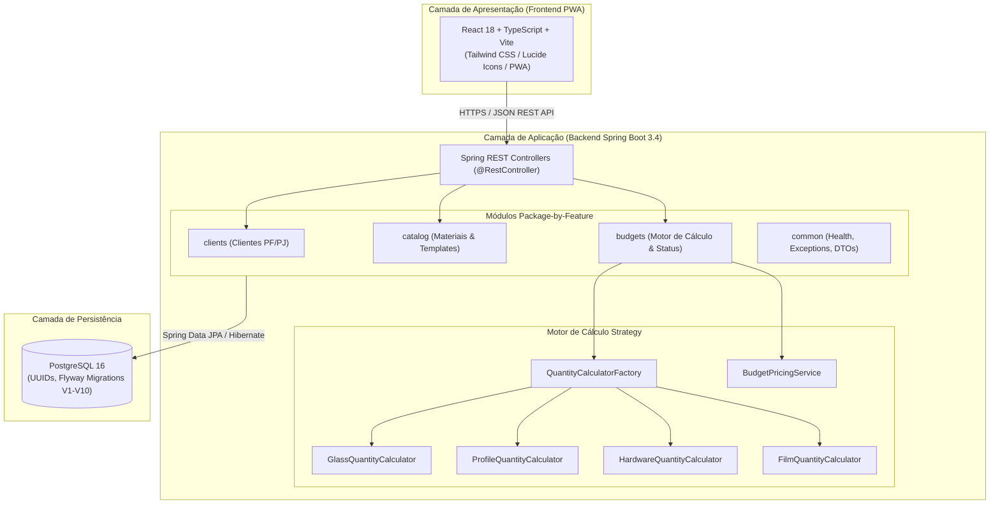
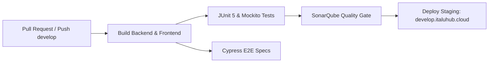

# ARQ — Documento de Arquitetura

| Campo | Valor |
|---|---|
| **Projeto** | AlumiGest — Sistema de Gestão para Vidraçaria e Esquadrias |
| **Sigla** | ALG |
| **Versão** | 2.0 (Atualizado com UUIDs, Motor Strategy de Cálculo, React/Vite e Pacotes IFPB) |
| **Data** | 31/08/2026 |

---

## Revisões

| Data | Versão | Descrição | Autor |
|---|---|---|---|
| 05/08/2026 | 1.0 | Versão inicial do Documento de Arquitetura | Ítalo Jefferson / Equipe AlumiGest |
| 31/08/2026 | 2.0 | Atualização para padrão `br.edu.ifpb.alumigest`, UUIDs nativos, Factory Strategy de cálculo de orçamentos, React 18 + Vite e Flyway V10 | Equipe AlumiGest (Scrum Master: Italo Santos) |

---

## 1. Visão Geral da Arquitetura

O AlumiGest utiliza uma arquitetura **monolítica modular** com separação desacoplada entre backend (API REST) e frontend (PWA SPA), organizados em um monorepo.

### 1.1 Diagrama de Alto Nível



---

### 1.2 Decisões Arquiteturais (ADRs)

| # | Decisão | Justificativa |
|---|---|---|
| **ADR-01** | **Monolítico Modular** | Adequado ao time e ao prazo acadêmico; elimina overhead de rede e infraestrutura de microserviços. |
| **ADR-02** | **Package-by-Feature** | Alta coesão interna e baixo acoplamento entre os domínios (`budgets`, `catalog`, `clients`, `common`). |
| **ADR-03** | **Chaves Primárias UUIDv4** | Evita enumeração sequencial exposta, permite geração distribuída e desacopla IDs de concorrência. |
| **ADR-04** | **Padrão Strategy + Factory para Cálculos** | Desacopla as fórmulas físicas de corte (vidro $m^2$, perfil linear $4W+6H$, ferragens e películas) das entidades de persistência. |
| **ADR-05** | **PWA com React 18 e Vite** | Alta performance de compilação, responsividade mobile para fábrica e suporte a instalação offline/PWA. |
| **ADR-06** | **Flyway Database Migrations** | Evolução estritamente controlada e auditável do schema relacional do PostgreSQL. |

---

## 2. Arquitetura do Backend (Java 21 + Spring Boot 3.4)

### 2.1 Estrutura de Pacotes (`br.edu.ifpb.alumigest`)

```
backend/src/main/java/br/edu/ifpb/alumigest/
├── AlumiGestApplication.java
│
├── budgets/                          # Módulo de Orçamentos Comerciais
│   ├── calculator/                   # Motor de Cálculo (Strategy)
│   │   ├── QuantityCalculatorStrategy.java
│   │   ├── QuantityCalculatorFactory.java
│   │   ├── GlassQuantityCalculator.java
│   │   ├── ProfileQuantityCalculator.java
│   │   ├── HardwareQuantityCalculator.java
│   │   └── FilmQuantityCalculator.java
│   ├── controller/
│   │   └── BudgetController.java     # Endpoints /api/v1/budgets e /api/orcamentos
│   ├── domain/
│   │   ├── Budget.java
│   │   ├── BudgetItem.java
│   │   ├── BudgetItemOption.java
│   │   └── BudgetStatus.java
│   ├── dto/
│   │   ├── BudgetRequestDTO.java
│   │   ├── BudgetResponseDTO.java
│   │   ├── BudgetItemRequestDTO.java
│   │   ├── BudgetItemResponseDTO.java
│   │   └── ...
│   ├── mapper/
│   │   └── BudgetMapper.java
│   ├── repository/
│   │   └── BudgetRepository.java
│   └── service/
│       ├── BudgetService.java
│       └── BudgetPricingService.java
│
├── catalog/                          # Módulo de Catálogo e Templates
│   ├── controller/
│   │   ├── AluminumProfileController.java
│   │   ├── GlassController.java
│   │   ├── HardwareController.java
│   │   ├── FilmController.java
│   │   ├── ProductController.java
│   │   └── ProductCategoryController.java
│   ├── domain/
│   │   ├── Material.java
│   │   ├── MaterialGroup.java
│   │   ├── Product.java
│   │   ├── ProductCategory.java
│   │   └── TemplateType.java
│   ├── dto/
│   ├── mapper/
│   ├── repository/
│   └── service/
│
├── clients/                          # Módulo de Clientes
│   ├── controller/
│   │   └── ClientController.java     # Endpoints /api/v1/clients e /api/clientes
│   ├── domain/
│   │   └── Client.java
│   ├── dto/
│   ├── mapper/
│   ├── repository/
│   └── service/
│
└── common/                           # Utilitários Compartilhados
    ├── config/
    │   ├── CorsConfig.java
    │   └── OpenApiConfig.java
    ├── controller/
    │   └── HealthController.java
    ├── dto/
    │   ├── PageResponse.java
    │   └── ErrorResponse.java
    └── exception/
        ├── GlobalExceptionHandler.java
        ├── BusinessException.java
        └── ResourceNotFoundException.java
```

---

### 2.2 Camadas Internas de cada Feature

```
┌────────────────────────────────────────────────────────┐
│               Controller (REST Endpoint)               │ ← Validação JSR-380 / OpenAPI Swagger
├────────────────────────────────────────────────────────┤
│                 Service (Regras de Negócio)            │ ← @Transactional, State Machine
├────────────────────────────────────────────────────────┤
│           Calculator Engine (Strategy Factory)         │ ← Fórmulas de Corte, Metragem e Pesos
├────────────────────────────────────────────────────────┤
│               Repository (Spring Data JPA)             │ ← JpaRepository<Entity, UUID>, JPQL
├────────────────────────────────────────────────────────┤
│                 Domain (Entidades JPA)                 │ ← @Entity, @Table(name = "tb_*")
└────────────────────────────────────────────────────────┘
```

---

## 3. Arquitetura do Frontend (React 18 + TypeScript + Vite)

### 3.1 Estrutura de Diretórios (`frontend/src`)

```
frontend/src/
├── components/
│   ├── catalog/              # Modais de Vidro, Perfil, Ferragem e Película
│   ├── layout/               # Sidebar, Header, Navegação em Abas
│   └── ui/                   # Button, Input, Modal, Badge, Toast
├── pages/
│   ├── catalog/              # Catálogo com 4 abas reativas
│   ├── clients/              # Listagem e cadastro de clientes
│   ├── budgets/              # Wizard de Orçamentos e Listagem
│   └── dashboard/            # Visão geral de vendas e métricas
├── services/                 # Clientes HTTP Axios tipados
│   ├── api.ts
│   ├── catalogService.ts
│   ├── clientService.ts
│   └── budgetService.ts
├── hooks/                    # Custom React Hooks
├── types/                    # Interfaces TypeScript (DTOs espelhados)
└── App.tsx
```

---

## 4. Arquitetura do Banco de Dados (PostgreSQL 16)

### 4.1 Padrões de Modelagem
* **Chaves Primárias:** `UUID` gerado nativamente via `gen_random_uuid()`.
* **Prefixo de Tabelas:** `tb_*` em snake_case plural (`tb_customers`, `tb_materials`, `tb_products`, `tb_budgets`, `tb_budget_items`, `tb_budget_item_options`).
* **Precisão Numérica:** `DECIMAL(12, 2)` para valores monetários e `DECIMAL(10, 4)` para quantidades e metragens.
* **Auditoria:** Colunas `created_at` e `updated_at` com timestamp UTC.

### 4.2 Histórico de Migrations Flyway

```
V1__create_material_groups_and_materials.sql
V2__create_products_and_product_items.sql
V3__add_material_unique_constraints.sql
V4__create_product_categories.sql
V5__seed_product_categories.sql
V6__add_dimensions_and_unique_index.sql
V7__create_customers_table.sql
V8__add_template_and_category_requirements_to_products.sql
V9__create_budgets_tables.sql
V10__remove_labor_cost_from_products.sql
```

---

## 5. Infraestrutura e CI/CD

### 5.1 Pipeline GitHub Actions



---

*Documento de Arquitetura homologado com a base de código — Versão 2.0 — 31/08/2026*
