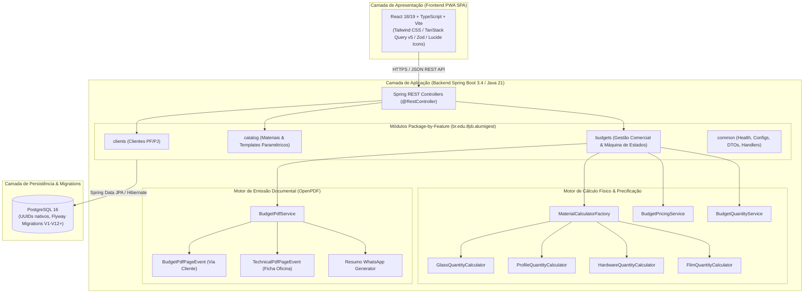

# 🏛️ ARQ — Documento de Arquitetura de Software (AlumiGest)

| Metadado | Descrição |
|---|---|
| **Projeto** | AlumiGest — Sistema de Gestão para Vidraçaria e Esquadrias |
| **Sigla** | ALG |
| **Versão** | 3.0 (Homologado com Motor de PDF, OpenPDF, TanStack Query, Zod e Quality Gate SonarQube) |
| **Data** | 24/09/2026 |
| **Governança** | Docs-as-Code — Oficial de Governança (`alumigest-doc-governor`) |

---

## Histórico de Revisões

| Data | Versão | Descrição | Autor |
|---|---|---|---|
| 05/08/2026 | 1.0 | Versão inicial do Documento de Arquitetura | Ítalo Jefferson / Equipe AlumiGest |
| 31/08/2026 | 2.0 | Atualização para padrão `br.edu.ifpb.alumigest`, UUIDs nativos, Factory Strategy de cálculo, React 18 + Vite e Flyway V10 | Equipe AlumiGest (Scrum Master: Italo Santos) |
| 24/09/2026 | 3.0 | Integração do motor de emissão de PDF (OpenPDF / iText), segregação de vias técnica/comercial, TanStack Query v5 + Zod no frontend e Quality Gate SonarQube | Equipe AlumiGest (Tech Lead: Ítalo Jefferson) |

---

## 1. Visão Geral da Arquitetura

O AlumiGest adota o estilo arquitetural **Monolítico Modular Desacoplado**, separando claramente a camada de serviços e regras de negócio no Backend (Spring Boot REST API) da camada de apresentação no Frontend (React PWA SPA), unificados em um monorepo para máxima rastreabilidade Docs-as-Code.

### 1.1 Diagrama de Alto Nível (Mermaid)



---

### 1.2 Decisões Arquiteturais Registradas (ADRs)

| # | Decisão | Justificativa |
|---|---|---|
| **ADR-01** | **Monolítico Modular** | Elimina complexidade operacional, latência de rede e orquestração de microsserviços, ideal para o escopo e equipe. |
| **ADR-02** | **Package-by-Feature** | Alta coesão interna e baixo acoplamento entre os domínios (`budgets`, `catalog`, `clients`, `common`). |
| **ADR-03** | **Identificadores UUIDv4 Nativos** | Previne ataques de enumeração sequencial (IDOR), viabiliza criação concorrente de registros e desacopla integridade relacional. |
| **ADR-04** | **Padrão Strategy + Factory para Cálculos Físicos** | Isola as fórmulas paramétricas de perfis ($2W+2H$, $2W+4H$, $2W+6H$, $2W+8H$), vidros e ferragens das entidades de persistência. |
| **ADR-05** | **PWA com React, Vite e TanStack Query** | Renderização ágil no navegador, gerenciamento declarativo de cache de servidor, responsividade para oficina e capacidade PWA. |
| **ADR-06** | **Flyway Database Migrations** | Rastreabilidade absoluta e evolução incremental do schema relacional do PostgreSQL através de versionamento em código. |
| **ADR-07** | **Segregação Estrita de Vias de PDF (OpenPDF)** | Separação completa da Ficha Técnica de Oficina (sigilo comercial absoluto, sem cifras financeiras) da Proposta Comercial do Cliente. |
| **ADR-08** | **Validação Bidirecional JSR-380 e Zod** | Integridade dos dados garantida tanto no frontend (Zod schemas no submit) quanto no backend (Bean Validation JSR-380 nos Records). |

---

## 2. Arquitetura do Backend (Java 21 + Spring Boot 3.4)

### 2.1 Estrutura de Pacotes (`br.edu.ifpb.alumigest`)

```
backend/src/main/java/br/edu/ifpb/alumigest/
├── AlumiGestApplication.java
│
├── budgets/                          # Módulo de Orçamentos e Vendas
│   ├── calculator/                   # Motor de Cálculo Paramétrico (Strategy)
│   │   ├── MaterialCalculatorFactory.java
│   │   ├── MaterialQuantityCalculator.java
│   │   ├── GlassQuantityCalculator.java
│   │   ├── ProfileQuantityCalculator.java
│   │   ├── HardwareQuantityCalculator.java
│   │   ├── FilmQuantityCalculator.java
│   │   ├── CategoryType.java
│   │   └── TemplateType.java
│   ├── config/
│   │   └── CompanyProperties.java    # Configurações institucionais da Alumiportas
│   ├── controller/
│   │   └── BudgetController.java     # Endpoints REST de orçamentos, descontos e PDFs
│   ├── domain/
│   │   ├── Budget.java
│   │   ├── BudgetItem.java
│   │   ├── BudgetItemOption.java
│   │   ├── BudgetStatus.java         # DRAFT, SENT, APPROVED, REJECTED, CANCELLED, EXPIRED
│   │   ├── DiscountType.java         # PERCENTUAL, VALOR_FIXO
│   │   └── PaymentCondition.java     # A_VISTA_PIX, ENTRADA_50_SALDO_ENTREGA, etc.
│   ├── dto/
│   │   ├── BudgetCreateRequest.java
│   │   ├── BudgetResponseDTO.java
│   │   ├── BudgetSummaryResponseDTO.java
│   │   ├── BudgetItemRequestDTO.java
│   │   ├── BudgetItemResponseDTO.java
│   │   ├── DiscountRequest.java
│   │   ├── StatusChangeRequest.java
│   │   └── BudgetPdfDTO.java
│   ├── mapper/
│   │   └── BudgetMapper.java         # Mapeamento MapStruct bidirecional
│   ├── repository/
│   │   ├── BudgetRepository.java
│   │   ├── BudgetItemRepository.java
│   │   └── BudgetItemOptionRepository.java
│   └── service/
│       ├── BudgetService.java        # Regras de negócio e máquina de estados
│       ├── BudgetPricingService.java # Consolidação de subtotal, descontos e totais
│       ├── BudgetQuantityService.java# Dimensionamento físico e alerta de subdimensionamento
│       ├── BudgetCodeGenerator.java  # Geração sequencial de códigos humanizados
│       ├── BudgetPdfService.java     # Geração de PDFs (OpenPDF) e WhatsApp
│       └── pdf/
│           ├── BudgetPdfPageEvent.java    # Rodapé institucional comercial (Página X de Y)
│           └── TechnicalPdfPageEvent.java # Rodapé institucional técnico para produção
│
├── catalog/                          # Módulo de Catálogo e Insumos
│   ├── controller/
│   │   ├── AluminumProfileController.java
│   │   ├── GlassController.java
│   │   ├── HardwareController.java
│   │   ├── FilmController.java
│   │   ├── ProductController.java
│   │   └── ProductCategoryController.java
│   ├── domain/
│   │   ├── Material.java             # Entidade polimórfica base
│   │   ├── AluminumProfile.java
│   │   ├── Glass.java
│   │   ├── Hardware.java
│   │   ├── Film.java
│   │   ├── Product.java              # Template/Esquadria composta
│   │   └── ProductCategory.java
│   ├── dto/
│   ├── mapper/
│   ├── repository/
│   └── service/
│
├── clients/                          # Módulo de Clientes (PF/PJ)
│   ├── controller/
│   │   └── CustomerController.java
│   ├── domain/
│   │   └── Customer.java
│   ├── dto/
│   ├── mapper/
│   ├── repository/
│   └── service/
│
└── common/                           # Infraestrutura Compartilhada
    ├── config/
    │   ├── CorsConfig.java           # Políticas de CORS
    │   └── OpenApiConfig.java        # Swagger / OpenAPI 3.0
    ├── controller/
    │   └── HealthController.java
    ├── dto/
    │   ├── ApiResponse.java
    │   ├── PageResponse.java
    │   └── ErrorResponse.java
    └── exception/
        ├── GlobalExceptionHandler.java
        ├── BusinessException.java
        ├── BudgetImmutableException.java
        ├── InvalidBudgetStatusTransitionException.java
        └── ResourceNotFoundException.java
```

---

### 2.2 Camadas Internas e Fluxo de Execução

```
┌────────────────────────────────────────────────────────┐
│               Controller (REST Endpoint)               │ ← Validação JSR-380 / OpenAPI Swagger
├────────────────────────────────────────────────────────┤
│                 Service (Regras de Negócio)            │ ← @Transactional, State Machine
├────────────────────────────────────────────────────────┤
│           Calculator Engine (Strategy Factory)         │ ← Fórmulas de Corte, Metragem e Pesos
├────────────────────────────────────────────────────────┤
│             PDF Engine (OpenPDF Page Events)           │ ← Segregação de Vias Comercial / Técnica
├────────────────────────────────────────────────────────┤
│               Repository (Spring Data JPA)             │ ← JpaRepository<Entity, UUID>, JPQL
├────────────────────────────────────────────────────────┤
│                 Domain (Entidades JPA)                 │ ← @Entity, @Table(name = "tb_*")
└────────────────────────────────────────────────────────┘
```

---

## 3. Arquitetura do Frontend (React 18/19 + TypeScript + Vite)

### 3.1 Estrutura de Diretórios por Feature (`frontend/src`)

```
frontend/src/
├── components/                       # Componentes Compartilhados Globais
│   ├── layout/                       # Sidebar, Topbar, MainLayout
│   └── ui/                           # Button, Input, Modal, Badge, Card, Toast
├── features/                         # Módulos Funcionais Coesos
│   ├── budgets/                      # Feature de Orçamentos
│   │   ├── components/               # BudgetEditor, BudgetFinancialSummary, CustomerSelector, etc.
│   │   ├── hooks/                    # useBudgets, useApplyDiscount, useDownloadPdf
│   │   ├── schemas/                  # budgetSchema.ts, discountSchema.ts (Zod)
│   │   ├── services/                 # budgetsApi.ts (Axios)
│   │   └── types/                    # Tipos espelhados dos DTOs Java
│   ├── catalog/                      # Feature de Catálogo
│   │   ├── components/               # Modais de Cadastro de Perfis, Vidros, etc.
│   │   └── services/                 # catalogApi.ts
│   └── clients/                      # Feature de Clientes
│       ├── components/               # CustomerForm, CustomerQuickCreateModal
│       └── services/                 # clientsApi.ts
├── pages/                            # Páginas de Rota
│   ├── BudgetDetailPage.tsx
│   ├── BudgetCreatePage.tsx
│   ├── BudgetsListPage.tsx
│   ├── CatalogPage.tsx
│   └── CustomersPage.tsx
├── routes/                           # Configuração do React Router
└── services/                         # Instância base do Axios (api.ts com interceptors)
```

---

## 4. Arquitetura do Banco de Dados (PostgreSQL 16)

### 4.1 Padrões de Modelagem
* **Chaves Primárias:** `UUID` gerado nativamente via `gen_random_uuid()`.
* **Convenção de Nomenclatura:** Tabelas com prefixo `tb_*` em snake_case plural (`tb_customers`, `tb_materials`, `tb_products`, `tb_budgets`, `tb_budget_items`, `tb_budget_item_options`).
* **Tipagem Financeira e Física:** `NUMERIC(12, 2)` para valores monetários e `NUMERIC(10, 4)` para quantidades e metragens exatas.
* **Auditoria de Registros:** Colunas `created_at` e `updated_at` com timestamp UTC.

### 4.2 Histórico Consolidado de Migrations Flyway

```
V1__create_material_groups_and_materials.sql
V2__create_products_and_product_items.sql
V3__add_material_unique_constraints.sql
V4__create_product_categories.sql
V5__seed_product_categories.sql
V6__add_dimensions_and_unique_index.sql
V7__create_customers_table.sql
V8__add_template_and_category_requirements_to_products.sql
V9__create_budgets_tables.sql
V10__remove_labor_cost_from_products.sql
V11__add_budget_commercial_conditions.sql
V12__add_budget_code_sequence.sql
```

---

## 5. Infraestrutura, Qualidade e Pipeline de CI/CD

### 5.1 Pipeline GitHub Actions e SonarQube

```mermaid
graph LR
    PR[Pull Request / Push develop] --> Build[Build Backend & Frontend]
    Build --> TestBack[JUnit 5 & JaCoCo Coverage]
    Build --> TestFront[Vitest & Cypress E2E]
    TestBack --> SonarBack[SonarQube Backend Analysis]
    TestFront --> SonarFront[SonarQube Frontend Analysis]
    SonarBack --> Gate{Quality Gate Check}
    SonarFront --> Gate
    Gate -->|Aprovado (New Code >= 80%, 0 Bugs)| Deploy[Deploy Staging: Coolify]
    Gate -->|Reprovado| Block[Bloqueia Merge do PR]
```

### 5.2 Critérios do Quality Gate
1. **Cobertura em Novo Código (New Code):** Mínimo de **80%** de linhas cobertas por testes automatizados.
2. **Confiabilidade:** **Zero Bugs** novos e **Zero Vulnerabilidades** de segurança.
3. **Manutenibilidade:** Débito técnico classificado como **A** (zero code smells bloqueantes).
4. **Duplicação de Código:** Abaixo de **3%** em arquivos de produção.

---
*Documento de Arquitetura homologado pelo Oficial de Governança Técnica (`alumigest-doc-governor`) em 24/09/2026.*
