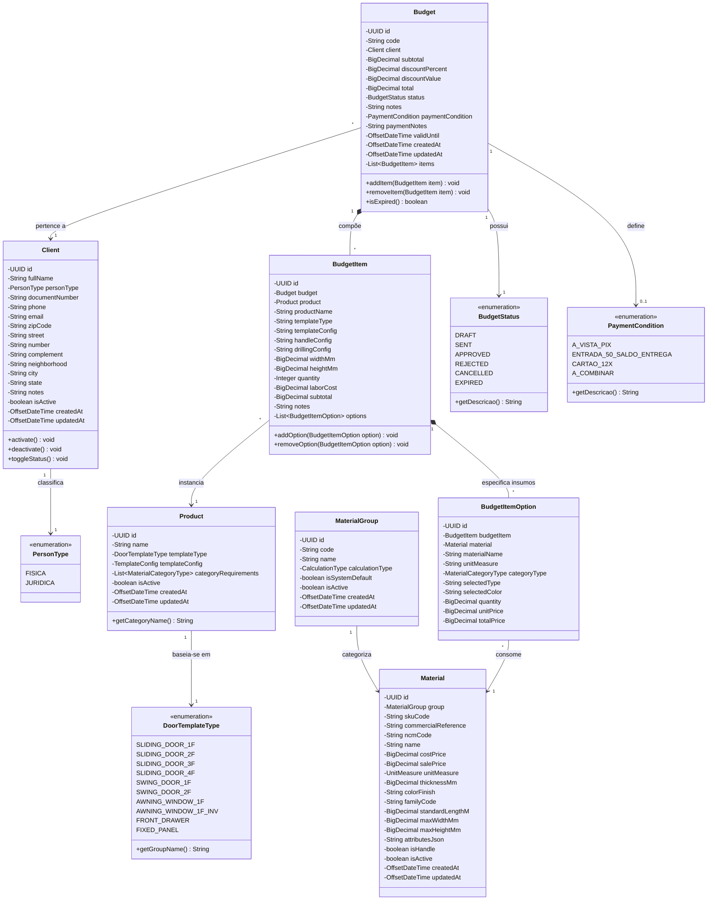
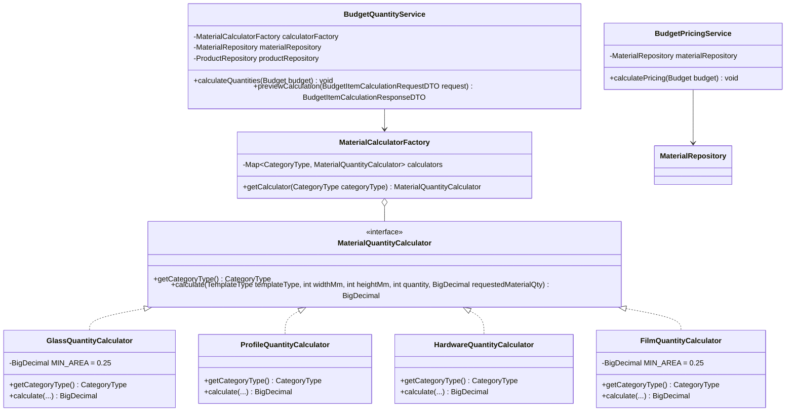
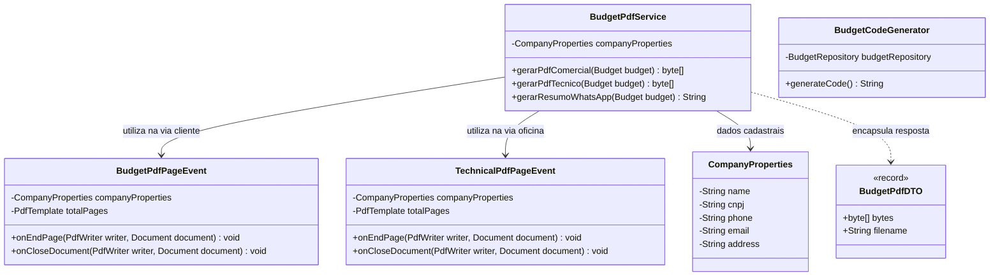
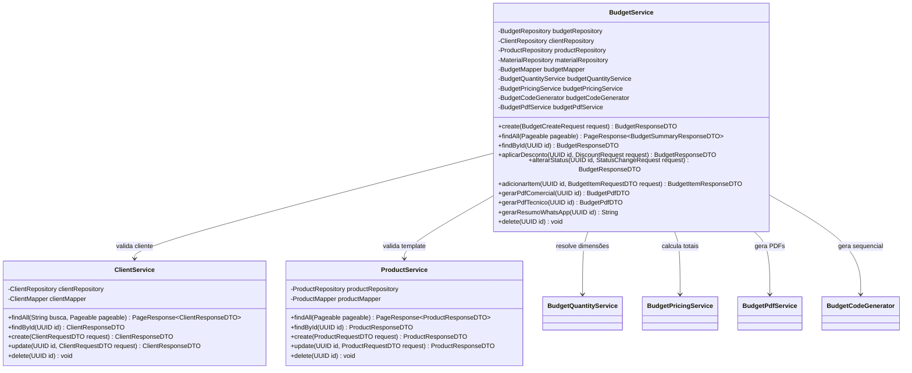
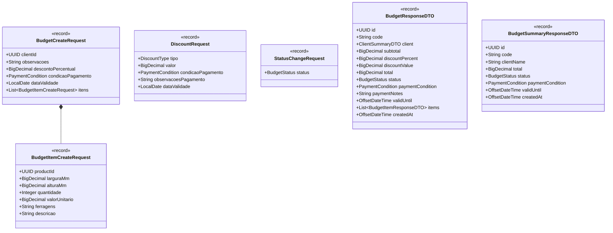

# 🏗️ DCC — Diagramas de Classes do Domínio e Engenharia (AlumiGest)

| Metadado | Descrição |
|---|---|
| **Projeto** | AlumiGest — Sistema de Gestão para Vidraçaria e Esquadrias |
| **Sigla** | ALG |
| **Versão** | 4.0 (Revisão Completa e Auditoria Estrita com o Código-Fonte de Produção) |
| **Data** | 24/09/2026 |
| **Governança** | Docs-as-Code — Oficial de Governança (`alumigest-doc-governor`) |

---

## Histórico de Revisões

| Data | Versão | Descrição | Autor |
|---|---|---|---|
| 05/08/2026 | 1.0 | Versão inicial dos diagramas conceituais | Ítalo Jefferson / Equipe AlumiGest |
| 12/08/2026 | 2.0 | Ajustes de relacionamentos na Sprint 2 | Equipe AlumiGest |
| 31/08/2026 | 3.0 | Atualização preliminar da Sprint 3 com padrões Strategy e UUIDs | Equipe AlumiGest |
| 24/09/2026 | 4.0 | Revisão minuciosa e fiel ao código: entidade `Client`, modelo unificado `Material`, esquadrias paramétricas `Product` com JSONB, novo motor de PDF (OpenPDF) e DTOs Records | Equipe AlumiGest (Tech Lead: Ítalo Jefferson) |

---

## 1. 🏛️ Modelo de Domínio Completo (Entidades JPA)

---

## 2. 🧮 Motor de Cálculo Físico e Precificação (Padrão Strategy + Factory)

---

## 3. 📄 Motor de Emissão Documental e Relatórios (OpenPDF)

---

## 4. ⚙️ Camada de Serviços da Aplicação (Services)

---

## 5. 📦 Catálogo de DTOs Records de Entrada e Saída

---
*Documento homologado pelo Oficial de Governança Técnica (`alumigest-doc-governor`) em 24/09/2026.*
