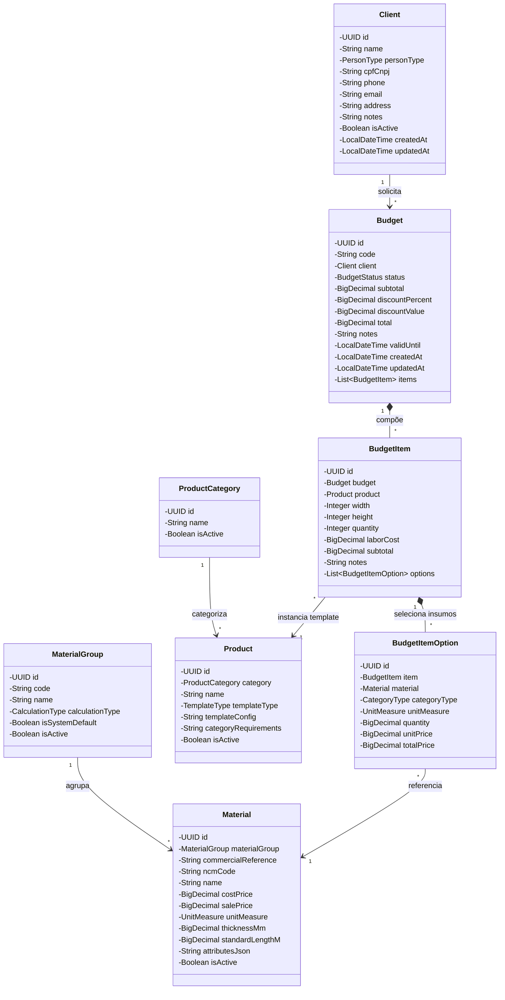
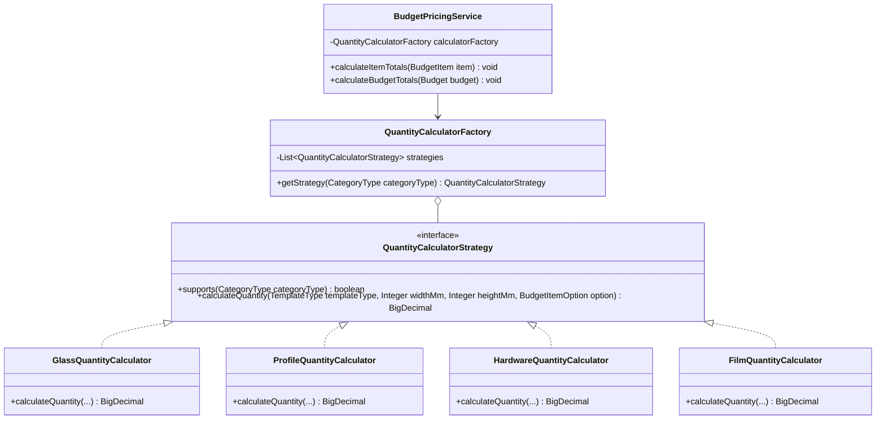
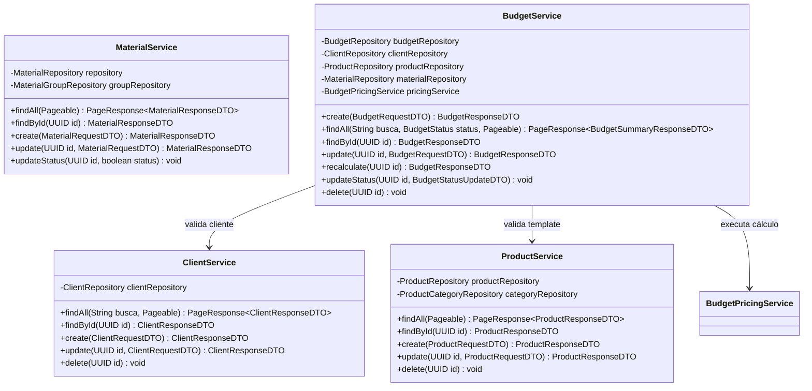
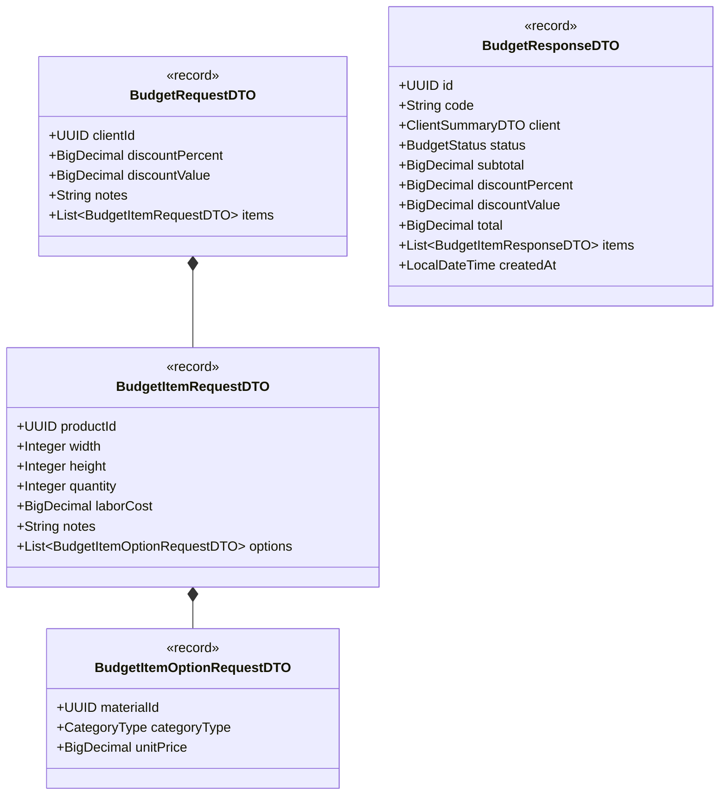

# DCC — Diagrama de Classes do Domínio
**Projeto:** AlumiGest — Sistema de Gestão para Vidraçaria e Esquadrias  
**Sigla:** ALG  
**Versão:** 3.0 (Atualizado com Domínios de Clientes, Templates Paramétricos, Orçamentos e Motor Strategy)  
**Data:** 31/08/2026  
**Autor:** Equipe de Engenharia de Software (Scrum Master: Italo Santos)  

---

## 1. 🏗️ Diagrama de Classes — Modelo de Domínio Completo

---

## 2. 🧮 Diagrama de Classes — Motor de Cálculo (Padrão Strategy + Factory)

---

## 3. ⚙️ Diagrama de Classes — Camada de Serviços (Services)

---

## 4. 📦 Diagrama de Classes — DTOs Principais

---

*Documento de Classes homologado com o código da Sprint 3 — Versão 3.0 — 31/08/2026*
