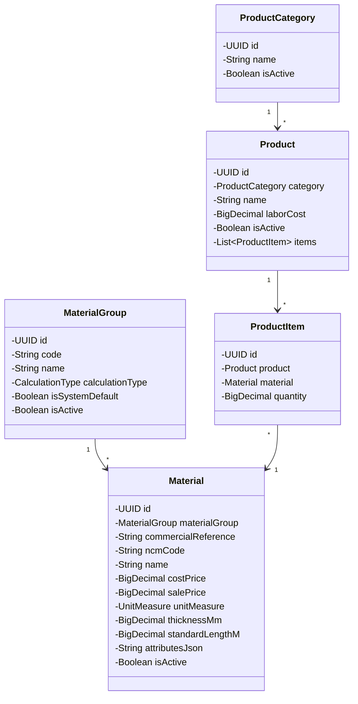
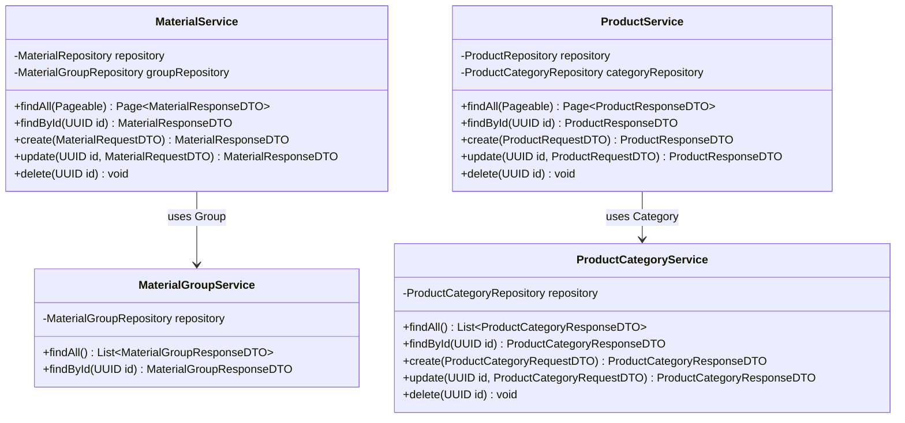
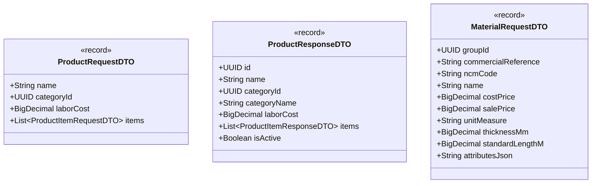

# DCC — Diagrama de Classes do Domínio

| Campo | Valor |
|---|---|
| **Projeto** | AlumiGest |
| **Versão** | 2.0 |
| **Data** | 12/08/2026 |

---

## 1. Diagrama de Classes — Domínio Principal (Catálogo)

---

## 2. Diagrama de Classes — Services

---

## 3. Diagrama de Classes — Principais DTOs

---

*Documento atualizado conforme decisões arquiteturais e refatoração do Catálogo (Agosto/2026)*
