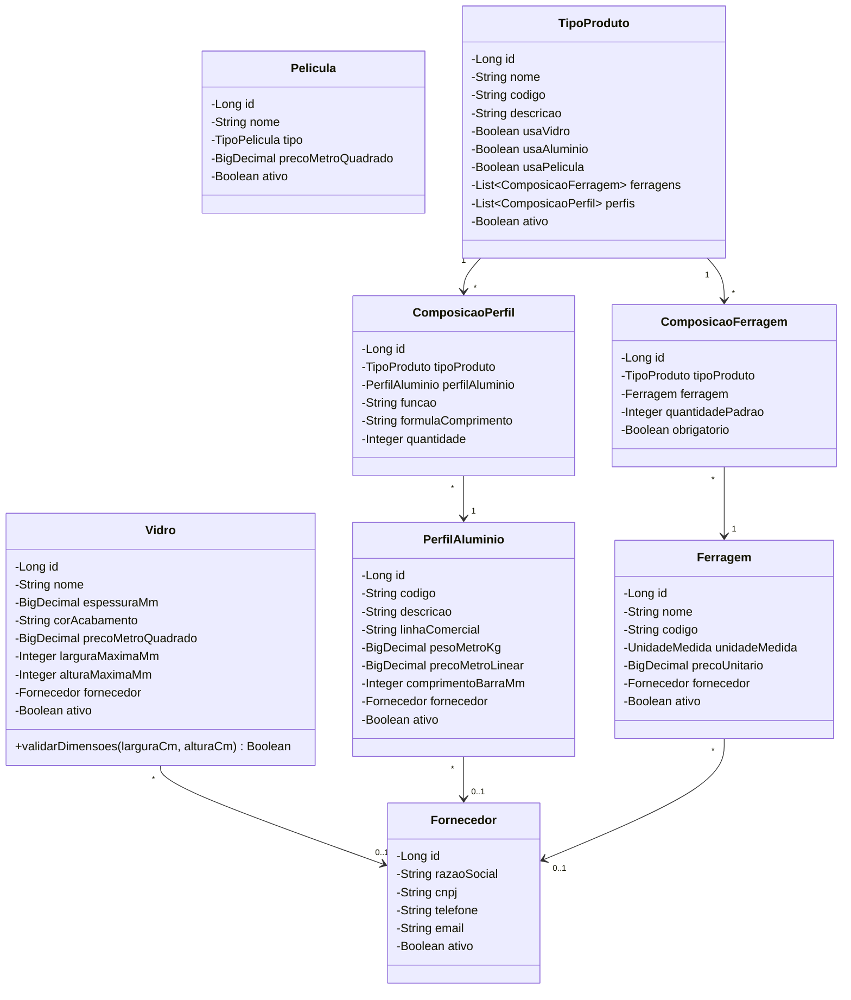
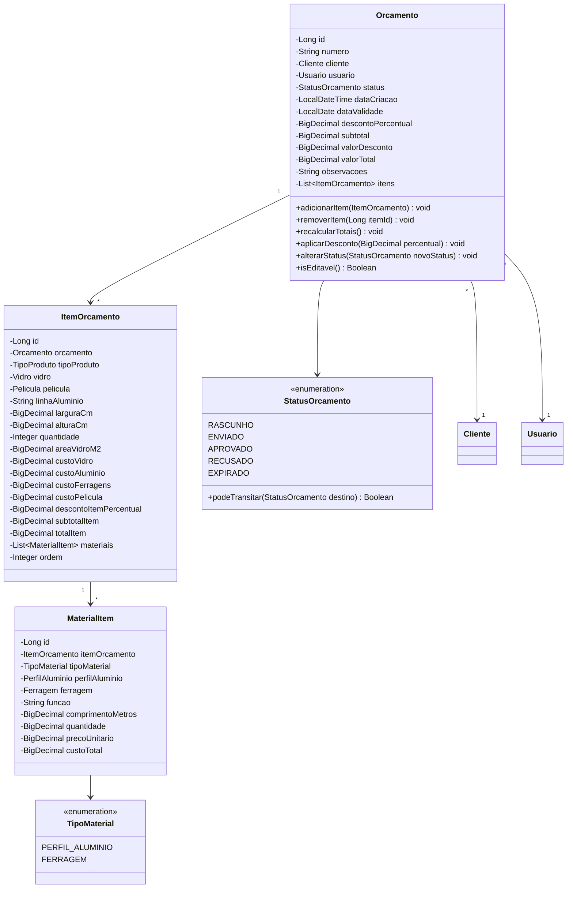
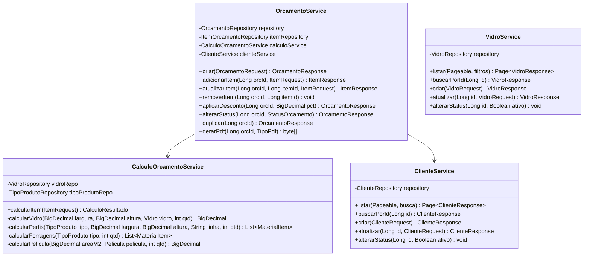
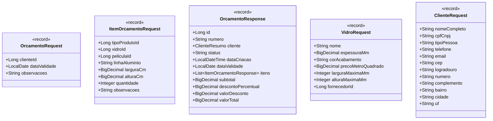

# DCC — Diagrama de Classes do Domínio

| Campo | Valor |
|---|---|
| **Projeto** | AlumiGest |
| **Versão** | 1.0 |
| **Data** | 05/08/2026 |

---

## 1. Diagrama de Classes — Módulo de Materiais

---

## 2. Diagrama de Classes — Módulo de Orçamentos

---

## 3. Diagrama de Classes — Services

---

## 4. Diagrama de Classes — DTOs

---

## 5. Enums do Domínio

| Enum | Valores | Uso |
|---|---|---|
| `StatusOrcamento` | RASCUNHO, ENVIADO, APROVADO, RECUSADO, EXPIRADO | Status do orçamento |
| `TipoMaterial` | PERFIL_ALUMINIO, FERRAGEM | Tipo de material por item |
| `UnidadeMedida` | UNIDADE, PAR, JOGO, METRO | Unidade de medida das ferragens |
| `TipoPelicula` | JATEADO, FUME, INSULFILM, ESPELHADO, DECORATIVO | Tipo de película |
| `TipoPessoa` | PF, PJ | Pessoa física ou jurídica |
| `Perfil` (Role) | ADMINISTRADOR, VENDEDOR, PRODUCAO | Perfil de acesso do usuário |

---

*Documento elaborado pela Ítalo Jefferson / Equipe AlumiGest — IFPB CST em ADS — Agosto/2026*
