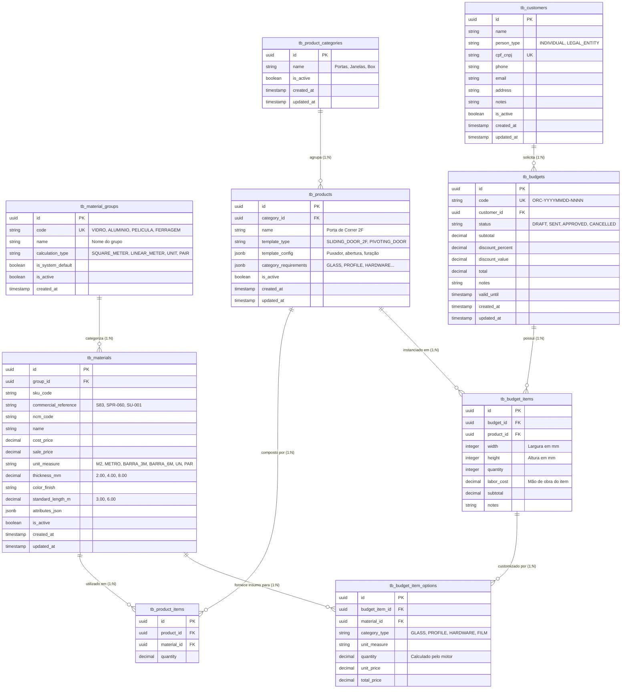

# 📐 Documento de Arquitetura e Modelagem de Dados (DER)
## Módulo: Catálogo de Materiais, Templates, Clientes e Orçamentos
**Projeto:** AlumiGest (Gestão Operacional e Orçamentária para Esquadrias e Vidraçaria)  
**Versão:** 3.0.0 (Consolidado com Migrações Flyway V1 a V10 da Sprint 3)  
**Data:** 31 de Agosto de 2026  
**Autor:** Equipe de Engenharia de Software (Scrum Master: Italo Jefferson Lima dos Santos)  

---

## 1. 🎯 Visão Geral e Objetivos Arquiteturais

O modelo de dados do AlumiGest foi projetado com base em princípios de alta coesão, extensibilidade (*Type-Object Pattern*) e conformidade com a engenharia de fabricação da **Alumiportas**.

### 🌟 Princípios de Design e Modelagem
1. **Grupos Fundamentais de Insumos (Sprint 2):**
   * **Vidros:** Medidos por área ($m^2$), com espessuras de **2mm a 10mm** e regra de faturamento mínimo de $0,25 m^2$.
   * **Perfis de Alumínio e Puxadores:** Medidos por metro linear ($m$) com barras padrão de **3.00m** e **6.00m**, referências comerciais (`SU-001`, `S83`, `SPR-060`) e NCM.
   * **Películas:** Medidas por área de aplicação ($m^2$) sobre vidros.
   * **Ferragens e Acessórios:** Medidos por **Unidade (`UN`)**, **Par (`PAR`)** ou **Metro (`METRO`)**.
2. **Templates Paramétricos de Esquadrias (Sprint 3 / Migration V8):**
   * A entidade `tb_products` atua como modelo/receita (`TemplateType`), armazenando esquemas vetoriais e regras de abertura em `template_config` (JSONB) e categorias obrigatórias em `category_requirements` (JSONB).
3. **Desacoplamento de Mão de Obra (Migration V10):**
   * A coluna `labor_cost` foi removida de `tb_products` e transferida para `tb_budget_items`, permitindo precificação de instalação dinâmica por orçamento.
4. **Clientes e Orçamentos (Migrations V7 e V9):**
   * Modelagem de clientes PF/PJ (`tb_customers`) e ciclo de vida de propostas comerciais (`tb_budgets`, `tb_budget_items`, `tb_budget_item_options`).

---

## 2. 📊 Diagrama Entidade-Relacionamento (DER Consolidado)



---

## 3. 📖 Dicionário de Dados

### 3.1 `tb_material_groups` (Grupos de Materiais)
| Campo | Tipo | Restrições | Descrição |
| :--- | :--- | :--- | :--- |
| `id` | `UUID` | `PK, DEFAULT uuid_generate_v4()` | Identificador universal. |
| `code` | `VARCHAR(50)` | `NOT NULL, UNIQUE` | Código do grupo (`VIDRO`, `ALUMINIO`, `PELICULA`, `FERRAGEM`). |
| `name` | `VARCHAR(100)` | `NOT NULL` | Nome exibido (*"Perfis de Alumínio"*). |
| `calculation_type` | `VARCHAR(30)` | `NOT NULL` | Regra física (`SQUARE_METER`, `LINEAR_METER`, `UNIT`, `PAIR`). |
| `is_system_default`| `BOOLEAN` | `DEFAULT FALSE` | `TRUE` para os 4 grupos nativos da Alumiportas. |
| `is_active` | `BOOLEAN` | `DEFAULT TRUE` | Soft delete. |
| `created_at` | `TIMESTAMP WITH TIME ZONE` | `DEFAULT NOW()` | Auditoria. |

---

### 3.2 `tb_materials` (Insumos do Catálogo)
| Campo | Tipo | Restrições | Descrição |
| :--- | :--- | :--- | :--- |
| `id` | `UUID` | `PK, DEFAULT uuid_generate_v4()` | Identificador universal. |
| `group_id` | `UUID` | `FK -> tb_material_groups(id)` | Grupo associado. |
| `sku_code` | `VARCHAR(50)` | `NULL` | Código interno SKU. |
| `commercial_reference`| `VARCHAR(100)`| `NULL` | Código de Fábrica: `SU-001`, `S83`, `SPR-060`. |
| `ncm_code` | `VARCHAR(10)` | `NULL` | Classificação fiscal NCM. |
| `name` | `VARCHAR(150)`| `NOT NULL` | Descrição completa do insumo. |
| `cost_price` | `DECIMAL(12,2)`| `NOT NULL, DEFAULT 0.00` | Preço de custo base. |
| `sale_price` | `DECIMAL(12,2)`| `NOT NULL, DEFAULT 0.00` | Preço de venda praticado. |
| `unit_measure` | `VARCHAR(20)` | `NOT NULL, DEFAULT 'UN'` | `M2`, `METRO`, `BARRA_3M`, `BARRA_6M`, `UN`, `PAR`. |
| `thickness_mm` | `DECIMAL(6,2)` | `NULL` | Espessura física em mm (**2.00, 4.00, 8.00**). |
| `color_finish` | `VARCHAR(50)` | `NULL` | Acabamento (Incolor, Bronze, Branco Ral, Preto). |
| `standard_length_m`| `DECIMAL(6,2)` | `NULL` | Comprimento da barra (**3.00m** ou **6.00m**). |
| `attributes_json` | `JSONB` | `NULL` | Extensões dinâmicas. |
| `is_active` | `BOOLEAN` | `DEFAULT TRUE` | Soft delete. |

---

### 3.3 `tb_products` (Templates de Esquadrias)
| Campo | Tipo | Restrições | Descrição |
| :--- | :--- | :--- | :--- |
| `id` | `UUID` | `PK` | Identificador universal. |
| `category_id` | `UUID` | `FK -> tb_product_categories(id)` | Categoria associada. |
| `name` | `VARCHAR(150)` | `NOT NULL` | Nome do template (*"Porta de Correr 2 Folhas"*). |
| `template_type` | `VARCHAR(50)` | `NULL` | Enum de tipologia (`SLIDING_DOOR_2F`, `PIVOTING_DOOR`, etc.). |
| `template_config` | `JSONB` | `NULL` | Puxador, furação e esquema de abertura. |
| `category_requirements` | `JSONB` | `NULL` | Insumos requeridos (`["GLASS", "PROFILE", "HARDWARE"]`). |
| `is_active` | `BOOLEAN` | `DEFAULT TRUE` | Soft delete. |

---

### 3.4 `tb_customers` (Clientes)
| Campo | Tipo | Restrições | Descrição |
| :--- | :--- | :--- | :--- |
| `id` | `UUID` | `PK` | Identificador universal. |
| `name` | `VARCHAR(150)` | `NOT NULL` | Nome completo / Razão Social. |
| `person_type` | `VARCHAR(20)` | `NOT NULL` | `INDIVIDUAL` (PF) ou `LEGAL_ENTITY` (PJ). |
| `cpf_cnpj` | `VARCHAR(20)` | `NULL, UNIQUE` | Documento único validado. |
| `phone` | `VARCHAR(20)` | `NULL` | Telefone / WhatsApp de contato. |
| `email` | `VARCHAR(100)` | `NULL` | E-mail de envio da proposta comercial. |
| `address` | `TEXT` | `NULL` | Endereço completo da obra / entrega. |
| `is_active` | `BOOLEAN` | `DEFAULT TRUE` | Soft delete. |

---

### 3.5 `tb_budgets` (Orçamentos)
| Campo | Tipo | Restrições | Descrição |
| :--- | :--- | :--- | :--- |
| `id` | `UUID` | `PK` | Identificador universal. |
| `code` | `VARCHAR(30)` | `NOT NULL, UNIQUE` | Código sequencial único (`ORC-YYYYMMDD-NNNN`). |
| `customer_id` | `UUID` | `NOT NULL, FK -> tb_customers(id)` | Cliente associado. |
| `status` | `VARCHAR(20)` | `NOT NULL` | `DRAFT`, `SENT`, `APPROVED`, `CANCELLED`. |
| `subtotal` | `DECIMAL(12,2)`| `NOT NULL, DEFAULT 0.00` | Soma dos subtotais dos itens. |
| `discount_percent`| `DECIMAL(5,2)` | `DEFAULT 0.00` | Desconto em percentual (0 a 100%). |
| `discount_value`| `DECIMAL(12,2)`| `DEFAULT 0.00` | Desconto em valor fixo (R$). |
| `total` | `DECIMAL(12,2)`| `NOT NULL, DEFAULT 0.00` | Valor líquido final faturado. |
| `valid_until` | `TIMESTAMP` | `NULL` | Data de validade da proposta. |

---

### 3.6 `tb_budget_items` e `tb_budget_item_options`
* **`tb_budget_items`:** Contém as dimensões nominais em milímetros (`width`, `height`), quantidade de peças, mão de obra específica (`labor_cost`) e subtotal calculado.
* **`tb_budget_item_options`:** Registra cada insumo selecionado (vidro, perfil, roldana, película), quantidade computada pela Strategy e preço unitário/total congelados.

---

## 4. 🗄️ Script DDL Oficial Consolidado (Migrations V1 a V10)

```sql
-- ============================================================================
-- AlumiGest DDL Schema (PostgreSQL 16 & Flyway V1 a V10)
-- ============================================================================

CREATE EXTENSION IF NOT EXISTS "uuid-ossp";

-- 1. Grupos de Materiais
CREATE TABLE tb_material_groups (
    id UUID PRIMARY KEY DEFAULT uuid_generate_v4(),
    code VARCHAR(50) NOT NULL UNIQUE,
    name VARCHAR(100) NOT NULL,
    calculation_type VARCHAR(30) NOT NULL,
    description TEXT,
    is_system_default BOOLEAN NOT NULL DEFAULT FALSE,
    is_active BOOLEAN NOT NULL DEFAULT TRUE,
    created_at TIMESTAMP WITH TIME ZONE DEFAULT CURRENT_TIMESTAMP
);

-- 2. Materiais
CREATE TABLE tb_materials (
    id UUID PRIMARY KEY DEFAULT uuid_generate_v4(),
    group_id UUID NOT NULL,
    sku_code VARCHAR(50),
    commercial_reference VARCHAR(100),
    ncm_code VARCHAR(10),
    name VARCHAR(150) NOT NULL,
    cost_price DECIMAL(12, 2) NOT NULL DEFAULT 0.00,
    sale_price DECIMAL(12, 2) NOT NULL DEFAULT 0.00,
    unit_measure VARCHAR(20) NOT NULL DEFAULT 'UN',
    thickness_mm DECIMAL(6, 2),
    color_finish VARCHAR(50),
    standard_length_m DECIMAL(6, 2),
    attributes_json JSONB,
    is_active BOOLEAN NOT NULL DEFAULT TRUE,
    created_at TIMESTAMP WITH TIME ZONE DEFAULT CURRENT_TIMESTAMP,
    updated_at TIMESTAMP WITH TIME ZONE DEFAULT CURRENT_TIMESTAMP,
    CONSTRAINT fk_materials_group FOREIGN KEY (group_id) REFERENCES tb_material_groups (id)
);

-- 3. Categorias e Produtos (Templates)
CREATE TABLE tb_product_categories (
    id UUID PRIMARY KEY,
    name VARCHAR(100) NOT NULL,
    is_active BOOLEAN NOT NULL DEFAULT TRUE,
    created_at TIMESTAMP WITH TIME ZONE DEFAULT CURRENT_TIMESTAMP,
    updated_at TIMESTAMP WITH TIME ZONE DEFAULT CURRENT_TIMESTAMP
);

CREATE TABLE tb_products (
    id UUID PRIMARY KEY,
    name VARCHAR(150) NOT NULL,
    category_id UUID NOT NULL,
    template_type VARCHAR(50),
    template_config JSONB,
    category_requirements JSONB,
    is_active BOOLEAN NOT NULL DEFAULT TRUE,
    created_at TIMESTAMP WITH TIME ZONE DEFAULT CURRENT_TIMESTAMP,
    updated_at TIMESTAMP WITH TIME ZONE DEFAULT CURRENT_TIMESTAMP,
    CONSTRAINT fk_product_category FOREIGN KEY (category_id) REFERENCES tb_product_categories (id)
);

-- 4. Clientes
CREATE TABLE tb_customers (
    id UUID PRIMARY KEY,
    name VARCHAR(150) NOT NULL,
    person_type VARCHAR(20) NOT NULL,
    cpf_cnpj VARCHAR(20) UNIQUE,
    phone VARCHAR(20),
    email VARCHAR(100),
    address TEXT,
    notes TEXT,
    is_active BOOLEAN NOT NULL DEFAULT TRUE,
    created_at TIMESTAMP WITH TIME ZONE DEFAULT CURRENT_TIMESTAMP,
    updated_at TIMESTAMP WITH TIME ZONE DEFAULT CURRENT_TIMESTAMP
);

-- 5. Orçamentos e Itens
CREATE TABLE tb_budgets (
    id UUID PRIMARY KEY,
    code VARCHAR(30) NOT NULL UNIQUE,
    customer_id UUID NOT NULL,
    status VARCHAR(20) NOT NULL,
    subtotal DECIMAL(12, 2) NOT NULL DEFAULT 0.00,
    discount_percent DECIMAL(5, 2) DEFAULT 0.00,
    discount_value DECIMAL(12, 2) DEFAULT 0.00,
    total DECIMAL(12, 2) NOT NULL DEFAULT 0.00,
    notes TEXT,
    valid_until TIMESTAMP WITH TIME ZONE,
    created_at TIMESTAMP WITH TIME ZONE DEFAULT CURRENT_TIMESTAMP,
    updated_at TIMESTAMP WITH TIME ZONE DEFAULT CURRENT_TIMESTAMP,
    CONSTRAINT fk_budget_customer FOREIGN KEY (customer_id) REFERENCES tb_customers (id)
);

CREATE TABLE tb_budget_items (
    id UUID PRIMARY KEY,
    budget_id UUID NOT NULL,
    product_id UUID NOT NULL,
    width INTEGER NOT NULL,
    height INTEGER NOT NULL,
    quantity INTEGER NOT NULL DEFAULT 1,
    labor_cost DECIMAL(12, 2) DEFAULT 0.00,
    subtotal DECIMAL(12, 2) NOT NULL DEFAULT 0.00,
    notes TEXT,
    CONSTRAINT fk_item_budget FOREIGN KEY (budget_id) REFERENCES tb_budgets (id) ON DELETE CASCADE,
    CONSTRAINT fk_item_product FOREIGN KEY (product_id) REFERENCES tb_products (id)
);

CREATE TABLE tb_budget_item_options (
    id UUID PRIMARY KEY,
    budget_item_id UUID NOT NULL,
    material_id UUID NOT NULL,
    category_type VARCHAR(30) NOT NULL,
    unit_measure VARCHAR(20) NOT NULL,
    quantity DECIMAL(10, 4) NOT NULL,
    unit_price DECIMAL(12, 2) NOT NULL,
    total_price DECIMAL(12, 2) NOT NULL,
    CONSTRAINT fk_option_item FOREIGN KEY (budget_item_id) REFERENCES tb_budget_items (id) ON DELETE CASCADE,
    CONSTRAINT fk_option_material FOREIGN KEY (material_id) REFERENCES tb_materials (id)
);
```

---

*Documento de Arquitetura de Dados (DER) homologado com as migrações V1 a V10 — Versão 3.0.0 — 31/08/2026*
