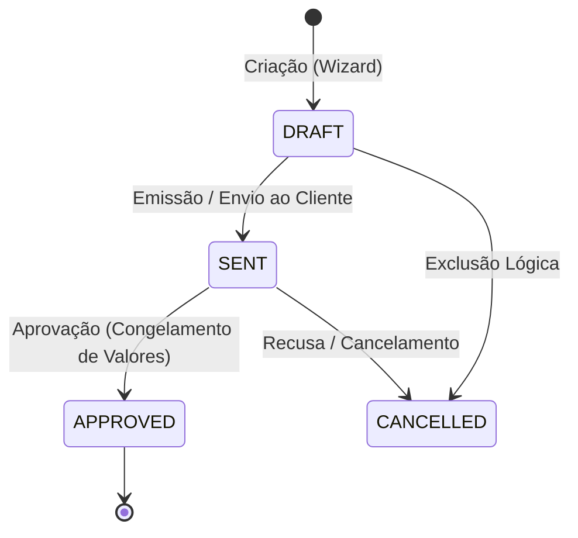

# ESQ — Especificação Técnica de Templates de Esquadrias, Orçamentos e Romaneio

| Campo | Valor |
|---|---|
| **Projeto** | AlumiGest — Sistema de Gestão para Vidraçaria e Esquadrias |
| **Documento** | Especificação Técnica e Arquitetural de Templates, Orçamentos e Romaneio |
| **Versão** | 2.0 (Consolidado com Motor de Cálculo, Descontos %/R$ e PDF em Duas Vias) |
| **Data** | 31/08/2026 |
| **Autor** | Equipe de Engenharia AlumiGest (Scrum Master: Italo Santos) |

---

## 1. 🎯 Visão Geral do Módulo

Este documento especifica a modelagem técnica, arquitetura de dados, contratos REST e regras visuais/gráficas de engenharia de fabricação para a **Alumiportas**:
1. **Templates de Esquadrias Paramétricas**: Modelos de portas, janelas e boxes com desenho vetorial SVG, furação e puxadores.
2. **Requisitos de Categorias de Insumos**: Vínculo dinâmico por categorias de material (`GLASS`, `PROFILE`, `HARDWARE`, `FILM`).
3. **Motor de Precificação e Orçamentos**: Montagem de propostas no Wizard com subtotal reativo, descontos em %/R$ e máquina de estados.
4. **Proposta Comercial e Romaneio de Oficina em PDF**: Emissão em folha A4 com segregação de via comercial (com valores) e via técnica (sem valores).

---

## 2. 🚪 Modelagem dos Templates de Esquadria

### 2.1 Tipos de Esquadria Suportados (`TemplateType`)

| Enum | Descrição Técnica | Sentido de Abertura Suportado |
| :--- | :--- | :--- |
| `SLIDING_DOOR_2F` | Porta de Correr 2 Folhas (1 Fixa + 1 Móvel) | `LEFT_TO_RIGHT`, `RIGHT_TO_LEFT` |
| `SLIDING_DOOR_4F` | Porta de Correr 4 Folhas (2 Fixas Laterais + 2 Móveis Centrais) | `CENTER_TO_SIDES` |
| `PIVOTING_DOOR` | Porta Pivotante com Eixo Deslocado | `OUTSIDE`, `INSIDE` |
| `SWING_DOOR_1F` | Porta de Giro / Abrir 1 Folha | `OUTSIDE`, `INSIDE` |
| `SWING_DOOR_2F` | Porta de Giro / Abrir 2 Folhas | `OUTSIDE`, `INSIDE` |
| `SLIDING_WINDOW_2F` | Janela de Correr 2 Folhas | `LEFT_TO_RIGHT`, `RIGHT_TO_LEFT` |
| `SLIDING_WINDOW_4F` | Janela de Correr 4 Folhas | `CENTER_TO_SIDES` |
| `MAXIM_AR_WINDOW` | Janela Maxim-Ar com Projeção Superior | Basculante |
| `GLASS_BOX_FRONTAL` | Box de Banheiro Frontal F1 (1 Fixo + 1 Correr) | `LEFT_TO_RIGHT`, `RIGHT_TO_LEFT` |
| `GLASS_BOX_CORNER` | Box de Banheiro em Canto (L) | Central / Canto |
| `FIXED_GLASS_FACADE` | Painel Fixo / Fachada em Vidro | Fixo |

---

### 2.2 Estrutura de Configuração Paramétrica (`TemplateConfig`)

```json
{
  "templateType": "SLIDING_DOOR_2F",
  "aluminumColor": "BLACK",
  "glassFinish": "CLEAR",
  "openingDirection": "LEFT_TO_RIGHT",
  "handleType": "BAR_TUBULAR",
  "handleConfig": {
    "handleType": "BAR_TUBULAR",
    "side": "BOTH_SIDES",
    "coverage": "PIECE",
    "pieceLengthCm": 40
  },
  "drillingConfig": {
    "holeCount": 2,
    "divisionType": "EQUAL",
    "customDistancesMm": [150, 450]
  },
  "isSlatted": false,
  "hasFixedPanel": true
}
```

#### Regras de Furação e Puxadores:
* **Puxador:** Localizado na folha móvel, no lado de abertura. Pode ser `BAR_TUBULAR` (Inox), `SHELL_LOCK` (Fecho concha) ou `LEVER_HANDLE` (Maçaneta).
* **Furação:** Renderizada com retículos `Ø` na **borda externa da folha**, obrigatoriamente no **lado oposto ao puxador**.
* **Inversão Dinâmica de Abertura:** Quando o sentido de abertura é alterado, o componente SVG inverte dinamicamente as posições da folha móvel, puxador, folha fixa, furação e setas de indicação.

---

## 3. 🧩 Desacoplamento por Categorias de Insumos

Ao cadastrar um Produto/Template, o sistema **NÃO fixa materiais específicos**, mas sim as **Categorias Obrigatórias** requeridas na montagem:

```json
[
  { "id": "req-vidro", "categoryType": "GLASS", "label": "Vidro das Folhas", "isOptional": false },
  { "id": "req-perfil", "categoryType": "PROFILE", "label": "Perfis e Trilhos de Alumínio", "isOptional": false },
  { "id": "req-ferragem", "categoryType": "HARDWARE", "label": "Kit de Ferragens e Fechos", "isOptional": false },
  { "id": "req-pelicula", "categoryType": "FILM", "label": "Película Protetora/Decorativa", "isOptional": true }
]
```

---

## 4. 🧮 Modelagem e Ciclo de Vida do Orçamento (`Budget`)

### 4.1 Máquina de Estados do Orçamento


### 4.2 Congelamento de Valores (`RN-CONG01`)
Após o status transitar para `APPROVED`:
* Todos os preços unitários, quantidades calculadas, medidas nominais e totais tornam-se **estritamente imutáveis**.
* A API rejeita requisições de alteração com código `HTTP 422 Unprocessable Entity`.

---

## 5. 🖨️ Proposta Comercial, Romaneio e Impressão A4

### 5.1 Proposta Comercial (Via Cliente)
* **Cabeçalho Timbrado:** Logotipo Alumiportas, CNPJ, telefone, e-mail institucional e dados da proposta (`ORC-YYYYMMDD-NNNN`).
* **Dados do Cliente:** Nome completo, CPF/CNPJ, WhatsApp e endereço da obra.
* **Tabela de Itens:** Modelo da esquadria, dimensões em milímetros ($L \times A$), tipo e espessura do vidro, cor dos perfis, puxadores, furação, mão de obra e valor subtotal.
* **Totais e Condições:** Subtotal bruto, desconto em % ou R$, total líquido final, condições de pagamento (À Vista PIX, 50%+50%, Cartão) e validade de 15 dias.
* **Compartilhamento WhatsApp:** Botão para copiar texto estruturado e pronto para envio via WhatsApp.

### 5.2 Romaneio Técnico de Peças (Via Oficina / Fábrica)
* **Regra de Omissão de Valores (`RN-PDF01`):** Esta via **omite estritamente todos os preços e valores financeiros (R$)**.
* **Gabarito de Fabricação:** Ficha de corte com dimensões em mm, fórmulas lineares de perfis, tipos de vidro, roldanas e indicação de furos.

### 5.3 Regras de Impressão e Exportação PDF (`@media print`)
1. **Ocultação de Elementos Web:** `header`, `nav`, `aside`, botões e tabs recebem `display: none !important`.
2. **Paginação A4 Contínua:** `@page { size: A4 portrait; margin: 12mm 10mm 15mm 10mm; }`.
3. **Não-Corte de Elementos:**
   * Linhas de tabela `<tr>` e cards possuem `page-break-inside: avoid !important`.
   * Cabeçalhos de tabela se repetem no topo de novas páginas (`thead { display: table-header-group; }`).

---

*Especificação Técnica homologada com os motores da Sprint 3 — Versão 2.0 — 31/08/2026*
