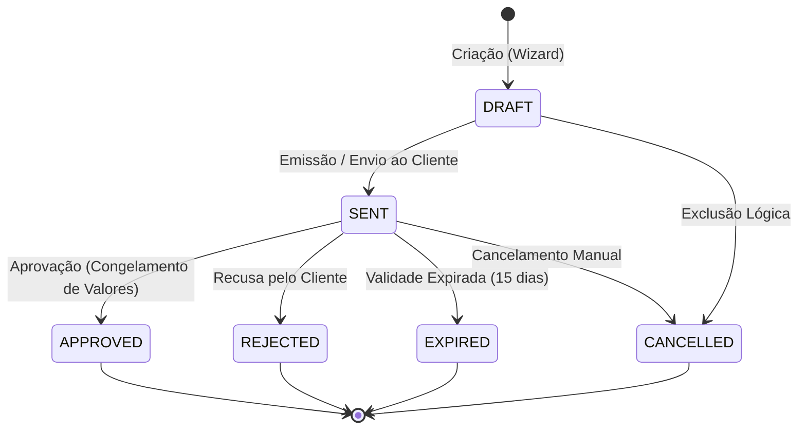

# ESQ — Especificação Técnica de Templates de Esquadrias, Orçamentos e Romaneio

| Campo | Valor |
|---|---|
| **Projeto** | AlumiGest — Sistema de Gestão para Vidraçaria e Esquadrias |
| **Documento** | Especificação Técnica e Arquitetural de Templates, Orçamentos e Romaneio |
| **Versão** | 3.0 (Consolidado com 10 Modelos Homologados, Studio CAD, Option Schema e Máquina de Estados Expandida) |
| **Data** | 10/09/2026 |
| **Autor** | Equipe de Engenharia AlumiGest (Scrum Master: Italo Santos) |

---

## 1. 🎯 Visão Geral do Módulo

Este documento especifica a modelagem técnica, arquitetura de dados, contratos REST e regras visuais/gráficas de engenharia de fabricação para a **Alumiportas**:
1. **Templates de Esquadrias Paramétricas**: 10 modelos canônicos de portas, janelas, boxes e painéis com desenho vetorial SVG interativo (Studio CAD), furação técnica precisa e puxadores.
2. **Esquema Técnico de Opções (`optionSchema`)**: Regras e limites específicos configurados por produto para restringir espessuras, furações, puxadores e cores permitidas no orçamento.
3. **Requisitos de Categorias de Insumos (`categoryRequirements`)**: Vínculo dinâmico por categorias de material (`GLASS`, `PROFILE`, `HARDWARE`, `FILM`).
4. **Motor de Precificação e Orçamentos**: Montagem de propostas no Wizard com subtotal reativo, condições comerciais, descontos em %/R$ e máquina de estados com suporte a congelamento.
5. **Proposta Comercial e Romaneio de Oficina em PDF**: Emissão em folha A4 com segregação de via comercial (com valores) e via técnica de fabricação (sem valores financeiros).

---

## 2. 🚪 Modelagem dos Templates de Esquadria

### 2.1 Tipos de Esquadria Suportados (`DoorTemplateType`)

O sistema adota **10 modelos canônicos oficiais**, agrupados em 4 famílias operacionais (`getGroupName()`):

| Enum Canônico | Grupo | Descrição Técnica | Sentido de Abertura / Operação |
| :--- | :--- | :--- | :--- |
| `SLIDING_DOOR_1F` | Box / Portas | Porta / Box de Correr 1 Folha Móvel | `LEFT_TO_RIGHT`, `RIGHT_TO_LEFT` |
| `SLIDING_DOOR_2F` | Portas | Porta de Correr 2 Folhas (1 Fixa + 1 Móvel) | `LEFT_TO_RIGHT`, `RIGHT_TO_LEFT` |
| `SLIDING_DOOR_3F` | Portas | Porta de Correr 3 Folhas | `LEFT_TO_RIGHT`, `RIGHT_TO_LEFT` |
| `SLIDING_DOOR_4F` | Portas | Porta de Correr 4 Folhas (2 Fixas + 2 Móveis) | `CENTER_TO_SIDES` |
| `SWING_DOOR_1F` | Portas | Porta de Giro / Abrir 1 Folha | `OUTSIDE`, `INSIDE` |
| `SWING_DOOR_2F` | Portas | Porta de Giro / Abrir 2 Folhas | `OUTSIDE`, `INSIDE` |
| `AWNING_WINDOW_1F` | Janelas | Janela Maxim-Ar / Basculante 1 Folha | Basculante Superior |
| `AWNING_WINDOW_1F_INV` | Janelas | Janela Maxim-Ar Invertida 1 Folha | Basculante Inferior |
| `FRONT_DRAWER` | Móveis / Painéis | Frente de Gaveta / Painel Gaveteiro | Abertura Frontal |
| `FIXED_PANEL` | Móveis / Painéis | Painel Fixo / Fachada em Vidro | Fixo Estrutural |

> [!NOTE]
> **Retrocompatibilidade de Enums Legados:**
> O enum [`DoorTemplateType`](file:///c:/Users/italo/Desktop/Projects/alumigest/backend/src/main/java/br/edu/ifpb/alumigest/catalog/domain/DoorTemplateType.java) e a migração `V14` mantêm compatibilidade total com os aliases legados (`PIVOTING_DOOR`, `MAXIM_AR_WINDOW`, `SLIDING_WINDOW_2F`, `SLIDING_WINDOW_4F`, `GLASS_BOX_FRONTAL`, `GLASS_BOX_CORNER`, `FIXED_GLASS_FACADE`, `SWING`, `SLIDING`, `TILT`, `DRAWER`, `DRAWER_FRONT`).

---

### 2.2 Estrutura de Configuração Paramétrica (`TemplateConfig`)

Representa o estado gráfico e as diretrizes físicas do desenho técnico:

```json
{
  "templateType": "SLIDING_DOOR_2F",
  "aluminumColor": "BLACK",
  "glassFinish": "CLEAR",
  "openingDirection": "LEFT_TO_RIGHT",
  "handleConfig": {
    "handleType": "BAR_TUBULAR",
    "side": "BOTH_SIDES",
    "coverage": "PIECE",
    "pieceLengthCm": 40,
    "profileColor": "BLACK"
  },
  "drillingConfig": {
    "drillingPosition": "LATERAL_EDGE",
    "holeCount": 2,
    "diameterMm": 12.0,
    "edgeDistanceMm": 50.0,
    "interDistanceMm": 300.0,
    "customPositionsMm": [150.0, 450.0]
  },
  "isSlatted": false,
  "hasFixedPanel": true
}
```

#### Regras de Furação e Puxadores no Studio CAD:
* **Puxador:** Posicionado na folha móvel de acordo com o lado de abertura. Pode ser do tipo `BAR_TUBULAR` (Tubo de Inox/Alumínio), `SHELL_LOCK` (Fecho Concha de embutir) ou `LEVER_HANDLE` (Maçaneta de alavanca).
* **Furação Técnica:** Suporta posicionamento paramétrico em borda superior (`TOP_EDGE`), borda lateral (`LATERAL_EDGE`), furação frontal no painel (`FRONTAL_PANEL`), borda inferior (`BOTTOM_EDGE`) ou nos 4 cantos para Spider Glass (`CORNER_4_POINTS`).
* **Inversão Dinâmica de Abertura:** A alteração do sentido de abertura inverte dinamicamente no SVG as posições de folha fixa, folha móvel, puxador, cotas dimensionais e retículos de furação.

---

### 2.3 Esquema de Restrições Técnicas do Produto (`TemplateOptionSchema`)

Armazenado na coluna `option_schema` (JSONB) da tabela `tb_products`, delimita as opções que podem ser selecionadas durante a montagem do orçamento:

```json
{
  "glassTypes": ["TEMPERED", "LAMINATED"],
  "glassColors": ["INCOLOR", "FUME", "VERDE", "BRONZE"],
  "glassThicknesses": [6, 8, 10],
  "profileColors": ["BRANCO", "PRETO", "FOSCO", "BRONZE"],
  "openingDirections": ["LEFT_TO_RIGHT", "RIGHT_TO_LEFT"],
  "handleTypes": ["BAR_TUBULAR", "SHELL_LOCK", "LEVER_HANDLE"],
  "handlePositions": ["LEFT", "RIGHT", "CENTER"],
  "handleLengths": [300, 400, 600, 1000],
  "drillingAllowed": true,
  "drillingPositions": ["LATERAL_EDGE", "TOP_EDGE", "FRONTAL_PANEL"],
  "drillingHoleCounts": [1, 2, 3, 4]
}
```

---

## 3. 🧩 Desacoplamento por Categorias de Insumos (`categoryRequirements`)

Ao cadastrar um Produto/Template, o sistema **não fixa materiais específicos**, mas sim as **Categorias Obrigatórias** requeridas na montagem:

```json
[
  { "id": "req-vidro", "categoryType": "GLASS", "label": "Vidro das Folhas", "isOptional": false },
  { "id": "req-perfil", "categoryType": "PROFILE", "label": "Perfis e Trilhos de Alumínio", "isOptional": false },
  { "id": "req-ferragem", "categoryType": "HARDWARE", "label": "Kit de Ferragens e Fechos", "isOptional": false },
  { "id": "req-pelicula", "categoryType": "FILM", "label": "Película Protetora/Decorativa", "isOptional": true }
]
```

---

## 4. 🧮 Modelagem e Ciclo de Vida do Orçamento (`Budget`)

### 4.1 Máquina de Estados do Orçamento


### 4.2 Condições Comerciais e Descontos
* **Descontos:** Suporte a desconto percentual (`discount_percent`) ou em valor absoluto (`discount_value`).
* **Condições de Pagamento:** Campos `payment_condition` (ex: `A_VISTA_PIX`, `ENTRADA_50_50`, `PARCELADO_CARTAO`) e `payment_notes`.
* **Congelamento de Valores (`RN-CONG01`):** Ao transitar para `APPROVED`, medidas, custos unitários e insumos tornam-se estritamente imutáveis. Requisições de alteração são rejeitadas com `HTTP 422 Unprocessable Entity`.

---

## 5. 🖨️ Proposta Comercial, Romaneio e Impressão A4

### 5.1 Proposta Comercial (Via Cliente)
* **Cabeçalho Timbrado:** Logotipo Alumiportas, CNPJ, telefone, e-mail institucional e dados da proposta (`ORC-YYYYMMDD-NNNN`).
* **Dados do Cliente:** Nome completo, CPF/CNPJ, WhatsApp e endereço da obra.
* **Tabela de Itens:** Modelo da esquadria, dimensões nominais ($L \times A$ mm), tipo/cor do vidro, cor dos perfis, puxadores, furação e subtotal.
* **Totais e Condições:** Subtotal bruto, descontos concedidos, valor líquido, condições de pagamento e validade.
* **Compartilhamento WhatsApp:** Texto estruturado pré-formatado para envio instantâneo ao cliente.

### 5.2 Romaneio Técnico de Peças (Via Oficina / Fábrica)
* **Regra de Omissão de Valores (`RN-PDF01`):** Esta via **omite estritamente todos os preços e valores financeiros (R$)**.
* **Gabarito de Fabricação:** Ficha técnica com dimensões nominais em mm, fórmulas lineares de perfis, tipos de vidro, roldanas e indicação detalhada de furações e puxadores.

---

*Especificação Técnica homologada — Versão 3.0 — 10/09/2026*
