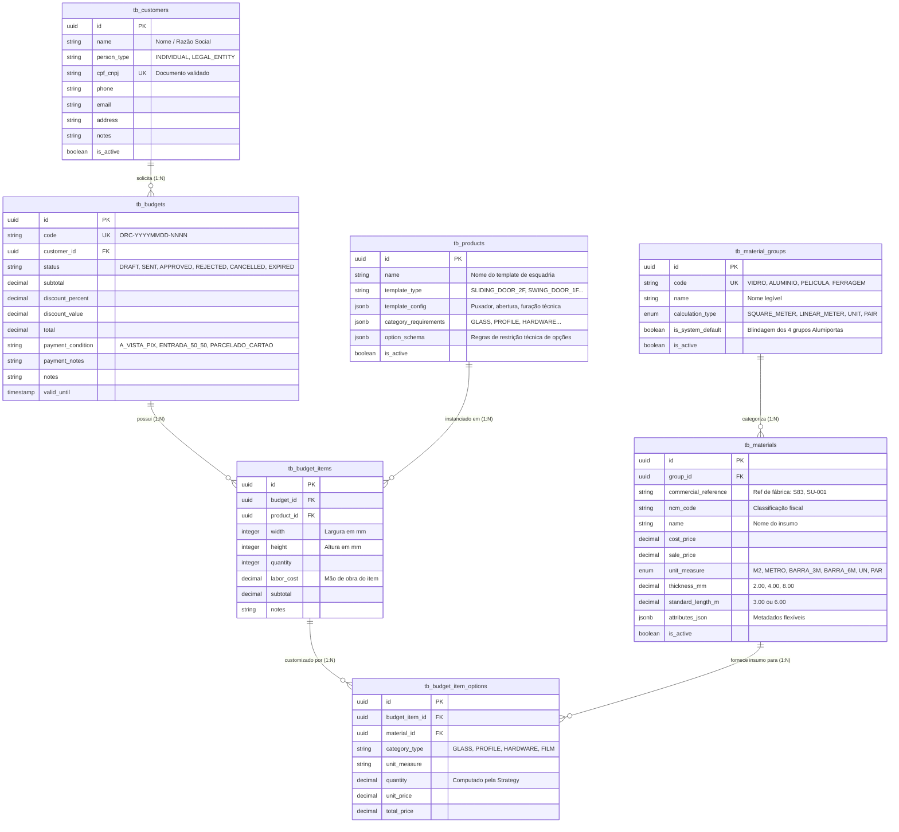

# 📊 MER — Modelo de Dados Oficial (AlumiGest)
**Projeto:** AlumiGest — Sistema de Gestão para Vidraçaria e Esquadrias  
**Versão:** 4.0 (Consolidado com Templates Paramétricos, Option Schema, Remoção de Categorias Legadas e Migrações Flyway V1-V15)  
**Data:** 10 de Setembro de 2026  
**SGBD:** PostgreSQL 16 com extensão `uuid-ossp`  
**Autor:** Equipe de Engenharia AlumiGest (Scrum Master: Italo Santos)  

---

## 1. 🎯 Visão Geral da Arquitetura de Dados

O modelo de dados do AlumiGest foi projetado com foco em **extensibilidade universal (*Type-Object Pattern*)**, **templates de esquadrias paramétricas** e **cálculo dinâmico de propostas comerciais**.

Com a evolução para templates paramétricos na Sprint 3 (migrações Flyway `V12` e `V13`):
* As antigas tabelas `tb_product_categories` e `tb_product_items` foram **extintas**.
* As esquadrias (`tb_products`) são classificadas dinamicamente a partir do seu modelo canônico (`template_type`), e seus insumos são desacoplados via requisitos dinâmicos de categoria (`category_requirements`).
* Foi introduzida a coluna `option_schema` (JSONB) para configurar limites e restrições técnicas específicas de cada produto no Studio CAD e no Wizard de Orçamentos.

---

## 2. 🗄️ Dicionário das Tabelas Principais

### 2.1 `tb_material_groups` (Grupos de Insumos)
* **Finalidade:** Define o tipo de insumo e a estratégia física de cálculo (área $m^2$, metro linear ou unidade).
* **Campos:** `id` (UUID PK), `code` (VARCHAR UK), `name` (VARCHAR), `calculation_type` (VARCHAR), `is_system_default` (BOOLEAN), `is_active` (BOOLEAN).

### 2.2 `tb_materials` (Insumos e Matérias-Primas do Catálogo)
* **Finalidade:** Tabela universal para vidros, perfis, películas e ferragens.
* **Campos:** `id` (UUID PK), `group_id` (UUID FK), `commercial_reference` (VARCHAR), `ncm_code` (VARCHAR), `name` (VARCHAR), `cost_price` (DECIMAL), `sale_price` (DECIMAL), `unit_measure` (VARCHAR), `thickness_mm` (DECIMAL), `standard_length_m` (DECIMAL), `attributes_json` (JSONB), `is_active` (BOOLEAN).

### 2.3 `tb_products` (Templates Paramétricos de Esquadrias)
* **Finalidade:** Modelagem de modelos de esquadrias (`DoorTemplateType`), esquemas paramétricos vetoriais (`template_config`), requisitos dinâmicos de insumos (`category_requirements`) e esquemas de opções técnicas permitidas (`option_schema`).
* **Campos:** `id` (UUID PK), `name` (VARCHAR), `template_type` (VARCHAR), `template_config` (JSONB), `category_requirements` (JSONB), `option_schema` (JSONB), `is_active` (BOOLEAN).
* *Nota Histórica:* A antiga coluna `category_id` e a tabela `tb_product_categories` foram eliminadas na migração `V12`; a antiga tabela `tb_product_items` foi eliminada na migração `V13`.

### 2.4 `tb_customers` (Clientes)
* **Finalidade:** Gestão de clientes físicos (PF) e jurídicos (PJ) para emissão de propostas comerciais.
* **Campos:** `id` (UUID PK), `name` (VARCHAR), `person_type` (VARCHAR), `cpf_cnpj` (VARCHAR UK), `phone` (VARCHAR), `email` (VARCHAR), `address` (TEXT), `notes` (TEXT), `is_active` (BOOLEAN).

### 2.5 `tb_budgets` (Orçamentos)
* **Finalidade:** Cabeçalho do orçamento comercial com código sequencial, máquina de estados, condições de pagamento e totalização financeira.
* **Campos:** `id` (UUID PK), `code` (VARCHAR UK), `customer_id` (UUID FK), `status` (VARCHAR: `DRAFT`, `SENT`, `APPROVED`, `REJECTED`, `CANCELLED`, `EXPIRED`), `subtotal` (DECIMAL), `discount_percent` (DECIMAL), `discount_value` (DECIMAL), `total` (DECIMAL), `payment_condition` (VARCHAR), `payment_notes` (TEXT), `notes` (TEXT), `valid_until` (TIMESTAMP).

### 2.6 `tb_budget_items` & `tb_budget_item_options` (Itens e Insumos do Orçamento)
* **Finalidade:** Registra cada esquadria sob medida (medidas em mm, mão de obra desacoplada) e os insumos específicos selecionados com precificação congelada na aprovação.
* **Campos `tb_budget_items`:** `id` (UUID PK), `budget_id` (UUID FK), `product_id` (UUID FK), `width` (INTEGER), `height` (INTEGER), `quantity` (INTEGER), `labor_cost` (DECIMAL), `subtotal` (DECIMAL), `notes` (TEXT).
* **Campos `tb_budget_item_options`:** `id` (UUID PK), `budget_item_id` (UUID FK), `material_id` (UUID FK), `category_type` (VARCHAR), `unit_measure` (VARCHAR), `quantity` (DECIMAL), `unit_price` (DECIMAL), `total_price` (DECIMAL).

---

*Modelo de Dados homologado com a base PostgreSQL 16 — Versão 4.0 — 10/09/2026*
