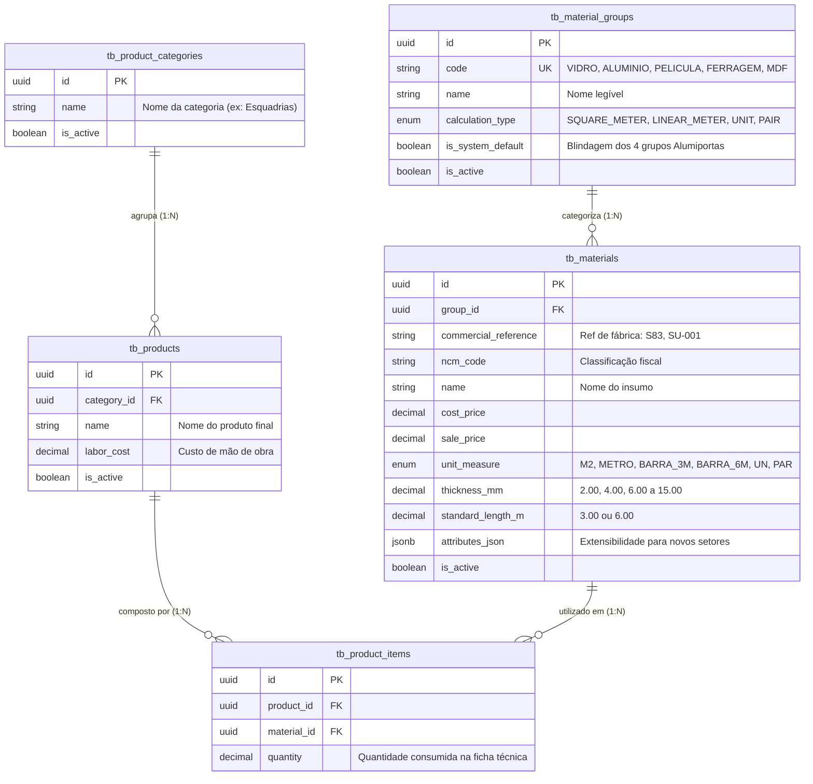

# 📊 MER — Modelo de Dados Oficial (AlumiGest)
**Projeto:** AlumiGest — Sistema de Gestão para Vidraçaria e Esquadrias  
**Versão:** 2.0 (Alinhado com DER Genérico e Decisões da Planning em 05/08/2026)  
**SGBD:** PostgreSQL 16 com extensão `uuid-ossp`  

---

## 1. 🎯 Visão Geral da Arquitetura de Dados

O modelo de dados do AlumiGest foi projetado com foco em **extensibilidade universal (*Type-Object Pattern*)** e **desacoplamento entre Insumos Básicos e Produtos Finais Compostos**.

---

## 2. 🗄️ Dicionário das Tabelas Principais

### 2.1 `tb_material_groups` (Grupos de Insumos)
* **Finalidade:** Define o tipo de insumo e a estratégia de cálculo de área, metro linear ou unidade.
* **Campos:** `id` (UUID PK), `code` (VARCHAR UK), `name` (VARCHAR), `calculation_type` (VARCHAR), `is_system_default` (BOOLEAN), `is_active` (BOOLEAN).

### 2.2 `tb_materials` (Insumos e Matérias-Primas)
* **Finalidade:** Tabela universal de insumos para vidros, perfis, películas e ferragens.
* **Campos:** `id` (UUID PK), `group_id` (UUID FK), `commercial_reference` (VARCHAR), `ncm_code` (VARCHAR), `name` (VARCHAR), `cost_price` (DECIMAL), `sale_price` (DECIMAL), `unit_measure` (VARCHAR), `thickness_mm` (DECIMAL), `standard_length_m` (DECIMAL), `attributes_json` (JSONB), `is_active` (BOOLEAN).

### 2.3 `tb_product_categories` (Categorias de Produtos)
* **Finalidade:** Agrupamento e organização dos produtos finais (ex: Esquadrias, Portas, Janelas).
* **Campos:** `id` (UUID PK), `name` (VARCHAR), `is_active` (BOOLEAN).

### 2.4 `tb_products` & `tb_product_items` (Produtos Finais e Fichas Técnicas)
* **Finalidade:** Modelagem do produto final (`tb_products`), definindo custo de mão de obra e categoria, bem como sua ficha técnica (`tb_product_items`), que é a "receita" relacionando as quantidades necessárias de cada material (`tb_materials`) para montar o produto.
* **Campos Principais:** `labor_cost` no Produto, `quantity` no Item associado.
