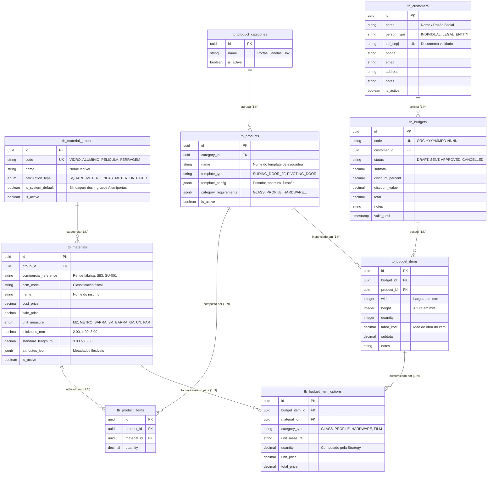

# 📊 MER — Modelo de Dados Oficial (AlumiGest)
**Projeto:** AlumiGest — Sistema de Gestão para Vidraçaria e Esquadrias  
**Versão:** 3.0 (Consolidado com Clientes, Orçamentos, Templates Paramétricos e Migrations V1-V10)  
**Data:** 31 de Agosto de 2026  
**SGBD:** PostgreSQL 16 com extensão `uuid-ossp`  
**Autor:** Equipe de Engenharia AlumiGest (Scrum Master: Italo Santos)  

---

## 1. 🎯 Visão Geral da Arquitetura de Dados

O modelo de dados do AlumiGest foi projetado com foco em **extensibilidade universal (*Type-Object Pattern*)**, **templates de esquadrias paramétricas** e **cálculo dinâmico de propostas comerciais**.

---

## 2. 🗄️ Dicionário das Tabelas Principais

### 2.1 `tb_material_groups` (Grupos de Insumos)
* **Finalidade:** Define o tipo de insumo e a estratégia física de cálculo (área $m^2$, metro linear ou unidade).
* **Campos:** `id` (UUID PK), `code` (VARCHAR UK), `name` (VARCHAR), `calculation_type` (VARCHAR), `is_system_default` (BOOLEAN), `is_active` (BOOLEAN).

### 2.2 `tb_materials` (Insumos e Matérias-Primas do Catálogo)
* **Finalidade:** Tabela universal para vidros, perfis, películas e ferragens.
* **Campos:** `id` (UUID PK), `group_id` (UUID FK), `commercial_reference` (VARCHAR), `ncm_code` (VARCHAR), `name` (VARCHAR), `cost_price` (DECIMAL), `sale_price` (DECIMAL), `unit_measure` (VARCHAR), `thickness_mm` (DECIMAL), `standard_length_m` (DECIMAL), `attributes_json` (JSONB), `is_active` (BOOLEAN).

### 2.3 `tb_product_categories` (Categorias de Produtos)
* **Finalidade:** Agrupamento e organização dos produtos finais (ex: Esquadrias, Portas, Janelas, Box).
* **Campos:** `id` (UUID PK), `name` (VARCHAR), `is_active` (BOOLEAN).

### 2.4 `tb_products` (Templates Paramétricos de Esquadrias)
* **Finalidade:** Modelagem de modelos de esquadrias (`TemplateType`), esquemas paramétricos vetoriais (`template_config`) e categorias obrigatórias (`category_requirements`).
* **Campos:** `id` (UUID PK), `category_id` (UUID FK), `name` (VARCHAR), `template_type` (VARCHAR), `template_config` (JSONB), `category_requirements` (JSONB), `is_active` (BOOLEAN).

### 2.5 `tb_customers` (Clientes)
* **Finalidade:** Gestão de clientes físicos (PF) e jurídicos (PJ) para emissão de propostas comerciais.
* **Campos:** `id` (UUID PK), `name` (VARCHAR), `person_type` (VARCHAR), `cpf_cnpj` (VARCHAR UK), `phone` (VARCHAR), `email` (VARCHAR), `address` (TEXT), `notes` (TEXT), `is_active` (BOOLEAN).

### 2.6 `tb_budgets` (Orçamentos)
* **Finalidade:** Cabeçalho do orçamento comercial com código sequencial, máquina de estados e totalização financeira.
* **Campos:** `id` (UUID PK), `code` (VARCHAR UK), `customer_id` (UUID FK), `status` (VARCHAR), `subtotal` (DECIMAL), `discount_percent` (DECIMAL), `discount_value` (DECIMAL), `total` (DECIMAL), `notes` (TEXT), `valid_until` (TIMESTAMP).

### 2.7 `tb_budget_items` & `tb_budget_item_options` (Itens e Insumos do Orçamento)
* **Finalidade:** Registra cada esquadria sob medida (medidas em mm, mão de obra desacoplada) e os insumos específicos selecionados com precificação congelada na aprovação.

---

*Modelo de Dados homologado com a base PostgreSQL 16 — Versão 3.0 — 31/08/2026*
