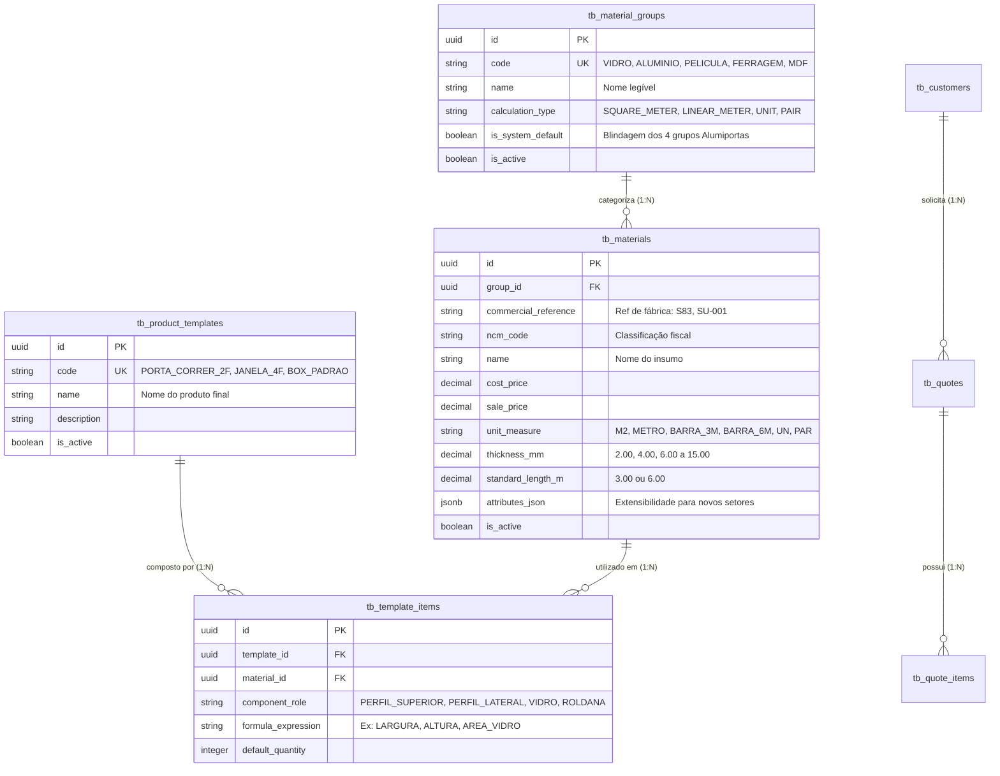

# 📊 MER — Modelo de Dados Oficial (AlumiGest)
**Projeto:** AlumiGest — Sistema de Gestão para Vidraçaria e Esquadrias  
**Versão:** 2.0 (Alinhado com DER Genérico e Decisões da Planning em 05/08/2026)  
**SGBD:** PostgreSQL 16 com extensão `uuid-ossp`  

---

## 1. 🎯 Visão Geral da Arquitetura de Dados

O modelo de dados do AlumiGest foi projetado com foco em **extensibilidade universal (*Type-Object Pattern*)** e **desacoplamento entre Insumos Básicos e Produtos Finais Compostos**.

---

## 2. 🗄️ Dicionário das Tabelas Principais

### 2.1 `tb_material_groups` (Grupos de Insumos)
* **Finalidade:** Define o tipo de insumo e a estratégia de cálculo de área, metro linear ou unidade.
* **Campos:** `id` (UUID PK), `code` (VARCHAR UK), `name` (VARCHAR), `calculation_type` (VARCHAR), `is_system_default` (BOOLEAN), `is_active` (BOOLEAN).

### 2.2 `tb_materials` (Insumos e Matérias-Primas)
* **Finalidade:** Tabela universal de insumos para vidros, perfis, películas e ferragens.
* **Campos:** `id` (UUID PK), `group_id` (UUID FK), `commercial_reference` (VARCHAR), `ncm_code` (VARCHAR), `name` (VARCHAR), `cost_price` (DECIMAL), `sale_price` (DECIMAL), `unit_measure` (VARCHAR), `thickness_mm` (DECIMAL), `standard_length_m` (DECIMAL), `attributes_json` (JSONB), `is_active` (BOOLEAN).

### 2.3 `tb_customers` (Clientes)
* **Finalidade:** Cadastro de clientes da vidraçaria para geração de orçamentos e pedidos.
* **Campos:** `id` (UUID PK), `name` (VARCHAR), `document` (VARCHAR - CPF/CNPJ), `phone` (VARCHAR), `whatsapp` (VARCHAR), `address` (TEXT), `is_active` (BOOLEAN).

### 2.4 `tb_product_templates` & `tb_template_items` (Templates de Portas/Esquadrias - Sprint 3)
* **Finalidade:** Modelagem de portas e janelas compostas, definindo a "receita" de quais perfis, vidros e roldanas formam a esquadria acabada.
