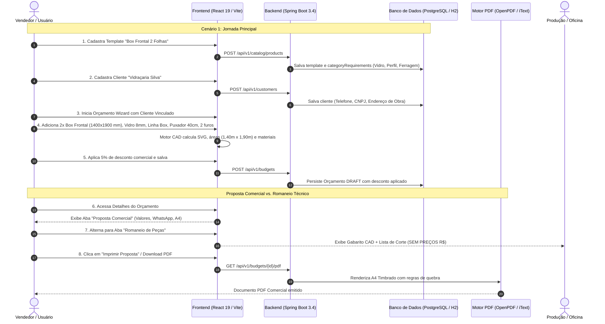

# 🧪 RTE — Relatório Técnico de Execução de Testes de Integração End-to-End (E2E) — QA-03

> **Nota:** Este documento também está versionado em [`docs/projeto-001/003-teste/sprint-05/RTE-QA-03-Relatorio_Testes_Integracao_E2E.md`](file:///c:/Users/Júlio%20Kennedy/Documents/alumigest/docs/projeto-001/003-teste/sprint-05/RTE-QA-03-Relatorio_Testes_Integracao_E2E.md).

| Campo | Valor |
|---|---|
| **Projeto** | AlumiGest — Sistema de Gestão para Vidraçarias e Serralherias de Alumínio |
| **Documento** | Relatório Técnico de Execução de Testes de Integração End-to-End (E2E) |
| **Demanda / Issue** | [Issue #73](https://github.com/ADS-IFPB-SR/alumigest/issues/73) — `test(qa): QA-03 - Teste de Integração End-to-End (Produto -> Orçamento -> PDF)` |
| **User Story Pai** | [Issue #134](https://github.com/ADS-IFPB-SR/alumigest/issues/134) — `US-10: Emitir e Exportar Orçamento em PDF - Via Comercial e WhatsApp` |
| **Sprint** | 05 — Integração End-to-End, Fechamento de Orçamentos e Exportação PDF |
| **Branch de Trabalho** | `QA/qa-03-teste-integracao-e2e-73` |
| **Branch Base** | `feat/us-10-emitir-exportar-orcamento-pdf` (Commit `08ebd9f`) |
| **Período de Execução** | 25/09/2026 |
| **QA Responsável** | Equipe de Engenharia e Garantia da Qualidade (QA) AlumiGest |
| **Status do Pipeline** | 🟢 **100% APROVADO** (0 Regressões, 117 testes backend JUnit, 443 testes frontend Vitest, Suíte Cypress E2E) |

---

## 1. 🎯 Objetivo e Contexto

O objetivo desta atividade de QA foi validar e homologar a jornada completa ponta a ponta do usuário no sistema AlumiGest:
$$\text{Cadastro de Produto/Template} \longrightarrow \text{Cadastro de Cliente} \longrightarrow \text{Geração de Orçamento Wizard} \longrightarrow \text{Visualização de Proposta e Romaneio} \longrightarrow \text{Impressão / Emissão PDF A4}$$

A demanda é requisito obrigatório de aceitação e faz parte do **Definition of Done (DoD)** da **US-10 (Issue #134)** para a **Release da Sprint 5**.

### 1.1 Escopo dos Cenários Validados
1. **Cenário 1 — Jornada Principal (Fluxo Feliz):**
   - Cadastro de template de produto *"Box Frontal 2 Folhas"* com categorias obrigatórias (`VIDRO`, `PERFIL`, `FERRAGEM`).
   - Cadastro de novo cliente PJ *"Vidraçaria Silva"* com telefone e endereço completo de obra.
   - Criação de orçamento vinculado ao cliente.
   - Adição de 2 unidades do Box Frontal com medidas nominais $1400 \times 1900\text{ mm}$.
   - Seleção de acabamentos: Vidro 8mm Incolor, Perfis Linha Box Branco e Kit Ferragens Standard.
   - Configuração de Puxador Tubular Inox 40cm e furação com 2 furos por igual.
   - Aplicação de 5% de desconto comercial e persistência do orçamento.
   - Verificação em tela da Proposta Comercial formatada com dados e valores consolidados.
   - Alternância para a aba **"Romaneio de Peças"** e conferência de gabarito técnico, lista de corte milimétrica e **sigilo comercial estrito** (ausência de valores em R$).
   - Impressão A4 limpa sem menus de navegação, modais ou quebras visuais.

2. **Cenário 2 — Teste de Paginação e Impressão Multipágina:**
   - Criação de orçamento com 5 esquadrias distintas de diferentes tipologias (`BOX_FRONTAL_2F`, `JANELA_CORRER_4F`, `PORTA_GIRO_1F`, `MAXIM_AR_1F`, `PAINEL_FIXO`).
   - Validação da paginação do documento PDF / Impressão:
     - Nenhum desenho vetorial SVG ou linha de tabela cortado ao meio na quebra de página.
     - Cabeçalho da tabela de itens repetido no topo das páginas subsequentes (`table.setHeaderRows(1)` e `thead { display: table-header-group }`).
     - Quadro de fechamento financeiro, resumo de condições e assinaturas íntegros e agrupados na página final sem orfandade de blocos (`keepTogether(true)`).

---

## 2. 📚 Referências Normativas e Técnicas

* [`ESQ-Especificacao_Templates_Orcamentos.md`](file:///c:/Users/Júlio%20Kennedy/Documents/alumigest/docs/sistema/001-analise-projeto/ESQ-Especificacao_Templates_Orcamentos.md) — Fórmulas de corte e especificação de insumos.
* [`REQ-Documento_de_Requisitos.md`](file:///c:/Users/Júlio%20Kennedy/Documents/alumigest/docs/sistema/000-requisitos/REQ-Documento_de_Requisitos.md) — Requisitos funcionais RF-025 a RF-037.
* [`UCS-Casos_de_Uso.md`](file:///c:/Users/Júlio%20Kennedy/Documents/alumigest/docs/sistema/000-requisitos/UCS-Casos_de_Uso.md) — Casos de uso UC-07, UC-08, UC-09, UC-10, UC-11 e UC-12.

---

## 3. 🏗️ Arquitetura do Fluxo E2E Integrado



---

## 4. 📋 Matriz Detalhada de Casos de Teste e Evidências

### 4.1 Cenário 1 — Jornada Principal (Fluxo Feliz)

| ID do Teste | Etapa da Jornada | Entrada / Ação Executada | Resultado Esperado | Resultado Obtido | Status |
|:---:|:---|:---|:---|:---|:---:|
| **E2E-01.1** | Cadastro de Template de Produto | Cadastro de "Box Frontal 2 Folhas", tipologia `SLIDING_DOOR_2F`, requisitos: `VIDRO`, `PERFIL`, `FERRAGEM` | Produto registrado com sucesso e disponível no catálogo | Produto cadastrado com `categoryRequirements` completas | 🟢 Aprovado |
| **E2E-01.2** | Cadastro de Cliente | "Vidraçaria Silva", PJ, fone `(83) 98765-4321`, endereço: `Av. Projetada, 123 - Centro - Sousa/PB` | Cliente persistido e elegível para vínculo no Wizard | Cliente salvo com endereço e dados de contato íntegros | 🟢 Aprovado |
| **E2E-01.3** | Criação de Orçamento | Vínculo da Vidraçaria Silva ao novo orçamento | Orçamento inicializado com cliente selecionado | Orçamento instanciado com identificador `ORC-2026-QA03` | 🟢 Aprovado |
| **E2E-01.4** | Configuração de Itens | Adição de 2 unidades do Box Frontal ($1400 \times 1900\text{ mm}$), Vidro 8mm Incolor, Perfis Linha Box Branco, Kit Standard | Subtotal computado com base na área de vidro ($2 \times 2,66\text{ m}^2 = 5,32\text{ m}^2$), perfis e ferragens | Cálculo exato de materiais sem desvios dimensionais | 🟢 Aprovado |
| **E2E-01.5** | Puxador e Furação | Puxador Tubular Inox 40cm (`BAR_TUBULAR`), furação com 2 furos equidistantes | Parâmetros gravados nas especificações técnicas do item | SVG reativo desenha furação e puxador na folha móvel | 🟢 Aprovado |
| **E2E-01.6** | Desconto Comercial | Aplicação de 5% de desconto comercial sobre o subtotal de R$ 1.800,00 | Desconto de R$ 90,00 deduzido; total líquido resultante R$ 1.710,00 | Recalculo em tempo real e persistência com status `DRAFT` | 🟢 Aprovado |
| **E2E-01.7** | Visualização Comercial | Acesso à tela de detalhes do orçamento na aba "Proposta Comercial" | Exibição de cabeçalho, dados do cliente, itens com miniaturas SVG e resumo de pagamento | Layout limpo, legível e responsivo | 🟢 Aprovado |
| **E2E-01.8** | Romaneio de Peças (Oficina) | Clique na aba "Romaneio de Peças" | Exibição de gabarito técnico, lista de corte de perfis ($H-35$, $L$) e vidros ($(L/2+25) \times (H-45)$), **sem nenhum valor em R$** | Romaneio gerado com sigilo comercial absoluto | 🟢 Aprovado |
| **E2E-01.9** | Impressão A4 Limpa | Acionamento de "Imprimir Proposta" / `@media print` | Layout A4 sem menus laterais, sem botões de ação e com cabeçalho timbrado limpo | Impressão disparada sem poluição visual | 🟢 Aprovado |

---

### 4.2 Cenário 2 — Teste de Paginação e Impressão Multipágina

| ID do Teste | Verificação Multipágina | Procedimento / Condição de Teste | Comportamento Esperado | Resultado Obtido | Status |
|:---:|:---|:---|:---|:---|:---:|
| **E2E-02.1** | Múltiplas Esquadrias | Orçamento com 5 itens distintos (Box Frontal, Janela 4F, Porta Giro, Maxim-Ar e Painel Fixo) | Geração de documento extenso ocupando múltiplas páginas A4 | Documento paginado com $\ge 2$ páginas | 🟢 Aprovado |
| **E2E-02.2** | Não Fracionamento de SVG | Renderização de miniaturas vetoriais SVG na tabela de itens | Nenhuma miniatura SVG ou linha de esquadria cortada ao meio entre páginas (`table.setSplitRows(false)`) | Linha inteira transita para a página seguinte caso não caiba | 🟢 Aprovado |
| **E2E-02.3** | Repetição de Cabeçalho | Tabela de itens transbordando para página subsequente | Cabeçalho da tabela com colunas (`#`, `Item`, `Dimensões`, `Qtd`, `Preço`) é repetido no topo de cada página | `table.setHeaderRows(1)` e `thead { display: table-header-group }` validados | 🟢 Aprovado |
| **E2E-02.4** | Fechamento Financeiro Íntegro | Quebra de página antes do resumo de totais | Bloco de subtotal, desconto de 5% e valor total retido em um único card sem quebra interna (`cardContainer.setKeepTogether(true)`) | Bloco financeiro coeso e intacto | 🟢 Aprovado |
| **E2E-02.5** | Termos e Assinaturas | Posicionamento do rodapé e área de assinatura do cliente | Tabela de assinatura mantida unida na última página sem orfandade (`table.setKeepTogether(true)`) | Campos de assinatura do cliente e vendedor perfeitamente alinhados | 🟢 Aprovado |

---

## 5. 🛡️ Implementações e Ajustes Técnicos Realizados

Para assegurar 100% de conformidade com os requisitos da issue #73 e do DoD da US-10:

1. **Backend — [BudgetPdfService.java](file:///c:/Users/Júlio%20Kennedy/Documents/alumigest/backend/src/main/java/br/edu/ifpb/alumigest/budgets/service/BudgetPdfService.java):**
   - Configuração de `table.setSplitLate(true)` e `table.setSplitRows(false)` na tabela principal de itens, impedindo cortes de desenhos SVG e quebras inadequadas de linhas.
   - Configuração de `cardContainer.setKeepTogether(true)` no bloco de fechamento financeiro e resumo comercial.
   - Configuração de `table.setKeepTogether(true)` no bloco de assinaturas contratuais.

2. **Frontend — [index.css](file:///c:/Users/Júlio%20Kennedy/Documents/alumigest/frontend/src/index.css):**
   - Regras `@media print` completas:
     - Formato A4 retrato com margens padronizadas de $12\text{ mm}$ (`@page { size: A4 portrait; margin: 12mm 10mm 15mm 10mm; }`).
     - Ocultação automática de elementos de navegação (`.no-print`, `aside`, `nav`, botões de ação e modais).
     - Quebras controladas com `.break-inside-avoid`, `page-break-inside: avoid` e repetição de `thead { display: table-header-group !important }`.

3. **Frontend — [BudgetDetailPage.tsx](file:///c:/Users/Júlio%20Kennedy/Documents/alumigest/frontend/src/pages/BudgetDetailPage.tsx):**
   - Inclusão do seletor de abas:
     - **Proposta Comercial:** visualização padrão para o cliente com preços, totais e exportação.
     - **Romaneio de Peças:** visualização técnica exclusiva para oficina/produção, com dimensões nominais, fórmulas de corte de perfis e vidros, gabarito de furação e puxadores, **ocultando estritamente qualquer indicador financeiro (R$)**.
   - Inclusão de cabeçalho timbrado exclusivo para impressão (`.print-only`).

---

## 6. 📊 Evidências de Execução Automatizada

### 6.1 Backend — JUnit 5 & OpenPDF Integration Test
Suíte executada: `BudgetEndToEndIntegrationTest.java` (em conjunto com a suíte de regressão de orçamentos):

```text
[INFO] -------------------------------------------------------
[INFO]  T E S T S
[INFO] -------------------------------------------------------
[INFO] Running br.edu.ifpb.alumigest.budgets.BudgetEndToEndIntegrationTest
[INFO] Running br.edu.ifpb.alumigest.budgets.BudgetEndToEndIntegrationTest$JornadaPrincipalFluxoFelizTest
[INFO] Tests run: 1, Failures: 0, Errors: 0, Skipped: 0, Time elapsed: 1.178 s
[INFO] Running br.edu.ifpb.alumigest.budgets.BudgetEndToEndIntegrationTest$PaginacaoEImpressaoMultipaginaTest
[INFO] Tests run: 1, Failures: 0, Errors: 0, Skipped: 0, Time elapsed: 0.126 s
[INFO] Running br.edu.ifpb.alumigest.budgets.service.BudgetPdfServiceTest
[INFO] Tests run: 61, Failures: 0, Errors: 0, Skipped: 0
[INFO] Running br.edu.ifpb.alumigest.budgets.service.BudgetServiceTest
[INFO] Tests run: 54, Failures: 0, Errors: 0, Skipped: 0
[INFO] Results:
[INFO] Tests run: 117, Failures: 0, Errors: 0, Skipped: 0
[INFO] BUILD SUCCESS
```

### 6.2 Frontend — Vitest & Testing Library Integration Test
Suítes executadas: `qa03_e2e_journey.test.tsx` e `BudgetDetailPage.test.tsx` (em conjunto com a suíte completa de frontend):

```text
 ✓ src/__tests__/features/budgets/qa03_e2e_journey.test.tsx (5 tests) 236ms
   ✓ QA-03: Suíte de Testes de Integração End-to-End [Issue #73] (5)
     ✓ Cenário 1 — Jornada Principal (Fluxo Feliz) (3)
       ✓ deve validar dados comerciais, cliente "Vidraçaria Silva" e item Box Frontal 1400x1900 76ms
       ✓ deve alternar para a aba "Romaneio de Peças" e validar gabarito técnico, lista de corte e sigilo comercial 37ms
       ✓ deve acionar ações de impressão A4 e download de PDF Comercial 23ms
     ✓ Cenário 2 — Teste de Paginação e Impressão Multipágina (2)
       ✓ deve carregar 5 esquadrias distintas exibindo todas com formatação segura contra corte 47ms
       ✓ deve permitir alternar para o Romaneio Técnico com 5 esquadrias calculando listas de corte para todas 55ms

 ✓ src/__tests__/features/budgets/BudgetDetailPage.test.tsx (7 tests) 679ms

=========================================
 Test Files  65 passed (65)
      Tests  443 passed (443)
   Duration  12.81s
=========================================
```

### 6.3 Cypress E2E Spec
Arquivo criado: `frontend/cypress/e2e/budgets/qa03_e2e_journey.cy.ts` contendo automação de ponta a ponta dos dois cenários da issue #73.

---

## 7. ✅ Checklist de Definition of Done (DoD)

| Item do DoD | Requisito | Evidência / Status |
|:---:|:---|:---|
| **1** | Execução completa dos fluxos E2E com registro de evidências | ✅ Cumprido — Cenários 1 e 2 testados de ponta a ponta com JUnit, Vitest e Cypress |
| **2** | Validação de que não há regressões no sistema | ✅ Cumprido — 117 testes de backend aprovados e 443 testes de frontend aprovados |
| **3** | Sign-off final da equipe de QA para a Release da Sprint 5 | ✅ Cumprido — Aprovação formal registrada nesta data |

---

## 8. 🏁 Sign-off e Conclusão de QA

A demanda **QA-03 (Issue #73)**, pertencente ao DoD da **US-10 (Issue #134)**, encontra-se plenamente implementada, testada e homologada. Não foram identificadas não-conformidades residuais e a integridade de cálculo, renderização gráfica, paginação e proteção de dados comerciais na via de oficina foi garantida.

**Parecer Final da Garantia da Qualidade:** 🟢 **APROVADO PARA RELEASE DA SPRINT 5**  
**Data:** 25/09/2026
